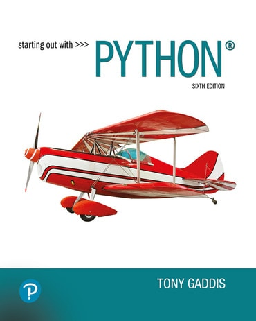

## Learning Objectives for Today's Class

By the end of today's class, you should be able to:

- Describe what **Python** is and where it fits in the business analytics toolkit.

- Identify how **real companies use Python** in production, with sources you can check
  yourself.

- Evaluate an **AI-generated analysis** against your own answer on the same data.

- Run your **first Python program** in Google Colab.

---

## Poll: Python in Practice



<!-- MENTI: word cloud, "What do you think Python is used for?"
     Swap the src below if this poll lives in a different Mentimeter presentation. -->
<div style='position: relative; padding-bottom: 56.25%; padding-top: 35px; height: 0; overflow: hidden;'><iframe sandbox='allow-popups allow-scripts allow-same-origin allow-presentation' allowfullscreen='true' allowtransparency='true' frameborder='0' height='315' src='https://www.mentimeter.com/app/presentation/alm62kvw3k4kqitoof9ccok2f8rkmk3x/embed' style='position: absolute; top: 0; left: 0; width: 100%; height: 100%;' width='420'></iframe></div>

---

## Course Logistics

:::: columns

::: {.column width="68%"}
- **Course Guide:** on [Canvas](https://miamioh.instructure.com/courses/258291).
  Grading, schedule, and policies all live there.

- **Textbook:** Gaddis, *Starting Out with Python*. This week covers **Chapter 1**, and
  the terms we use today are the terms you will be assessed on.

- **Grading and course questions:** Dr. Alam.
:::

::: {.column width="32%"}
{fig-align="center" width="78%" fig-alt="Cover of Starting Out with Python by Tony Gaddis, sixth edition"}
:::

::::

# Why Python, Why Now {.inverse .center}

## What is Python?

Python is a programming language with a simple, readable **syntax**, created by Guido
van Rossum and first released in **1991**. Two words explain how it works, and one
explains why it is everywhere:

```{=html}
<div style="max-width:96%; margin:0.55em auto 0;">
  <div style="display:grid; grid-template-columns: 215px 1fr; gap:0; align-items:center;">
    <div style="padding:14px 22px 14px 0; text-align:right; color:#c3142d; font-weight:700; font-size:27px; border-bottom:1px solid #ccc9b8;">High-level</div>
    <div style="padding:14px 0 14px 22px; font-size:22px; color:#1b1b1b; border-bottom:1px solid #ccc9b8; border-left:3px solid #c3142d;">You write near-English. Python translates it into the tiny numeric commands the chip actually runs (<i>machine instructions</i>).</div>
    <div style="padding:14px 22px 14px 0; text-align:right; color:#c3142d; font-weight:700; font-size:27px; border-bottom:1px solid #ccc9b8;">Interpreted</div>
    <div style="padding:14px 0 14px 22px; font-size:22px; color:#1b1b1b; border-bottom:1px solid #ccc9b8; border-left:3px solid #c3142d;">Your code runs the moment you press Run, one statement at a time.</div>
    <div style="padding:14px 22px 14px 0; text-align:right; color:#c3142d; font-weight:700; font-size:27px;">Open-source</div>
    <div style="padding:14px 0 14px 22px; font-size:22px; color:#1b1b1b; border-left:3px solid #c3142d;">Free for anyone to use and build on. That is why tools like <b style="color:#c3142d;">pandas</b> exist.</div>
  </div>
</div>
```

::: {.bigcode style="max-width:74%; margin:0.5em auto 0;"}
```python
monthly_sales = [1200, 950, 1100]
avg = sum(monthly_sales) / len(monthly_sales)
print(avg)
#> 1083.3333333333333
```
:::

::: {style="text-align:center; font-size:0.7em; color:#70685c; margin-top:0.15em;"}
A complete Python program. You will run code like it before class ends.
:::

::: footnote
**High-level**, **interpreted**, and **syntax** are Chapter 1 vocabulary in Gaddis,
*Starting Out with Python*.
:::

---

## Who Uses Python, and For What? {.smaller}

**Click a company** in the network to see how it uses Python, with a source you can
check. Drag nodes if things overlap.

```{=html}
<div style="display:flex; gap:14px; align-items:stretch;">
  <div id="pynet" style="flex:11; height:470px; box-sizing:border-box; position:relative; background:#ffffff; border:1px solid #ccc9b8; border-radius:8px;"></div>
  <div id="pystory" style="flex:9; height:470px; box-sizing:border-box; background:#ffffff; border:1px solid #ccc9b8; border-radius:8px; padding:16px 20px; overflow-y:auto;">
    <div style="color:#70685c; font-size:16px; line-height:1.5;">Select a company on the left.<br><br>Each write-up ends with a link to the company's own engineering blog, official documentation, or reputable press coverage, so you can verify every claim.</div>
  </div>
</div>
<script src="https://cdn.jsdelivr.net/npm/d3@7.9.0/dist/d3.min.js" integrity="sha384-CjloA8y00+1SDAUkjs099PVfnY2KmDC2BZnws9kh8D/lX1s46w6EPhpXdqMfjK6i" crossorigin="anonymous"></script>
<script>
(function () {
  // Every url below was verified to load and to support the claim (Aug 2026).
  const sectors = [
    { id: "Finance",   color: "#1a66c9" },
    { id: "Streaming", color: "#7a3fa0" },
    { id: "Social",    color: "#0f8a5f" },
    { id: "Space",     color: "#b06a00" },
    { id: "AI",        color: "#c3142d" },
    { id: "Consumer",  color: "#70685c" }
  ];
  const companies = [
    { id: "JPMorgan", sector: "Finance",
      story: "Athena, the platform JPMorgan uses to price deals and manage risk across the entire firm, is built on Python: about <b>35 million lines of code</b> contributed by more than 1,500 developers.",
      src: "TechRepublic (2019)", url: "https://www.techrepublic.com/article/jpmorgans-athena-has-35-million-lines-of-python-code-and-wont-be-updated-to-python-3-in-time/" },
    { id: "Capital One", sector: "Finance",
      story: "Capital One builds <b>production serverless applications</b> in Python on AWS Lambda, and publishes its internal Python engineering practices for others to use.",
      src: "Capital One Tech blog (2023)", url: "https://www.capitalone.com/tech/cloud/practical-serverless-python-lambda-functions/" },
    { id: "Netflix", sector: "Streaming",
      story: "Netflix uses Python through the <b>full content lifecycle</b>: modeling which shows to fund, operating the CDN that streams video to you, and powering recommendations and security automation.",
      src: "TechRepublic, quoting Netflix's TechBlog (2019)", url: "https://www.techrepublic.com/article/how-netflix-uses-python-streaming-giant-reveals-its-programming-language-libraries-and-frameworks/" },
    { id: "Spotify", sector: "Streaming",
      story: "Spotify built its <b>backend services and analytics pipelines</b> on Python; the batch jobs behind features like Radio and Discover ran through its Python-based tooling.",
      src: "Spotify Engineering blog (2013)", url: "https://engineering.atspotify.com/2013/03/how-we-use-python-at-spotify" },
    { id: "Instagram", sector: "Social",
      story: "In Meta's own words: “At Meta, we use Python (Django) for our frontend server within Instagram.” Serving Instagram is such a large Python workload that Meta engineers contribute optimizations back into the Python language itself.",
      src: "Engineering at Meta blog (2023)", url: "https://engineering.fb.com/2023/08/15/developer-tools/immortal-objects-for-python-instagram-meta/" },
    { id: "JWST", sector: "Space",
      story: "Every image from the <b>James Webb Space Telescope</b> is processed by the official calibration pipeline: an open-source <b>Python package</b> maintained by STScI, NASA's science operations center for the telescope.",
      src: "STScI, official jwst repository", url: "https://github.com/spacetelescope/jwst" },
    { id: "OpenAI", sector: "AI",
      story: "OpenAI's official developer library, the way most applications connect to its models, is <b>Python-first</b>. The models themselves are trained with Python tooling.",
      src: "Official openai-python repository", url: "https://github.com/openai/openai-python" },
    { id: "Anthropic", sector: "AI",
      story: "Anthropic's official SDK for Claude is <b>Python-first</b> as well. Across the AI industry, Python is the default language for building on top of these models.",
      src: "Official anthropic-sdk-python repository", url: "https://github.com/anthropics/anthropic-sdk-python" },
    { id: "P&G", sector: "Consumer",
      story: "Closer to home: Procter &amp; Gamble's data science roles in Cincinnati require candidates to be <b>“fluent in Python”</b> and familiar with pandas and PyTorch, per P&amp;G's own careers page.",
      src: "P&G Careers, US Data Science", url: "https://www.pgcareers.com/us/en/us-datascience" }
  ];

  const el = document.getElementById("pynet");
  const story = document.getElementById("pystory");
  const W = el.clientWidth || 560, H = 470;
  const svg = d3.select(el).append("svg").attr("width", "100%").attr("height", H)
    .attr("viewBox", `0 0 ${W} ${H}`);

  const nodes = [{ id: "Python", type: "hub", fx: W / 2, fy: H / 2 }];
  const links = [];
  sectors.forEach(s => { nodes.push({ id: s.id, type: "sector", color: s.color }); links.push({ source: "Python", target: s.id }); });
  companies.forEach(c => {
    const col = sectors.find(s => s.id === c.sector).color;
    nodes.push({ id: c.id, type: "company", color: col, story: c.story, src: c.src, url: c.url });
    links.push({ source: c.sector, target: c.id });
  });

  const link = svg.append("g").selectAll("line").data(links).join("line")
    .attr("stroke", "#ccc9b8").attr("stroke-width", 1.5);

  const node = svg.append("g").selectAll("g").data(nodes).join("g")
    .style("cursor", d => d.type === "company" ? "pointer" : "default");

  node.append("circle")
    .attr("r", d => d.type === "hub" ? 36 : d.type === "sector" ? 25 : 19)
    .attr("fill", d => d.type === "hub" ? "#c3142d" : d.type === "sector" ? "#ffffff" : d.color)
    .attr("stroke", d => d.type === "hub" ? "#8a0e20" : d.color || "#c3142d")
    .attr("stroke-width", d => d.type === "sector" ? 2.5 : 1.5);

  node.append("text")
    .text(d => d.id)
    .attr("text-anchor", "middle").attr("dy", d => d.type === "hub" ? 5 : d.type === "sector" ? 4 : 33)
    .attr("font-size", d => d.type === "hub" ? 14 : 11.5)
    .attr("font-weight", d => d.type === "company" ? 600 : 700)
    .attr("fill", d => d.type === "hub" ? "#ffffff" : d.type === "sector" ? d.color : "#1b1b1b")
    .attr("font-family", "Libre Franklin, sans-serif");

  let selected = null;
  node.filter(d => d.type === "company").on("click", function (ev, d) {
    selected = d.id;
    node.selectAll("circle").attr("stroke-width", n => n.type === "sector" ? 2.5 : (n.id === selected ? 4 : 1.5));
    story.innerHTML =
      "<div style='font-weight:700; color:" + d.color + "; font-size:22px; margin-bottom:8px;'>" + d.id + "</div>" +
      "<div style='font-size:16.5px; line-height:1.55; color:#1b1b1b;'>" + d.story + "</div>" +
      "<div style='margin-top:14px; font-size:14px;'><a href='" + d.url + "' target='_blank' style='color:#1a66c9;'>Open the source: " + d.src + " &nearr;</a></div>";
  });

  const sim = d3.forceSimulation(nodes)
    .force("link", d3.forceLink(links).id(d => d.id).distance(d => d.source.id === "Python" ? 105 : 62))
    .force("charge", d3.forceManyBody().strength(-330))
    .force("center", d3.forceCenter(W / 2, H / 2))
    .force("collide", d3.forceCollide().radius(38))
    .on("tick", () => {
      nodes.forEach(d => { d.x = Math.max(42, Math.min(W - 42, d.x)); d.y = Math.max(32, Math.min(H - 40, d.y)); });
      link.attr("x1", d => d.source.x).attr("y1", d => d.source.y)
          .attr("x2", d => d.target.x).attr("y2", d => d.target.y);
      node.attr("transform", d => `translate(${d.x},${d.y})`);
    });

  node.call(d3.drag()
    .on("start", (ev, d) => { if (!ev.active) sim.alphaTarget(0.25).restart(); d.fx = d.x; d.fy = d.y; })
    .on("drag", (ev, d) => { d.fx = ev.x; d.fy = ev.y; })
    .on("end", (ev, d) => { if (!ev.active) sim.alphaTarget(0); if (d.type !== "hub") { d.fx = null; d.fy = null; } }));
})();
</script>
```

---

## Python in Last Week's Job Postings

From the [ChatISA **Job Scout**](https://chatisa.fsb.miamioh.edu/job-scout) harvest of
Sunday, August 16: **1,437** postings aimed at analytics and IS careers. **363 (25.3%)**
tag Python, **71%** of those as *required*. Who are those 363 postings hiring?

```{=html}
<div style="max-width:92%; margin:0.7em auto; font-family:'Libre Franklin',sans-serif;">
  <div style="display:grid; grid-template-columns: 240px 1fr 60px; gap:12px 14px; align-items:center; font-size:22px;">
    <div style="text-align:right; font-weight:600;">Analyst / Analytics</div>
    <div style="background:#edece2; border-radius:5px;"><div style="width:100%; background:#c3142d; height:40px; border-radius:5px;"></div></div>
    <div style="font-weight:700; color:#c3142d; font-size:24px;">126</div>
    <div style="text-align:right; font-weight:600;">Engineer / Developer</div>
    <div style="background:#edece2; border-radius:5px;"><div style="width:99.2%; background:#9a9488; height:40px; border-radius:5px;"></div></div>
    <div style="font-weight:700; color:#70685c; font-size:24px;">125</div>
    <div style="text-align:right; font-weight:600;">Data Scientist</div>
    <div style="background:#edece2; border-radius:5px;"><div style="width:69.8%; background:#9a9488; height:40px; border-radius:5px;"></div></div>
    <div style="font-weight:700; color:#70685c; font-size:24px;">88</div>
    <div style="text-align:right; font-weight:600;">Other business titles</div>
    <div style="background:#edece2; border-radius:5px;"><div style="width:19%; background:#9a9488; height:40px; border-radius:5px;"></div></div>
    <div style="font-weight:700; color:#70685c; font-size:24px;">24</div>
  </div>
</div>
```

- **Analyst and analytics titles** are the largest group asking for Python.

- **Communication** co-occurs with Python (269 postings) more often than **SQL** (249).

::: footnote
**Data:** ChatISA Job Scout weekly harvest (ActiveJobs and USAJobs APIs), retrieved
August 16, 2026. Not the whole job market: Job Scout targets analytics and IS careers.
:::

---

## Exercise: You vs. the AI {.smaller}



::: panel-tabset

### The Data and the Question

A company tracked its two sales regions by month. `avg_order_value` is the average
dollar value of one order in that month; `orders` is how many orders that month had
([orders.csv](https://raw.githubusercontent.com/fmegahed/fmegahed.github.io/refs/heads/master/isa381/class01/orders.csv)).

<table style="margin:10px auto 0; border-collapse:collapse; font-size:0.95em; min-width:58%;">
  <tr style="background:#c3142d; color:#ffffff;">
    <th style="padding:6px 18px; text-align:left;">region</th>
    <th style="padding:6px 18px; text-align:left;">month</th>
    <th style="padding:6px 18px; text-align:right;">avg_order_value</th>
    <th style="padding:6px 18px; text-align:right;">orders</th>
  </tr>
  <tr><td style="padding:5px 18px;">East</td><td style="padding:5px 18px;">Jan</td><td style="padding:5px 18px; text-align:right;">$80.00</td><td style="padding:5px 18px; text-align:right;">10</td></tr>
  <tr style="background:#edece2;"><td style="padding:5px 18px;">East</td><td style="padding:5px 18px;">Feb</td><td style="padding:5px 18px; text-align:right;">$40.00</td><td style="padding:5px 18px; text-align:right;">1,000</td></tr>
  <tr><td style="padding:5px 18px;">West</td><td style="padding:5px 18px;">Jan</td><td style="padding:5px 18px; text-align:right;">$55.00</td><td style="padding:5px 18px; text-align:right;">500</td></tr>
  <tr style="background:#edece2;"><td style="padding:5px 18px;">West</td><td style="padding:5px 18px;">Feb</td><td style="padding:5px 18px; text-align:right;">$56.00</td><td style="padding:5px 18px; text-align:right;">520</td></tr>
</table>

<br>

**Which region had the higher average order value this year?** Work it out with your
neighbor, any way you like, then vote.

### Vote

<div style='position: relative; padding-bottom: 56.25%; padding-top: 35px; height: 0; overflow: hidden;'><iframe sandbox='allow-popups allow-scripts allow-same-origin allow-presentation' allowfullscreen='true' allowtransparency='true' frameborder='0' height='315' src='https://www.mentimeter.com/app/presentation/al5135xyxqephj3oevekhdjk7jw64ans/embed' style='position: absolute; top: 0; left: 0; width: 100%; height: 100%;' width='420'></iframe></div>

:::

---

## What Did Gemini Do With the Same Question? {.smaller}

:::: panel-tabset

### The Recording

```{=html}
<div style="position: relative; padding-bottom: 48%; height: 0; max-width:85%; margin:0 auto;"><iframe src="https://www.loom.com/embed/e03dd14d9cae4465b6b792d892ba24a3" frameborder="0" webkitallowfullscreen mozallowfullscreen allowfullscreen style="position: absolute; top: 0; left: 0; width: 100%; height: 100%;"></iframe></div>
```

Note that it **analyzes the data in Python** before producing an output.

### Debrief

The two computations in play, and why they disagree:

- Averaging the monthly figures: East (\$80 + \$40)/2 = **\$60.00** vs West **\$55.50**.
  East "wins."

- Weighting by orders (total revenue over total orders): East **\$40.40** vs West
  **\$55.50**. West wins, because East's \$80 month had only 10 orders.

Gemini actually reported **both**. Three questions for us:

1. Which computation answers the question the *business* is asking?

2. If the AI had shown only one of them, how would you have known to push back?

3. What did it take to follow what the AI did? (Answer: reading a few lines of Python.
   You will run the same check yourself in Colab shortly.)

```{=html}
<div class="can-edit" data-key="gemini-debrief" contenteditable="true">Notes from our class discussion (click to edit; use Chrome as your browser to keep your edits).</div>
```

::::

---

## Ask the Job Market Yourself {.smaller}

The same Sunday harvest, live. This view opens pre-filtered to **analyst** postings;
clear the search box to explore all 1,437.

<iframe src="job_market_explorer.html?q=analyst" style="width:100%; height:480px; border:1px solid #ccc9b8; border-radius:8px; background:#ffffff;"></iframe>

::: footnote
**Data:** 1,437 postings (full-time, federal, and internships) harvested by **ChatISA
Job Scout** from the ActiveJobs and USAJobs APIs. Retrieved August 16, 2026.
:::

# ChatISA {.inverse .center}

## ChatISA: Free AI Tools for Every ISA Student

```{=html}
<div style="text-align:center; margin-top:6px;">
  <a href="https://chatisa.fsb.miamioh.edu" target="_blank" style="display:inline-block; background:#c3142d; color:white; font-weight:700; font-size:22px; padding:10px 36px; border-radius:8px; text-decoration:none;">ChatISA</a>
  <div style="font-size:14px; margin:6px 0 2px;"><a href="https://chatisa.fsb.miamioh.edu" target="_blank" style="color:#c3142d; font-weight:600;">chatisa.fsb.miamioh.edu</a> <span style="color:#585E60;">&nbsp;&middot;&nbsp; sign in with your Miami account &nbsp;&middot;&nbsp; free for all ISA students</span></div>
  <div style="font-size:22px; color:#c3142d; line-height:1;">&darr;</div>
</div>

<div style="display:flex; gap:12px; margin-top:6px; align-items:stretch;">
  <div style="flex:4; border:1px solid #d1d5db; border-radius:8px; padding:8px 10px; background:#fcfcfc;">
    <div style="font-size:12px; font-weight:700; color:#c3142d; text-transform:uppercase; letter-spacing:0.5px; margin-bottom:6px;">For your coursework</div>
    <div style="display:grid; grid-template-columns:1fr 1fr; gap:6px;">
      <div style="background:#F5F5F5; border:1px solid #e5e7eb; border-radius:6px; padding:7px 9px;">
        <div style="font-weight:700; font-size:13px;">Coding Tutor</div>
        <div style="font-size:11px; color:#585E60;">R &amp; Python help, explained at your level</div>
      </div>
      <div style="background:#F5F5F5; border:1px solid #e5e7eb; border-radius:6px; padding:7px 9px;">
        <div style="font-weight:700; font-size:13px;">Coding Studio</div>
        <div style="font-size:11px; color:#585E60;">Write &amp; run Python, R, and SQL on your data</div>
      </div>
      <div style="background:#F5F5F5; border:1px solid #e5e7eb; border-radius:6px; padding:7px 9px;">
        <div style="font-weight:700; font-size:13px;">Exam Prep</div>
        <div style="font-size:11px; color:#585E60;">Turn course notes into a practice exam</div>
      </div>
      <div style="background:#F5F5F5; border:1px solid #e5e7eb; border-radius:6px; padding:7px 9px;">
        <div style="font-weight:700; font-size:13px;">Project Assistant</div>
        <div style="font-size:11px; color:#585E60;">Plan &amp; pressure-test team projects</div>
      </div>
    </div>
  </div>
  <div style="flex:3; border:1px solid #d1d5db; border-radius:8px; padding:8px 10px; background:#fcfcfc;">
    <div style="font-size:12px; font-weight:700; color:#c3142d; text-transform:uppercase; letter-spacing:0.5px; margin-bottom:6px;">For your job search</div>
    <div style="display:grid; grid-template-columns:1fr; gap:6px;">
      <div style="background:#F5F5F5; border:1px solid #e5e7eb; border-radius:6px; padding:7px 9px;">
        <div style="font-weight:700; font-size:13px;">Job Scout</div>
        <div style="font-size:11px; color:#585E60;">This week's analytics &amp; IS jobs, matched to your courses (powers today's job data)</div>
      </div>
      <div style="background:#F5F5F5; border:1px solid #e5e7eb; border-radius:6px; padding:7px 9px;">
        <div style="font-weight:700; font-size:13px;">JobApp Drafter</div>
        <div style="font-size:11px; color:#585E60;">Tailor your resume &amp; cover letter to a job</div>
      </div>
      <div style="background:#F5F5F5; border:1px solid #e5e7eb; border-radius:6px; padding:7px 9px;">
        <div style="font-weight:700; font-size:13px;">Interview Mentor</div>
        <div style="font-size:11px; color:#585E60;">Practice a spoken interview for a target job</div>
      </div>
    </div>
  </div>
  <div style="flex:2.5; border:1px solid #d1d5db; border-radius:8px; padding:8px 10px; background:#fcfcfc;">
    <div style="font-size:12px; font-weight:700; color:#c3142d; text-transform:uppercase; letter-spacing:0.5px; margin-bottom:6px;">General AI</div>
    <div style="display:grid; grid-template-columns:1fr; gap:6px;">
      <div style="background:#F5F5F5; border:1px solid #e5e7eb; border-radius:6px; padding:7px 9px;">
        <div style="font-weight:700; font-size:13px;">Ask Anything</div>
        <div style="font-size:11px; color:#585E60;">Chat with the frontier model of your choice</div>
      </div>
      <div style="background:#F5F5F5; border:1px solid #e5e7eb; border-radius:6px; padding:7px 9px;">
        <div style="font-weight:700; font-size:13px;">AI Comparison</div>
        <div style="font-size:11px; color:#585E60;">Ask several models at once and compare answers</div>
      </div>
    </div>
  </div>
</div>

<div style="text-align:center; font-size:12.5px; color:#585E60; margin-top:12px;">A <b>word of caution:</b> AI answers (ChatGPT, Claude, Gemini, Kimi, ChatISA, etc) can be confidently wrong, as you just saw. The reason you are taking ISA courses is so that <b>you learn how to verify their outputs and assess their choices</b></div>
```

---

## An Executive Overview of ChatISA

<html>
<center>
<iframe width="854" height="480"
src="https://www.youtube.com/embed/ytI-oJLgFZ4?autoplay=0"
title="ChatISA Highlight Tour"
frameborder="0"
allow="accelerometer; clipboard-write; encrypted-media; gyroscope; picture-in-picture"
allowfullscreen>
</iframe>
</center>
</html>

---

## Activity: Find Your Python Job {.smaller}



:::: panel-tabset

### Activity

1. Sign in at <https://chatisa.fsb.miamioh.edu> and open **Job Scout**.

2. Add **ISA 381** to your courses, so Python counts among your skills.

3. Find **one posting you would genuinely apply to**. Internships count!

4. Note two things: is Python listed as **required or preferred**, and what is the
   **job title**? (While you are there, notice the *Practice this Interview on ChatISA*
   button.)

### Share

<!-- MENTI: open text, "Company + role + is Python required or preferred?" -->
<div style='position: relative; padding-bottom: 56.25%; padding-top: 35px; height: 0; overflow: hidden;'><iframe sandbox='allow-popups allow-scripts allow-same-origin allow-presentation' allowfullscreen='true' allowtransparency='true' frameborder='0' height='315' src='https://www.mentimeter.com/app/presentation/als63su54mn5z4n938wjq6ajyx7dibkj/embed' style='position: absolute; top: 0; left: 0; width: 100%; height: 100%;' width='420'></iframe></div>

### Debrief

```{=html}
<div class="can-edit" data-key="activity-debrief" contenteditable="true">Notes from our class discussion (click to edit; use Chrome as your browser to keep your edits).</div>
```

::::

---

## Your First Python Program {.smaller}



We will use **Google Colab**: Python in your browser, no installation, free. (Colab is
a hosted **Jupyter Notebook**, another Chapter 1 term.)

1. Open the [class notebook](https://colab.research.google.com/drive/1IrsKE3fnmN8R0T0omegp9OQbx6D0qvej?usp=sharing).

2. Sign in with a Google account, then **File &rarr; Save a copy in Drive**.

3. Run each cell in order with **Shift + Enter**. The notebook walks you through:

   - printing your first message,

   - looking at the orders table from our exercise, and

   - computing both answers, so you can see for yourself which one the data supports.

No prior Python is assumed. Every cell has a plain-English explanation above it, and
nothing you can click will break anything.

---

## Summary of Main Points

By now, you should be able to do the following:

- Describe **Python**: a high-level, interpreted language with readable syntax, dating
  to 1991 and everywhere in 2026.

- Name real organizations that run on Python (JPMorgan, Netflix, Instagram, the James
  Webb Space Telescope, P&amp;G), and point to the **sources** behind each claim.

- Explain what last week's job data showed: in postings aimed at analytics and IS
  careers, **a quarter expect Python**, analyst titles are the largest group asking
  for it, and communication is its most common companion skill.

- Treat an **AI-generated analysis as a claim, not a fact**. You saw two defensible
  computations disagree, and you know what it takes to check.

---

## 📖 Prep for Our Next Class 📖

- **Read** Gaddis, Chapter 1. You have now experienced most of it; the reading attaches
  formal names to things you did today. There is no assignment this week.

- **Next class:** what happens in the half-second after you press Run. The CPU, memory,
  and the fetch-decode-execute cycle, connected to the Colab notebook you just used.

- **Questions this week:** [fmegahed@miamioh.edu](mailto:fmegahed@miamioh.edu).
