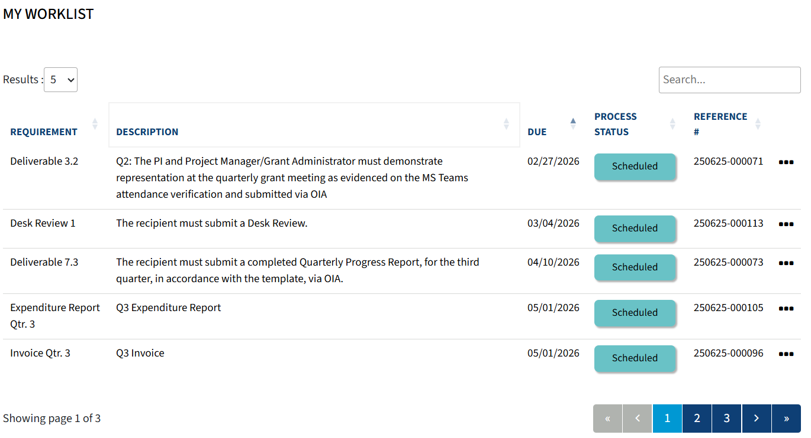
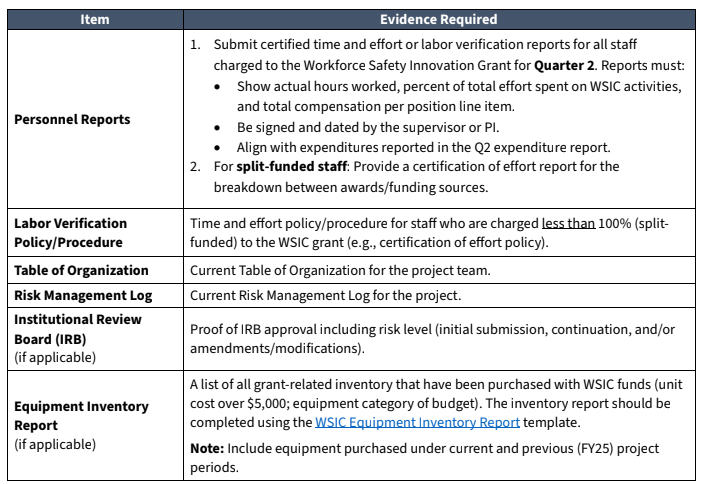
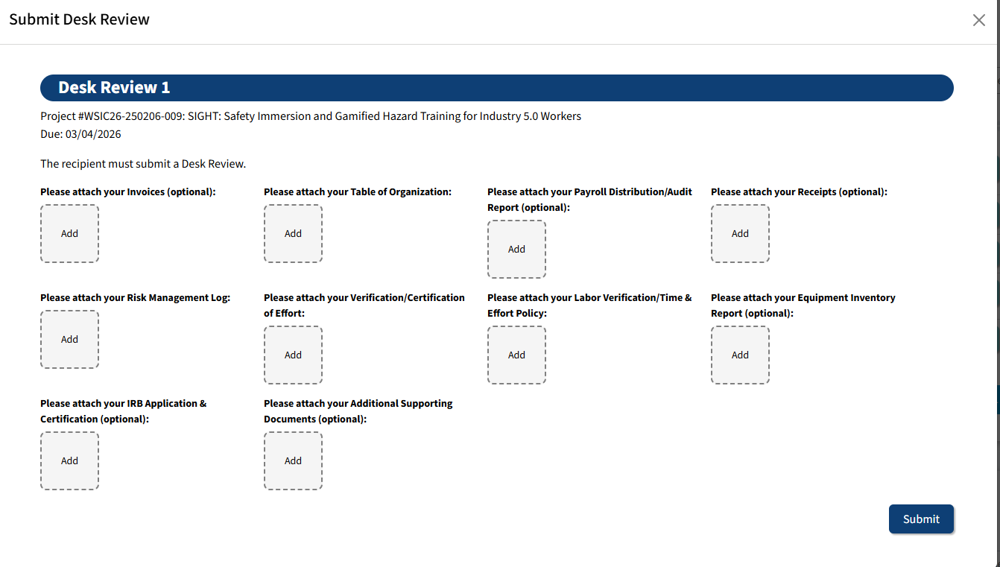
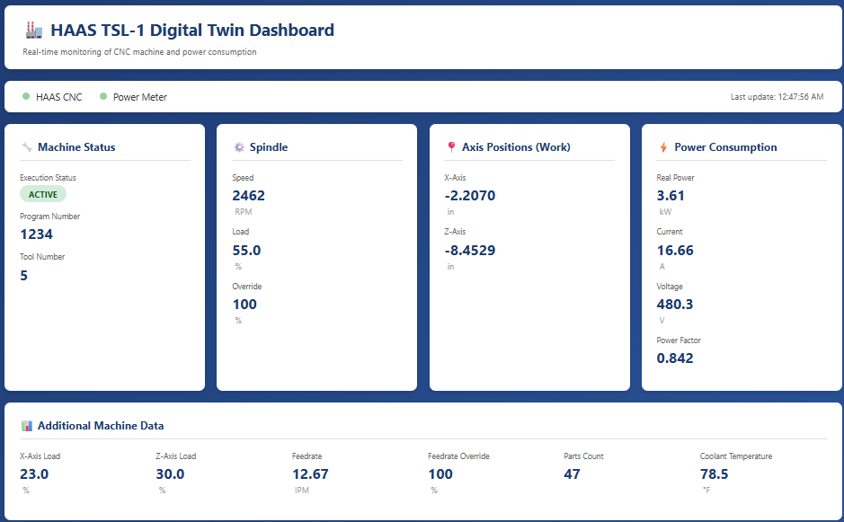

## Meeting Goals

- **Review and approve** Meeting 14 minutes and action items

- **Update** the team on **BWC deliverable and requirement deadlines**, including the upcoming **Desk Review**.

- **Technical updates**:

  + User Diagnostic Survey presentation and discussion (Lora).
  + Plans for a *Journal of Service Research* paper submission (Arthur and Jay).
  + Digital twin for safety 4.0 paper updates (Ibrahim and Amanda).

- **Industry Partner Collaboration:** Q3 Updates from MeetKai and MaxByte

- **BWC Q3 presentation** overview.

- **Risk mitigation/log** and further updates.

```{r options}
#| include: false

reticulate::use_condaenv("sight", required = TRUE)

# setting miamired color and ggplot2 theme for all plots
miamired = "#c3142d"

ggplot2::theme_set(
  ggplot2::theme_bw() +
  ggplot2::theme(
    plot.title = ggplot2::element_text(hjust = 0.5, size = 14, face = "bold"),
    plot.subtitle = ggtext::element_markdown(size = 12, color = "black"),
    legend.position='none',
    panel.grid.major = ggplot2::element_blank(),
    panel.grid.minor = ggplot2::element_blank(),
    strip.background = ggplot2::element_rect(fill ="#C3142D"),
    strip.text = ggplot2::element_text(color = "white", size = 8, face = "bold"),
    panel.spacing = ggplot2::unit(1, "lines"),
    # bold x-ticks, yticks and the axis labels
    axis.text = ggplot2::element_text(face = "bold", color = "black"),
    axis.title = ggplot2::element_text(face = "bold", color = "black"),
    plot.caption = ggtext::element_markdown(size = 8, color = "black")
  )
  )
```

```{python}
#| include: false

import matplotlib.pyplot as plt
from matplotlib.patches import FancyBboxPatch

MU = {
    'red': '#c3142d', 'gold': '#EFDB72', 'tan': '#CCC9B8',
    'blue': '#3E5468', 'white': '#ffffff', 'black': '#000000'
}

def draw_flowchart_vertical(
    nodes, figsize=(10, None), box_width=7, box_height=1.1, gap=0.5
):
    """Draw a vertical flowchart with rounded boxes and arrows."""
    n = len(nodes)
    total_h = n * box_height + (n - 1) * gap
    if figsize[1] is None:
        figsize = (figsize[0], max(total_h + 1.0, 4))
    fig, ax = plt.subplots(figsize=figsize)

    positions = []
    for i in range(n):
        y = total_h - i * (box_height + gap) - box_height / 2
        positions.append(y)

    for i, (node, y) in enumerate(zip(nodes, positions)):
        rect = FancyBboxPatch(
            (-box_width / 2, y - box_height / 2),
            box_width,
            box_height,
            boxstyle="round,pad=0.15",
            facecolor=node.get('fill_color', MU['white']),
            edgecolor=node.get('border_color', MU['black']),
            linewidth=2.5,
        )
        ax.add_patch(rect)

        title_y = y + 0.15 if node.get('subtitle') else y
        ax.text(
            0, title_y, node['title'],
            ha='center', va='center',
            fontsize=13, fontweight='bold',
            color=node.get('text_color', MU['black']),
            fontfamily='sans-serif',
        )

        if node.get('subtitle'):
            ax.text(
                0, y - 0.2, node['subtitle'],
                ha='center', va='center',
                fontsize=10,
                color=node.get('text_color', MU['black']),
                fontfamily='sans-serif',
                style='italic',
            )

        if i < n - 1:
            ax.annotate(
                '',
                xy=(0, positions[i + 1] + box_height / 2 + 0.02),
                xytext=(0, y - box_height / 2 - 0.02),
                arrowprops=dict(
                    arrowstyle='->', lw=2, color='#333333', mutation_scale=20
                ),
            )

    margin = 0.5
    ax.set_xlim(-box_width / 2 - margin, box_width / 2 + margin)
    ax.set_ylim(-0.5, total_h + 0.5)
    ax.set_aspect('equal')
    ax.axis('off')
    plt.tight_layout()
    plt.show()
```

# Review Action Items from Previous Meeting and Approve Minutes  {.inverse .center}

Fadel M. Megahed


## Review of Action Items and Approval of Meeting Minutes




## Action Item Tracking from Meeting 14

<div style="font-size: 0.58em;">

| Responsible Party | Action Item | Due Date | Done? |
|:---|:---|:---|:---:|
| **Ibrahim Yousif** | Share Digital Twin cobot video and human--cobot collaboration examples with MeetKai | Feb 10, 2026 | <input type="checkbox"> |
| **MaxByte** | Deliver the pallet truck | Feb 13, 2026 | <input type="checkbox"> |
| **MaxByte** | Finalize hardware scope for sensors/DACs with Mohammad, Ibrahim, and Reza | Feb 13, 2026 | <input type="checkbox"> |
| **MaxByte** | Set up the pallet truck | Feb 20, 2026 | <input type="checkbox"> |
| **MaxByte** | Finalize data acquisition from three machines and provide demo/access | Feb 27, 2026 | <input type="checkbox"> |
| **MU Team & Lora** | Provide 4 summary slides for BWC's Q3 presentation | Feb 18, 2026 | <input type="checkbox"> |
| **MU Team & Lora** | Submit user diagnostic survey content to MeetKai | Feb 20, 2026 | <input type="checkbox"> |
| **Maressa Dixon** | Coordinate the schedule for key personnel interviews | In a few weeks | <input type="checkbox"> |

</div>


## Attendance Sign as Required By BWC

::: {.columns}

::: {.column width="60%"}

- **Use your full name** (first and last) when joining the Zoom call — even if you're in a shared conference room.

- This helps us log attendance accurately for BWC reporting.

- If you're in a conference room:
  - Only **one computer** should have audio enabled.
  - All **other devices** must be **muted** (microphone **and** speaker).

:::

::: {.column width="40%"}

<br><br>
```{python attendance_qr}
#| echo: false
#| output: hide
#| fig-align: center
#| cache: true
#| out-width: "100%"
#| fig-cap: "Scan QR code if you are not on Zoom (i.e., in a conference room and not logged in on zoom)."

import qrcode
import matplotlib.pyplot as plt

url = "https://miamioh.zoom.us/j/84057529393?pwd=IU6JQthYGgDfRGdZ0r1d0Xxf9iIpON.1"
img = qrcode.make(url)

# Display without extraneous output
plt.imshow(img, cmap="gray")
_ = plt.axis("off")  # suppress output
plt.tight_layout()
plt.show()

```

:::
:::


# Administrative Updates {.center .inverse}

Fadel Megahed

## Upcoming BWC Deadlines

<br>

{width='100%' fig-align='center' fig-alt='Upcoming BWC deadlines.'}

::: {style="text-align:center; font-size: 0.7em"}
A screenshot of the upcoming deliverables/requirements from the Ohio BWC/WSIC online portal.
:::


## Desk Review 1: Required Documentation (Due Mar 04, 2026)

{width='100%' fig-align='center' fig-alt='Desk Review 1 required documentation and evidence table.'}


## Desk Review 1: Submission Requirements

{width='100%' fig-align='center' fig-alt='Desk Review 1 submission requirements.'}


# Technical Updates: MU and Lora {.center .inverse}

Arthur Carvalho, Jay Shan, Ibrahim Yousif, and Lora


## User Diagnostic Survey -- Presentation and Discussion




## User Diagnostic Survey -- Key Highlights

```{python}
#| echo: false
#| fig-align: center
#| label: fig-survey-structure
#| fig-cap: "User Diagnostic Survey — four sections establishing a baseline of worker safety knowledge before VR training"

draw_flowchart_vertical([
    {'title': 'Section 1: User Background & Priorities',
     'subtitle': 'Machine experience \u00b7 Safety training \u00b7 Risk perception',
     'border_color': MU['gold']},
    {'title': 'Section 2: Safety & Risk Perception',
     'subtitle': 'Guard removal \u00b7 Cobot zone decisions \u00b7 Collision responsibility',
     'border_color': MU['tan']},
    {'title': 'Section 3: Technical Knowledge',
     'subtitle': 'Chuck key hazards \u00b7 Chip clearing \u00b7 Protective stop \u00b7 Emergency response',
     'border_color': MU['red']},
    {'title': 'Section 4: PPE Knowledge',
     'subtitle': 'PPE per machine type \u00b7 Mandatory vs optional',
     'border_color': MU['blue']},
])
```


## User Diagnostic Survey -- Pre/Post Assessment Design

```{python}
#| echo: false
#| fig-align: center
#| label: fig-survey-design
#| fig-cap: "Pre/post assessment design — comparing scores before and after SIGHT VR training to quantify impact on worker safety knowledge"

draw_flowchart_vertical([
    {'title': 'Pre-VR Baseline',
     'subtitle': 'Diagnostic Survey (4 Sections)',
     'border_color': MU['gold']},
    {'title': 'SIGHT VR Training',
     'subtitle': 'Gamified Safety Modules',
     'fill_color': MU['red'], 'text_color': MU['white'],
     'border_color': MU['red']},
    {'title': 'Post-VR Assessment',
     'subtitle': 'Follow-up Survey (Same Instrument)',
     'border_color': MU['tan']},
    {'title': 'Evaluate Effectiveness',
     'subtitle': 'Measure Knowledge Gain & Behavior Change',
     'border_color': MU['blue']},
])
```


## *Journal of Service Research*: Special Issue Submission Plan {.smaller}

- **Special Issue:** *AI-enabled Experience Innovation*

- **Full paper due:** September 30, 2026

- **Leads:** Arthur Carvalho and Jay Shan

- **Potential research angle:**
  + How AI-driven safety training (VR + RAG chatbot) transforms the worker experience in manufacturing environments.
  + Linking gamified training interventions to measurable changes in safety behavior and knowledge retention.

- **Next steps:**
  + Finalize the research design and data collection plan.
  + Coordinate with MeetKai on analytics data from the VR modules.


## Digital Twin Progress and Live Demo

{width='100%' fig-align='center' fig-alt='CNC machine with IoT sensors for digital twin monitoring.'}


## Digital Twin for Safety 4.0 -- System Architecture

```{python}
#| echo: false
#| fig-align: center
#| label: fig-dt-architecture
#| fig-cap: "Digital Twin for Safety 4.0 — end-to-end system architecture from data sources to safety monitoring"

def draw_dt_architecture():
    fig, ax = plt.subplots(figsize=(11, 5.5))

    # -- Data Sources group box --
    gx, gy, gw, gh = 0, 3.8, 10.5, 1.7
    group = FancyBboxPatch(
        (gx - gw / 2, gy - gh / 2), gw, gh,
        boxstyle="round,pad=0.15",
        facecolor='#fffef5', edgecolor=MU['gold'], linewidth=2.5,
    )
    ax.add_patch(group)
    ax.text(gx, gy + gh / 2 + 0.1, 'Data Sources',
            ha='center', va='bottom', fontsize=13, fontweight='bold',
            color=MU['blue'], fontfamily='sans-serif')

    # Three source boxes inside group
    sw, sh = 3.0, 1.1
    sources = [
        ('IoT Sensors', 'Induction \u00b7 Vibration \u00b7 IR Temp'),
        ('Computer Vision', 'YOLO Detection (99%+ mAP)'),
        ('Machine Controllers', 'Built-in Sensors & CNC Data'),
    ]
    for j, (title, sub) in enumerate(sources):
        sx = (j - 1) * (sw + 0.3)
        r = FancyBboxPatch(
            (sx - sw / 2, gy - sh / 2), sw, sh,
            boxstyle="round,pad=0.1",
            facecolor=MU['white'], edgecolor=MU['tan'], linewidth=2,
        )
        ax.add_patch(r)
        ax.text(sx, gy + 0.15, title, ha='center', va='center',
                fontsize=11, fontweight='bold', fontfamily='sans-serif')
        ax.text(sx, gy - 0.2, sub, ha='center', va='center',
                fontsize=9, fontfamily='sans-serif', style='italic')

    # -- Pipeline boxes --
    pw, ph, pgap = 7, 0.8, 0.35
    pipeline = [
        ('Real-Time Data Acquisition', MU['blue'], MU['white'], MU['black']),
        ('Digital Twin Platform', MU['red'], MU['red'], MU['white']),
        ('Safety Monitoring & Alerts', MU['blue'], MU['white'], MU['black']),
    ]
    ptop = gy - gh / 2 - 0.5
    for k, (title, border, fill, tc) in enumerate(pipeline):
        py = ptop - k * (ph + pgap)
        r = FancyBboxPatch(
            (-pw / 2, py - ph / 2), pw, ph,
            boxstyle="round,pad=0.12",
            facecolor=fill, edgecolor=border, linewidth=2.5,
        )
        ax.add_patch(r)
        ax.text(0, py, title, ha='center', va='center',
                fontsize=12, fontweight='bold', color=tc, fontfamily='sans-serif')
        src_y = (gy - gh / 2) if k == 0 else (ptop - (k - 1) * (ph + pgap) - ph / 2)
        ax.annotate(
            '', xy=(0, py + ph / 2 + 0.02), xytext=(0, src_y - 0.02),
            arrowprops=dict(arrowstyle='->', lw=2, color='#333333', mutation_scale=20),
        )

    bottom_y = ptop - 2 * (ph + pgap) - ph / 2
    ax.set_xlim(-6, 6)
    ax.set_ylim(bottom_y - 0.2, gy + gh / 2 + 0.45)
    ax.axis('off')
    plt.tight_layout()
    plt.show()

draw_dt_architecture()
```


# Industry Partner Collaboration {.inverse .center}

MeetKai and MaxByte


## MeetKai: Live Update

### MeetKai will now share their screen for a Q3 update.

**Please hold for screen sharing.**


## MaxByte: Live Update

### MaxByte will now share their screen for a Q3 update.

**Please hold for screen sharing.**


# BWC Q3 Presentation Overview {.inverse .center}

Fadel Megahed


## Q3 BWC Presentation: Summary Slides




# Discussion and Deadlines {.inverse .center}

Open Floor


## Key Deliverables and Deadlines

```{python}
#| echo: false
#| fig-align: center
#| label: fig-timeline
#| fig-cap: "Upcoming BWC deliverables and technical task deadlines"

def draw_timeline():
    fig, ax = plt.subplots(figsize=(13, 5))

    # Central timeline axis
    ax.plot([0.5, 9.5], [2.5, 2.5], color='#aaaaaa', lw=2, zorder=1)

    # Lane labels
    ax.text(-0.6, 3.8, 'BWC\nDeliverables', ha='center', va='center',
            fontsize=11, fontweight='bold', color=MU['gold'], fontfamily='sans-serif')
    ax.text(-0.6, 1.2, 'Technical\nTasks', ha='center', va='center',
            fontsize=11, fontweight='bold', color=MU['blue'], fontfamily='sans-serif')

    # BWC events (above timeline)
    bwc = [
        (1.5, 'Feb 26', 'Q3 BWC\nPresentation', MU['gold']),
        (3.5, 'Feb 27', 'Deliverable 3.2\nGrant Meeting', MU['tan']),
        (5.5, 'Mar 04', 'Desk Review 1\nSubmission', MU['red']),
        (8.5, 'Apr 10', 'Q3 Progress\nReport', MU['blue']),
    ]
    for x, date, label, color in bwc:
        ax.plot(x, 2.5, 'o', markersize=10, color=color, zorder=5)
        ax.plot([x, x], [2.5, 3.2], color=color, lw=1.5, zorder=3)
        bbox_props = dict(boxstyle='round,pad=0.3', facecolor=color + '30',
                          edgecolor=color, linewidth=1.5)
        ax.text(x, 3.8, label, ha='center', va='center', fontsize=9,
                fontweight='bold', fontfamily='sans-serif', bbox=bbox_props)
        ax.text(x, 2.2, date, ha='center', va='top', fontsize=8,
                color='#555555', fontfamily='sans-serif')

    # Technical events (below timeline)
    tech = [
        (2.5, 'Feb 2026', 'Create Gamified\nEngine', MU['red']),
        (7.0, 'Mar 2026', 'Integrate Analytics\n& Finalize 3D Renders', MU['tan']),
    ]
    for x, date, label, color in tech:
        ax.plot(x, 2.5, 's', markersize=10, color=color, zorder=5)
        ax.plot([x, x], [2.5, 1.8], color=color, lw=1.5, zorder=3)
        bbox_props = dict(boxstyle='round,pad=0.3', facecolor=color + '30',
                          edgecolor=color, linewidth=1.5)
        ax.text(x, 1.2, label, ha='center', va='center', fontsize=9,
                fontweight='bold', fontfamily='sans-serif', bbox=bbox_props)
        ax.text(x, 2.8, date, ha='center', va='bottom', fontsize=8,
                color='#555555', fontfamily='sans-serif')

    ax.set_xlim(-2.0, 10.5)
    ax.set_ylim(0.0, 5.0)
    ax.axis('off')
    plt.tight_layout()
    plt.show()

draw_timeline()
```


## Updates to Risk and Risk Log

Based on our conversation, Arthur can update the risk log with any further updates.
