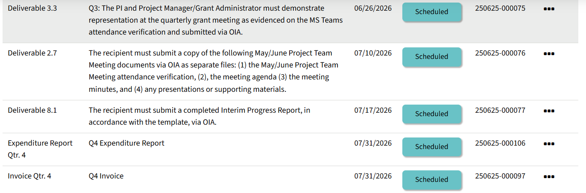
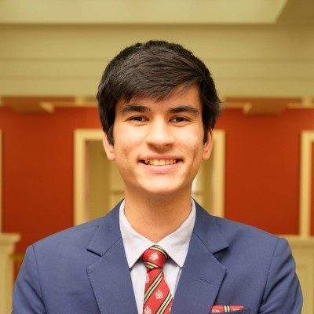
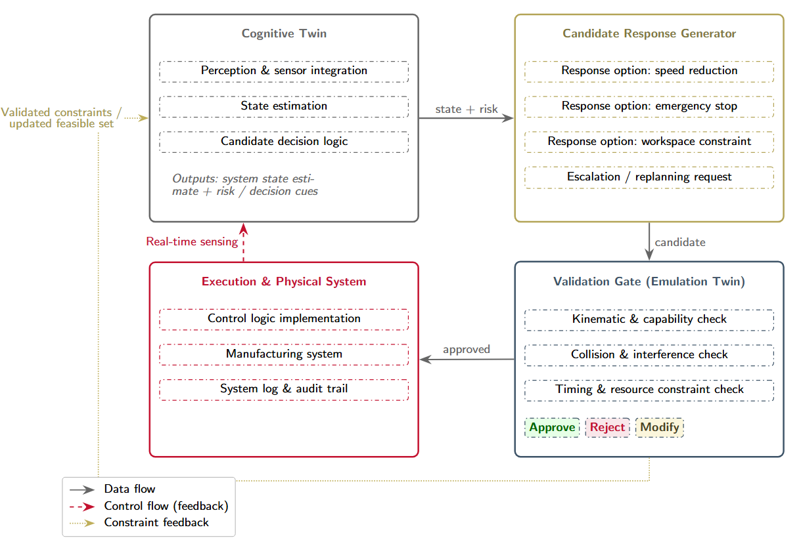

```{r options}
#| include: false

reticulate::use_condaenv("sight", required = TRUE)

# setting miamired color and ggplot2 theme for all plots
miamired = "#c3142d"

ggplot2::theme_set(
  ggplot2::theme_bw() +
  ggplot2::theme(
    plot.title = ggplot2::element_text(hjust = 0.5, size = 14, face = "bold"),
    plot.subtitle = ggtext::element_markdown(size = 12, color = "black"),
    legend.position='none',
    panel.grid.major = ggplot2::element_blank(),
    panel.grid.minor = ggplot2::element_blank(),
    strip.background = ggplot2::element_rect(fill ="#C3142D"),
    strip.text = ggplot2::element_text(color = "white", size = 8, face = "bold"),
    panel.spacing = ggplot2::unit(1, "lines"),
    axis.text = ggplot2::element_text(face = "bold", color = "black"),
    axis.title = ggplot2::element_text(face = "bold", color = "black"),
    plot.caption = ggtext::element_markdown(size = 8, color = "black")
  )
  )
```

```{python}
#| include: false

import matplotlib.pyplot as plt
from matplotlib.patches import FancyBboxPatch

MU = {
    'red': '#c3142d', 'gold': '#EFDB72', 'tan': '#CCC9B8',
    'blue': '#3E5468', 'gray': '#585E60',
    'white': '#ffffff', 'black': '#000000'
}

def draw_flowchart_vertical(
    nodes, figsize=(10, None), box_width=7, box_height=1.1, gap=0.5
):
    """Draw a vertical flowchart with rounded boxes and arrows."""
    n = len(nodes)
    total_h = n * box_height + (n - 1) * gap
    if figsize[1] is None:
        figsize = (figsize[0], max(total_h + 1.0, 4))
    fig, ax = plt.subplots(figsize=figsize)

    positions = []
    for i in range(n):
        y = total_h - i * (box_height + gap) - box_height / 2
        positions.append(y)

    for i, (node, y) in enumerate(zip(nodes, positions)):
        rect = FancyBboxPatch(
            (-box_width / 2, y - box_height / 2),
            box_width,
            box_height,
            boxstyle="round,pad=0.15",
            facecolor=node.get('fill_color', MU['white']),
            edgecolor=node.get('border_color', MU['black']),
            linewidth=2.5,
        )
        ax.add_patch(rect)

        title_y = y + 0.15 if node.get('subtitle') else y
        ax.text(
            0, title_y, node['title'],
            ha='center', va='center',
            fontsize=13, fontweight='bold',
            color=node.get('text_color', MU['black']),
            fontfamily='sans-serif',
        )

        if node.get('subtitle'):
            ax.text(
                0, y - 0.2, node['subtitle'],
                ha='center', va='center',
                fontsize=10,
                color=node.get('text_color', MU['black']),
                fontfamily='sans-serif',
                style='italic',
            )

        if i < n - 1:
            ax.annotate(
                '',
                xy=(0, positions[i + 1] + box_height / 2 + 0.02),
                xytext=(0, y - box_height / 2 - 0.02),
                arrowprops=dict(
                    arrowstyle='->', lw=2, color='#333333', mutation_scale=20
                ),
            )

    margin = 0.5
    ax.set_xlim(-box_width / 2 - margin, box_width / 2 + margin)
    ax.set_ylim(-0.5, total_h + 0.5)
    ax.set_aspect('equal')
    ax.axis('off')
    plt.tight_layout()
    plt.show()
```


## Meeting Goals

- **Review and approve** the agenda and confirm attendance.

- **Administrative Updates**:
  + Upcoming BWC deliverables.
  + Interim Progress Report (Deliverable 8.1, due Jul 17, 2026).
  + Personnel transitions: Amanda White, Ryan Singh, and Austin Hamilton.
  + Budget revision and reallocation.

- **Technical updates**:
  + Arthur Carvalho's Miami AI Symposium presentation.
  + Ibrahim Yousif's two technology disclosures.
  + Summer plans for the digital twin (web app, paper, demo for the BWC Q4 presentation).
  + Continuously improving the AI experience.

- **Industry Partner Collaboration**:
  + MeetKai and Arthur: handoff and database migration.
  + MaxByte: AR demo progress.

- **Risk mitigation/log** and further updates.


## Attendance Sign as Required By BWC

::: {.columns}

::: {.column width="60%"}

- **Use your full name** (first and last) when joining the Zoom call — even if you're in a shared conference room.

- This helps us log attendance accurately for BWC reporting.

- If you're in a conference room:
  - Only **one computer** should have audio enabled.
  - All **other devices** must be **muted** (microphone **and** speaker).

:::

::: {.column width="40%"}

<br><br>
```{python attendance_qr}
#| echo: false
#| output: hide
#| fig-align: center
#| cache: true
#| out-width: "100%"
#| fig-cap: "Scan QR code if you are not on Zoom (i.e., in a conference room and not logged in on zoom)."

import qrcode
import matplotlib.pyplot as plt

url = "https://miamioh.zoom.us/j/84057529393?pwd=IU6JQthYGgDfRGdZ0r1d0Xxf9iIpON.1"
img = qrcode.make(url)

plt.imshow(img, cmap="gray")
_ = plt.axis("off")
plt.tight_layout()
plt.show()

```

:::
:::


# Administrative Updates and Requests {.center .inverse}

Fadel Megahed


## Upcoming BWC Deadlines

<br>

{width='100%' fig-align='center' fig-alt='Upcoming BWC deadlines as of May 01, 2026.'}

::: {style="text-align:center; font-size: 0.7em"}
A screenshot of the upcoming deliverables/requirements from the Ohio BWC/WSIC online portal.
:::


## Interim Progress Report (Deliverable 8.1, Due Jul 17, 2026)




## Budget Revision and Reallocation

::: {.columns}

::: {.column width="15%"}

```{python budget_icon}
#| echo: false
#| fig-align: center
#| out-width: "100%"

import matplotlib.pyplot as plt
from matplotlib.patches import FancyBboxPatch

fig, ax = plt.subplots(figsize=(2.5, 2.5))
badge = FancyBboxPatch((0.1, 0.25), 0.8, 0.5, boxstyle="round,pad=0.05",
                       facecolor=MU['gold'], edgecolor=MU['red'], linewidth=2.5)
_ = ax.add_patch(badge)
_ = ax.text(0.5, 0.5, '$', ha='center', va='center',
        fontsize=42, fontweight='bold', color=MU['red'], fontfamily='sans-serif')
_ = ax.set_xlim(0, 1)
_ = ax.set_ylim(0, 1)
_ = ax.set_aspect('equal')
_ = ax.axis('off')
plt.tight_layout()
plt.show()
```

:::

::: {.column width="85%"}

<br>

- **Fadel** is leading the FY26 budget revision and reallocation in coordination with **Paula Murray** to align the post-award MU team on process and timing.

- Updated allocations and any action items for co-PIs will be circulated **before contracts are routed**.

:::
:::


# Personnel Updates and External Recognition {.center .inverse}

Fadel Megahed


## Personnel Updates

::: {.columns}

::: {.column width="33%"}

[**Amanda White**]{style="color:#c3142d; font-size: 1.1em;"}

{width='75%' fig-align='center' fig-alt='Amanda White headshot.'}

Graduating in two weeks: **BS in Business Analytics**.

*Next:* Technical Solutions Engineer at **Epic**.

:::

::: {.column width="33%"}

[**Ryan Singh**]{style="color:#c3142d; font-size: 1.1em;"}

{width='75%' fig-align='center' fig-alt='Ryan Singh headshot.'}

Graduating in two weeks: **MS in Business Analytics**.

*Next:* Consultant at **enFocus**.

:::

::: {.column width="33%"}

[**Austin Hamilton**]{style="color:#c3142d; font-size: 1.1em;"}

```{python austin_icon}
#| echo: false
#| fig-align: center
#| out-width: "75%"

import matplotlib.pyplot as plt

fig, ax = plt.subplots(figsize=(2.5, 2.5))
_ = ax.add_patch(plt.Circle((0.5, 0.72), 0.16, fill=False, color=MU['blue'], linewidth=3))
_ = ax.add_patch(plt.Polygon(
    [(0.27, 0.05), (0.36, 0.52), (0.64, 0.52), (0.73, 0.05)],
    fill=False, edgecolor=MU['blue'], linewidth=3
))
_ = ax.set_xlim(0, 1)
_ = ax.set_ylim(0, 1)
_ = ax.set_aspect('equal')
_ = ax.axis('off')
plt.tight_layout()
plt.show()
```

Successfully defended his **MS Thesis Proposal**.

*Title:* *"Semantic Decimation of 3D Models."*

:::
:::


## Arthur Carvalho's Miami AI Symposium Presentation




# Technical Updates {.center .inverse}

Fadel Megahed and Ibrahim Yousif


## Technology Disclosures Submitted by Ibrahim Yousif

```{python}
#| echo: false
#| fig-align: center
#| label: fig-tech-disclosures
#| fig-cap: "Both submitted in Q4 FY26."
#| out-width: "100%"

import matplotlib.pyplot as plt
from matplotlib.patches import FancyBboxPatch

titles = [
    "Generating Engineering-Grade Parametric\nCAD Models from 2D Industrial Imagery via\nSemantic Ontology and Confidence-Routed\nMulti-Modal Identification",
    "Cognitive Closed-Loop Robotic Assembly\nvia Multi-Modal Design Understanding\nand Real-Time Verification",
]

fig, axes = plt.subplots(1, 2, figsize=(13, 5))

for ax, title in zip(axes, titles):
    card = FancyBboxPatch(
        (0.04, 0.04), 0.92, 0.92,
        boxstyle="round,pad=0.04",
        facecolor=MU['white'], edgecolor=MU['red'], linewidth=2.5,
    )
    _ = ax.add_patch(card)

    badge = FancyBboxPatch(
        (0.40, 0.74), 0.20, 0.13,
        boxstyle="round,pad=0.02",
        facecolor=MU['gold'], edgecolor=MU['red'], linewidth=2,
    )
    _ = ax.add_patch(badge)
    _ = ax.text(0.50, 0.805, 'IP', ha='center', va='center',
            fontsize=18, fontweight='bold', color=MU['red'],
            fontfamily='sans-serif')

    _ = ax.text(0.50, 0.40, title, ha='center', va='center',
            fontsize=11.5, fontstyle='italic',
            color=MU['black'], fontfamily='sans-serif')

    _ = ax.set_xlim(0, 1)
    _ = ax.set_ylim(0, 1)
    _ = ax.set_aspect('equal')
    _ = ax.axis('off')

plt.tight_layout()
plt.show()
```


## Digital Twin: Live Demo

<div style="position: relative; width: 100%; height: 500px; overflow: hidden;">
  <iframe
    src="https://www.youtube.com/embed/NbrHcfBa_VY?start=82"
    title="Digital Twin demonstration"
    allow="accelerometer; autoplay; clipboard-write; encrypted-media; gyroscope; picture-in-picture; web-share"
    allowfullscreen="true"
    frameborder="0"
    style="position: absolute; top: 0; left: 0; width: 100%; height: 100%; border: 0;"
  ></iframe>
</div>


## Digital Twin: Summer Paper Architecture

{width='100%' fig-align='center' fig-alt='Digital twin closed-loop architecture: Cognitive Twin, Candidate Response Generator, Validation Gate (Emulation Twin), and Execution & Physical System.'}

::: {style="text-align:center; font-size: 0.7em"}
Closed-loop architecture targeted for the *Journal of Intelligent Manufacturing* submission: Cognitive Twin → Candidate Response Generator → Validation Gate (Emulation Twin) → Execution & Physical System.
:::


## Digital Twin: Current Paper Draft




## Summer Team and Roles for the Digital Twin Paper

```{python}
#| echo: false
#| fig-align: center
#| label: fig-summer-team
#| fig-cap: "Summer 2026 contributions for the Journal of Intelligent Manufacturing submission."
#| out-width: "100%"

import matplotlib.pyplot as plt
from matplotlib.patches import FancyBboxPatch

fig, ax = plt.subplots(figsize=(13, 6.0))

LANE_X = 0.5
LANE_W = 12.0
LANE_H = 1.4
GAP = 0.25
PERSON_W = 2.4
PERSON_H = 0.7

lanes = [
    {
        'y': 4.4,
        'label': 'Lead / Implementation',
        'color': MU['red'],
        'people': [
            ('Ibrahim Yousif', '(lead)'),
            ('Leo', 'sensing & data'),
            ('Michael', 'sensing & data'),
            ('Austin Hamilton', 'web app polish'),
        ],
    },
    {
        'y': 2.6,
        'label': 'Writing / Analysis',
        'color': MU['blue'],
        'people': [
            ('Fadel Megahed', ''),
            ('Arthur Carvalho', ''),
        ],
    },
    {
        'y': 0.8,
        'label': 'Experimental Setup + Writing/Analysis',
        'color': MU['gold'],
        'people': [
            ('Lora', ''),
            ('Mohammad Mayyas', ''),
        ],
    },
]

for lane in lanes:
    lane_box = FancyBboxPatch(
        (LANE_X, lane['y']), LANE_W, LANE_H,
        boxstyle="round,pad=0.05",
        facecolor='#fafafa', edgecolor=lane['color'], linewidth=2.5,
    )
    _ = ax.add_patch(lane_box)

    _ = ax.text(LANE_X + 0.15, lane['y'] + LANE_H - 0.18,
            lane['label'],
            ha='left', va='top',
            fontsize=11, fontweight='bold',
            color=lane['color'], fontfamily='sans-serif')

    n = len(lane['people'])
    total_w = n * PERSON_W + (n - 1) * GAP
    start_x = LANE_X + (LANE_W - total_w) / 2

    for i, (name, role) in enumerate(lane['people']):
        px = start_x + i * (PERSON_W + GAP)
        py = lane['y'] + (LANE_H - PERSON_H) / 2 - 0.15
        person_box = FancyBboxPatch(
            (px, py), PERSON_W, PERSON_H,
            boxstyle="round,pad=0.04",
            facecolor=MU['white'], edgecolor=lane['color'], linewidth=1.5,
        )
        _ = ax.add_patch(person_box)

        if role:
            _ = ax.text(px + PERSON_W / 2, py + PERSON_H / 2 + 0.12,
                    name, ha='center', va='center',
                    fontsize=10, fontweight='bold',
                    color=MU['black'], fontfamily='sans-serif')
            _ = ax.text(px + PERSON_W / 2, py + PERSON_H / 2 - 0.13,
                    role, ha='center', va='center',
                    fontsize=8.5, fontstyle='italic',
                    color=MU['gray'], fontfamily='sans-serif')
        else:
            _ = ax.text(px + PERSON_W / 2, py + PERSON_H / 2,
                    name, ha='center', va='center',
                    fontsize=10, fontweight='bold',
                    color=MU['black'], fontfamily='sans-serif')

# Arrows: Lead -> Writing (down) and Experimental Setup -> Lead (up)
arrowprops = dict(arrowstyle='->', lw=1.6, color=MU['gray'], mutation_scale=18)
_ = ax.annotate('', xy=(LANE_X + LANE_W * 0.30, 2.6 + LANE_H),
            xytext=(LANE_X + LANE_W * 0.30, 4.4),
            arrowprops=arrowprops)
_ = ax.text(LANE_X + LANE_W * 0.30 + 0.15, (2.6 + LANE_H + 4.4) / 2,
        'data & results', ha='left', va='center',
        fontsize=8.5, color=MU['gray'], fontstyle='italic')

_ = ax.annotate('', xy=(LANE_X + LANE_W * 0.70, 4.4),
            xytext=(LANE_X + LANE_W * 0.70, 0.8 + LANE_H),
            arrowprops=arrowprops)
_ = ax.text(LANE_X + LANE_W * 0.70 + 0.15, (0.8 + LANE_H + 4.4) / 2,
        'experimental design', ha='left', va='center',
        fontsize=8.5, color=MU['gray'], fontstyle='italic')

_ = ax.set_xlim(0, LANE_X + LANE_W + 0.5)
_ = ax.set_ylim(0.3, 4.4 + LANE_H + 0.5)
_ = ax.set_aspect('auto')
_ = ax.axis('off')
plt.tight_layout()
plt.show()
```


## Continuously Improving the AI Experience

**Arthur Carvalho** is leading continued AI experience improvements over the summer:

- **Long-context approach.** Pass the entire knowledge base into the prompt and benchmark it against the current retrieval pipeline.

- **Newer foundation models and modern RAG frameworks.** Evaluate up-to-date model and framework releases on our existing eval set.

- **Open to other suggestions** from the team.


# Industry Partner Collaboration {.inverse .center}

MeetKai and MaxByte


## MeetKai: Live Update

### MeetKai will now share their screen for a Q4 update.

**Please hold for screen sharing.**


## MaxByte: Live Update

### MaxByte will now share their screen for a Q4 update.

**Please hold for screen sharing.**


# Discussion and Wrap Up {.inverse .center}

Open Floor


## Key Deliverables and Deadlines

```{python}
#| echo: false
#| fig-align: center
#| label: fig-timeline
#| fig-cap: "Upcoming BWC deliverables and technical task deadlines (May -- Jul 2026)."

def draw_timeline():
    fig, ax = plt.subplots(figsize=(13, 5))

    # Central timeline axis
    ax.plot([0.5, 9.5], [2.5, 2.5], color='#aaaaaa', lw=2, zorder=1)

    # Lane labels
    ax.text(
        -0.6, 3.8, 'BWC\nDeliverables',
        ha='center', va='center',
        fontsize=11, fontweight='bold',
        color=MU['gold'], fontfamily='sans-serif'
    )
    ax.text(
        -0.6, 1.2, 'Technical\nTasks',
        ha='center', va='center',
        fontsize=11, fontweight='bold',
        color=MU['blue'], fontfamily='sans-serif'
    )

    # BWC events (above timeline) -- chronological
    bwc = [
        (3.0, 'Jun 26', 'Del. 3.3:\nQ4 Grant Meeting', MU['gold']),
        (5.0, 'Jul 10', 'Del. 2.7:\nMay/Jun Mtg Docs', MU['tan']),
        (6.5, 'Jul 17', 'Del. 8.1:\nInterim Report', MU['red']),
        (9.0, 'Jul 31', 'Q4 Expenditure\n& Invoice', MU['blue']),
    ]
    for x, date, label, color in bwc:
        ax.plot(x, 2.5, 'o', markersize=10, color=color, zorder=5)
        ax.plot([x, x], [2.5, 3.2], color=color, lw=1.5, zorder=3)
        bbox_props = dict(
            boxstyle='round,pad=0.3',
            facecolor=color + '30',
            edgecolor=color,
            linewidth=1.5,
        )
        ax.text(x, 3.8, label, ha='center', va='center',
                fontsize=9, fontweight='bold',
                fontfamily='sans-serif', bbox=bbox_props)
        ax.text(x, 2.2, date, ha='center', va='top',
                fontsize=8, color='#555555', fontfamily='sans-serif')

    # Technical events (below timeline) -- chronological
    tech = [
        (0.8, 'Jun 10', 'Web App w/ Auth\nReady for BWC Cobot', MU['red']),
        (2.3, 'Jun 15', 'DT Paper Draft\nCompleted', MU['tan']),
        (4.0, 'Jun 30', 'DT Paper Submitted\n(JIM)', MU['blue']),
    ]
    for x, date, label, color in tech:
        ax.plot(x, 2.5, 's', markersize=10, color=color, zorder=5)
        ax.plot([x, x], [2.5, 1.8], color=color, lw=1.5, zorder=3)
        bbox_props = dict(
            boxstyle='round,pad=0.3',
            facecolor=color + '30',
            edgecolor=color,
            linewidth=1.5,
        )
        ax.text(x, 1.2, label, ha='center', va='center',
                fontsize=9, fontweight='bold',
                fontfamily='sans-serif', bbox=bbox_props)
        ax.text(x, 2.8, date, ha='center', va='bottom',
                fontsize=8, color='#555555', fontfamily='sans-serif')

    ax.set_xlim(-2.0, 10.5)
    ax.set_ylim(0.0, 5.0)
    ax.axis('off')
    plt.tight_layout()
    plt.show()

draw_timeline()
```


## Updates to Risk and Risk Log

Based on our conversation, Arthur can update the risk log with any further updates.
