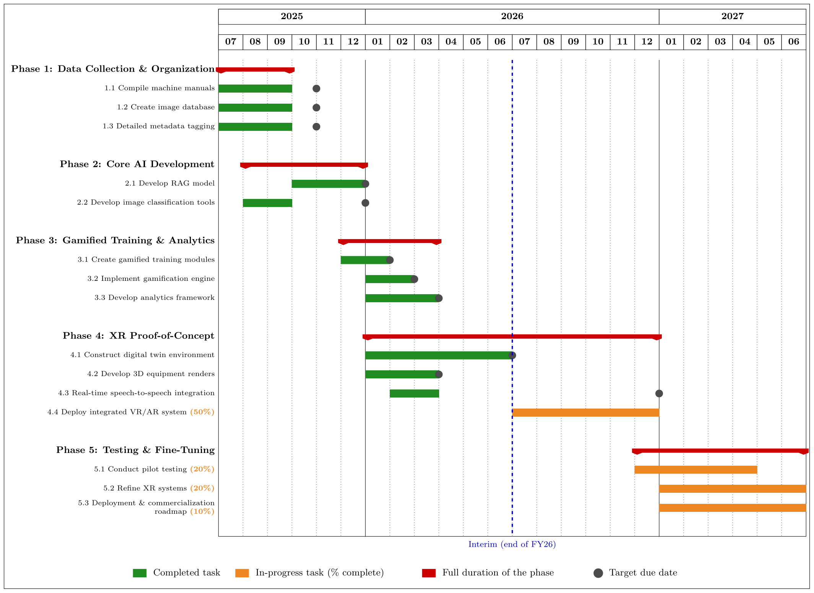
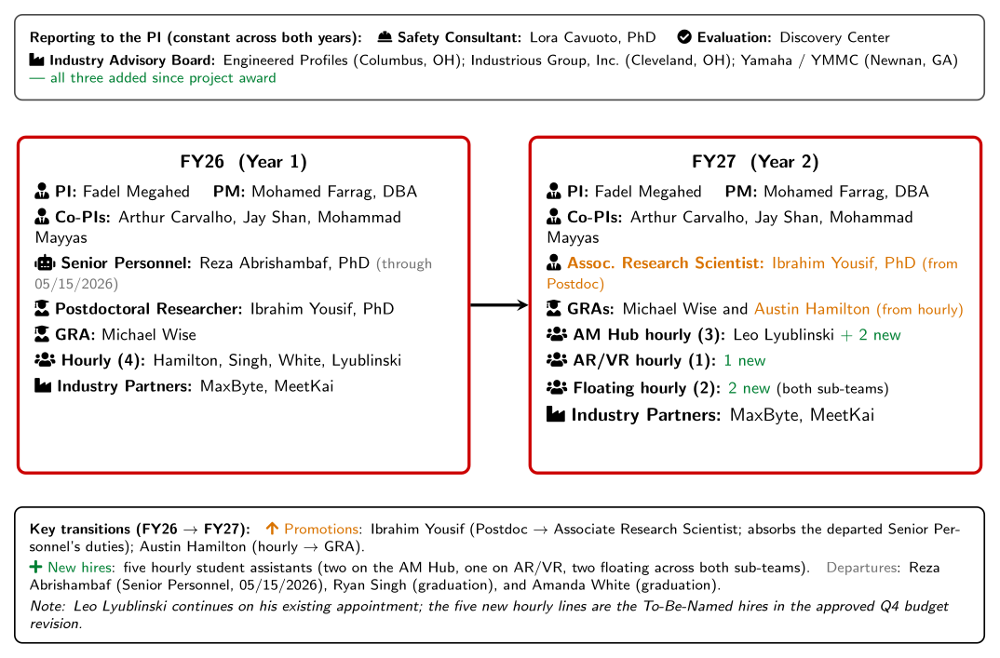
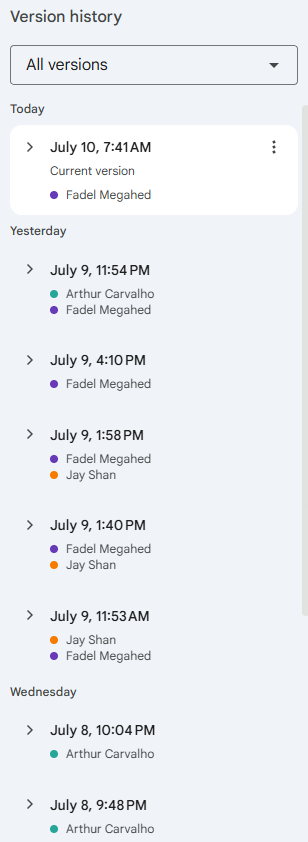
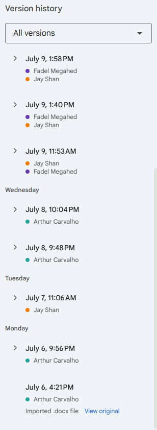
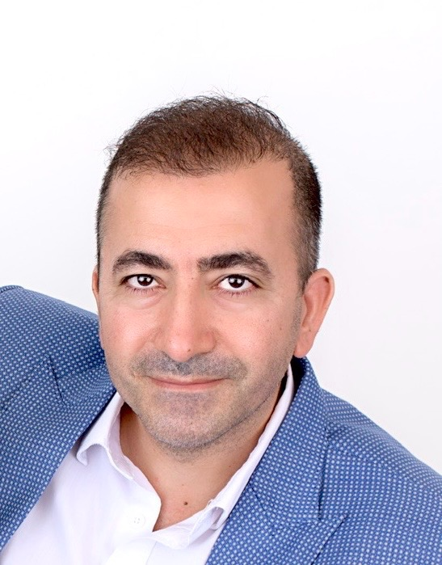

```{r options}
#| include: false

reticulate::use_condaenv("sight", required = TRUE)

# setting miamired color and ggplot2 theme for all plots
miamired = "#c3142d"

ggplot2::theme_set(
  ggplot2::theme_bw() +
  ggplot2::theme(
    plot.title = ggplot2::element_text(hjust = 0.5, size = 14, face = "bold"),
    plot.subtitle = ggtext::element_markdown(size = 12, color = "black"),
    legend.position='none',
    panel.grid.major = ggplot2::element_blank(),
    panel.grid.minor = ggplot2::element_blank(),
    strip.background = ggplot2::element_rect(fill ="#C3142D"),
    strip.text = ggplot2::element_text(color = "white", size = 8, face = "bold"),
    panel.spacing = ggplot2::unit(1, "lines"),
    axis.text = ggplot2::element_text(face = "bold", color = "black"),
    axis.title = ggplot2::element_text(face = "bold", color = "black"),
    plot.caption = ggtext::element_markdown(size = 8, color = "black")
  )
  )
```

```{python}
#| include: false

import matplotlib.pyplot as plt
from matplotlib.patches import FancyBboxPatch

MU = {
    'red': '#c3142d', 'gold': '#EFDB72', 'tan': '#CCC9B8',
    'blue': '#3E5468', 'gray': '#585E60',
    'white': '#ffffff', 'black': '#000000'
}

def draw_flowchart_vertical(
    nodes, figsize=(10, None), box_width=7, box_height=1.1, gap=0.5
):
    """Draw a vertical flowchart with rounded boxes and arrows."""
    n = len(nodes)
    total_h = n * box_height + (n - 1) * gap
    if figsize[1] is None:
        figsize = (figsize[0], max(total_h + 1.0, 4))
    fig, ax = plt.subplots(figsize=figsize)

    positions = []
    for i in range(n):
        y = total_h - i * (box_height + gap) - box_height / 2
        positions.append(y)

    for i, (node, y) in enumerate(zip(nodes, positions)):
        rect = FancyBboxPatch(
            (-box_width / 2, y - box_height / 2),
            box_width,
            box_height,
            boxstyle="round,pad=0.15",
            facecolor=node.get('fill_color', MU['white']),
            edgecolor=node.get('border_color', MU['black']),
            linewidth=2.5,
        )
        ax.add_patch(rect)

        title_y = y + 0.15 if node.get('subtitle') else y
        ax.text(
            0, title_y, node['title'],
            ha='center', va='center',
            fontsize=13, fontweight='bold',
            color=node.get('text_color', MU['black']),
            fontfamily='sans-serif',
        )

        if node.get('subtitle'):
            ax.text(
                0, y - 0.2, node['subtitle'],
                ha='center', va='center',
                fontsize=10,
                color=node.get('text_color', MU['black']),
                fontfamily='sans-serif',
                style='italic',
            )

        if i < n - 1:
            ax.annotate(
                '',
                xy=(0, positions[i + 1] + box_height / 2 + 0.02),
                xytext=(0, y - box_height / 2 - 0.02),
                arrowprops=dict(
                    arrowstyle='->', lw=2, color='#333333', mutation_scale=20
                ),
            )

    margin = 0.5
    ax.set_xlim(-box_width / 2 - margin, box_width / 2 + margin)
    ax.set_ylim(-0.5, total_h + 0.5)
    ax.set_aspect('equal')
    ax.axis('off')
    plt.tight_layout()
    plt.show()
```


## Meeting Goals

<div style="font-size: 0.82em;">

- [**Review and approve**]{style="color:#c3142d;"} the Meeting 21 minutes, confirm attendance, and revisit prior action items.

- [**Administrative Updates**]{style="color:#c3142d;"} (Fadel + MU Team):
  + FY27 hiring plan for **five student workers**.
  + Year 2 purchases: **Claude Code, Roboflow, cameras**, and other needs.
  + **First-year evaluation** update and lessons learned for Year 2 (Discovery Center).
  + Status of the current **Interim Progress Report** (Deliverable 8.1, due Jul 17, 2026).

- [**Technical Updates**]{style="color:#c3142d;"} (MU and Lora):
  + WebVR hosting, continuous improvement, and a request for **expert feedback** (Arthur).
  + Consultant's feedback on the current VR version (**Lora**).
  + **Digital twin** progress and the *Journal of Intelligent Manufacturing* paper (AM Hub team).

- [**Industry Partner Collaboration**]{style="color:#c3142d;"}: MeetKai handoff (Andrea) and MaxByte **AR demo** (Naveen/Ram).

- [**Risk mitigation / log**]{style="color:#c3142d;"} updates and further discussion.

</div>


## Recap: What We Covered in Meeting 21 (Jun 26)

::: {style="font-size: 0.9em;"}

::: {.columns}

::: {.column width="50%"}

[**🤝 Industry Handoffs**]{style="color:#c3142d;"}

- **MeetKai** transferred *all* project assets (digital environment, assets, and code) to a **MU GitHub repository**.
- **MaxByte** demoed the **autonomous pallet truck + AR** live at the AM Hub.

[**📋 Administrative / BWC**]{style="color:#c3142d;"}

- Q4 presentation delivered Jun 18; BWC **approved all Q1–Q3** submissions.
- Interim (Full-Year) Report set for **Jul 17, 2026**.

:::

::: {.column width="50%"}

[**⚙️ Technical Progress**]{style="color:#c3142d;"}

- Digital twin: floor rendering matched to the physical AM Hub + Web VR; **CNC modeling** underway.
- **Smart Safety Dashboard**: human-presence detection, station-time tracking, PPE (hard-hat) monitoring, daily PDF/Excel reports.

[**📄 Dissemination**]{style="color:#c3142d;"}

- **NAMRC 54**: chatbot paper presented (Fadel & Ibrahim).
- **HICSS**: long-context vs. RAG fast-track submission.

:::

:::

:::


## Action Items from Meeting 21

<div style="font-size: 0.55em;">

| Responsible Party | Action Item | Due Date | Status |
|:---|:---|:---|:---:|
| **Fadel / MU Team** | Submit proof of Q4 attendance to BWC | Jun 2026 | <input type="checkbox" checked> **Done** |
| **Kristen & Yue** (Discovery Center) | Provide draft evaluation report for BWC inclusion | Jul 8–9, 2026 | <input type="checkbox" checked> **Draft delivered** |
| **All Project Members** | Review the Interim Report draft at this meeting | Jul 10, 2026 | <input type="checkbox"> **In progress today** |
| **Fadel / MU Team** | Submit Interim (Full-Year) Progress Report | Jul 17, 2026 | <input type="checkbox"> **On track** |
| **Ibrahim** | Establish shared version control (GitHub) for CV / UI / DT code | ASAP | <input type="checkbox"> **In progress** |
| **Ibrahim / MU Team** | Update digital avatars/assets to wear long pants (industrial compliance) | Next Phase | <input type="checkbox"> **TBD** |
| **Ibrahim / Michael** | Explore part tracking via YOLO for cycle-time / productivity metrics | Next Phase | <input type="checkbox"> **TBD** |

</div>


## Meeting 21 Minutes




# Administrative Updates {.center .inverse}

Fadel Megahed


## Year 1 in the Books: Congratulations, and On to Year 2!

{width='100%' fig-align='center' fig-alt='SIGHT project timeline showing Year 1 progress and the work ahead for Year 2.'}


## FY27 Hiring Plan: Five Student Workers

{width='82%' fig-align='center' fig-alt='Side-by-side personnel transition plan for the five FY27 student workers.'}

::: {style="text-align:center; font-size: 0.62em"}
**1** worker for AI updates · **3** for the AM Hub (2 supporting structured experimentation) · **1** TBD (MU Team).
:::


## Year 2 Purchases

::: {.columns}

::: {.column width="55%"}

<div style="font-size: 0.82em;">

- [**Claude Code**]{style="color:#c3142d;"}: 6 subscriptions for **Fadel, Arthur, Jay, Ibrahim, Austin**, and **1 TBD** student worker.
- [**Roboflow**]{style="color:#c3142d;"}: annual subscription for **Ibrahim** (CV annotation and training).
- [**Cameras**]{style="color:#c3142d;"}: for shop-floor monitoring and digital-twin sensing.
- [**Other identified needs**]{style="color:#c3142d;"}: as they arise (Fadel and the MU Team).

</div>

<div style="border-left: 6px solid #c3142d; background:#f7f7f7; padding: 0.4em 0.7em; margin-top: 0.5em; font-size: 0.82em;">
💳 We now have our own [**grant P-card, in Fadel's name**]{style="color:#c3142d;"}, streamlining purchasing for the team.
</div>

:::

::: {.column width="45%"}

<div style="text-align:center;">
<iframe src="https://giphy.com/embed/VTZ3c7tWi1BACnZZ29" width="480" height="480" style="max-width:100%; border:0;" frameBorder="0" class="giphy-embed" allowFullScreen></iframe>
</div>

:::

:::


## Themes from the FY26 Evaluation (Discovery Center)




## Interim Progress Report (1 of 6): Deliverable 8.1, Due Jul 17, 2026




## Interim Report: Section Assignments & Contributions to Date

::: {.columns}

::: {.column width="44%"}

<div style="font-size: 0.78em;">

- On [**Jul 6**]{style="color:#c3142d;"}, Arthur assigned the **18 remaining sections** and set a hard deadline of [**end of day, Thursday Jul 09, 2026**]{style="color:#c3142d;"}.

- I have been **requesting these contributions for the past 2–3 meetings**.

- Today, each owner will **walk us through their sections**; anyone behind should **commit to a submission date**.

- The document's version history shows **who has contributed so far** →

</div>

:::

::: {.column width="28%"}

{height='430px' fig-align='center' fig-alt='Interim report Google Doc version history, most recent edits.'}

:::

::: {.column width="28%"}

{height='430px' fig-align='center' fig-alt='Interim report Google Doc version history, earlier edits.'}

:::

:::


## Interim Report Sections — Fadel Megahed

::: {.columns}

::: {.column width="26%"}

{width='72%' fig-align='center' fig-alt='Fadel Megahed headshot.'}

<div style="text-align:center;">[**Fadel Megahed**]{style="color:#c3142d; font-size: 1.05em;"}<br><span style="font-size:0.7em;">*4 sections*</span></div>

:::

::: {.column width="74%"}

```{=html}
<div style="font-size: 0.64em;">
<table style="width:100%; border-collapse:collapse;">
<tr style="background:#c3142d; color:white;"><th style="text-align:left; padding:7px;">Section</th><th style="padding:7px;">Status</th><th style="text-align:left; padding:7px;">Live Notes</th></tr>
<tr><td style="padding:7px;">1. Project Schedule Status</td><td style="text-align:center;"><select><option>Select status</option><option>✓ Done</option><option>⏳ In Progress</option><option>✗ Not Started</option></select></td><td style="vertical-align:top;"><textarea rows="4" style="width:100%; height:105px; resize:vertical;"></textarea></td></tr>
<tr><td style="padding:7px;">2. Total Percentage of Project Completion</td><td style="text-align:center;"><select><option>Select status</option><option>✓ Done</option><option>⏳ In Progress</option><option>✗ Not Started</option></select></td><td style="vertical-align:top;"><textarea rows="4" style="width:100%; height:105px; resize:vertical;"></textarea></td></tr>
<tr><td style="padding:7px;">8. Administrative Status of Project</td><td style="text-align:center;"><select><option>Select status</option><option>✓ Done</option><option>⏳ In Progress</option><option>✗ Not Started</option></select></td><td style="vertical-align:top;"><textarea rows="4" style="width:100%; height:105px; resize:vertical;"></textarea></td></tr>
<tr><td style="padding:7px;">9. Project Budget Status</td><td style="text-align:center;"><select><option>Select status</option><option>✓ Done</option><option>⏳ In Progress</option><option>✗ Not Started</option></select></td><td style="vertical-align:top;"><textarea rows="4" style="width:100%; height:105px; resize:vertical;"></textarea></td></tr>
</table>
</div>
```

:::

:::


## Interim Report Sections — Arthur Carvalho

::: {.columns}

::: {.column width="26%"}

{width='72%' fig-align='center' fig-alt='Arthur Carvalho headshot.'}

<div style="text-align:center;">[**Arthur Carvalho**]{style="color:#c3142d; font-size: 1.05em;"}<br><span style="font-size:0.7em;">*4 sections*</span></div>

:::

::: {.column width="74%"}

```{=html}
<div style="font-size: 0.64em;">
<table style="width:100%; border-collapse:collapse;">
<tr style="background:#c3142d; color:white;"><th style="text-align:left; padding:7px;">Section</th><th style="padding:7px;">Status</th><th style="text-align:left; padding:7px;">Live Notes</th></tr>
<tr><td style="padding:7px;">3. Project Overview</td><td style="text-align:center;"><select><option>Select status</option><option selected>✓ Done</option><option>⏳ In Progress</option><option>✗ Not Started</option></select></td><td style="vertical-align:top;"><textarea rows="4" style="width:100%; height:105px; resize:vertical;">First draft completed.</textarea></td></tr>
<tr><td style="padding:7px;">13. Communications, Outreach &amp; Dissemination</td><td style="text-align:center;"><select><option>Select status</option><option>✓ Done</option><option>⏳ In Progress</option><option>✗ Not Started</option></select></td><td style="vertical-align:top;"><textarea rows="4" style="width:100%; height:105px; resize:vertical;"></textarea></td></tr>
<tr><td style="padding:7px;">14. Updated Communications Matrix</td><td style="text-align:center;"><select><option>Select status</option><option>✓ Done</option><option>⏳ In Progress</option><option>✗ Not Started</option></select></td><td style="vertical-align:top;"><textarea rows="4" style="width:100%; height:105px; resize:vertical;"></textarea></td></tr>
<tr><td style="padding:7px;">17. Risk Management Log</td><td style="text-align:center;"><select><option>Select status</option><option>✓ Done</option><option>⏳ In Progress</option><option>✗ Not Started</option></select></td><td style="vertical-align:top;"><textarea rows="4" style="width:100%; height:105px; resize:vertical;"></textarea></td></tr>
</table>
</div>
```

:::

:::


## Interim Report Sections — Jay Shan

::: {.columns}

::: {.column width="26%"}

{width='72%' fig-align='center' fig-alt='Jay (Zhe) Shan headshot.'}

<div style="text-align:center;">[**Jay Shan**]{style="color:#c3142d; font-size: 1.05em;"}<br><span style="font-size:0.7em;">*4 sections*</span></div>

:::

::: {.column width="74%"}

```{=html}
<div style="font-size: 0.64em;">
<table style="width:100%; border-collapse:collapse;">
<tr style="background:#c3142d; color:white;"><th style="text-align:left; padding:7px;">Section</th><th style="padding:7px;">Status</th><th style="text-align:left; padding:7px;">Live Notes</th></tr>
<tr><td style="padding:7px;">4. Interim Activity Status</td><td style="text-align:center;"><select><option>Select status</option><option>✓ Done</option><option>⏳ In Progress</option><option>✗ Not Started</option></select></td><td style="vertical-align:top;"><textarea rows="4" style="width:100%; height:105px; resize:vertical;"></textarea></td></tr>
<tr><td style="padding:7px;">5. Project Progress</td><td style="text-align:center;"><select><option>Select status</option><option>✓ Done</option><option>⏳ In Progress</option><option>✗ Not Started</option></select></td><td style="vertical-align:top;"><textarea rows="4" style="width:100%; height:105px; resize:vertical;"></textarea></td></tr>
<tr><td style="padding:7px;">16. Action Plan</td><td style="text-align:center;"><select><option>Select status</option><option>✓ Done</option><option>⏳ In Progress</option><option>✗ Not Started</option></select></td><td style="vertical-align:top;"><textarea rows="4" style="width:100%; height:105px; resize:vertical;"></textarea></td></tr>
<tr><td style="padding:7px;">20. Looking Ahead</td><td style="text-align:center;"><select><option>Select status</option><option>✓ Done</option><option>⏳ In Progress</option><option>✗ Not Started</option></select></td><td style="vertical-align:top;"><textarea rows="4" style="width:100%; height:105px; resize:vertical;"></textarea></td></tr>
</table>
</div>
```

:::

:::


## Interim Report Sections — Mohammad Mayyas

::: {.columns}

::: {.column width="26%"}

{width='72%' fig-align='center' fig-alt='Mohammad Mayyas headshot.'}

<div style="text-align:center;">[**Mohammad Mayyas**]{style="color:#c3142d; font-size: 1.05em;"}<br><span style="font-size:0.7em;">*3 sections*</span></div>

:::

::: {.column width="74%"}

```{=html}
<div style="font-size: 0.64em;">
<table style="width:100%; border-collapse:collapse;">
<tr style="background:#c3142d; color:white;"><th style="text-align:left; padding:7px;">Section</th><th style="padding:7px;">Status</th><th style="text-align:left; padding:7px;">Live Notes</th></tr>
<tr><td style="padding:7px;">11. Collaboration Efforts</td><td style="text-align:center;"><select><option>Select status</option><option>✓ Done</option><option>⏳ In Progress</option><option>✗ Not Started</option></select></td><td style="vertical-align:top;"><textarea rows="4" style="width:100%; height:105px; resize:vertical;"></textarea></td></tr>
<tr><td style="padding:7px;">12. Commercialization Efforts</td><td style="text-align:center;"><select><option>Select status</option><option>✓ Done</option><option>⏳ In Progress</option><option>✗ Not Started</option></select></td><td style="vertical-align:top;"><textarea rows="4" style="width:100%; height:105px; resize:vertical;"></textarea></td></tr>
<tr><td style="padding:7px;">18. Lessons Learned</td><td style="text-align:center;"><select><option>Select status</option><option>✓ Done</option><option>⏳ In Progress</option><option>✗ Not Started</option></select></td><td style="vertical-align:top;"><textarea rows="4" style="width:100%; height:105px; resize:vertical;"></textarea></td></tr>
</table>
</div>
```

::: {style="font-size:0.7em; color:#c3142d; margin-top:0.3em;"}
⏳ *No edits yet in the document version history; please confirm a submission date.*
:::

:::

:::


## Interim Report Sections — Ibrahim Yousif

::: {.columns}

::: {.column width="26%"}

{width='72%' fig-align='center' fig-alt='Ibrahim Yousif headshot.'}

<div style="text-align:center;">[**Ibrahim Yousif**]{style="color:#c3142d; font-size: 1.05em;"}<br><span style="font-size:0.7em;">*3 sections*</span></div>

:::

::: {.column width="74%"}

```{=html}
<div style="font-size: 0.64em;">
<table style="width:100%; border-collapse:collapse;">
<tr style="background:#c3142d; color:white;"><th style="text-align:left; padding:7px;">Section</th><th style="padding:7px;">Status</th><th style="text-align:left; padding:7px;">Live Notes</th></tr>
<tr><td style="padding:7px;">6. Technical Progress &amp; Considerations</td><td style="text-align:center;"><select><option>Select status</option><option>✓ Done</option><option>⏳ In Progress</option><option>✗ Not Started</option></select></td><td style="vertical-align:top;"><textarea rows="4" style="width:100%; height:105px; resize:vertical;"></textarea></td></tr>
<tr><td style="padding:7px;">7. Success Metrics</td><td style="text-align:center;"><select><option>Select status</option><option>✓ Done</option><option>⏳ In Progress</option><option>✗ Not Started</option></select></td><td style="vertical-align:top;"><textarea rows="4" style="width:100%; height:105px; resize:vertical;"></textarea></td></tr>
<tr><td style="padding:7px;">15. Challenges</td><td style="text-align:center;"><select><option>Select status</option><option>✓ Done</option><option>⏳ In Progress</option><option>✗ Not Started</option></select></td><td style="vertical-align:top;"><textarea rows="4" style="width:100%; height:105px; resize:vertical;"></textarea></td></tr>
</table>
</div>
```

::: {style="font-size:0.7em; color:#c3142d; margin-top:0.3em;"}
⏳ *No edits yet in the document version history; please confirm a submission date.*
:::

:::

:::


# Technical Updates {.center .inverse}

Fadel Megahed and Ibrahim Yousif


## WebVR: Continued Refinements — Arthur's Contributions (1/2)

<div style="font-size: 0.82em; margin-bottom: 0.6em;">
[**Context.**]{style="color:#c3142d;"} Arthur inherited the VR codebase from **MeetKai** roughly three weeks ago. Since then he has (1) studied the codebase, (2) moved deployment to **MU-controlled platforms**, and (3) fixed many issues, putting us [**very close to a v1.0**]{style="color:#c3142d;"} that checks all the boxes we promised BWC.
</div>

::: {.columns}

::: {.column width="33%"}

<div style="background:#c3142d; color:#fff; padding:9px 10px; border-radius:8px; font-weight:bold; text-align:center; font-size:0.82em;">🖥️ Dashboard / UI</div>

<div style="font-size: 0.72em; margin-top: 0.7em; line-height: 1.65;">

- Removed unused items (Settings, Feedback, profile image); added an **About** page.
- Renamed bot to **SIGHT bot**; cleaned end-screen text and button ordering.
- Fixed **Milling / Cobot / CNC** wording, typos, and PPE tooltip text.

</div>

:::

::: {.column width="33%"}

<div style="background:#3E5468; color:#fff; padding:9px 10px; border-radius:8px; font-weight:bold; text-align:center; font-size:0.82em;">🔐 Authentication</div>

<div style="font-size: 0.72em; margin-top: 0.7em; line-height: 1.65;">

- Reworked auth: **Google**, email sign-in, and join flows.
- Sign-up collects name / email / password; **Firebase** identity carried into Unity.
- Cleaner **sign-out reset**; Firebase-specific forgot-password errors.

</div>

:::

::: {.column width="33%"}

<div style="background:#EFDB72; color:#222; padding:9px 10px; border-radius:8px; font-weight:bold; text-align:center; font-size:0.82em;">🗄️ Database / Backend</div>

<div style="font-size: 0.72em; margin-top: 0.7em; line-height: 1.65;">

- Added **Cloudflare Worker** backend; Firebase UID as `player_id`.
- Upserts players into **Google Cloud SQL / MySQL**.
- Added DB documentation, **ERD**, and seed inserts.

</div>

:::

:::


## WebVR: Continued Refinements — Arthur's Contributions (2/2)

::: {.columns}

::: {.column width="33%"}

<div style="background:#c3142d; color:#fff; padding:9px 10px; border-radius:8px; font-weight:bold; text-align:center; font-size:0.82em;">🤖 AI Chatbot</div>

<div style="font-size: 0.72em; margin-top: 0.7em; line-height: 1.65;">

- [**Screenshot capture**]{style="color:#c3142d;"} attached to each query: *significantly* better responses.
- New `/query_with_screenshot` endpoint; conversation-ID reuse; rich-text formatting.
- Manual TTS playback; upgraded model and improved **SIGHT Bot** instructions.

</div>

:::

::: {.column width="33%"}

<div style="background:#3E5468; color:#fff; padding:9px 10px; border-radius:8px; font-weight:bold; text-align:center; font-size:0.82em;">🚀 WebGL / Deployment</div>

<div style="font-size: 0.72em; margin-top: 0.7em; line-height: 1.65;">

- Fixed WebGL MIME types, `.wasm` / `.data` paths, and build templates.
- **Monotonic** loading bar; Google Analytics tag added.
- Hardened **GitHub Actions / Cloudflare** deploy (R2 rewriting, cache-busting).

</div>

:::

::: {.column width="33%"}

<div style="background:#EFDB72; color:#222; padding:9px 10px; border-radius:8px; font-weight:bold; text-align:center; font-size:0.82em;">📚 Documentation</div>

<div style="font-size: 0.72em; margin-top: 0.7em; line-height: 1.65;">

- Rewrote main **README** (build, auth, deploy, analytics, Cloud SQL, AI API).
- Added **AI** and **AI/API** READMEs.
- Added a **database README** with schema and ERD explanations.

</div>

:::

:::

<div style="border-left: 6px solid #c3142d; background:#f7f7f7; padding: 0.5em 0.8em; margin-top: 0.8em; font-size: 0.74em;">
📋 [**Ask of the team:**]{style="color:#c3142d;"} roughly 2–3 hours of meticulous testing. Feedback by **Jul 17**; first release planned for **Jul 24**. Format issues as *"I saw [current], but it should be [correction]."*
</div>


## New Permanent Home for the VR Platform: sightvr.org

```{r}
#| echo: false

knitr::include_url("https://sightvr.org", height = "480px")
```

::: {style="text-align:center; font-size: 0.8em"}
Permanent link: [**http://sightvr.org**](http://sightvr.org) *(replaces the MeetKai-hosted demo URL).*
:::


## WebVR Feedback from Lora




## Finalizing the Digital Twin Beyond the Proof-of-Concept Prototype

```{python}
#| echo: false
#| fig-align: center
#| out-width: "100%"

import matplotlib.pyplot as plt
from matplotlib.patches import FancyBboxPatch

pillars = [
    ('a', 'Permanent\nWebsite', 'Always-on public hosting', MU['red']),
    ('b', 'Bug-Free\nTesting', 'Verified, stable release', MU['blue']),
    ('c', 'Git Code\nRepository', 'Versioned & documented', MU['red']),
    ('d', 'Structured\nExperimentation', 'Evidence that it works', MU['blue']),
    ('e', 'Polished\nDemo Videos', 'CNC Lathe + Cobot utility', MU['red']),
]

CARD_W = 2.3
GAP = 0.35
CARD_H = 3.0
card_y = 1.4
n = len(pillars)
total_w = n * CARD_W + (n - 1) * GAP

fig, ax = plt.subplots(figsize=(13, 5.2))

for i, (letter, title, sub, color) in enumerate(pillars):
    x = i * (CARD_W + GAP)
    cx = x + CARD_W / 2
    card = FancyBboxPatch(
        (x, card_y), CARD_W, CARD_H,
        boxstyle="round,pad=0.05",
        facecolor=MU['white'], edgecolor=color, linewidth=2.5,
    )
    _ = ax.add_patch(card)

    badge = FancyBboxPatch(
        (cx - 0.4, card_y + CARD_H - 0.95), 0.8, 0.65,
        boxstyle="round,pad=0.04",
        facecolor=color, edgecolor='none',
    )
    _ = ax.add_patch(badge)
    _ = ax.text(cx, card_y + CARD_H - 0.625, f'({letter})',
                ha='center', va='center', fontsize=15,
                fontweight='bold', color=MU['white'])

    _ = ax.text(cx, card_y + CARD_H - 1.7, title,
                ha='center', va='center', fontsize=13,
                fontweight='bold', color=MU['black'])
    _ = ax.text(cx, card_y + 0.55, sub,
                ha='center', va='center', fontsize=9.5,
                fontstyle='italic', color=MU['gray'])

banner = FancyBboxPatch(
    (0, 0.15), total_w, 0.85,
    boxstyle="round,pad=0.04",
    facecolor=MU['gold'], edgecolor=MU['red'], linewidth=2,
)
_ = ax.add_patch(banner)
_ = ax.text(total_w / 2, 0.575,
            'Stretch goal: use cameras + Mayyas/MaxByte sensors to shadow and stop the milling machine',
            ha='center', va='center', fontsize=10.5,
            fontweight='bold', color=MU['black'])

_ = ax.set_xlim(-0.2, total_w + 0.2)
_ = ax.set_ylim(0, 5.0)
_ = ax.set_aspect('auto')
_ = ax.axis('off')
plt.tight_layout()
plt.show()
```


## From May 01 Meeting: Digital Twin — Architecture

{width='100%' fig-align='center' fig-alt='Digital twin closed-loop architecture: Cognitive Twin, Candidate Response Generator, Validation Gate (Emulation Twin), and Execution & Physical System.'}

::: {style="text-align:center; font-size: 0.7em"}
Closed-loop architecture targeted for the *Journal of Intelligent Manufacturing* submission: Cognitive Twin → Candidate Response Generator → Validation Gate (Emulation Twin) → Execution & Physical System.
:::


## From May 01 Meeting: Digital Twin — Current Paper Draft




## From May 01 Meeting: Summer Team and Roles for the Digital Twin Paper

```{python}
#| echo: false
#| fig-align: center
#| out-width: "100%"

import matplotlib.pyplot as plt
from matplotlib.patches import FancyBboxPatch

fig, ax = plt.subplots(figsize=(13, 6.0))

LANE_X = 0.5
LANE_W = 12.0
LANE_H = 1.4
GAP = 0.25
PERSON_W = 2.4
PERSON_H = 0.7

lanes = [
    {
        'y': 4.4,
        'label': 'Lead / Implementation',
        'color': MU['red'],
        'people': [
            ('Ibrahim Yousif', '(lead)'),
            ('Leo', 'sensing & data'),
            ('Michael', 'sensing & data'),
            ('Austin Hamilton', 'web app polish'),
        ],
    },
    {
        'y': 2.6,
        'label': 'Writing / Analysis',
        'color': MU['blue'],
        'people': [
            ('Fadel Megahed', ''),
            ('Arthur Carvalho', ''),
        ],
    },
    {
        'y': 0.8,
        'label': 'Experimental Setup + Writing/Analysis',
        'color': MU['gold'],
        'people': [
            ('Lora', ''),
            ('Mohammad Mayyas', ''),
        ],
    },
]

for lane in lanes:
    lane_box = FancyBboxPatch(
        (LANE_X, lane['y']), LANE_W, LANE_H,
        boxstyle="round,pad=0.05",
        facecolor='#fafafa', edgecolor=lane['color'], linewidth=2.5,
    )
    _ = ax.add_patch(lane_box)

    _ = ax.text(LANE_X + 0.15, lane['y'] + LANE_H - 0.18,
            lane['label'],
            ha='left', va='top',
            fontsize=11, fontweight='bold',
            color=lane['color'], fontfamily='sans-serif')

    n = len(lane['people'])
    total_w = n * PERSON_W + (n - 1) * GAP
    start_x = LANE_X + (LANE_W - total_w) / 2

    for i, (name, role) in enumerate(lane['people']):
        px = start_x + i * (PERSON_W + GAP)
        py = lane['y'] + (LANE_H - PERSON_H) / 2 - 0.15
        person_box = FancyBboxPatch(
            (px, py), PERSON_W, PERSON_H,
            boxstyle="round,pad=0.04",
            facecolor=MU['white'], edgecolor=lane['color'], linewidth=1.5,
        )
        _ = ax.add_patch(person_box)

        if role:
            _ = ax.text(px + PERSON_W / 2, py + PERSON_H / 2 + 0.12,
                    name, ha='center', va='center',
                    fontsize=10, fontweight='bold',
                    color=MU['black'], fontfamily='sans-serif')
            _ = ax.text(px + PERSON_W / 2, py + PERSON_H / 2 - 0.13,
                    role, ha='center', va='center',
                    fontsize=8.5, fontstyle='italic',
                    color=MU['gray'], fontfamily='sans-serif')
        else:
            _ = ax.text(px + PERSON_W / 2, py + PERSON_H / 2,
                    name, ha='center', va='center',
                    fontsize=10, fontweight='bold',
                    color=MU['black'], fontfamily='sans-serif')

# Arrows: Lead -> Writing (down) and Experimental Setup -> Lead (up)
arrowprops = dict(arrowstyle='->', lw=1.6, color=MU['gray'], mutation_scale=18)
_ = ax.annotate('', xy=(LANE_X + LANE_W * 0.30, 2.6 + LANE_H),
            xytext=(LANE_X + LANE_W * 0.30, 4.4),
            arrowprops=arrowprops)
_ = ax.text(LANE_X + LANE_W * 0.30 + 0.15, (2.6 + LANE_H + 4.4) / 2,
        'data & results', ha='left', va='center',
        fontsize=8.5, color=MU['gray'], fontstyle='italic')

_ = ax.annotate('', xy=(LANE_X + LANE_W * 0.70, 4.4),
            xytext=(LANE_X + LANE_W * 0.70, 0.8 + LANE_H),
            arrowprops=arrowprops)
_ = ax.text(LANE_X + LANE_W * 0.70 + 0.15, (0.8 + LANE_H + 4.4) / 2,
        'experimental design', ha='left', va='center',
        fontsize=8.5, color=MU['gray'], fontstyle='italic')

_ = ax.set_xlim(0, LANE_X + LANE_W + 0.5)
_ = ax.set_ylim(0.3, 4.4 + LANE_H + 0.5)
_ = ax.set_aspect('auto')
_ = ax.axis('off')
plt.tight_layout()
plt.show()
```


# Industry Partner Collaboration {.inverse .center}

MeetKai and MaxByte


## MeetKai: Thank You for an Excellent Handoff

::: {.columns}

::: {.column width="58%"}

<div style="font-size: 0.86em;">

A sincere [**thank you to the MeetKai team**]{style="color:#c3142d;"} as they transition to other projects:

- ✅ **Full handoff** of the web-based VR platform.
- 📁 A **detailed, well-documented repository** (platforms, accounts, and code all captured).
- 🌟 **Excellent work** that put us within reach of a v1.0 release.

</div>

<div style="border-left: 6px solid #c3142d; background:#f7f7f7; padding: 0.4em 0.7em; margin-top: 0.6em; font-size: 0.86em;">
🎙️ [**Andrea**]{style="color:#c3142d;"}: the floor is yours for any questions or comments for our team.
</div>

:::

::: {.column width="42%"}

<div style="text-align:center; margin-top:1.2em;">
<span style="font-size: 6em;">🤝</span>
</div>

:::

:::


## MaxByte: AR Demo Status


# Discussion and Wrap Up | Open Floor {.inverse .center}

All Project Members


## Technical Work Ahead

{width='100%' fig-align='center' fig-alt='SIGHT project timeline highlighting the technical work ahead.'}


## Upcoming BWC Deadlines

<br>

```{=html}
<div style="display:flex; justify-content:center;">
<table style="border-collapse:separate; border-spacing:0; width:90%; font-size:0.8em; box-shadow:0 3px 10px rgba(0,0,0,0.14); border-radius:12px; overflow:hidden;">
<thead>
<tr style="background:#c3142d; color:#fff;">
<th style="text-align:left; padding:13px 18px;">Deliverable</th>
<th style="text-align:center; padding:13px 18px; white-space:nowrap;">Due Date</th>
<th style="text-align:center; padding:13px 18px;">Status</th>
</tr>
</thead>
<tbody>
<tr style="background:#ffffff;">
<td style="padding:13px 18px;"><strong style="color:#c3142d;">Interim (Full-Year) Progress Report:</strong> Deliverable 8.1</td>
<td style="text-align:center; padding:13px 18px; font-weight:bold; white-space:nowrap;">Jul 17, 2026</td>
<td style="text-align:center; padding:13px 18px;"><span style="background:#c3142d; color:#fff; padding:4px 12px; border-radius:14px; font-size:0.82em; font-weight:bold;">Next up</span></td>
</tr>
<tr style="background:#f5f5f5;">
<td style="padding:13px 18px;">July / August team meeting documents</td>
<td style="text-align:center; padding:13px 18px; font-weight:bold; white-space:nowrap;">Sep 11, 2026</td>
<td style="text-align:center; padding:13px 18px;"><span style="background:#EFDB72; color:#222; padding:4px 12px; border-radius:14px; font-size:0.82em; font-weight:bold;">Upcoming</span></td>
</tr>
<tr style="background:#ffffff;">
<td style="padding:13px 18px;"><strong>Q5 Quarterly Progress Report</strong></td>
<td style="text-align:center; padding:13px 18px; font-weight:bold; white-space:nowrap;">Oct 09, 2026</td>
<td style="text-align:center; padding:13px 18px;"><span style="background:#3E5468; color:#fff; padding:4px 12px; border-radius:14px; font-size:0.82em; font-weight:bold;">Scheduled</span></td>
</tr>
<tr style="background:#f5f5f5;">
<td style="padding:13px 18px;">Digital Twin paper: <em>Journal of Intelligent Manufacturing</em></td>
<td style="text-align:center; padding:13px 18px; font-weight:bold; white-space:nowrap;">TBD</td>
<td style="text-align:center; padding:13px 18px;"><span style="background:#585E60; color:#fff; padding:4px 12px; border-radius:14px; font-size:0.82em; font-weight:bold;">Technical</span></td>
</tr>
</tbody>
</table>
</div>
```

::: {style="text-align:center; font-size: 0.7em; margin-top:0.6em;"}
Contacts: Fadel Megahed (fmegahed@miamioh.edu) · Mohamed Farrag, PM (farragm2@miamioh.edu).
:::


## Updates to Risk and Risk Log

Based on our conversation, Arthur can update the risk log with any further updates.
