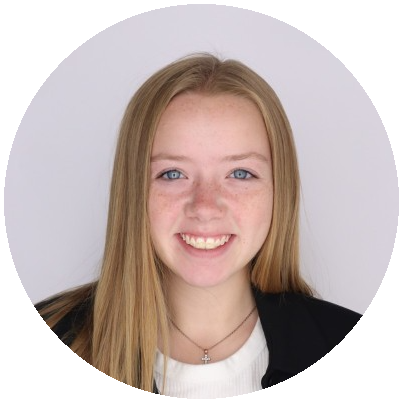
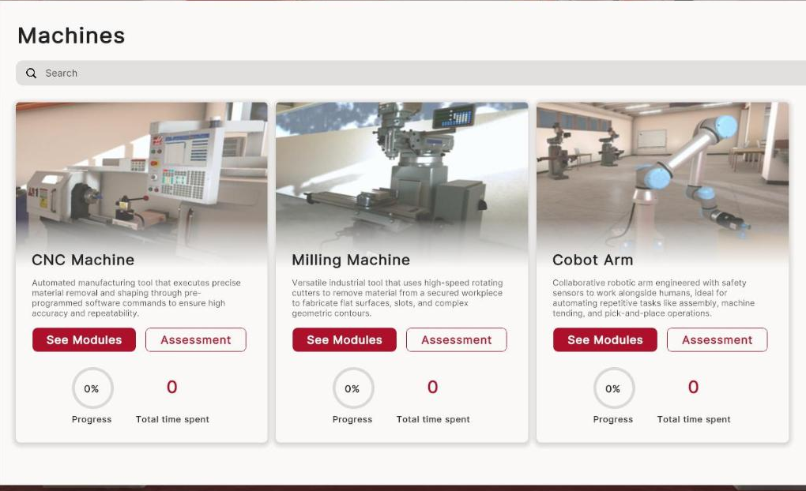
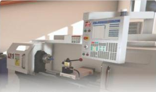
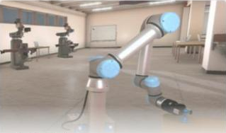
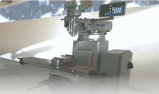
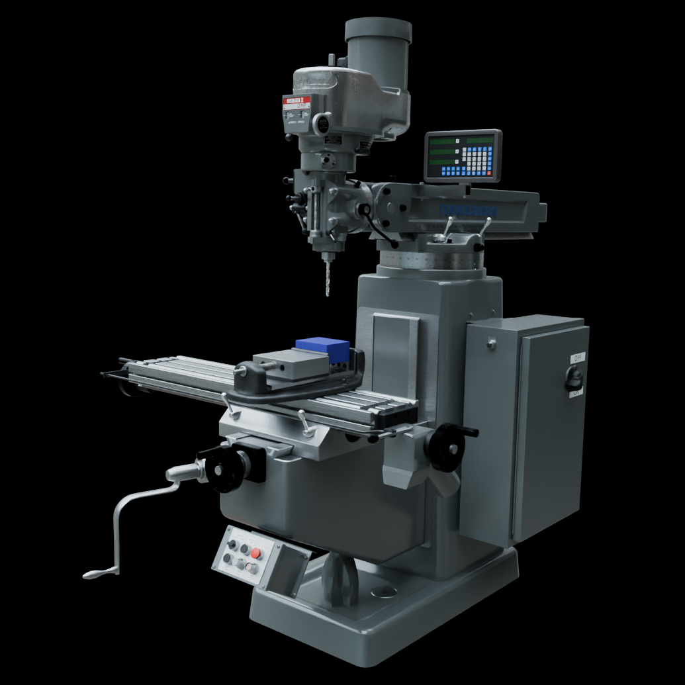

```{r options}
#| include: false

reticulate::use_condaenv("sight", required = TRUE)

# setting miamired color and ggplot2 theme for all plots
miamired = "#c3142d"

ggplot2::theme_set(
  ggplot2::theme_bw() +
  ggplot2::theme(
    plot.title = ggplot2::element_text(hjust = 0.5, size = 14, face = "bold"),
    plot.subtitle = ggtext::element_markdown(size = 12, color = "black"),
    legend.position='none',
    panel.grid.major = ggplot2::element_blank(),
    panel.grid.minor = ggplot2::element_blank(),
    strip.background = ggplot2::element_rect(fill ="#C3142D"),
    strip.text = ggplot2::element_text(color = "white", size = 8, face = "bold"),
    panel.spacing = ggplot2::unit(1, "lines"),
    axis.text = ggplot2::element_text(face = "bold", color = "black"),
    axis.title = ggplot2::element_text(face = "bold", color = "black"),
    plot.caption = ggtext::element_markdown(size = 8, color = "black")
  )
  )
```


## Meeting Goals

```{=html}
<div class="agenda-bar">
  <div class="seg" style="flex:2;">1</div>
  <div class="seg" style="flex:5;">2</div>
  <div class="seg" style="flex:15;">3</div>
  <div class="seg" style="flex:15;">4</div>
  <div class="seg" style="flex:15;">5</div>
  <div class="seg" style="flex:5;">6</div>
  <div class="seg" style="flex:3;">7</div>
</div>
<div class="agenda-grid">
  <div><div class="ag-n">1 <span>· 2 min</span></div><div class="ag-t">Minutes and action items</div><div class="ag-p">Fadel</div></div>
  <div><div class="ag-n">2 <span>· 5 min</span></div><div class="ag-t">Administrative updates</div><div class="ag-p">Fadel: BWC status, three new team members, Safety 2027</div></div>
  <div><div class="ag-n">3 <span>· 15 min</span></div><div class="ag-t">Technical updates</div><div class="ag-p">Arthur: WebVR at sightvr.org<br>Michael and AM Hub subteam: machine SOPs for AR</div></div>
  <div><div class="ag-n">4 <span>· 15 min</span></div><div class="ag-t">Industry partner</div><div class="ag-p">Ram: MaxByte developments in the AM Hub</div></div>
  <div><div class="ag-n">5 <span>· 15 min</span></div><div class="ag-t">Miami-Lora closed session</div><div class="ag-p">Austin: environment status<br>Lora: experimental protocol</div></div>
  <div><div class="ag-n">6 <span>· 5 min</span></div><div class="ag-t">Risk log</div><div class="ag-p">All</div></div>
  <div><div class="ag-n">7 <span>· 3 min</span></div><div class="ag-t">Wrap-up</div><div class="ag-p">Action items, next steps</div></div>
</div>
```

::: {style="font-size: 0.62em; text-align:center; margin-top:0.8em;"}
Sixty minutes in seven blocks; block widths are proportional to the minutes allotted in the agenda.
:::


## Recap: What We Covered in Meeting 24 (Aug 7)

::: {style="font-size: 0.82em;"}

::: {.columns}

::: {.column width="50%"}

[**Administrative / BWC**]{style="color:#c3142d;"}

- BWC **accepted the Year 1 interim report**; July documents submitted on schedule.
- **Q4 invoice** fully processed and approved.
- Q5 report due **Oct 9**; BWC review **Oct 21/22**; 4-slide executive deck due **Oct 11**.
- **OSC 2027** abstract (Columbus, Mar 16 to 19, 2027): live demo vs. AI safety workshop format.

[**Hiring**]{style="color:#c3142d;"}

- Wissam Nusair joining for AM Hub operations; Lindsay Stevenson (MSBA) onboarding.
- Three more students targeted, two based at the Hamilton hub.

:::

::: {.column width="50%"}

[**Student-led technical updates**]{style="color:#c3142d;"}

- **Michael**: thesis proposal on smart-manufacturing machine safety; sensor matrix for the UR5e, Haas CNC, and Bridgeport mill. Feedback: near-misses and caught-by incidents, Hierarchy of Hazard Controls.
- **Austin**: AR environment progress.
- **Leo**: ROI and cost-benefit analysis paper with Jay and Ibrahim.

[**MaxByte**]{style="color:#c3142d;"}

- Five-milestone delivery approach; Milestone 1 design documentation complete.
- Deliverables now go to the **MU-maintained shared Google Drive**.

:::

:::

:::


## Action Items from Meeting 24

<div style="font-size: 0.62em;">

| Responsible Party | Action Item | Due Date | Status |
|:---|:---|:---|:---:|
| **Fadel / Team** | Submit OSC 2027 abstract and select presentation format | Aug 8, 2026 | <span class="st-done">&#10003;</span> **Done:** presentation #2268, *Using GenAI to Develop Training Materials (WSIC)* |
| **Fadel / HR** | Finalize hiring paperwork for Lindsay Stevenson (MSBA) | Aug 15, 2026 | <span class="st-done">&#10003;</span> **Done** |
| **Michael Wise** | Refine thesis proposal slides (near-misses and caught-by focus) | Aug 14, 2026 | <input type="checkbox"> |
| **Leo** | Complete mathematical framework for the ROI/CBA paper | Aug 14, 2026 | <input type="checkbox"> |
| **Fadel / Team** | Prepare Q5 BWC executive deck (4 slides) | Oct 11, 2026 | <input type="checkbox"> |

</div>


## Meeting 24 Minutes




# Administrative Updates {.center .inverse}

Fadel Megahed


## Status of BWC Deliverables and Requirements

<div style="font-size: 0.74em;">

- [**Accepted by BWC:**]{style="color:#2e7d32;"} Year 1 interim (full-year) progress report, Deliverable 8.1 (Jul 17, 2026).
- [**Submitted:**]{style="color:#2e7d32;"} July / August project team documents (Sep 11, 2026 deadline).
- [**Ahead:**]{style="color:#c3142d;"} the Q5 cycle, with emphasis on functional AR milestones.

</div>

```{=html}
<div class="tl tl-short">
  <div class="tl-line"></div>
  <div class="tl-month" style="left:0%;">Sep 1</div>
  <div class="tl-month" style="left:100%;">Oct 31</div>
  <div class="tl-today" style="left:5%;"><span>Today<br>Sep 4</span></div>
  <div class="tl-item down" style="left:51.7%;"><div class="tl-stub"></div><div class="tl-dot"></div><div class="tl-label"><b>Oct 2</b><br>Q5 report: team draft due<br><span class="pill pill-red">Next up</span></div></div>
  <div class="tl-item up" style="left:63.3%;"><div class="tl-stub"></div><div class="tl-dot"></div><div class="tl-label"><b>Oct 9</b><br>Q5 quarterly progress report to BWC<br><span class="pill pill-gold">Due</span></div></div>
  <div class="tl-item down tier2" style="left:66.7%;"><div class="tl-stub"></div><div class="tl-dot"></div><div class="tl-label"><b>Oct 11</b><br>Q5 executive deck (4 slides)<br><span class="pill pill-gold">Due</span></div></div>
  <div class="tl-item up" style="left:84.2%;"><div class="tl-stub"></div><div class="tl-dot"></div><div class="tl-label"><b>Oct 21 / 22</b><br>BWC Q5 review meeting; formal submission<br><span class="pill pill-blue">Scheduled</span></div></div>
</div>
```


## Welcome: Lindsay Stevenson (Student Research Assistant)

::: columns
::: {.column width="22%"}
{width="92%" fig-alt="Lindsay Stevenson headshot."}
:::

::: {.column width="78%"}

<div style="font-size: 0.8em;">

- **Role at Miami:** Master of Science in Business Analytics candidate, Farmer School of Business; Miami graduate with degrees in business analytics and sport communication and media.
- **SIGHT Project Role:** Student research assistant supporting project analytics and documentation.
- **Skills:** Python, R, SQL, Power BI, and Tableau; predictive modeling and data visualization.
- **Beyond the classroom:** Communications roles with Miami RedHawks Athletics, including sports-information duties for golf, baseball, and field hockey.

</div>

<div style="font-size: 0.7em; margin-top: 0.4em;">**Lindsay, in your own words:** what drew you to the project?</div>
<div class="can-edit" data-key="intro-lindsay" contenteditable="true" data-placeholder="Type live notes here; they persist in this browser."></div>

:::
:::

::: {style="font-size: 0.55em; text-align:right;"}
Source: [LinkedIn profile](https://www.linkedin.com/in/lindsay-stevenson-miami-ohio/).
:::


## Welcome: Wissam Nusair (Student Research Assistant)

::: columns
::: {.column width="22%"}
{width="92%" fig-alt="Wissam Nusair headshot."}
:::

::: {.column width="78%"}

<div style="font-size: 0.78em;">

- **Role at Miami:** Miami University student; research assistant at Miami since August 2026.
- **SIGHT Project Role:** Supports AM Hub operations, lab setup, and physical-lab logistics at the Hamilton campus.
- **Experience:**
  + Data science intern, Fifth Third Bank (2026).
  + Data science intern, Procter and Gamble (2025).
  + Lead developer, WNusair Software (2023 to 2025).
- **Leadership:** Chief Information Officer of the INTERalliance of Greater Cincinnati, the largest student-run IT organization in the country.

</div>

<div style="font-size: 0.7em; margin-top: 0.3em;">**Wissam, in your own words:** what drew you to the project?</div>
<div class="can-edit" data-key="intro-wissam" contenteditable="true" data-placeholder="Type live notes here; they persist in this browser."></div>

:::
:::

::: {style="font-size: 0.55em; text-align:right;"}
Source: [LinkedIn profile](https://www.linkedin.com/in/wnusair/).
:::


## Welcome: Abby Helsinger (Discovery Center Evaluation Team)

::: columns
::: {.column width="22%"}
{width="92%" fig-alt="Abby Helsinger headshot."}
:::

::: {.column width="78%"}

<div style="font-size: 0.74em;">

- **Role at Miami:** Senior Research Associate, Discovery Center (since summer 2022).
- **SIGHT Project Role:** Joins Kristen and Yue on the external evaluation team for Year 2.
- **Education:**
  + M.S., Exercise and Health Studies (healthy aging focus), Miami University.
  + B.S., Health and Sport Studies with a minor in Gerontology, Miami University.
  + Currently pursuing a Ph.D.
- **Background:**
  + Fifteen years with local and national non-profits on healthy living and chronic-disease prevention programs.
  + Senior Research Associate at the Scripps Gerontology Center (2020 to 2022).
  + Research interests: public health and policy, health behaviors, and equity.

</div>

<div style="font-size: 0.7em; margin-top: 0.3em;">**Abby, in your own words:** how will you be involved in the evaluation?</div>
<div class="can-edit" data-key="intro-abby" contenteditable="true" data-placeholder="Type live notes here; they persist in this browser."></div>

:::
:::

::: {style="font-size: 0.55em; text-align:right;"}
Source: [Miami University profile](https://miamioh.edu/profiles/ehs/abby-helsinger.html).
:::


## Safety 2027 (ASSP): Finalizing the Submission

::: {.columns}

::: {.column width="52%"}

```{=html}
<div style="position:relative; width:100%; padding-bottom:56.25%; height:0; overflow:hidden; border-radius:8px;">
<iframe src="https://www.youtube.com/embed/hATSz2LL5TU" title="Safety 2027: See You Next Year" style="position:absolute; top:0; left:0; width:100%; height:100%; border:0;" allow="accelerometer; autoplay; clipboard-write; encrypted-media; gyroscope; picture-in-picture" allowfullscreen></iframe>
</div>
```

::: {style="font-size: 0.6em; text-align:center;"}
ASSP **Safety 2027 Conference + Expo**, New Orleans, **June 7 to 9, 2027**: [safety.assp.org](https://safety.assp.org/)
:::

:::

::: {.column width="48%"}

<div style="font-size: 0.62em;">

**Proposed title:** *The Role of Generative AI in Safety Training*. Drafters: **Fadel and Lora**.

```{=html}
<table class="mu-table">
<thead><tr><th>Submission section</th><th style="text-align:center;">Status</th></tr></thead>
<tbody>
<tr><td>1. Title</td><td style="text-align:center;"><span class="pill pill-green">Drafted</span></td></tr>
<tr><td>2. Presentation description (up to 600 words)</td><td style="text-align:center;"><span class="pill pill-green">Drafted</span></td></tr>
<tr><td>3. Learning outcomes (1 to 3)</td><td style="text-align:center;"><span class="pill pill-gold">Revised today</span></td></tr>
<tr><td>4. Topic relevance (up to 150 words)</td><td style="text-align:center;"><span class="pill pill-gold">Draft for review</span></td></tr>
<tr><td>5. Biographical information (up to 600 words)</td><td style="text-align:center;"><span class="pill pill-gold">Draft for review</span></td></tr>
<tr><td>6. Short session description (up to 50 words)</td><td style="text-align:center;"><span class="pill pill-gold">Draft for review</span></td></tr>
</tbody>
</table>
```

The next four slides carry the OSC 2027 reference and the drafts for sections 3 to 6.

</div>

:::

:::


## Safety 2027: What We Already Submitted to OSC 2027

::: {.columns}

::: {.column width="40%"}

<div style="font-size: 0.74em;">

[**Ohio Safety Congress 2027**]{style="color:#c3142d;"}

- Columbus, OH, March 16 to 19, 2027.
- Presentation **#2268**.
- Title: *Using GenAI to Develop Training Materials (WSIC)*.
- Submitted Aug 8, 2026 (500-character limit).

The Safety 2027 drafts reuse this framing and extend it with the learning objectives and case-study detail on the next slides.

</div>

:::

::: {.column width="60%"}

<div style="border-left: 6px solid #c3142d; background:#f7f7f7; padding: 0.6em 0.9em; font-size: 0.74em;">
<strong>OSC abstract (as submitted):</strong><br>
Generative AI and gamification can allow for adaptable and engaging training materials. We will highlight the advantages and limitations of generative AI within the context of safety training and the integration with VR and AR training modalities. We will present a case study on the development and deployment of a conversational training chatbot and other systems that have been evaluated.
</div>

:::

:::


## Safety 2027: Learning Objectives (Section 3)

<div style="font-size: 0.8em;">

Attendees will be able to:

```{=html}
<div style="display:flex; gap:14px; margin-top:0.6em;">
  <div style="flex:1; border:2px solid #c3142d; border-radius:12px; padding:14px 16px; background:#fff;">
    <div style="font-size:1.6em; font-weight:bold; color:#c3142d;">1</div>
    <strong>Explain</strong> how generative AI can inform the creation of safety training materials.
  </div>
  <div style="flex:1; border:2px solid #c3142d; border-radius:12px; padding:14px 16px; background:#fff;">
    <div style="font-size:1.6em; font-weight:bold; color:#c3142d;">2</div>
    <strong>Use</strong> generative AI to create safety training materials.
  </div>
  <div style="flex:1; border:2px solid #c3142d; border-radius:12px; padding:14px 16px; background:#fff;">
    <div style="font-size:1.6em; font-weight:bold; color:#c3142d;">3</div>
    <strong>Compare and evaluate</strong> different approaches for retrieving and generating AI-grounded information.
  </div>
</div>
```

</div>

<div style="font-size: 0.66em; margin-top: 1em;">
These replace the two outcomes in the Aug 3 starter file. They move from awareness (explain) to practice (use) to judgment (compare and evaluate), which matches the description's promise of a practical roadmap and the chatbot retrieval-grounding case study.
</div>


## Safety 2027: Drafts for Sections 4 and 6

::: {.columns}

::: {.column width="58%"}

<div style="font-size: 0.6em;">

[**4. Topic relevance**]{style="color:#c3142d;"} (limit 150 words) <span class="wc" data-for="assp-relevance"></span>

<div class="edit-text" contenteditable="true" data-key="assp-relevance" data-limit="150">Ineffective, one-time onboarding training remains a systemic risk identified by the National Safety Council's Work to Zero initiative. Safety professionals are now asked to train a workforce on a mix of decades-old and newly automated equipment, while generative AI tools arrive faster than guidance on how to use them responsibly. This session gives attendees a grounded, evidence-based view: where generative AI reliably helps in creating and updating training materials, where it fails, and how to verify AI-generated safety content against manufacturer manuals and OSHA requirements. Drawing on an Ohio BWC-funded project that is deploying a safety chatbot, VR modules, and AR guidance in a manufacturing training hub, we translate research results into steps attendees can apply immediately, regardless of facility size or technology maturity.</div>

</div>

:::

::: {.column width="42%"}

<div style="font-size: 0.6em;">

[**6. Short session description**]{style="color:#c3142d;"} (limit 50 words) <span class="wc" data-for="assp-short"></span>

<div class="edit-text" contenteditable="true" data-key="assp-short" data-limit="50">Generative AI and gamification can make safety training adaptive and engaging. We share what worked, and what did not, in building and evaluating GenAI-generated training materials, a conversational safety chatbot, and VR and AR training modules for manufacturing, with practical guidance for legacy and smart facilities alike.</div>

</div>

:::

:::

::: {style="font-size: 0.56em; text-align:center; margin-top:0.8em; color:#585E60;"}
Click into either draft to edit it live; edits persist in this browser and the word counts update as you type.
:::


## Safety 2027: Biographical Information (Section 5, Draft)

<div style="font-size: 0.52em; text-align:right; color:#585E60;">Combined limit 600 words <span class="wc" data-for="bio-fadel bio-lora"></span></div>

::: {.columns}

::: {.column width="50%"}

<div style="font-size: 0.5em; border-right: 1px solid #ddd; padding-right: 0.8em;">

[**Fadel Megahed**]{style="color:#c3142d; font-size:1.15em;"}

<div class="edit-text" contenteditable="true" data-key="bio-fadel">Fadel M. Megahed, Ph.D., is the Raymond E. Glos Endowed Professor in Business and Professor of Information Systems and Analytics at Miami University's Farmer School of Business, and was named a Miami University Faculty Scholar in 2023. His research applies artificial intelligence and statistical surveillance to problems in manufacturing, public health, and occupational safety and health, and has been supported by more than $2.7 million in grants and contracts from the NSF, NIOSH, the Ohio Bureau of Workers' Compensation, P&amp;G, Aflac, and GE Research. He has published 61 peer-reviewed journal papers, serves as Editor of the Case Study section of the <em>Journal of Quality Technology</em>, and received the 2025 Richard K. Smucker Teaching Excellence Award, the Farmer School's highest teaching honor. He is the principal investigator of SIGHT (Safety Immersion and Gamified Hazard Training for Industry 5.0 Workers), funded by the Ohio BWC Worker Safety Innovation Center. He holds a Ph.D. and M.S. in Industrial and Systems Engineering from Virginia Tech and a B.S. in Mechanical Engineering from the American University in Cairo.</div>

</div>

:::

::: {.column width="50%"}

<div style="font-size: 0.5em; padding-left: 0.4em;">

[**Lora Cavuoto**]{style="color:#c3142d; font-size:1.15em;"}

<div class="edit-text" contenteditable="true" data-key="bio-lora">Lora Cavuoto, Ph.D., is Professor and Director of Undergraduate Studies in the Department of Industrial and Systems Engineering at the University at Buffalo. Her research spans physical ergonomics, occupational safety and health, and human factors in healthcare, including surgeon ergonomics. She received the American Society of Safety Professionals' William E. Tarrants Outstanding Safety Educator Award in 2022, was named one of the National Safety Council's Rising Stars of Safety in 2024, and received the Human Factors and Ergonomics Society's HFE WOMAN Mentor of the Year Award in 2024. She serves as the safety consultant on the SIGHT project, where she leads the design of the usability and training-effectiveness evaluation of the VR and AR systems. She holds a Ph.D. and M.S. in Industrial and Systems Engineering from Virginia Tech, an M.S. in Occupational Ergonomics and Safety from the University of Miami, and a B.S. in Biomedical Engineering from the University of Miami.</div>

</div>

:::

:::


# Technical Updates {.center .inverse}

Arthur Carvalho, Michael Wise, and the AM Hub subteam


## WebVR: Release Path to v1.0.0

```{=html}
<div class="tl tl-vr">
  <div class="tl-line"></div>
  <div class="tl-month" style="left:0%;">Aug 7<br><span style="font-weight:normal;">Meeting 24</span></div>
  <div class="tl-month" style="left:52.2%;">Sep 1</div>
  <div class="tl-month" style="left:100%;">Sep 22</div>
  <div class="tl-today" style="left:60.9%;"><span>Today<br>Sep 4</span></div>
  <div class="tl-item up" style="left:4.3%;"><div class="tl-stub"></div><div class="tl-dot done"></div><div class="tl-label"><b>v0.5.0</b> · closed Aug 9<br>Milling module fixes<br><span class="pill pill-green">18 of 18</span></div></div>
  <div class="tl-item down" style="left:41.3%;"><div class="tl-stub"></div><div class="tl-dot done"></div><div class="tl-label"><b>v0.6.0</b> · closed Aug 26<br>CNC (Haas TL-1) module fixes<br><span class="pill pill-green">20 of 20</span></div></div>
  <div class="tl-item up" style="left:43.5%;"><div class="tl-stub"></div><div class="tl-dot done"></div><div class="tl-label"><b>v0.7.0</b> · closed Aug 27<br>Navigation, auth, interaction<br><span class="pill pill-green">6 of 6</span></div></div>
  <div class="tl-item down" style="left:65.2%;"><div class="tl-stub"></div><div class="tl-dot"></div><div class="tl-label"><b>v0.8.0</b> · due Sep 6<br>"All machines are done. Cobot is the last one."<div class="mini"><div style="width:50%;"></div></div>4 of 8 closed</div></div>
  <div class="tl-item up" style="left:80.4%;"><div class="tl-stub"></div><div class="tl-dot"></div><div class="tl-label"><b>v0.9.0</b> · due Sep 13<br>"AI and dashboard are done"<div class="mini"><div style="width:15%;"></div></div>2 of 13 closed</div></div>
  <div class="tl-item down" style="left:95.7%;"><div class="tl-stub"></div><div class="tl-dot"></div><div class="tl-label"><b>v1.0.0</b> · due Sep 20<br>"Evaluation is done"<div class="mini"><div style="width:33%;"></div></div>4 of 12 closed</div></div>
</div>
```

::: {style="font-size: 0.62em; text-align:center; margin-top:0.3em;"}
Live platform: [sightvr.org](https://sightvr.org/). Tracker: private GitHub repository `arthurgcarvalho/SIGHT-VR` (85 issues logged; 62 closed, 23 open as of Sep 4, 2026). Milestone scope text quoted from the tracker.
:::


## WebVR: Issues Filed, Who Filed Them, and What Has Closed

```{r vr_prep}
#| include: false

issues = jsonlite::fromJSON("data/sight_vr_issues_2026-09-04.json", simplifyVector = FALSE)

df = purrr::map_dfr(issues, function(i) {
  tibble::tibble(
    number = i$number,
    title = i$title,
    state = i$state,
    closed_at = ifelse(is.null(i$closedAt), NA_character_, i$closedAt),
    label = ifelse(length(i$labels) == 0, "Unlabeled", i$labels[[1]]$name)
  )
})

label_levels = c("CNC", "Milling", "Cobot", "Dashboard", "AI", "Evaluation", "Other")
label_cols = setNames(RColorBrewer::brewer.pal(7, "Dark2"), label_levels)

df = df |>
  dplyr::mutate(
    label = factor(label, levels = label_levels),
    reporter = stringr::str_match(title, "\\((\\w+) #\\d+\\)")[, 2],
    reporter = ifelse(is.na(reporter), "Arthur", reporter),
    status = ifelse(state == "CLOSED", "Closed", "Open")
  )

by_label = df |> dplyr::count(label) |> dplyr::arrange(n)
label_order = as.character(by_label$label)

small_theme = ggplot2::theme(
  plot.title = ggplot2::element_text(size = 11),
  axis.text = ggplot2::element_text(size = 9),
  axis.title = ggplot2::element_text(size = 9),
  legend.position = "bottom",
  legend.text = ggplot2::element_text(size = 8),
  legend.key.size = ggplot2::unit(0.35, "cm"),
  legend.margin = ggplot2::margin(0, 0, 0, 0)
)
```

::: {.columns}

::: {.column width="30%"}

```{r vr_filed}
#| echo: false
#| warning: false
#| message: false
#| fig-height: 4.8
#| fig-width: 3.8
#| out.width: 100%
#| fig-alt: "Bar chart of all 85 SIGHT-VR issues by area: CNC 27, Milling 21, Dashboard 12, Evaluation 12, Cobot 8, Other 9 (approximate), AI 2."

by_label |>
  dplyr::mutate(label = factor(label, levels = label_order)) |>
  ggplot2::ggplot(ggplot2::aes(x = label, y = n, fill = label)) +
  ggplot2::geom_col(width = 0.7) +
  ggplot2::geom_text(ggplot2::aes(label = n), hjust = -0.25, fontface = "bold", size = 3.6) +
  ggplot2::coord_flip() +
  ggplot2::scale_fill_manual(values = label_cols, guide = "none") +
  ggplot2::scale_y_continuous(expand = ggplot2::expansion(mult = c(0, 0.18))) +
  ggplot2::labs(title = "Issues filed (85)", x = NULL, y = "Issues") +
  small_theme
```

:::

::: {.column width="40%"}

```{r vr_reporters}
#| echo: false
#| warning: false
#| message: false
#| fig-height: 4.8
#| fig-width: 5.0
#| out.width: 100%
#| fig-alt: "Stacked bar chart of the 85 issues by the person who filed them, colored by area. Jay filed 28, Lora 27, Austin 14, Arthur 9, and Leo 7."

by_person = df |> dplyr::count(reporter, label)
totals = by_person |> dplyr::group_by(reporter) |> dplyr::summarise(n = sum(n)) |> dplyr::arrange(n)

by_person |>
  dplyr::mutate(reporter = factor(reporter, levels = totals$reporter)) |>
  ggplot2::ggplot(ggplot2::aes(x = reporter, y = n, fill = label)) +
  ggplot2::geom_col(width = 0.7, color = "white", linewidth = 0.3) +
  ggplot2::geom_text(ggplot2::aes(label = n), position = ggplot2::position_stack(vjust = 0.5),
                     color = "white", fontface = "bold", size = 3) +
  ggplot2::geom_text(data = totals |> dplyr::mutate(reporter = factor(reporter, levels = totals$reporter)),
                     ggplot2::aes(x = reporter, y = n, label = n), inherit.aes = FALSE,
                     hjust = -0.25, fontface = "bold", size = 3.6) +
  ggplot2::coord_flip() +
  ggplot2::scale_fill_manual(values = label_cols, drop = FALSE, name = NULL) +
  ggplot2::scale_y_continuous(expand = ggplot2::expansion(mult = c(0, 0.12))) +
  ggplot2::labs(title = "Who filed them", x = NULL, y = "Issues") +
  small_theme +
  ggplot2::guides(fill = ggplot2::guide_legend(nrow = 2))
```

:::

::: {.column width="30%"}

```{r vr_status}
#| echo: false
#| warning: false
#| message: false
#| fig-height: 4.8
#| fig-width: 3.8
#| out.width: 100%
#| fig-alt: "Stacked bar chart of the 85 issues by area showing closed versus open counts: 62 closed and 23 open in total."

by_status = df |> dplyr::count(label, status) |>
  dplyr::mutate(label = factor(label, levels = label_order),
                status = factor(status, levels = c("Open", "Closed")))

by_status |>
  ggplot2::ggplot(ggplot2::aes(x = label, y = n, fill = status)) +
  ggplot2::geom_col(width = 0.7, color = "white", linewidth = 0.3) +
  ggplot2::geom_text(ggplot2::aes(label = n), position = ggplot2::position_stack(vjust = 0.5),
                     color = "white", fontface = "bold", size = 3) +
  ggplot2::coord_flip() +
  ggplot2::scale_fill_manual(values = c(Closed = "#2e7d32", Open = "#c3142d"), name = NULL,
                             breaks = c("Closed", "Open")) +
  ggplot2::scale_y_continuous(expand = ggplot2::expansion(mult = c(0, 0.08))) +
  ggplot2::labs(title = "Closed vs. open (62 / 23)", x = NULL, y = "Issues") +
  small_theme
```

:::

:::

::: {style="font-size: 0.6em; margin-top:0.2em;"}
Same 85 issues in all three charts, ordered by area total. **55 of the 62 closed issues were closed since Meeting 24 (Aug 7):** milling spindle, power-feed, and end-mill guidance (v0.5.0); CNC control-panel, chuck-key, door, and PPE fixes (v0.6.0); in-module navigation and exit (v0.7.0); cobot PPE labels (v0.8.0). Source: SIGHT-VR GitHub tracker, exported Sep 4, 2026; issue #87 has no reporter tag and is counted under Arthur.
:::


## WebVR: Open Items on the Path to v1.0.0 (23 Issues)

::: {.columns}

::: {.column width="30%"}

<div style="font-size: 0.55em;">

[**v0.8.0: Cobot (4)**]{style="color:#c3142d;"} <span class="pill pill-red" style="font-size:0.7em;">Sep 6</span>

- Visual guidance for assessment objectives (Leo)
- Run Program: clarify the workpiece measurement interaction (Jay)
- Run Program: clarify the `loop_test.urp` selection instruction (Jay)
- Generate Program: clarify or remove the `loop_test.urp` filename dependency (Jay)

</div>

:::

::: {.column width="37%"}

<div style="font-size: 0.55em;">

[**v0.9.0: Dashboard and AI (11)**]{style="color:#c3142d;"} <span class="pill pill-gold" style="font-size:0.7em;">Sep 13</span>

- Show overall assessment completion (Jay)
- Rename Progress to Assessment progress (Jay)
- Separate learning and assessment actions and completion states (Jay)
- Add an indicator for learned modules (Jay)
- Standardize module names across machines (Jay)
- Move Take assessment button to the bottom (Jay)
- Correct partial module progress tracking (Leo)
- Align machine card action buttons (Lora)
- Show assessment history before 100% progress (Lora)
- AI: stop assuming users are wearing a VR headset (Austin)
- AI: handle generic greetings without assuming a machine context (Leo)

</div>

:::

::: {.column width="33%"}

<div style="font-size: 0.55em;">

[**v1.0.0: Evaluation (8)**]{style="color:#c3142d;"} <span class="pill pill-blue" style="font-size:0.7em;">Sep 20</span>

- Show users where assessment mistakes occurred (Jay)
- Allow assessments to be completed per module (Jay)
- Validate Clean CNC assessment scoring (Lora)
- Cobot Generate Program assessment: remove instructional content (Lora)
- Cobot PPE module: remove Assessment bullets from two tooltips (Lora)
- Cobot PPE module: correct assessment grammar (Lora)
- Cobot PPE module (Lora)

</div>

:::

:::

<div class="callout-red" style="font-size: 0.62em; margin-top:0.2em;">
**Arthur:** which of these are needed before Lora's usability sessions, and which can slip past v1.0.0?
</div>


## WebVR: Live at [sightvr.org](https://sightvr.org/)

{.r-stretch fig-alt="sightvr.org dashboard listing the CNC Machine, Milling Machine, and Cobot Arm, each with See Modules and Assessment buttons and progress indicators."}


## AR Machine SOPs: Where Each Document Stands

```{=html}
<div style="display:flex; gap:14px; align-items:stretch;">
  <div class="mcard">
    
    <div class="mcard-body">
      <div class="mcard-title">Haas TL-1 CNC lathe</div>
      <span class="pill pill-green">AR-ready structure</span>
      <div class="mcard-text">Fact-checked, picture-free operator SOP (Rev 1.0 draft, Aug 11) with 14 sections and three appendices, plus the illustrated 13-page lab SOP. Implemented in the AR build.</div>
      <div class="mcard-flag">Door-interlock test record still TBD</div>
    </div>
  </div>
  <div class="mcard">
    
    <div class="mcard-body">
      <div class="mcard-title">UR5e cobot</div>
      <span class="pill pill-green">AR-ready structure</span>
      <div class="mcard-text">Cobot SOP, AR edition: 8 modules, each split into <em>AR System Guidance</em> and <em>Operator Procedure</em>. Payload (1.130 kg), program name, and 4-foot boundary checks encoded as gates.</div>
    </div>
  </div>
  <div class="mcard">
    
    <div class="mcard-body">
      <div class="mcard-title">Bridgeport / Cincinnati mill</div>
      <span class="pill pill-red">Needs expansion</span>
      <div class="mcard-text">One-page SOP: PPE, pre-run checklist, starting, shutdown, safety reminders. No AR guidance layer yet; manual-mill CAD parts (high-low lever, RPM adjuster) incomplete.</div>
    </div>
  </div>
</div>
<div style="margin-top:10px; border:2px solid #3E5468; border-radius:10px; padding:6px 12px; font-size:0.6em; display:flex; gap:12px; align-items:center;">
  <span class="pill pill-blue">Living index</span>
  <span><strong>Equipment manuals, operation videos, safety procedures, and CAD documentation</strong> (Michael Wise): per machine, the manuals, CAD/STEP/STL files, annotation photos, and recorded videos on safety, startup, running, and parameters. Feeds both the AR build and the SOP fact-checks.</span>
</div>
```

::: {style="font-size: 0.52em; text-align:center; margin-top:0.4em;"}
Machine images: SIGHT VR renders from sightvr.org. Documents by Michael Wise and the AM Hub subteam.
:::


## Haas TL-1 CNC Lathe: Illustrated Lab SOP




## UR5e Cobot SOP in AR Form

```{=html}
<div class="chev-row">
  <div class="chev">1<span>Set up the robot</span></div>
  <div class="chev chev-hi">2<span>Power on</span></div>
  <div class="chev">3<span>Activate gripper</span></div>
  <div class="chev">4<span>Load program</span></div>
  <div class="chev">5<span>Run program</span></div>
  <div class="chev">6<span>Complete and stop</span></div>
  <div class="chev">7<span>Reposition</span></div>
  <div class="chev">8<span>Power off</span></div>
</div>
<div style="font-size:0.56em; text-align:center; margin:4px 0 8px 0;">Each module maps one-to-one to a recorded demo. Module 2 shown below.</div>
<table class="mu-table" style="font-size:0.56em;">
<thead><tr><th style="width:50%;">AR System Guidance (what the headset highlights, gates, and confirms)</th><th>Operator Procedure (what the trainee does)</th></tr></thead>
<tbody>
<tr><td>Display the 4-foot safety boundary; highlight the orange floor line and the far side of the table. <strong>Block progress while the operator is inside the boundary.</strong></td><td>Stay at least 4 feet from the robot: behind the orange line or on the far side of the table.</td></tr>
<tr><td>Highlight the red robot-status button; then ON; wait until the state reads <em>Idle</em>.</td><td>Tap the red button (bottom left), tap ON, wait for Idle.</td></tr>
<tr><td>Highlight the active payload field; <strong>if it does not read 1.130 kg, warn and block.</strong></td><td>Verify the displayed active payload is 1.130 kg.</td></tr>
<tr><td>Highlight START; show a wait indicator through brake release; highlight Exit; confirm the status reads <em>Normal</em>.</td><td>Select Start, wait for initialization, select Exit.</td></tr>
</tbody>
</table>
```


## Before an SOP Enters the AR Build: The Fact-Check Flow

```{=html}
<div style="display:flex; align-items:stretch; gap:6px; font-size:0.56em; margin-top:0.2em;">
  <div style="flex:1.05; border:2px solid #585E60; border-radius:10px; padding:8px 10px; background:#fff;">
    <div style="font-weight:bold; color:#585E60; margin-bottom:4px;">1. Candidate drafts</div>
    AM Hub source SOP and Use Case 1 (Jun 27)<br>
    MaxByte SOP v1.0 (Aug 5)<br>
    Claude-generated draft (Aug)
  </div>
  <div style="align-self:center; font-size:1.8em; color:#c3142d;">&#8250;</div>
  <div style="flex:1.4; border:2px solid #c3142d; border-radius:10px; padding:8px 10px; background:#fff;">
    <div style="font-weight:bold; color:#c3142d; margin-bottom:4px;">2. Fact-check by Michael Wise (Aug 11)</div>
    Every step compared against the source hierarchy:<br>
    <strong>a.</strong> Haas Lathe Operator's Manual (2018) and TL-1/2 online manual<br>
    <strong>b.</strong> Miami University safety and energy-control procedures<br>
    <strong>c.</strong> AM Hub TL-1 training materials<br>
    <strong>d.</strong> Earlier drafts<br>
    plus OSHA 29 CFR 1910.147 (LOTO) and 1910.212
  </div>
  <div style="align-self:center; font-size:1.8em; color:#c3142d;">&#8250;</div>
  <div style="flex:1.05; border:2px solid #585E60; border-radius:10px; padding:8px 10px; background:#fff;">
    <div style="font-weight:bold; color:#585E60; margin-bottom:4px;">3. Fact-checked SOP (Rev 1.0 draft)</div>
    14 sections, 11 recorded corrections (Appendix A), 10 items to verify before approval (Appendix B)
  </div>
  <div style="align-self:center; font-size:1.8em; color:#c3142d;">&#8250;</div>
  <div style="flex:1.05; border:2px solid #c3142d; border-radius:10px; padding:8px 10px; background:#fff7f7;">
    <div style="font-weight:bold; color:#c3142d; margin-bottom:4px;">4. Release gate</div>
    Lab supervisor approves and documents that the <strong>door lock/interlock</strong> and all safety devices function.<br>
    Owner, approver, and review interval assigned.
  </div>
  <div style="align-self:center; font-size:1.8em; color:#c3142d;">&#8250;</div>
  <div style="flex:0.8; border:2px solid #2e7d32; border-radius:10px; padding:8px 10px; background:#f3faf3;">
    <div style="font-weight:bold; color:#2e7d32; margin-bottom:4px;">5. AR build</div>
    Steps become gated AR guidance
  </div>
</div>

<div style="font-size:0.56em; margin-top:0.7em; font-weight:bold; color:#c3142d;">What the fact-check changed (5 of 11 corrections)</div>
<table class="mu-table" style="font-size:0.52em; margin-top:0.2em;">
<thead><tr><th style="width:36%;">Earlier claim</th><th style="width:12%;">Disposition</th><th>Fact-checked rule</th></tr></thead>
<tbody>
<tr><td>Press green power until a beep</td><td>Corrected</td><td>Press and hold [POWER ON] until the Haas logo appears; no beep criterion.</td></tr>
<tr><td>Door opening should stop the spindle</td><td>Corrected</td><td>Doors remain locked during Run/Setup motion; verify the interlock per the manual's periodic test.</td></tr>
<tr><td>Automatic turret/tool change</td><td>Corrected</td><td>The TL-1 has a manual quick-change tool post; changes require stopped motion.</td></tr>
<tr><td>Begin the first run at 100% feed</td><td>Removed</td><td>Use Graphics, Single Block, and supervisor-approved reduced overrides for an unproven program.</td></tr>
<tr><td>E-stop stops everything</td><td>Made precise</td><td>Stops axes, servos, spindle, and coolant; it does not isolate energy. LOTO does.</td></tr>
</tbody>
</table>
```


# Industry Partner Collaboration {.inverse .center}

MaxByte


## MaxByte: Recent Developments in the AM Hub

<div style="font-size: 0.85em; margin-bottom: 0.6em;">
[**Ram and the MaxByte team**]{style="color:#c3142d;"} will share their slides on recent developments deployed in the AM Hub.
</div>

<div style="font-size: 0.72em;">**Live notes and questions:**</div>
<div class="can-edit" data-key="maxbyte-notes" contenteditable="true" style="min-height: 12em;" data-placeholder="Type live notes here; they persist in this browser."></div>


# Miami-Lora Closed Session {.inverse .center}

Immersive Environment Testing: MaxByte drops off here. Thank you, Ram.


## Immersive Environment Status (Austin)

<div style="font-size: 0.85em; margin-bottom: 0.6em;">
[**Austin**]{style="color:#c3142d;"} will share his screen to present the current status of the environment, recent demos, and blockers.
</div>

<div style="font-size: 0.72em;">**Live notes and questions:**</div>
<div class="can-edit" data-key="austin-notes" contenteditable="true" style="min-height: 12em;" data-placeholder="Type live notes here; they persist in this browser."></div>


## Experimental Design (Lora): Session Structure

```{=html}
<div class="sess">
  <div class="sess-tag">Session 1<br><span>about 60 min</span></div>
  <div class="sess-box sess-gray">Baseline questionnaires<br><span>Demographics · Nordic safety climate · OSHA JHA quiz · Technology attitude</span></div>
  <div class="sess-arrow">&#8250;</div>
  <div class="sess-box">System orientation</div>
  <div class="sess-arrow">&#8250;</div>
  <div class="sess-box sess-red">Scenario 1<br><span>about 10 min</span></div>
  <div class="sess-arrow">&#8250;</div>
  <div class="sess-box sess-red">Scenario 2<br><span>about 10 min</span></div>
  <div class="sess-arrow">&#8250;</div>
  <div class="sess-box sess-red">Scenario 3<br><span>about 10 min</span></div>
  <div class="sess-arrow">&#8250;</div>
  <div class="sess-box">Post-session feedback<br><span>TAM usefulness and ease of use, open-ended</span></div>
</div>
<div class="sess-wash">One-week washout, then <strong>Session 2</strong> repeats orientation, three scenarios, and feedback in the <strong>other modality</strong>. Modality order is randomly assigned; every participant completes both VR and AR.</div>

<div style="display:flex; gap:16px; margin-top:10px;">
  <div class="cond cond-vr">
    
    <div>
      <div class="cond-title" style="color:#3E5468;">VR condition</div>
      <ul>
        <li><strong>27-inch monitor, mouse and keyboard</strong> (sightvr.org).</li>
        <li>Three scenarios, about 30 minutes total, on the safe operation of a piece of equipment: choosing PPE, placing machine guarding, setting up the machine.</li>
      </ul>
    </div>
  </div>
  <div class="cond cond-ar">
    
    <div>
      <div class="cond-title" style="color:#c3142d;">AR condition</div>
      <ul>
        <li><strong>Standing in front of the equipment</strong>; currently stated as using the Microsoft HoloLens.</li>
        <li>Three scenarios, about 30 minutes total, same task structure as VR.</li>
      </ul>
    </div>
  </div>
</div>
```

::: {style="font-size: 0.52em; text-align:right; margin-top:0.3em;"}
Content: Lora Cavuoto, experimental design slides (Sep 2026). All questionnaires on paper; performance logged inside each system.
:::


## Experimental Design (Lora): Measures

<div style="font-size: 0.64em;">

```{=html}
<table class="mu-table">
<thead><tr><th style="width:30%;">Measure</th><th style="width:16%;">When</th><th>What it captures</th></tr></thead>
<tbody>
<tr><td><strong>Nordic Occupational Safety Climate Questionnaire</strong></td><td>Baseline</td><td>Prior safety-training experience and safety attitudes.</td></tr>
<tr><td><strong>OSHA Job Hazard Analysis Quiz</strong></td><td>Baseline</td><td>Baseline hazard-recognition knowledge.</td></tr>
<tr><td><strong>General Attitude Towards Technology Scale</strong></td><td>Baseline</td><td>Baseline attitude toward technology.</td></tr>
<tr><td><strong>Perceived usefulness and ease of use</strong> (Technology Acceptance Model)</td><td>Post-session</td><td>Usability of the VR and AR systems, rated independently for each system, plus open-ended feedback.</td></tr>
<tr><td><strong>Training scenario performance: time</strong></td><td>In system</td><td>Time taken to complete each training scenario.</td></tr>
<tr><td><strong>Training scenario performance: knowledge</strong></td><td>In system</td><td>In-scenario tasks that evaluate safety knowledge on the specific task.</td></tr>
</tbody>
</table>
```

</div>

<div class="callout-red" style="font-size: 0.7em;">
Subject performance is documented **within the VR and AR systems**. All questionnaires are completed **on paper** during the study.
</div>

::: {style="font-size: 0.55em; text-align:right; margin-top:0.3em;"}
Content: Lora Cavuoto, experimental design slides (Sep 2026).
:::


## Discussion: Are the Two Builds Ready for the Protocol?

::: {.columns}

::: {.column width="64%"}

```{=html}
<table class="mu-table" style="font-size:0.56em;">
<thead><tr><th style="width:20%;">Protocol needs</th><th style="width:40%;">VR (sightvr.org)</th><th style="width:40%;">AR (AM Hub)</th></tr></thead>
<tbody>
<tr><td><strong>Device</strong></td><td><span class="pill pill-green">Set</span> 27-inch monitor, mouse, keyboard</td><td><span class="pill pill-red">Decide</span> Protocol says HoloLens; current build runs on Magic Leap 2</td></tr>
<tr><td><strong>3 scenarios, about 10 min each</strong></td><td><span class="pill pill-gold">Choose</span> Modules exist for all three machines; pick the three that match AR</td><td><span class="pill pill-gold">Choose</span> Haas instructional module first; cobot and mill packages follow</td></tr>
<tr><td><strong>In-system logging of time and knowledge</strong></td><td><span class="pill pill-green">Available</span> Dashboard tracks progress and assessment scores; per-module assessments open for v1.0.0</td><td><span class="pill pill-red">Confirm</span> What the build logs today, and where it is stored</td></tr>
<tr><td><strong>Machines ready</strong></td><td><span class="pill pill-gold">v0.8.0</span> Cobot module is the last one (due Sep 6)</td><td><span class="pill pill-gold">Gate</span> TL-1 door-interlock test record; anchors stable under lab lighting</td></tr>
<tr><td><strong>Milestone</strong></td><td><span class="pill pill-blue">Sep 20</span> v1.0.0 "Evaluation is done"</td><td><span class="pill pill-blue">TBD</span> Full end-to-end run-through on device</td></tr>
</tbody>
</table>
```

:::

::: {.column width="36%"}

<div style="font-size: 0.68em;">**Decisions and owners** (device, scenario set, logging, recruitment start):</div>
<div class="can-edit" data-key="protocol-notes" contenteditable="true" style="min-height: 12em;" data-placeholder="Type live notes here; they persist in this browser."></div>

:::

:::


# Risk Mitigation and Wrap-Up {.inverse .center}

All Project Members


## Risk Mitigation and Log Updates

<div style="font-size: 0.72em;">**New or evolving risks and mitigation updates (Arthur maintains the log):**</div>
<div class="can-edit" data-key="risk-notes" contenteditable="true" style="min-height: 14em;" data-placeholder="Risk: mitigation (owner)"></div>


## Upcoming BWC Deadlines

```{=html}
<div class="tl tl-short">
  <div class="tl-line"></div>
  <div class="tl-month" style="left:0%;">Sep 1</div>
  <div class="tl-month" style="left:100%;">Oct 31</div>
  <div class="tl-today" style="left:5%;"><span>Today<br>Sep 4</span></div>
  <div class="tl-item down" style="left:51.7%;"><div class="tl-stub"></div><div class="tl-dot"></div><div class="tl-label"><b>Oct 2</b><br>Q5 report: team draft due<br><span class="pill pill-red">Next up</span></div></div>
  <div class="tl-item up" style="left:63.3%;"><div class="tl-stub"></div><div class="tl-dot"></div><div class="tl-label"><b>Oct 9</b><br>Q5 quarterly progress report to BWC<br><span class="pill pill-gold">Due</span></div></div>
  <div class="tl-item down tier2" style="left:66.7%;"><div class="tl-stub"></div><div class="tl-dot"></div><div class="tl-label"><b>Oct 11</b><br>Q5 executive deck (4 slides)<br><span class="pill pill-gold">Due</span></div></div>
  <div class="tl-item up" style="left:84.2%;"><div class="tl-stub"></div><div class="tl-dot"></div><div class="tl-label"><b>Oct 21 / 22</b><br>BWC Q5 review meeting; formal submission<br><span class="pill pill-blue">Scheduled</span></div></div>
</div>
```


::: {style="text-align:center; font-size: 0.66em; margin-top:0.4em;"}
Contacts: Fadel Megahed (fmegahed@miamioh.edu) · Mohamed Farrag, PM (farragm2@miamioh.edu).
:::


## Action Items and Next Steps

<div style="font-size: 0.72em;">**Captured live (owner, item, due date):**</div>
<div class="can-edit" data-key="action-items" contenteditable="true" style="min-height: 13em; font-size: 0.9em;" data-placeholder="Owner: item (due date)"></div>

::: {style="font-size: 0.66em; margin-top: 0.6em;"}
Q5 report draft circulates by **Oct 2**; slides for BWC are due 7 to 10 days before the Oct 21/22 review.
:::
