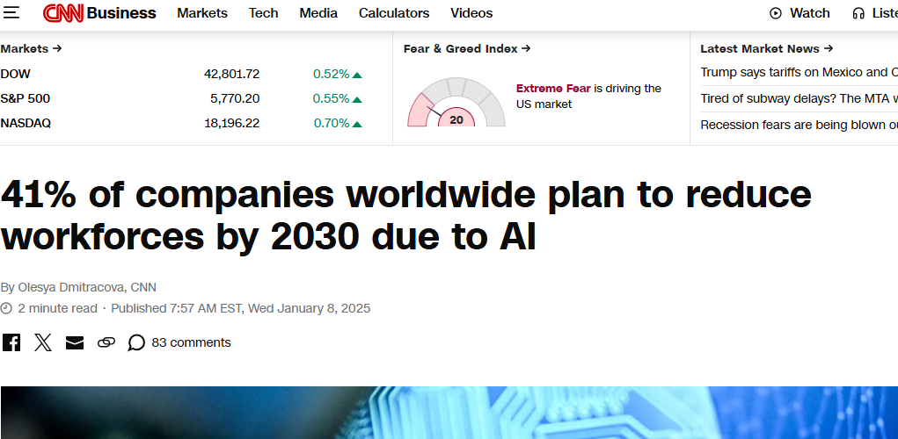
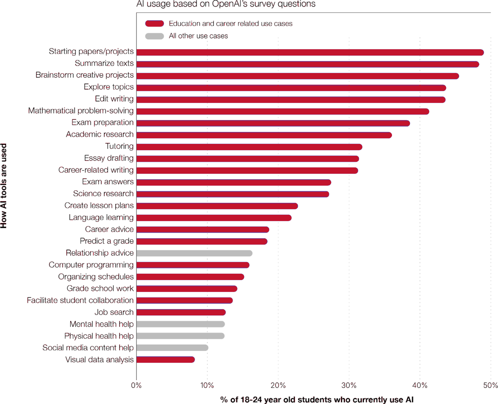
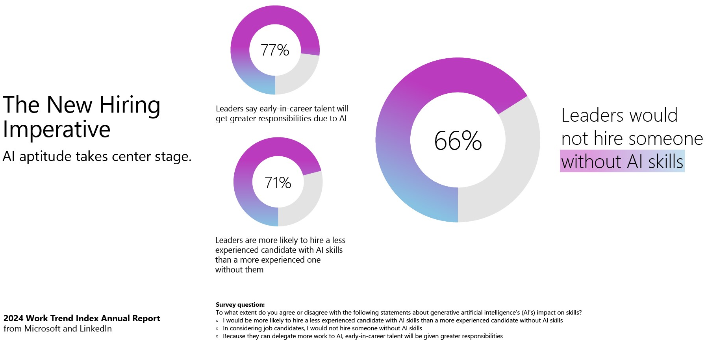
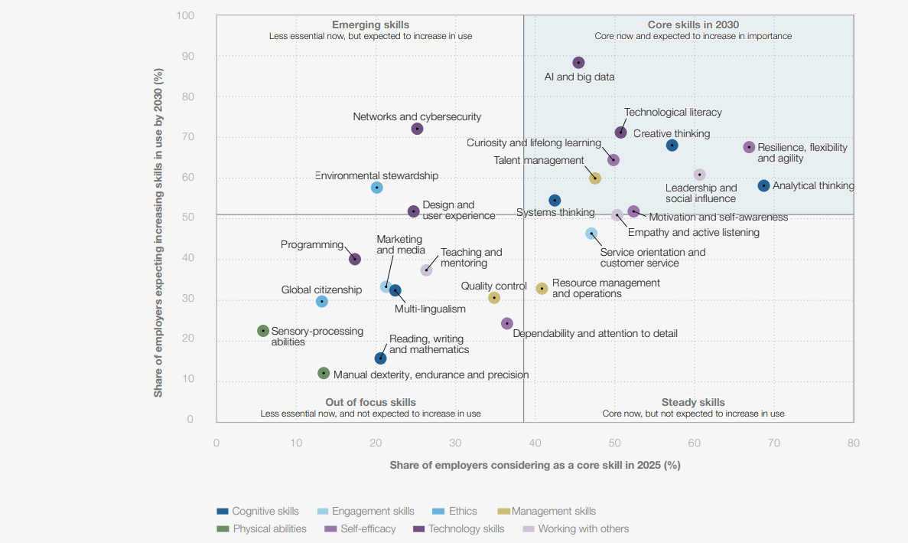
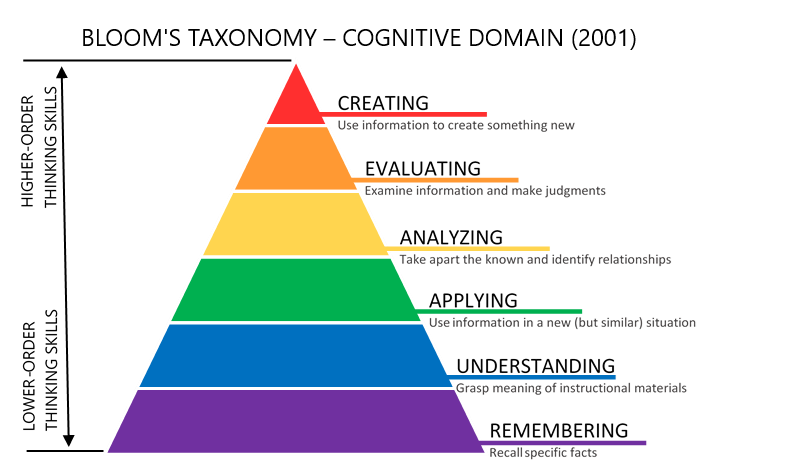
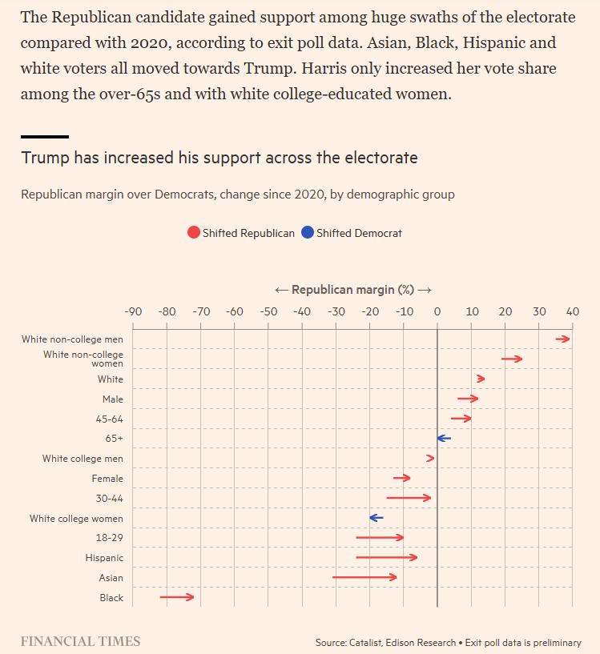
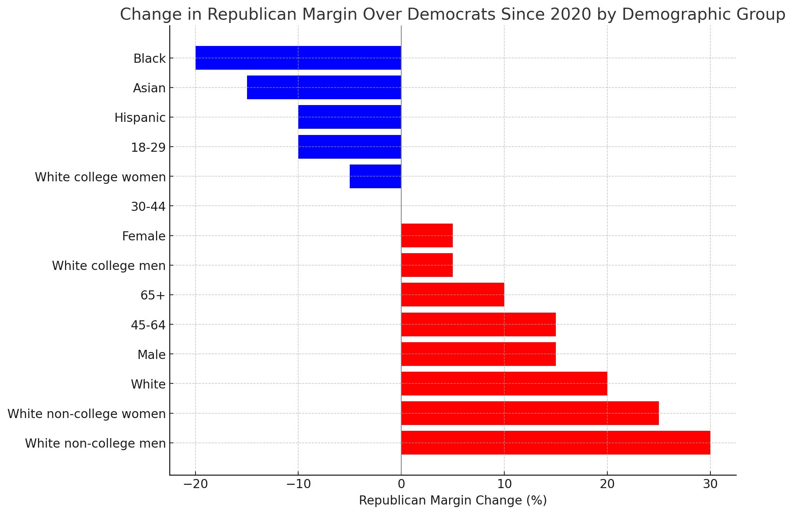
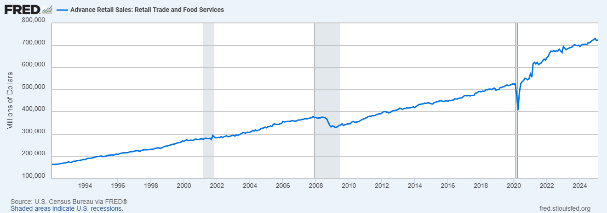
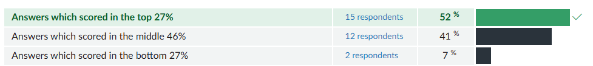

```{r setup, include=FALSE}
knitr::opts_chunk$set(cache = FALSE,
                      echo = FALSE,
                      warning = FALSE,
                      message = FALSE,
                      progress = FALSE, 
                      verbose = FALSE,
                      dev = 'png',
                      fig.height = 3,
                      dpi = 300,
                      fig.align = 'center')

options(htmltools.dir.version = FALSE)


miamired = '#C3142D'

if(require(pacman)==FALSE) install.packages("pacman")
if(require(devtools)==FALSE) install.packages("devtools")
if(require(countdown)==FALSE) devtools::install_github("gadenbuie/countdown")
if(require(xaringanExtra)==FALSE) devtools::install_github("gadenbuie/xaringanExtra")
if(require(emo)==FALSE) devtools::install_github("hadley/emo")
if(require(icons)==FALSE) devtools::install_github("mitchelloharawild/icons")

pacman::p_load(tidyverse, magrittr, lubridate, janitor, # data analysis pkgs
               DataExplorer, scales, plotly, calendR, pdftools, # plots
               tmap, sf, urbnmapr, tigris, # maps
               bibliometrix, # for bibliometric analysis of my papers
               gifski, av, gganimate, ggtext, glue, extrafont, # for animations
               emojifont, emo, RefManageR, xaringanExtra, countdown) # for
```

```{r xaringan-themer, include=FALSE, warning=FALSE}
if(require(xaringanthemer) == FALSE) install.packages("xaringanthemer")
library(xaringanthemer)

style_mono_accent(base_color = "#84d6d3",
                  base_font_size = "20px")

xaringanExtra::use_extra_styles(
  hover_code_line = TRUE,         
  mute_unhighlighted_code = TRUE  
)

xaringanExtra::use_xaringan_extra(c("tile_view", "animate_css", "tachyons", "panelset", "share_again", "search", "fit_screen", "editable", "clipboard"))

```


## What our Students and their Families See in the Media

```{r cnn, echo=FALSE, out.width='92%', fig.align='center', fig.alt="41% of companies worldwide plan to reduce workforces by 2030 due to AI"}

```

.footnote[
<html>
<hr>
</html>

**Article Source:** Dmitracova, O. (2025, January 8). **41% of companies worldwide plan to reduce workforces by 2030 due to AI**. CNN Business. <https://www.cnn.com/2025/01/08/business/ai-job-losses-by-2030-intl/index.html>
]


---

## The Fear of Technological Unemployment is Not New

> "The **fear** has even been expressed by some that **technological change** would in the **near future not only cause increasing unemployment**, but that **eventually it would eliminate all but a few jobs**, with the major portion of what we now call **work being performed automatically** ..." 
>
> .font70[National Commission on Technology, Automation and Economic Progress (1966). Technology and the American Economy. Volume 1. February 1966. Report to the President and Members of Congress [(p.xii)](https://files.eric.ed.gov/fulltext/ED023803.pdf)].


???
We have the honor to present the report of the National Commission on Technology, Automation, and Economic Progress. This Commission was established by Public Law 88-444, which was approved by Congress on August 5, 1964, and signed by the President on August 19, 1964.

The Commission was appointed by the President in December 1964, and the
appointments were approved by the Senate on January 27, 1965. 


---

## Historical Predictions of Technlogical Change

> .black[.bold[Technological change]] on the other hand, has been a .black[.bold[major factor]] in the **displacement and temporary unemployment of particular workers**. Thus technological change (along with other forms of economic change) is an important determinant of the **precise places, industries, and people affected by unemployment**. 
>
> .font70[National Commission on Technology, Automation and Economic Progress (1966). Technology and the American Economy. Volume 1. February 1966. Report to the President and Members of Congress [(p.9)](https://files.eric.ed.gov/fulltext/ED023803.pdf)].

<br>

> The .black[.bold[basic fact]] is that **technology eliminates jobs, not work**.  
>
> .font70[National Commission on Technology, Automation and Economic Progress (1966). Technology and the American Economy. Volume 1. February 1966. Report to the President and Members of Congress [(p.9)](https://files.eric.ed.gov/fulltext/ED023803.pdf)].


---

## Historical Predictions of Technlogical Change: Accurate

```{r manfacturing_and_unrate, echo = FALSE, results='hide', fig.height=4.25, fig.width=8.4}
manf_and_unrate = 
  tidyquant::tq_get("UNRATE", get = "economic.data", from = "1960-01-01") |>
  dplyr::filter(date >= "1960-01-01") |>
  dplyr::mutate(date = as.Date(date)) |>
  dplyr::rename(unrate = price) |>
  dplyr::left_join(
    tidyquant::tq_get("MANEMP", get = "economic.data", from = "1960-01-01") , 
    by = c("date" = "date")
    ) |>
  dplyr::mutate(manfemp = price) |>
  dplyr::select(date, unrate, manfemp) |>
  dplyr::mutate(manfemp = manfemp / 1000) |> 
  tidyr::pivot_longer(
    cols = c(unrate, manfemp),
    names_to = "series",
    values_to = "value"
  ) |> 
  dplyr::mutate(
    series = dplyr::case_when(
      series == "unrate" ~ "Unemployment Rate (%)",
      series == "manfemp" ~ "Manuf. Employment (M)"
    )
  )


max_dates <- manf_and_unrate |> 
  dplyr::group_by(series) |> 
  dplyr::filter(value == max(value)) |> 
  dplyr::select(series, date, value) |> 
  dplyr::distinct()


# Highlight values on the plot on Feb 1966
feb_1966_annotations <- manf_and_unrate |>
  dplyr::filter(date == as.Date("1966-02-01"))

# Highlight values on the plot on Feb 2025
feb_2025_annotations <- manf_and_unrate |>
  dplyr::filter(date == as.Date("2025-02-01"))
  
# Create a paneled plot
manf_and_unrate |>
  ggplot2::ggplot(ggplot2::aes(x = date, y = value)) +
  ggplot2::geom_line(linewidth = 1) +
  
  # Feb 1966 Annotations
  ggplot2::facet_wrap(~ series, scales = "free", ncol = 1, strip.position = "left") +
  ggplot2::geom_point(data = feb_1966_annotations, ggplot2::aes(x = date, y = value), size = 2, color = "darkgray") +
  ggplot2::geom_segment(
    data = feb_1966_annotations, 
    ggplot2::aes(x = date, xend = date, y = value + 2, yend = value),
    arrow = ggplot2::arrow(length = ggplot2::unit(0.2, "cm")), color = "darkgray"
  ) +
  ggplot2::geom_text(
    data = feb_1966_annotations, 
    ggplot2::aes(x = date, y = value + 2.5, label = paste0("Feb 1966: ", round(value, 2))), 
    size = 2.25, color = "darkgray", fontface = "bold"
  ) +
  
  # Feb 2025 Annotations
  ggplot2::geom_point(data = feb_2025_annotations, ggplot2::aes(x = date, y = value), size = 2, color = "#C3142D") +
  ggplot2::geom_segment(
    data = feb_2025_annotations, 
    ggplot2::aes(x = date, xend = date, y = value + 2, yend = value),
    arrow = ggplot2::arrow(length = ggplot2::unit(0.2, "cm")), color = "#C3142D"
  ) +
  ggplot2::geom_text(
    data = feb_2025_annotations, 
    ggplot2::aes(x = date, y = value + 2.5, label = paste0("Feb 2025: ", round(value, 2))), 
    size = 2.25, color = "#C3142D", fontface = "bold"
  ) +
  ggplot2::scale_x_date(date_labels = "%Y", date_breaks = "5 years") +
  ggplot2::labs(
    title = "U.S. Manufacturing Employment and Overall Unemployment Rate (1960-2025)",
    x = "Year",
    y = "",
    caption = '**Data Source:** FRED | **Created by:** Fadel M. Megahed' 
  ) +
  
  # Add vertical lines for max values
  ggplot2::geom_vline(xintercept = as.Date("1998-06-01"), linetype = "dashed", color = "darkgray") +
  ggplot2::geom_text(data = max_dates, ggplot2::aes(value-1), x = as.Date("1998-06-30") + 30, label = "Digital Economy", color = "darkgray", size = 3, hjust = 0, fontface= "bold") +
  ggplot2::theme_bw() +
  ggplot2::theme(
    plot.title = ggplot2::element_text(hjust = 0.5, size = 14, face = "bold"),
    legend.position='none',
    panel.grid.major = ggplot2::element_blank(),
    panel.grid.minor = ggplot2::element_blank(),
    strip.background = ggplot2::element_rect(fill ="#C3142D"),
    strip.text = ggplot2::element_text(color = "white", size = 8, face = "bold"),
    panel.spacing = ggplot2::unit(1, "lines"),
    # bold x-ticks, yticks and the axis labels
    axis.text = ggplot2::element_text(face = "bold", color = "black"),
    axis.title = ggplot2::element_text(face = "bold", color = "black"),
    plot.caption = ggtext::element_markdown(size = 8, color = "black")
  )

```


---

## Generative AI Usage in Higher Education Today

.left-column[

.content-box-gray[

.center[

**95%**  
.font70[say the .black[.bold[teaching models]] at their schools will be affected significantly or to some degree]

___

**95%**  
.font70[say .black[.bold[academic integrity]] will be impacted by the spread of GenAI tools]   

___

**92%**   
.font70[think GenAI tools will lead to .black[.bold[overreliance]] by students on the tools]  

___

**81%**   
.font70[think GenAI will have an impact on .black[.bold[digital divides]]]


]
]
]

.right-column[
```{r gen_ai_challenges, echo = FALSE, results='hide', fig.height=2.5, fig.width=6.9}

# Extracted data for institutions with more than 10,000 students
df <- data.frame(
  Category = c(
    "Preparing students for the future",
    "Preparing faculty for effective teaching and mentoring of students",
    "Helping non-faculty staff using GenAI tools to perform their work"
  ),
  Percentage = c(51, 53, 58)
)

# Function to wrap text if the category name exceeds 45 characters
df$Category <- sapply(df$Category, function(x) {
  if (nchar(x) > 35) {
    return(stringr::str_wrap(x, width = 35))
  } else {
    return(x)
  }
})

# Create the bar chart
ggplot2::ggplot(df, ggplot2::aes(x = Percentage, y = Category)) +
  ggplot2::geom_bar(stat = "identity", fill = "#C3142D") +
  
  # Annotations inside the bars in white
  ggplot2::geom_text(
    ggplot2::aes(label = paste0(Percentage, "%")), 
    color = "white", fontface = "bold", size = 4, hjust = 1.2
  ) +
  
  # Set x-axis limits to 0-100
  ggplot2::scale_x_continuous(limits = c(0, 100)) +
  
  # Labels and title
  ggplot2::labs(
    title = "Universities Unprepared for GenAI Challenges",
    subtitle = '% of the 88 universities (>10,000 students) whose leaders say their <br>schools are **not very or not at all prepared** to use GenAI effectively for <br> ... ',
    x = "Percentage (%)",
    y = "",
    caption = "**Data Source:** Survey by the American Association of Colleges and Universities (AAC&U) and Elon University, Nov. 4-Dec. 7, 2024. <br> **Created by:** Fadel M. Megahed."
  ) +
  
  # Theme styling as requested
  ggplot2::theme_bw() +
  ggplot2::theme(
    plot.title = ggplot2::element_text(hjust = 0.5, size = 14, face = "bold"),
    legend.position = 'none',
    panel.grid.major = ggplot2::element_blank(),
    panel.grid.minor = ggplot2::element_blank(),
    axis.text = ggplot2::element_text(face = "bold", color = "black"),
    axis.title = ggplot2::element_text(face = "bold", color = "black"),
    plot.caption = ggtext::element_markdown(size = 8, color = "black"),
    plot.subtitle = ggtext::element_markdown(size = 10, color = "black"),
    plot.margin = ggplot2::margin(2, 2, 2, 2)
  )

```

<br>

.font80[
.center[
Across all surveyed universities, **only 2% (7/337 universities) of leaders** think that a .black[.bold[clear majority of their faculty are well prepared to use GenAI in teaching]].
]
]


]

.footnote[
<html>
<hr>
</html>

**Data Source:** Survey by the American Association of Colleges and Universities (AAC&U) and Elon University, Nov. 4-Dec. 7, 2024. See [Watson and Rainie
(2025)](https://dgmg81phhvh63.cloudfront.net/content/user-photos/AACU_AI_Report_2025.pdf) to access the survey report. <br> The text data captures the responses of the 337 *university presidents, chancellors, provosts, rectors, academic affairs vice presidents, and academic deans*, who responded to GenAI tool questions. The chart data is based on the 88 *universities with more than 10,000 students* .

]


---

## Challenges to GenAI Adoption in Higher Education

```{r challenges, echo = FALSE, results='hide', fig.height=4.05, fig.width=8.4}
# Modify the subtitle to include color-coded text instead of a legend
subtitle_text <- "<p><strong>To what extent do you think the following are challenges to adopting Generative AI <br> tools at your institution?  
<span style='color:#C3142D; font-weight:bold;'>A Lot</span> vs.  
<span style='color:darkgray; font-weight:bold;'>Some</span></strong></p>"

# Extracted data
df <- data.frame(
  Challenge = c(
    "Faculty unfamiliarity with Generative AI tools",
    "Concerns regarding diminished student learning outcomes",
    "Lack of training and support infrastructure",
    "Lack of trust in the safety and security of the Generative AI tools",
    "Faculty resistance to using Generative AI tools",
    "Poor quality of Generative AI tools' output, including false, misleading or biased information",
    "Student unfamiliarity with Generative AI tools"
  ),
  A_lot = c(53, 44, 36, 34, 34, 22, 11),
  Some = c(40, 46, 48, 55, 54, 51, 46)
)

# Compute total impact for sorting
df <- df |>
  dplyr::mutate(Total = A_lot + Some) |>
  dplyr::arrange(dplyr::desc(Total))  # Sort by Total impact descending

# Reshape data to long format for ggplot2
df_long <- df |>
  dplyr::select(-Total) |>
  tidyr::pivot_longer(cols = c(A_lot, Some), names_to = "Impact", values_to = "Percentage") |> 
  dplyr::mutate(Impact = forcats::fct_reorder(Impact, Percentage, .desc = TRUE))

# Function to wrap long text labels
df_long$Challenge <- stringr::str_wrap(df_long$Challenge, width = 45)

# Define colors
impact_colors <- c(A_lot = "#C3142D", Some = "darkgray") # #E4A4A4

# Create the sorted bar plot
ggplot2::ggplot(
  df_long, 
  ggplot2::aes(
    x = Percentage, 
    y = reorder(Challenge, -Percentage, sum, decreasing = T), fill = Impact)) +
  ggplot2::geom_bar(stat = "identity", position = "stack") +
  
  # Annotations inside the bars
  ggplot2::geom_text(ggplot2::aes(label = paste0(Percentage, "%")),
            position = ggplot2::position_stack(vjust = 0.5),
            color = "white", fontface = "bold", size = 4) +
  
  # Custom fill colors
  ggplot2::scale_fill_manual(
    values = impact_colors, labels = c("Some", "A Lot")
    ) +
  
  # X-axis from 0 to 100
  ggplot2::scale_x_continuous(
    limits = c(0, 100), breaks = seq(0, 100, 20)
    ) +
  
  # Labels
  ggplot2::labs(
    title = "Challenges to Adopting Generative AI Tools in Courses",
    subtitle = subtitle_text, 
    x = "Percentage (%)",
    y = "",
    fill = "Extent of Challenge",
    caption = "**Data Source:** Survey by the The American Association of Colleges and Universities (AAC&U) and Elon University, Nov. 4-Dec. 7, 2024."
  ) +
  
  # Theme settings
  ggplot2::theme_bw() +
  ggplot2::theme(
    plot.title = ggplot2::element_text(hjust = 0.5, size = 14, face = "bold"),
    plot.subtitle = ggtext::element_markdown(hjust = 0.5, size = 10),
    legend.position = "none",
    panel.grid.major = ggplot2::element_blank(),
    panel.grid.minor = ggplot2::element_blank(),
    axis.text = ggplot2::element_text(face = "bold", color = "black"),
    axis.title = ggplot2::element_text(face = "bold", color = "black"),
    plot.caption = ggtext::element_markdown(size = 8, color = "black")
  )

```

.footnote[
<html>
<hr>
</html>

**Image Adapted** from [Watson and Rainie
(2025)](https://dgmg81phhvh63.cloudfront.net/content/user-photos/AACU_AI_Report_2025.pdf) Survey. The The American Association of Colleges and Universities (AAC&U) and Elon University, Nov. 4-Dec. 7, 2024.

]


---

## But, Students are Using GenAI Tools: OpenAI's View

```{r gen_ai_usage, echo = FALSE, out.width='60%', fig.align='center'}


```

.footnote[
<html>
<hr>
</html>

**Image Adapted** from OpenAI (2025). [Building an AI-Ready Workforce: A Look at College Student ChatGPT Adoption in the US](https://cdn.openai.com/global-affairs/openai-edu-ai-ready-workforce.pdf), P.5.
]

---

## But, Students are Using GenAI Tools: Anthropic's View (1)

```{r gen_ai_usage2, echo = FALSE, out.width='76%', fig.align='center'}
knitr::include_graphics("https://www.anthropic.com/_next/image?url=https%3A%2F%2Fwww-cdn.anthropic.com%2Fimages%2F4zrzovbb%2Fwebsite%2F7d9704a6edee6bb96a7f767621d83beadc039a0c-2400x1586.png&w=3840&q=75")

```

.footnote[
<html>
<hr>
</html>

**Image Source:** Anthropic (2025). [Anthropic Education Report: How University Students Use Claude](https://www.anthropic.com/news/anthropic-education-report-how-university-students-use-claude).
]


---

## But, Students are Using GenAI Tools: Anthropic's View (2)

```{r gen_ai_usage3, echo = FALSE, out.width='71%', fig.align='center'}
knitr::include_graphics("https://www.anthropic.com/_next/image?url=https%3A%2F%2Fwww-cdn.anthropic.com%2Fimages%2F4zrzovbb%2Fwebsite%2Fd22ea4cc33c603b51435e334c4311ffc5b1d7f5a-2400x1818.png&w=3840&q=75")

```

.footnote[
<html>
<hr>
</html>

**Image Source:** Anthropic (2025). [Anthropic Education Report: How University Students Use Claude](https://www.anthropic.com/news/anthropic-education-report-how-university-students-use-claude).
]


---

## And, Employers are Embracing GenAI

```{r gen_ai_employers, echo = FALSE, out.width='100%', fig.align='center'}


```

.footnote[
<html>
<hr>
</html>

**Image Source:** 2024 Work Trend Index Annual Report from Microsoft and LinkedIn (2024). [AI at Work is Here. Now Comes the Hard Part](https://www.microsoft.com/en-us/worklab/s/43878f19ef5e48d9bc2c21de5476ea2d/). Published on May 8, 2024.
]


---

## And, Employers are Projecting Skill Transitions 2025-30

```{r skill_transitions, echo = FALSE, out.width='80%', fig.align='center'}

```

.footnote[
<html>
<hr>
</html>

**Source:** World Economic Forum (2025). [The Future of Jobs Report 2025](https://reports.weforum.org/docs/WEF_Future_of_Jobs_Report_2025.pdf), P. 41. The Future of Jobs Report 2025 brings together the perspective of over 1,000 leading global
employers, representing more than 14 million workers across 22 industry clusters and
55 economies from around the world.

]


---

## My Opinion on the Integration of GenAI in Courses


.font70[
There is no singular recipe for integrating GenAI in courses. The integration of GenAI in courses should be based on the **course objectives**, **learning outcomes**, and **assessment methods**. 

I believe that the **integration of GenAI in courses** can be simplified into dimensions: **(a) Learning Activities** and **(b) Assessment Activities**, with AI being .black[.bold[prohibited]] or .black[.bold[controlled/integrated/encouraged]] within each dimension.  

]

.font70[

  |   | **AI Not Permitted**  | **AI Permitted (Controlled/Integrated)**  |
    |---|----------------------|--------------------------------------------|
    | **Learning Activities**   | **Prohibited in Learning** <br><br>**Rationale:** <br>• Fosters independent learning <br>• Allow for broader discussion on: <br> - *AI Ethics*, and <br> - *Environmental stewardship* <br><br>**Examples:** <br>• No AI for drafting <br>• No AI for brainstorming or feedback | **Integrated in Learning** <br><br>**Rationale:** <br>• Advances *technological literacy*, <br>• Stimulates *creative thinking*, <br>• Stimulates *analytical thinking*, and <br>• Supports *lifelong learning* <br><br>**Examples:** <br>• AI-assisted brainstorming and drafting <br>• Personalized feedback via AI tools |
    | **Assessment Activities** |  | **Integrated in Learning and Assessment** <br><br>**Rationale:** <br>• Supports coherent skill development when AI is integrated in learning  <br><br>**Examples:** <br>• AI-assisted assessments/exams with clear guidelines |

]


---

## The Cost-Benefit Analysis of AI in Learning

.font70[

|   | **Benefits of AI in Learning** | **Risks of AI in Learning** |
|---|-------------------------------|-----------------------------|
| **Summary** | AI offers enhanced productivity, synthesis, and alignment with modern workplace tools. | AI introduces potential for misinformation and diminished learner autonomy. |
| **Key Points** | • Can replace traditional search tasks <br>• Synthesizes and summarizes content <br>• Generates creative outputs quickly <br>• Becoming a core workplace skill | • Prone to hallucinations (false but confident answers) <br>• May erode student agency and critical thinking <br>• Encourages over-reliance on automation <br>• Quality depends heavily on prompting and oversight |
| **Tension** | Encourages innovation and tech literacy | Raises ethical, epistemic, and educational concerns |

]


### 🎯 My Goal in This Talk

To share how I attempt to **walk this tight line:** recognizing that while AI can genuinely support learning and creativity, it must be used **critically and intentionally** to avoid undermining deeper educational values.

???

This framing sets the tone: you're not here to argue for or against AI outright — you're here to show your nuanced, practical approach as an educator working in real classrooms with real constraints.

---
class: center, middle, inverse

# Conquering the Digital Divide with ChatISA

<br>

.pull-left-2[<br>Megahed, F. M., Chen, Y. J., Ferris, J.A., Resatar, C., Ross, K., Lee, Y., & Jones-Farmer, L. A. (2025). ChatISA: A Prompt-Engineered Chatbot for Coding, Project Management, Interview and Exam Preparation Activities. Under review.

[Freely available @ [arXiv](https://arxiv.org/abs/2407.15010)].]

.pull-right-2[<div></div>]

---

## A Live Demo of ChatISA

<center>
    <a href="https://chatisa.fsb.miamioh.edu/">
        
    </a>
</center>


.footnote[
<html>
<hr>
</html>

**Note:** I encourage the audience to experiment with **ChatISA** at <https://chatisa.fsb.miamioh.edu/>. For demos, please see our [Exam Ally module demo](https://www.loom.com/share/239950fad0e24ef1875e8d5fb35cbe60), and our [Interview Prep module demo](https://www.loom.com/share/896d4ab0e18747f0bca8dba5fff9cc36?sid=3ea3eaa3-c88b-4d60-b150-b6e14a443575) as examples.
]  

---
class: center, middle, inverse

# Re-imagining Assessments with AI-Evaluation Questions


---

## Evaluating AI-Generated Responses in ISA 401

.pull-left[
- **Premise**  
  + Students will have to work with AI-generated responses in their future careers.  
  + It is important to evaluate the quality of AI-generated responses.  
  + We can move from traditional **application** and **analysis** to **(deeper) evaluation** type assessments.
]

.pull-right[

<br>

```{r blooms, echo=FALSE, out.width='100%', fig.align='center'}

```
]

.footnote[
<html>
<hr>
</html>

**Image Source:** Center for Instructional Technology and Training. University of Florida. [Bloom's Taxonomy Graphic Description](https://citl.ufl.edu/teaching-resources/teaching-strategies/blooms-taxonomy/).
]


---

## Evaluating AI-Generated Responses in ISA 401 (Q6F24)

.font80[
I have asked ChatGPT to critique the .black[.bold[third chart]] in [this Financial Times article](https://www.ft.com/content/392e1e79-a8c1-4473-ab51-3267c415b078) (a static image of is presented below).
]

```{r q6f24ex1, echo=FALSE, out.width='43%', fig.align='center'}

```


---

## Evaluating AI-Generated Responses in ISA 401 (Q6F24)

.font70[
.black[.bold[ChatGPT presented a lot of "potential" issues with the chart. It was a ton to put on an exam question, so I followed up with, "Forget about that; how do I ask relevant data visualization questions to data visualization business students based on this chart?"]]  It mentioned several things including:

> Here are some data visualization questions that could help business students critically analyze and interpret this chart:  
>
> **1. Interpretation and Context:**  
> - What additional context or baseline data would help make the shifts in support more meaningful for viewers?  
> - How would you ensure the chart communicates both the change in support and the initial levels of support in 2020?  
>
> **2. Design Choices:**  
> - Why might the designer have chosen arrows to represent shifts? Are arrows the most effective way to communicate this information?
> - How could alternative chart types (like a .black[.bold[bar chart]] or slope chart) change the audience’s interpretation of these shifts?
 

So I naturally asked the following question based on the underlined content from ChatGPT answer above, "Can you make a bar chart with this data to allow students to compare?" **It made the chart in the next slide (assume that the values in it are correct since ChatGPT likely eye-balled the values from the Financial Times Chart).** 
]  

---

## Evaluating AI-Generated Responses in ISA 401 (Q6F24)


```{r q6f24ex1_chart, echo=FALSE, out.width='60%', fig.align='center'}


```

**Explain which of the two charts provides a more complete story of the elections**. Please limit your answer to 15-20 words.


---

## Evaluating AI-Generated Responses in ISA 444 (Q1S25)

.font90[I provided ChatGPT (GPT-4o on April 02, 2025) with the following chart and asked it to answer this multiple-choice question with justification.]

```{r q6s25ex1, echo=FALSE, out.width='60%', fig.align='center'}

```

.font90[
RSAFS is a seasonally adjusted monthly time series that exhibits a clear upward trend over time. Based on the chart provided, which of the following **baseline forecasting methods is expected to have the worst performance in terms of Mean Absolute Error (MAE)**?

A. Historical Average 
B. 12-Month Window Average 
C. Naive 
D. Seasonal Naive 
E. Holt’s Method 

Please **identify the worst method and provide a short justification** for your choice.
]


---

## Evaluating AI-Generated Responses in ISA 444 (Q1S25)

.font80[
<html>
<p class="" data-start="0" data-end="129">The baseline forecasting method expected to perform <strong data-start="52" data-end="99">worst in terms of Mean Absolute Error (MAE)</strong> for the RSAFS time series is:&nbsp; <strong data-start="135" data-end="160">A. Historical Average</strong></p>
<h3 class="" data-start="167" data-end="189"><strong data-start="171" data-end="189">Justification:</strong></h3>
<p class="" data-start="191" data-end="269">The chart of the <strong data-start="208" data-end="250">Retail and Food Services Sales (RSAFS)</strong> time series shows:</p>
<ul data-start="271" data-end="339">
    <li class="" data-start="271" data-end="297">
        <p class="" data-start="273" data-end="297"><strong data-start="273" data-end="297">A clear upward trend</strong></p>
    </li>
    <li class="" data-start="298" data-end="315">
        <p class="" data-start="300" data-end="315"><strong data-start="300" data-end="315">Seasonality</strong></p>
    </li>
    <li class="" data-start="316" data-end="339">
        <p class="" data-start="318" data-end="339"><strong data-start="318" data-end="339">Monthly frequency</strong></p>
    </li>
</ul>
</html>
]


---

## Evaluating AI-Generated Responses in ISA 444 (Q1S25)

.font70[
<html>
<p class="" data-start="341" data-end="414">Given these characteristics, here's how each method would likely perform:</p>
<div class="overflow-x-auto contain-inline-size">
    <table style="border-collapse: collapse; width: 61.0979%; height: 172.674px;" border="1" data-start="416" data-end="1076">
        <thead data-start="416" data-end="498">
            <tr style="height: 27.1007px;" data-start="416" data-end="498">
                <th style="width: 17.5249%; height: 27.1007px;" data-start="416" data-end="439">Method</th>
                <th style="width: 11.4993%; height: 27.1007px;" data-start="439" data-end="456">Handles Trend?</th>
                <th style="width: 39.651%; height: 27.1007px;" data-start="456" data-end="479">Handles Seasonality?</th>
                <th style="width: 31.1645%; height: 27.1007px;" data-start="479" data-end="498">MAE Performance</th>
            </tr>
        </thead>
        <tbody data-start="584" data-end="1076">
            <tr style="height: 29.1146px;" data-start="584" data-end="673">
                <td style="width: 17.5249%; height: 29.1146px;"><strong data-start="586" data-end="608">Historical Average</strong></td>
                <td style="width: 11.4993%; height: 29.1146px;">❌ No</td>
                <td style="width: 39.651%; height: 29.1146px;">❌ No</td>
                <td style="width: 31.1645%; height: 29.1146px;"><strong data-start="656" data-end="665">Worst</strong></td>
            </tr>
            <tr style="height: 29.1146px;" data-start="674" data-end="756">
                <td style="width: 17.5249%; height: 29.1146px;">12-Month Window Avg</td>
                <td style="width: 11.4993%; height: 29.1146px;">✅ (partially)</td>
                <td style="width: 39.651%; height: 29.1146px;">✅ Yes</td>
                <td style="width: 31.1645%; height: 29.1146px;">Better</td>
            </tr>
            <tr style="height: 29.1146px;" data-start="757" data-end="871">
                <td style="width: 17.5249%; height: 29.1146px;">Naive</td>
                <td style="width: 11.4993%; height: 29.1146px;">✅ Yes</td>
                <td style="width: 39.651%; height: 29.1146px;">❌ No</td>
                <td style="width: 31.1645%; height: 29.1146px;">Worse than seasonal, better than historical</td>
            </tr>
            <tr style="height: 29.1146px;" data-start="872" data-end="957">
                <td style="width: 17.5249%; height: 29.1146px;">Seasonal Naive</td>
                <td style="width: 11.4993%; height: 29.1146px;">✅ Yes</td>
                <td style="width: 39.651%; height: 29.1146px;">✅ Yes</td>
                <td style="width: 31.1645%; height: 29.1146px;">Better</td>
            </tr>
            <tr style="height: 29.1146px;" data-start="958" data-end="1076">
                <td style="width: 17.5249%; height: 29.1146px;">Holt&rsquo;s Method</td>
                <td style="width: 11.4993%; height: 29.1146px;">✅ Yes</td>
                <td style="width: 39.651%; height: 29.1146px;">❌ (but can be extended to Holt-Winters for seasonal)</td>
                <td style="width: 31.1645%; height: 29.1146px;">Better than naive</td>
            </tr>
        </tbody>
    </table>
</div>
<ul data-start="1078" data-end="1618">
    <li class="" data-start="1078" data-end="1253">
        <p class="" data-start="1080" data-end="1253"><strong data-start="1080" data-end="1102">Historical Average</strong> uses the same average value for all future forecasts, ignoring both trend and seasonality, making it highly inaccurate for a trending seasonal series.</p>
    </li>
    <li class="" data-start="1254" data-end="1414">
        <p class="" data-start="1256" data-end="1414"><strong data-start="1256" data-end="1273">Holt&rsquo;s Method</strong> accounts for trend, so even though it doesn&rsquo;t directly model seasonality, it's still far superior to methods that ignore the trend entirely.</p>
    </li>
    <li class="" data-start="1415" data-end="1484">
        <p class="" data-start="1417" data-end="1484"><strong data-start="1417" data-end="1435">Seasonal Naive</strong> works better when strong seasonality is present.</p>
    </li>
    <li class="" data-start="1485" data-end="1618">
        <p class="" data-start="1487" data-end="1618"><strong data-start="1487" data-end="1514">12-Month Window Average</strong> adapts slightly better than a global historical average by capturing local trend and seasonal behavior.</p>
    </li>
</ul>
<p>&nbsp;</p>
<html>
]


---

## Evaluating AI-Generated Responses in ISA 444 (Q1S25)
.font70[
<html>
<h3><strong data-start="1625" data-end="1640">Conclusion:</strong></h3>
<p><strong data-start="1643" data-end="1675">Option A. Historical Average</strong> will have the <strong data-start="1690" data-end="1703">worst MAE</strong> because it fails to account for both the <strong data-start="1745" data-end="1761">upward trend</strong> and <strong data-start="1766" data-end="1787">seasonal patterns</strong> evident in the time series.</p>
<hr class="" data-start="162" data-end="165" />
<p><span style="text-decoration: underline; font-size: 18pt;"><strong>Proof of the ChatGPT interaction:</strong></span><span style="font-size: 12pt;"><strong> (You do not need to look at the recording; I am just providing you to emphasize that I did not try to trick ChatGPT in any of my exam questions)</strong></span></p>
<p>Here is <a class="inline_disabled" href="https://www.loom.com/share/19a10e510c3c4471b02a654230b2b6b0?sid=81642c49-6e9c-4bad-8ba6-6221f48cce50" target="_blank" rel="noopener">my video recording of the interaction</a>. Note that the ChatGPT project only contains the course notes for context and I did not provide it with any custom instructions besides what is in the prompt.</p>
<hr class="" data-start="162" data-end="165" />
<p><span style="text-decoration: underline; font-size: 18pt;"><strong>Exam Question:</strong></span></p>
<p><strong>Assess the <span style="text-decoration: underline;">correctness</span> of (a) <span style="text-decoration: underline;">ChatGPT's answer</span> and (b) <span style="text-decoration: underline;">its justification</span>. <span style="text-decoration: underline;">If there are error(s) in either the answer or justification, please present each error in its bullet point</span>.&nbsp;</strong></p>
<html>
]


---

## Evaluating AI-Generated Responses in ISA 444 (Q1S25)

In this question, ChatGPT was able to provide a **correct answer**, but it **did not provide a correct justification**. Additionally, some students struggle with these types of assessment questions. 

```{r q1_s25ex1_chatgpt, echo=FALSE, out.width='100%', fig.align='center'}

```


---
class: center, middle, inverse

# Concluding Remarks

---


## AI is Here to Stay, ...  

- But educators should have the **academic freedom** and **pedagogical autonomy** to decide how to use AI in their courses (from prohibiting it to encouraging its use).   

- I would be happy to share my experiences and insights on using AI in my courses, and learn from your experiences as well.  

- I am also happy to share our **ChatISA** app with you, and I encourage you to experiment with it.  


---

## Happy to Answer any Questions

<center>
<iframe width="728" height="410" src="https://www.youtube.com/embed/aQDEt-YhyVc" title="YouTube video player" frameborder="0" allow="accelerometer; autoplay; clipboard-write; encrypted-media; gyroscope; picture-in-picture; web-share" referrerpolicy="strict-origin-when-cross-origin" allowfullscreen></iframe>
</center>

.footnote[
<html>
<hr>
</html>

**Original Source:** Unknown, but this version is from [this YouTube Channel](https://youtube.com/shorts/aQDEt-YhyVc?si=cUxxee7Lf-kMAXV_). The original creator of this video is unknown. 

]


---
class: center, middle, inverse, title-slide

.title[
# <p>Beyond the Initial Shock: Leveraging AI to Enhance Student Learning</p>
]
.author[
### Fadel M. Megahed, Raymond E. Glos Professor   <a href="http://www.fsb.miamioh.edu/directory/megahefm"><svg viewBox="0 0 512 512" style="height:1em;position:relative;display:inline-block;top:.1em;fill:white;" xmlns="http://www.w3.org/2000/svg"> <path d="M326.612 185.391c59.747 59.809 58.927 155.698.36 214.59-.11.12-.24.25-.36.37l-67.2 67.2c-59.27 59.27-155.699 59.262-214.96 0-59.27-59.26-59.27-155.7 0-214.96l37.106-37.106c9.84-9.84 26.786-3.3 27.294 10.606.648 17.722 3.826 35.527 9.69 52.721 1.986 5.822.567 12.262-3.783 16.612l-13.087 13.087c-28.026 28.026-28.905 73.66-1.155 101.96 28.024 28.579 74.086 28.749 102.325.51l67.2-67.19c28.191-28.191 28.073-73.757 0-101.83-3.701-3.694-7.429-6.564-10.341-8.569a16.037 16.037 0 0 1-6.947-12.606c-.396-10.567 3.348-21.456 11.698-29.806l21.054-21.055c5.521-5.521 14.182-6.199 20.584-1.731a152.482 152.482 0 0 1 20.522 17.197zM467.547 44.449c-59.261-59.262-155.69-59.27-214.96 0l-67.2 67.2c-.12.12-.25.25-.36.37-58.566 58.892-59.387 154.781.36 214.59a152.454 152.454 0 0 0 20.521 17.196c6.402 4.468 15.064 3.789 20.584-1.731l21.054-21.055c8.35-8.35 12.094-19.239 11.698-29.806a16.037 16.037 0 0 0-6.947-12.606c-2.912-2.005-6.64-4.875-10.341-8.569-28.073-28.073-28.191-73.639 0-101.83l67.2-67.19c28.239-28.239 74.3-28.069 102.325.51 27.75 28.3 26.872 73.934-1.155 101.96l-13.087 13.087c-4.35 4.35-5.769 10.79-3.783 16.612 5.864 17.194 9.042 34.999 9.69 52.721.509 13.906 17.454 20.446 27.294 10.606l37.106-37.106c59.271-59.259 59.271-155.699.001-214.959z"></path></svg> MU Webpage</a><br><br/>
]
.date[
### July 02, 2025 | Federal University of Bahia | Miami University
]
