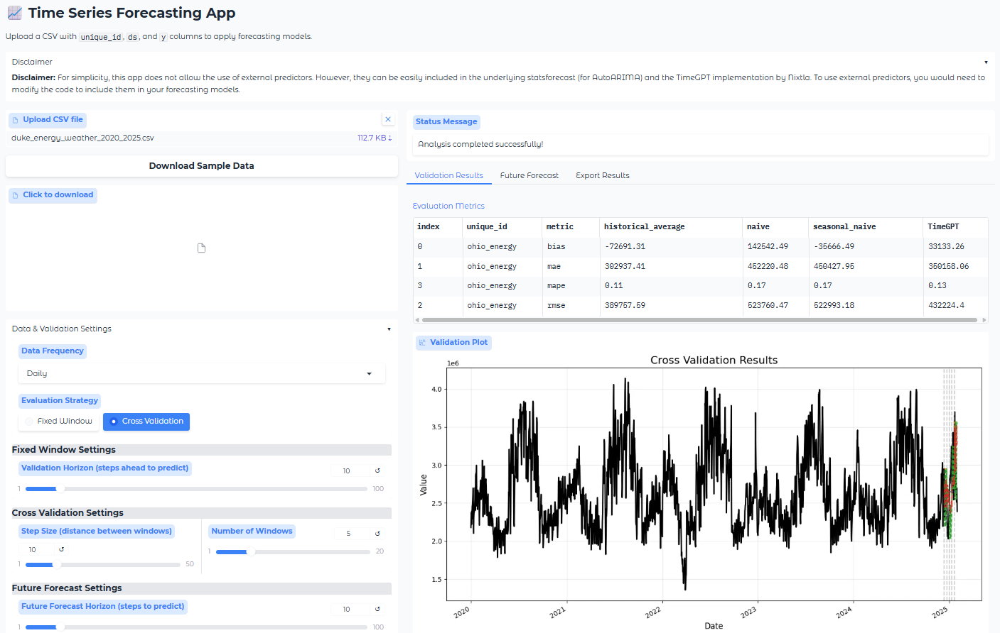
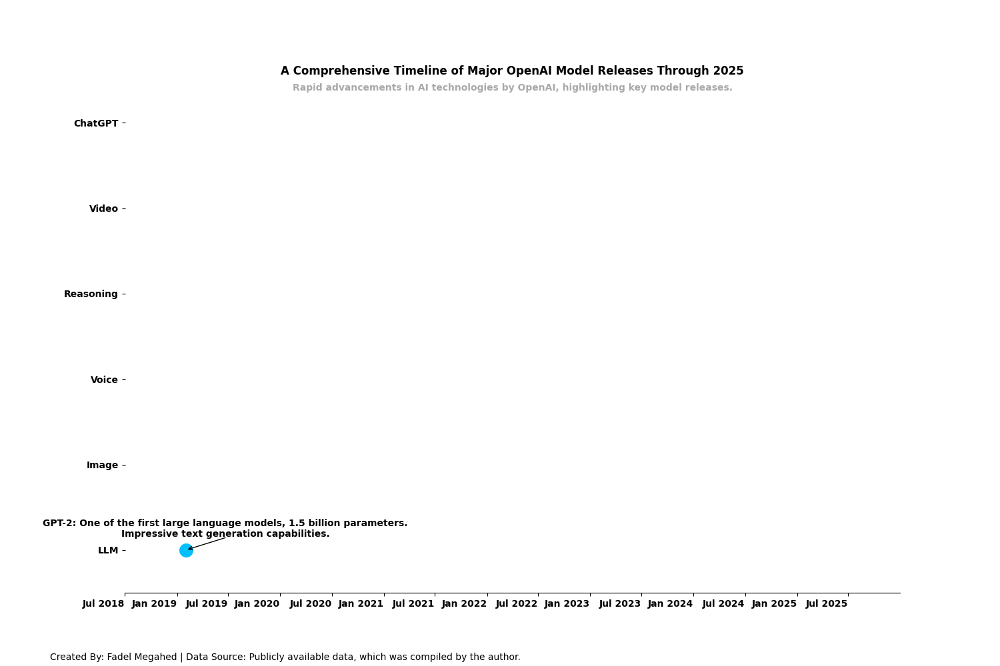
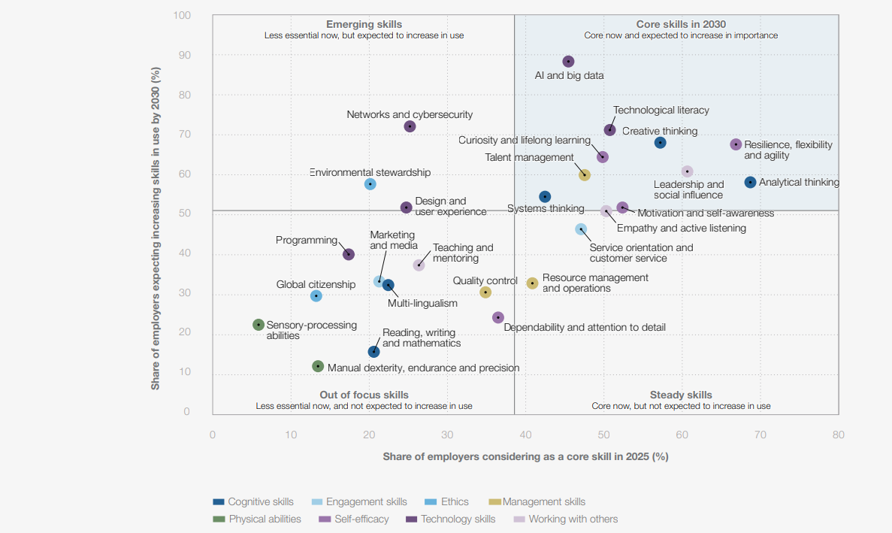
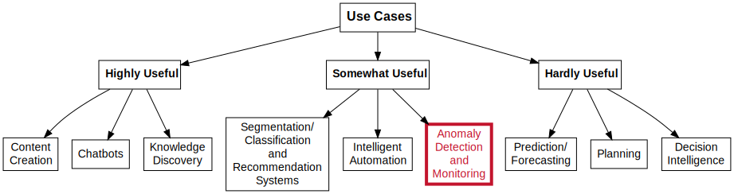

```{r setup, include=FALSE}
knitr::opts_chunk$set(cache = TRUE,
                      echo = FALSE,
                      warning = FALSE,
                      message = FALSE,
                      progress = FALSE, 
                      verbose = FALSE,
                      dev = 'png',
                      fig.height = 3,
                      dpi = 300,
                      fig.align = 'center')

options(htmltools.dir.version = FALSE)


miamired = '#C3142D'

if(require(pacman)==FALSE) install.packages("pacman")
if(require(devtools)==FALSE) install.packages("devtools")
if(require(countdown)==FALSE) devtools::install_github("gadenbuie/countdown")
if(require(xaringanExtra)==FALSE) devtools::install_github("gadenbuie/xaringanExtra")
if(require(emo)==FALSE) devtools::install_github("hadley/emo")
if(require(icons)==FALSE) devtools::install_github("mitchelloharawild/icons")

pacman::p_load(tidyverse, magrittr, lubridate, janitor, # data analysis pkgs
               DataExplorer, scales, plotly, calendR, pdftools, # plots
               tmap, sf, urbnmapr, tigris, # maps
               bibliometrix, # for bibliometric analysis of my papers
               gifski, av, gganimate, ggtext, glue, extrafont, # for animations
               emojifont, emo, RefManageR, xaringanExtra, countdown) # for
```

```{r xaringan-themer, include=FALSE, warning=FALSE}
if(require(xaringanthemer) == FALSE) install.packages("xaringanthemer")
library(xaringanthemer)

style_mono_accent(base_color = "#84d6d3",
                  base_font_size = "20px")

xaringanExtra::use_extra_styles(
  hover_code_line = TRUE,         
  mute_unhighlighted_code = TRUE  
)

xaringanExtra::use_xaringan_extra(c("tile_view", "animate_css", "tachyons", "panelset", "share_again", "search", "fit_screen", "editable", "clipboard"))

```


## Audience Pulse: Interests & Experience with Gen AI

`r countdown(minutes = 1, seconds = 15, top = 0, font_size = "2em")`

<center>
<iframe src="https://wall.sli.do/event/5jdmw1sTzECQCYKjq4PE2U?section=05462fb2-179e-4eb3-a025-72619b3dddde" height="75%" width="75%" frameBorder="0" style="min-height: 450px;" allow="clipboard-write" title="Slido"></iframe></center>


.footnote[
<html>
<hr>
</html>

**Note:** Please scan the QR code to access the Slido poll. You can also use the link: <https://app.sli.do/event/5jdmw1sTzECQCYKjq4PE2U>. 
]

---

## Just Confirming this Talk is not About Recycling!!

```{r recycling, echo=FALSE, out.width='45%'}

knitr::include_graphics('figs/oops_email.png')

```

---
count: false

## Just Confirming this Talk is not About Recycling!!

```{r recycling2, echo=FALSE, out.width='73%'}
knitr::include_graphics('figs/recycling2.png')
```

.footnote[
<html>
<hr>
</html>

**Note:** Cartoon created using ChatGPT-o3 on May 18, 2025. You can see the entire interaction [here](https://chatgpt.com/share/682aa227-8360-8005-b881-6d01414f1553). The full resolution image from that interaction can be downloaded [here](https://chatgpt.com/share/682aa14e-38f4-8191-a28f-1c7786e4bbe7).
]

---

## The Road to Large Language Models

<br>

```{r generative_ai_chart_out, out.width='100%', dpi = 600, fig.alt='From big data to big models, a flow chart documenting how we got to large language models'}
knitr::include_graphics('figs/generative_ai_chart.png')
```

.footnote[
<html>
<hr>
</html>

**Comment:** You have been hearing about **big data** in Quality Control for over a decade now. In fact, we presented our paper, [Statistical Perspectives on Big Data](https://citeseerx.ist.psu.edu/document?repid=rep1&type=pdf&doi=ab40f392e653b7336cbebf7c4fb95d3988748282), almost exactly 12 years ago in the ISQC Workshop in Sydney. We now have models that can digest questions/prompts and generate answers based on more than 45TB of text. 
]

---

## Uniqueness of LLMs vs. Earlier AI Models

.content-box-gray[
.bold[.red[LLMs:]] .bold[The objective is to generate new content rather than analyze existing data.]
]

.font90[
-  The generated content is based on a .bold[.red[stochastic behavior embedded in generative AI models such that the same input prompts results in different content]].
- LLMs with known model sizes can have up to **540 billion parameters** ([PaLM](https://arxiv.org/abs/2204.02311)). Note that state-of-the-art models like *GPT-o3*, and *Claude Sonnet 3.7*  have **not revealed their model sizes**.
- With the increase in model size, researchers have observed the **“emergent abilities”** of LLMs, which were **not explicitly encoded in the training**. [Examples include](https://ai.googleblog.com/2022/11/characterizing-emergent-phenomena-in.html):
  + Multi-step arithmetic, and  
  + taking college-level exams.  
- LLMs are **foundation models** (see [Bommasani et al. 2021](https://arxiv.org/abs/2108.07258)), large pre-trained AI systems
that can be **repurposed with minimal effort across numerous domains and diverse tasks.**
]


---

## Generative AI Hype (2023)

```{r mckinsey_ai, echo=FALSE, out.width='60%'}
knitr::include_graphics('figs/mckinsey_ai.png')
```

.footnote[
<html>
<hr>
</html>

**Image Source:** [McKinsey & Company (July 2023). The economic potential of generative AI: The next productivity frontier [P. 10]](https://www.mckinsey.com/capabilities/mckinsey-digital/our-insights/the-economic-potential-of-generative-ai-the-next-productivity-frontier#/)
]


---

## Generative AI Hype (2024)

.pull-left[
```{r google_ai, echo=FALSE, out.width='100%'}
knitr::include_graphics('figs/google_ai.png')
```

.center[
.font80[Andrew McAfee (2024). [Generally Faster: The Economic Impact of Generative AI](https://storage.googleapis.com/gweb-uniblog-publish-prod/documents/Generally_Faster_-_The_Economic_Impact_of_Generative_AI.pdf)]
]
]

.pull-right[
```{r ssn_2024, echo=FALSE, out.width='100%'}
knitr::include_graphics('figs/gen_ai_coders_sept_2024.jpeg')
```

.center[.font80[Cui et al. (2024). [SSRN 4945566](https://papers.ssrn.com/sol3/papers.cfm?abstract_id=4945566)]]

]


---

## Generative AI Hype (2025)

```{r bcg_data, echo=FALSE, out.width='100%', fig.height = 3.5}
# Prepare data
df <- tibble::tibble(
  Country = factor(c("Japan", "US", "Singapore", "UK", "France", "Germany",
                     "India", "UAE", "Spain", "Italy", "Brazil", "Global"),
                   levels = rev(c("Japan", "US", "Singapore", "UK", "France", "Germany",
                                  "India", "UAE", "Spain", "Italy", "Brazil", "Global"))),
  `Up to $25M` = c(53, 59, 63, 65, 69, 69, 71, 78, 81, 83, 86, 69),
  `$26M-$50M`  = c(26, 23, 25, 18, 17, 18, 15, 15, 6, 12, 12, 18),
  `$51M-$100M` = c(10, 9, 6, 10, 6, 9, 8, 6, 5, 3, 0, 7),
  `>$100M`     = c(11, 9, 6, 7, 8, 4, 6, 1, 8, 2, 2, 6)
)

# Transform to long format
df_long <- tidyr::pivot_longer(
  data = df,
  cols = -Country,
  names_to = "Investment",
  values_to = "Percent"
)

# Order levels
df_long$Investment <- factor(df_long$Investment, 
                             levels = rev(c("Up to $25M", "$26M-$50M", "$51M-$100M", ">$100M")))

# Cumulative position for centering
df_long <- dplyr::group_by(df_long, Country) |> 
  dplyr::mutate(pos = cumsum(Percent) - Percent / 2)

# Add dynamic text color and conditional labels
df_long <- dplyr::mutate(
  df_long,
  text_color = ifelse(Percent > 15, "white", "white"),
  label = ifelse(Percent >= 3, paste0(Percent, "%"), "")
)

# Define fill colors from RColorBrewer
fill_colors <- c("black", miamired,  "#FEB24C", "#A9A9A9")
names(fill_colors) <- levels(df_long$Investment)

# Plot
ggplot2::ggplot(df_long, ggplot2::aes(x = Percent, y = Country, fill = Investment)) +
  ggplot2::geom_col(width = 0.8) +
  ggplot2::geom_text(
    ggplot2::aes(label = label, x = pos, color = text_color),
    size = 3,
    fontface = "bold",
    show.legend = FALSE
  ) +
  ggplot2::scale_x_continuous(
    breaks = seq(0, 100, 20),
    labels = scales::percent_format(scale = 1),
    limits = c(0, 120),
  ) +
  ggplot2::scale_color_identity() +
  ggplot2::scale_fill_manual(
    values = fill_colors,
    guide = ggplot2::guide_legend(reverse = TRUE)
    ) +
  ggplot2::labs(
    title = "How much are you planning to invest in AI in 2025?",
    x = "Percentage of companies", 
    y = NULL, 
    fill = NULL
    # caption = "**Data Source:** BCG AI Radar (2025). From Potential to Profit: Closing the AI Impact Gap. [P. 5] | **Adapted By:** Fadel M. Megahed"
  ) +
  ggplot2::theme_minimal(base_size = 10) +
  ggplot2::theme(
    legend.position = "bottom",
    panel.grid.major.y = ggplot2::element_blank(),
    panel.grid.minor = ggplot2::element_blank(),
    axis.text.y = ggplot2::element_text(face = "bold")
  ) +
  # Rectangle from 66 to 100% on the Global bar
  ggplot2::annotate(
    geom = "rect",
    xmin = 69, xmax = 100,
    ymin = 0.5, ymax = 1.5,
    fill = NA, color = "forestgreen", size = 1.5
  ) +
  
  # Label to the right of the bar
  ggplot2::annotate(
    geom = "label",
    x = 102, y = 1.35,
    label = "~ One in three \ncompanies plan \nto invest >$25M",
    hjust = 0, vjust = 0.5,
    size = 2,
    label.size = 0.3,
    fill = "white", color = "forestgreen",
    fontface = "bold"
  ) +
  ggplot2::theme(
    legend.position = "bottom",
    panel.grid.major.y = ggplot2::element_blank(),
    panel.grid.minor = ggplot2::element_blank(),
    axis.text.y = ggplot2::element_text(face = "bold"),
    axis.text.x = ggplot2::element_text(face = "bold"),
    legend.text = ggplot2::element_text(face = "bold"),
    plot.title = ggplot2::element_text(face = "bold", size = 12, hjust = 0.5),
    axis.title.x = ggplot2::element_text(face = "bold", size = 11),
    plot.caption = ggtext::element_markdown(size = 7, hjust = 0)
  ) 


```

.footnote[
<html>
<hr>
</html>

**Image Adapted from:** BCG AI Radar (2025). [From Potential to Profit: Closing the AI Impact Gap](https://www.bcg.com/publications/2025/how-much-are-you-planning-to-invest-in-ai-in-2025). [P. 5]
]


---

##🤦🏽‍♂️️ But also My Experience in May 2025 (ChatGPT-o3)

```{r rock_paper, echo=FALSE, out.width='75%'}
knitr::include_graphics('figs/rock_paper_scissors.png')
```

.footnote[
<html>
<hr>
</html>

**Source:** Megahed, F.M. (2025). [Playing Rock Paper Scissors with ChatGPT o3 on May 18, 2025.](https://chatgpt.com/share/6829d3fa-2640-8005-a882-971d1190bb21). See the full video of the interaction [here](https://www.loom.com/share/7c0eac514773425bb3b5ef0355add538?sid=cb1f9e28-bb71-4131-9cce-38d5dd79463c).
]


---

##🤦🏽‍♂️️ But also My Experience in May 2025 (ChatGPT-o3)


<center>
<iframe width="800" height="450" src="https://www.loom.com/embed/44c2ddbd1696471f93601573155b4f34?sid=60a80e88-97c3-4f67-b784-00b68e77caa6" frameborder="0" webkitallowfullscreen mozallowfullscreen allowfullscreen></iframe>
</center>

.footnote[
<html>
<hr>
</html>

**Context:** Here, we show that *ChatGPT-o3* (OpenAI's most advanced reasoning models) continues to hallucinate when asked about **fictional data not in the `qcc` package**. This demonstrates that the issues identified earlier by [Megahed et al. (2024)](https://www.tandfonline.com/doi/abs/10.1080/08982112.2023.2206479) remain relevant, despite the model's advancements.
]


---
class: inverse, center, middle

# Structured Text Extraction for SQC Applications


---

## What is Structured Text Extraction (STE)?

**Structured Text Extraction** is the process of extracting relevant information from unstructured text data and converting it into a structured format that can be easily analyzed.

<br>

```{r structured_text, echo=FALSE, out.width='100%'}
set.seed(2025)
recalls = readr::read_delim(
  "data/FLAT_RCL.txt", 
  delim = "\t",
  # based on https://static.nhtsa.gov/odi/ffdd/rcl/RCL.txt (name or desc based)
  col_names = c(
    "record_id", "campaign_number", "make", "model", "year", 
    "manf_campaign_number", "component_desc", "manufacturer", "begin_manf_date",
    "end_manf_date", "vehicle_equipment_tire_report", "potential_vehicles_affected",
    "date_owner_notified_by_manf", "recall_initatior", "manufactuerers_of_recalled",
    "report_receieved_date", "record_creation_date", "regulation_part_number",
    "federal_motor_vehicle_safety_standard_number", "defect_description",
    "consequence_description", "corrective_action_description", "recall_notes",
    "recall_component_id", "manufacturer_component_name", 
    "manufacturer_component_description",
    "manufacturer_component_number"
  )
) |> 
  # removing unknown years
  dplyr::filter(year >= 2025 & year < 9999) |> 
  # keeping only unique recall_descriptions since a recall can impact multiple models and makes
  dplyr::distinct(defect_description, .keep_all = TRUE) |> 
  dplyr::select(
    record_id, defect_description
  ) |> dplyr::sample_n(3)

knitr::kable(
  recalls,
  col.names = c("Record ID", "Defect Description"),
  caption = "2025 Models Recall Data from NHTSA.",
  format = "html",
  escape = FALSE
) |> 
  kableExtra::kable_styling(
    full_width = FALSE,
    position = "left",
    html_font = "Arial",
    font_size = 12,
    bootstrap_options = c("striped", "hover", "condensed")
  )

```

.footnote[
<html>
<hr>
</html>

**Data Source:** [NHTSA Recalls Dataset From 2020-2024 (2025).](https://static.nhtsa.gov/odi/ffdd/rcl/RCL_FROM_2020_2024.zip) The data is based on the NHTSA's recall database, which contains information about vehicle recalls in the United States. 

**Context:** Manufacturers who determine that a product or piece of original equipment either has a safety defect, or is not in compliance with federal safety standards, are required to notify NHTSA within five business days. NHTSA requires that manufacturers file a defect and noncompliance report as well as quarterly recall status reports, in compliance with Federal Regulation 49 (the National Traffic and Motor Safety Act) Part 573, which identifies the requirements for safety recalls. NHTSA stores this information and the data can be used to search for recall information related to specific NHTSA campaigns and product types.  

**Note:** Recalls made in 2024 can influence later models, and hence, we are using the 2025 model year as a filter in the print out above.
]


---

## The Code and Output

.font90[
```{r structured_text_code, echo = TRUE, results='hide', out.width='100%'}
chat = ellmer::chat_ollama(model = 'gemma3:27b')

type_recall = ellmer::type_object(
  manufacturer   = ellmer::type_string("The name of the company recalling the vehicles.", required=F),
  models         = ellmer::type_string("List of affected vehicle models.", required=F),
  model_years    = ellmer::type_string("List of model years affected.", required=F),
  defect_summary = ellmer::type_string("Summary of the main defect.", required=F)
)

extract_fn = function(x, chat_object, custom_type_object){
  return( chat_object$extract_data(x, type = custom_type_object) )
}

extracted_data = purrr::map_df(
  .x=recalls$defect_description, .f=extract_fn, chat_object=chat, custom_type_object=type_recall
  ) 
```
]

```{r structured_text_code2, echo=FALSE, out.width='100%'}
knitr::kable(
  extracted_data |> 
    dplyr::mutate(record_id = recalls$record_id) |> 
    dplyr::select(
      record_id, manufacturer, models, model_years, defect_summary
      ) |> 
    tail(2),
  col.names = c("Record ID", "Manufacturer", "Vehicle Models", "Model Years", "Defect Summary"),
  format = "html",
  escape = FALSE
) |> 
  kableExtra::kable_styling(
    full_width = FALSE,
    position = "left",
    html_font = "Arial",
    font_size = 12,
    bootstrap_options = c("striped", "hover", "condensed")
  )
```

.footnote[
<html>
<hr>
</html>

**Note:** The choice of open-source vs closed-source model, and the model size can have a large impact on the performance of this step. **Here**, we only show the last two rows of our extraction step for space considerations.
]


---

## Our No-Code App for STE: A Demo

Our [no-code app](https://huggingface.co/spaces/fmegahed/structured_text_extraction) utilizes the `ellmer` package to extract structured data from unstructured text, and OpenAI's `gpt-4o-mini` model to perform the extraction. 

```{r structured_text_app, echo=FALSE, out.width='90%'}
knitr::include_graphics('figs/hf_ste.png')
```

---

## Some Potential Applications of STE in SQC

- **Defect Detection**: Automating the identification of defects in manufacturing processes by analyzing inspection reports and maintenance logs.  

- **Customer Feedback Analysis**: Analyzing customer feedback, reviews, and warranty claims to identify common defects or issues with products. 

- **Regulatory Compliance**: Extracting information from regulatory documents, such as safety recalls or compliance reports, to ensure that products meet industry standards and regulations.  

- **Research:** Analyzing research papers, patents, and technical reports to extract relevant information about new materials, processes, or technologies.


---

## Practical Considerations

> LLMs are **inherently stochastic**. It is important to check the: (a) **consistency** of the extracted data, and (b) **external validity** of the results.  

```{r ste_reliability, echo=FALSE, out.width='45%'}
knitr::include_graphics('figs/intra_dist.png')
```


.footnote[
<html>
<hr>
</html>

**Note:** Our work on LLM consistency should be on **arXiv** sometime next week. Our detailed analysis in this area is available [here](https://fmegahed.github.io/research/llm_consistency/llm_consistency.html).
]


---
class: inverse, center, middle

# ChatISA: Our In-House Bot for Students

<br>

.pull-left-2[<br>Megahed, F. M., Chen, Y. J., Ferris, J.A., Resatar, C., Ross, K., Lee, Y., & Jones-Farmer, L. A. (2024). ChatISA: A Prompt-Engineered Chatbot for Coding, Project Management, Interview and Exam Preparation Activities. Under review.

[Freely available @ [arXiv](https://arxiv.org/abs/2407.15010)].]

.pull-right-2[<div></div>]


---

## A Live Demo of ChatISA

<center>
    <a href="https://chatisa.fsb.miamioh.edu/">
        
    </a>
</center>

.footnote[
<html>
<hr>
</html>

**Note:** We encourage the audience to experiment with **ChatISA** at <https://chatisa.fsb.miamioh.edu/>. If we have time, we can also go over [this pre-recorded and sped-up demo of our voice-enabled Interview Mentor](https://www.loom.com/share/896d4ab0e18747f0bca8dba5fff9cc36?sid=24872af4-aefd-4889-8083-b3eeb1082c52).
]


---
class: inverse, center, middle

# ChatSQC: Our Grounded App, to address Imprecise SQC Answers and Hallucinations

<br>

.pull-left-2[<br>Megahed, F. M., Chen, Y. J., Zwetsloot, I., Knoth, S., Montgomery, D.C., & Jones-Farmer, L. A. (2024). Introducing ChatSQC: Enhancing Statistical Quality Control with Augmented AI.  *Journal of Quality Technology*, 56(5), 474-497.

[Freely available @ [arXiv](https://arxiv.org/pdf/2308.13550)].]

.pull-right-2[<div></div>]


---

## The Construction of ChatSQC

```{r chatsqc, out.width='80%', echo=FALSE, fig.alt='The construction of ChatSQC involved four main phases: (a) a one-time extraction of the reference material, (b) a one-time preprocessing of the extracted material, (c) a continuous (online) chat inference, and (d) the hosting/deployment of the app on a web server.'}
knitr::include_graphics('figs/ChatSQC_flowchart_new.png')
```

---

## A Live Demo of ChatSQC

<center>
    <a href="https://chatsqc.osc.edu/">
        
    </a>
</center>

.footnote[
<html>
<hr>
</html>

**Note:** We encourage the audience to experiment with **ChatSQC** at <https://chatsqc.osc.edu/>.
]


---
class: inverse, center, middle

# Adapting OpenAI's CLIP Model for Few-Shot Image Inspection in Manufacturing Quality Control

<br>

.pull-left-2[<br>Megahed, F. M., Chen, Y. J., Colosimo, B. M., Grasso, M. L. G., Jones-Farmer, L. A., Knoth, S., Sun, H. & Zwetsloot, I. (2025). Adapting OpenAI's CLIP Model for Few-Shot Image Inspection in Manufacturing Quality Control: An Expository Case Study with Multiple Application Examples. arXiv preprint arXiv:2501.12596.

[Freely available @ [arXiv](https://arxiv.org/pdf/2501.12596)].]

.pull-right-2[<div></div>]


---

## What is CLIP?


```{r clip, echo=FALSE, out.width='100%'}
knitr::include_graphics('figs/CLIP.png')
```


.footnote[
<html>
<hr>
</html>

**Note:** CLIP (Contrastive Language–Image Pretraining) is a neural network architecture that learns to connect images and text. It was developed by OpenAI and released in January 2021.

**Image Source:** <https://github.com/openai/CLIP>.
]


???

This is the main training loss for CLIP. The key idea is simple: we want the embedding of an image and its correct caption to be close, and for all other captions to be far away — and vice versa.

So for each image–text pair in the mini-batch, we compute how similar the image is to every text in the batch, and how similar the text is to every image. Then we use a softmax to convert those similarities into a probability distribution, and apply cross-entropy loss to maximize the likelihood of the correct match.

The loss is symmetric — we do this from image-to-text and text-to-image, and average the two directions.

This simple structure is what gives CLIP its ability to generalize so broadly.

---

## Our Few Shot QC Framework

```{r few_shot, echo=FALSE, out.width='100%'}
knitr::include_graphics('figs/clip_framework.png')
```

> **Practical Notes:** 
>
> All preprocessing shown in the figure—center-crop → resize → patch extraction → embedding—happens **automatically** inside the standard `model, preprocess = clip.load("ViT-L/14", device=device)` function.
>
> In practice, you call one function, and CLIP handles the crop, resize, non-overlapping patching, and projection to the $d$-dimensional vector.
>
>We do **NOT** leverage the **text encoder** in our few-shot approach. We only use the **image encoder** to extract the $d$-dimensional vector representation of the image.


---

## An Example with Stochastic Textured Surfaces (STS)

```{r exp03_learning_images, echo=FALSE, out.width='100%'}
knitr::include_graphics('https://raw.githubusercontent.com/fmegahed/qe_genai/main/results/exp03_learning_images.gif')
```


---

## Zero-Shot Failure for the STS Example


CLIP fails in **zero‑shot** because STS defects are subtle & domain‑specific.

<br>

| Accuracy | Sens | Spec | Prec | F1 | AUC |
|---------:|-----:|-----:|-----:|---:|----:|
| 0.500 | 0.000 | 1.000 | 0.000 | 0.000 | 0.171 |

<br>

Therefore we evaluate **few‑shot** performance while varying the learning‑set siz and two image encoder models (*ViT‑L/14* vs *ViT‑B/32*).


---

## Few-Shot Learning for the STS Example

```{r exp03_few_shot, echo=FALSE, out.width='72%'}
knitr::include_graphics('figs/exp03_comparing_two_clip_models.png')
```


???

- *ViT‑L/14* reaches **97% accuracy** with only **50** images/class.  

- Smaller *ViT‑B/32* saturates around 76%.  

- Fine‑grained $14\times14$ patching better captures local stochastic texture.


---

## Our No-Code App for CLIP: A Demo

**Our tool is available at**: <https://huggingface.co/spaces/fmegahed/clip>.

```{r clip_demo, echo=FALSE, out.width='90%'}
knitr::include_graphics('figs/hf_clip.png')
```

.footnote[
<html>
<hr>
</html>

**Notes:** Our source code for the app can be found under our [HF Files](https://huggingface.co/spaces/fmegahed/clip/tree/main). Furthermore, the code for our detailed experiments with CLIP is available in [this Python Notebook](https://github.com/fmegahed/qe_genai/blob/main/notebook/image_inspection_with_clip.ipynb). Our under development Python library can be accessed at [FewShotIQ](https://test.pypi.org/project/FewShotIQ/0.1.1/).  
]


---
class: inverse, center, middle

# Using Transformers for Time Series Forecasting

---

## TimeGPT: An Example of Foundational Models for TS

```{r timegpt, echo=FALSE, out.width='100%'}
knitr::include_graphics('figs/timegpt_archi.png')

```
.footnote[
<html>
<hr>
</html>

**Image Source:** [Getting Started with TimeGPT](https://www.nixtla.io/docs/getting-started-about_timegpt). The TimeGPT model is by `Nixtla` and a short description can be found in their [Arxiv paper titled: TimeGPT-1](https://arxiv.org/abs/2310.03589). 
]

???
TimeGPT’s architecture builds on the self-attention mechanism introduced in the original “Attention is All You Need” paper. Unlike typical large language models (LLMs), TimeGPT is independently trained on extensive time series datasets to minimize forecasting errors.

TimeGPT employs an encoder-decoder structure with residual connections, layer normalization, and a linear output layer to match the decoder outputs to forecast dimensions. The attention-based mechanisms help the model capture diverse historical patterns to create accurate future predictions.

The model processes input sequences from left to right, similar to how humans read sentences, and predicts future values (“tokens”) based on historical windows of time series data.

---

## Our No-Code App for Time Series Forecasting: A Demo

Our app can be found [here](https://huggingface.co/spaces/fmegahed/statsforecast).

```{r timegpt_app, echo=FALSE, out.width='65%'}



```

.footnote[
<html>
<hr>
</html>

**Note:** For an end-to-end example of how I compared the performance of traditional statistical time series forecasting models with ML models and TimeGPT to predict electrical energy demand for Ohio-based Duke Energy, please refer to [Stat](https://colab.research.google.com/drive/1OiWZOL857YoeP-w7tfUasSxUfHjrjEbP?usp=sharing), [ML](https://colab.research.google.com/drive/1KA6K43CdnJ2jSMhkZW_mjsfL-TMbcwc_?usp=sharing), and [TimeGPT](https://colab.research.google.com/drive/182o9R9teYj7XflsRmxAy7xcGo0rtKH9n?usp=sharing) notebooks.  

]

---

class: inverse, center, middle

# Concluding Remarks


---

## 1. Keeping up with AI Developments is Hard!!

```{python generative_ai_dev, include=FALSE, eval = FALSE}
import matplotlib.pyplot as plt
import matplotlib.dates as mdates
from matplotlib.animation import FuncAnimation
from datetime import datetime

# Data for the timeline
events = [
    ("GPT-2", "February 2019", "One of the first large language models, 1.5 billion parameters. "
                               "Impressive text generation capabilities."),
    ("GPT-3", "June 2020", "175 billion parameters, achieved state-of-the-art results on many "
                           "NLP benchmarks. Enabled coherent, contextual text generation."),
    ("DALL-E", "January 2021", "OpenAI's first multimodal AI for generating images from text "
                               "descriptions. Pioneered diffusion models for image synthesis."),
    ("CLIP", "June 2021", "Contrastive language-image pre-training model that enabled zero-shot "
                          "transfer for vision tasks. A breakthrough in multimodal learning."),
    ("DALL-E 2", "April 2022", "Improved image generation with higher resolution, better coherence, "
                               "and ability to create variations."),
    ("ChatGPT", "November 2022", "Conversational AI assistant based on GPT-3.5, with improved dialogue "
                                 "abilities and instruction following. Gained widespread popularity."),
    ("Whisper", "September 2022", "Automatic speech recognition (ASR) system that outperformed previous "
                                  "models while being more robust and efficient."),
    ("GPT-4", "March 2023", "Multimodal model with rumoured 1.76 trillion parameters, capable of analyzing images "
                            "and documents in addition to text. Significant performance gains."),
    ("DALL-E 3", "November 2023", "Next-generation multimodal model with advanced image editing, animation, "
                                  "and 3D capabilities. Integrated with ChatGPT."),
    ("GPT-4 Turbo", "November 2023", "Optimized GPT-4 with faster performance, lower costs, larger context "
                                     "window, trained on newer data."),
    ("GPT-4o", "May 2024", "New AI model released, with improved text, video, and audio processing "
                           "capabilities over GPT-4. Integrated into ChatGPT desktop app."),
    ("GPT-4o mini", "July 2024", "Smaller version of GPT-4o replacing GPT-3.5 Turbo, designed for "
                                 "enterprise automation and affordability while maintaining performance."),
    ("o1-preview", "September 2024", "First reasoning-focused model using chain-of-thought to solve complex problems. "
                                    "Marked a new paradigm in AI by focusing on thorough reasoning before responding."),
    ("o1-mini", "September 2024", "Cost-efficient version of the o1 reasoning model, designed for wider "
                                 "accessibility while maintaining strong reasoning capabilities."),
    ("o1", "December 2024", "Full release of OpenAI's reasoning model, significantly improving accuracy "
                           "in math, coding, and complex problem-solving tasks."),
    ("Sora", "December 2024", "Text-to-video generation model producing realistic videos up to 20 seconds long. "
                             "Able to create complex scenes with accurate physical interactions."),
    ("GPT-4.5", "February 2025", "OpenAI's largest model to date with improved pattern recognition and "
                                "creativity. Final non-chain-of-thought model before the GPT-5 release."),
    ("o3", "April 2025", "Advanced reasoning model achieving 87.5% in the ARC-AGI benchmark. "
                         "Significant improvement in solving complex problems over o1."),
    ("o4-mini", "April 2025", "Streamlined version of OpenAI's o-series reasoning models, designed to "
                              "balance performance with efficiency."),
    ("GPT-4.1", "April 2025", "Model released to replace GPT-4.5 in the API with similar performance "
                             "but at a lower cost. Part of OpenAI's product simplification strategy.")
]

# Sort events by date
events.sort(key=lambda x: datetime.strptime(x[1], "%B %Y"))

# Categorize by model types
categories = {
    "LLM": ["GPT-2", "GPT-3", "GPT-4", "GPT-4 Turbo", "GPT-4o", "GPT-4o mini", "GPT-4.5", "GPT-4.1"],
    "Image": ["DALL-E", "DALL-E 2", "DALL-E 3", "CLIP"],
    "Voice": ["Whisper"],
    "ChatGPT": ["ChatGPT"],
    "Reasoning": ["o1-preview", "o1-mini", "o1", "o3", "o4-mini"],
    "Video": ["Sora"]
}

# Extracting dates and descriptions
dates = [datetime.strptime(event[1], "%B %Y") for event in events]
descriptions = [f"{event[0]}: {event[2]}" for event in events]
y_positions = [0]*len(events)
colors = []
sizes = []

for i, event in enumerate(events):
    if event[0] in categories["LLM"]:
        y_positions[i] = 1
        colors.append("deepskyblue")
        sizes.append(200)
    elif event[0] in categories["Image"]:
        y_positions[i] = 2
        colors.append("mediumseagreen")
        sizes.append(200)
    elif event[0] in categories["Voice"]:
        y_positions[i] = 3
        colors.append("tomato")
        sizes.append(200)
    elif event[0] in categories["Reasoning"]:
        y_positions[i] = 4
        colors.append("purple")
        sizes.append(200)
    elif event[0] in categories["Video"]:
        y_positions[i] = 5
        colors.append("orange")
        sizes.append(200)
    else:
        y_positions[i] = 6
        colors.append("gold")
        sizes.append(400)

# Create figure and axis
fig, ax = plt.subplots(figsize=(15, 10))

# Function to update the plot
def update(num):
    ax.clear()
    ax.scatter(dates[:num+1], y_positions[:num+1], color=colors[:num+1], s=sizes[:num+1])
    ax.set_yticks([1, 2, 3, 4, 5, 6])
    ax.set_yticklabels(["LLM", "Image", "Voice", "Reasoning", "Video", "ChatGPT"], fontsize=10, weight='bold')

    # Displaying the current event description
    if num < len(descriptions):
        desc = descriptions[num]
        words = desc.split()
        lines = []
        line = ""
        for word in words:
            if len(line) + len(word) + 1 <= 80:
                line += (word + " ")
            else:
                lines.append(line)
                line = word + " "
        lines.append(line)
        wrapped_desc = "\n".join(lines)

        # Adjusting text position to ensure it's within plot boundaries
        x_pos = dates[num]
        y_pos = y_positions[num] + 0.25
        text_x_pos = x_pos
        if num in [0]:
            text_x_pos = dates[num] + (dates[1] - dates[0]) * 0.3  # Shift right for the first two descriptions
        elif num in [len(descriptions) - 2, len(descriptions) - 1]:
            text_x_pos = dates[num] - (dates[num] - dates[num-1]) * 1.4  # Shift left for the last two descriptions

        ax.text(text_x_pos, y_pos, wrapped_desc, ha='center', va='center', fontsize=10, fontname='DejaVu Sans', weight='bold')
        # Draw arrow from description to point
        ax.annotate('', xy=(x_pos, y_positions[num]), xytext=(text_x_pos, y_pos - 0.1 * (len(lines) - 1)),
            arrowprops=dict(arrowstyle="->", color='black'))

    ax.xaxis.set_major_locator(mdates.MonthLocator(interval=6))
    ax.xaxis.set_major_formatter(mdates.DateFormatter('%b %Y'))
    plt.setp(ax.get_xticklabels(), ha="right", fontsize=10, weight='bold')
    ax.set_xlim([datetime(2018, 7, 1), datetime(2025, 12, 31)])
    ax.set_ylim(0.5, 6.5)
    ax.set_title('A Comprehensive Timeline of Major OpenAI Model Releases Through 2025', fontname='DejaVu Sans', fontsize=12, weight='bold')
    ax.text(0.5, .985, 'Rapid advancements in AI technologies by OpenAI, highlighting key model releases.',
        transform=ax.transAxes, ha='center', va='center', fontsize=10, color='darkgray', weight='bold', fontname='DejaVu Sans')
    ax.annotate("Created By: Fadel Megahed | Data Source: Publicly available data, which was compiled by the author.", xy=(0.05, 0.01), xycoords='figure fraction', ha='left', fontsize=10, fontname='DejaVu Sans')
    ax.yaxis.grid(False)
    ax.xaxis.grid(False)
    ax.spines['top'].set_visible(False)
    ax.spines['right'].set_visible(False)
    ax.spines['left'].set_visible(False)

# Create animation
ani = FuncAnimation(fig, update, frames=len(dates)+1, repeat=False)

# Save or show the animation
ani.save('figs/timeline_animation.mp4', writer='ffmpeg', fps=0.75)
ani.save('figs/timeline_animation.gif', fps=0.75)
# plt.show()  # Uncomment this line to display the animation instead of saving it
```

```{r use_cases1_out, echo=FALSE, out.width='74%'}
 
```

---

## 2. The Fear of Technological Unemployment is Not New

```{r cnn, echo=FALSE, out.width='92%', fig.align='center', fig.alt="41% of companies worldwide plan to reduce workforces by 2030 due to AI"}
knitr::include_graphics("figs/cnn_ai_displace_jobs.png")
```

.footnote[
<html>
<hr>
</html>

**Article Source:** Dmitracova, O. (2025, January 8). **41% of companies worldwide plan to reduce workforces by 2030 due to AI**. CNN Business. <https://www.cnn.com/2025/01/08/business/ai-job-losses-by-2030-intl/index.html>
]


---
count: false

## 2. The Fear of Technological Unemployment is Not New

> "The **fear** has even been expressed by some that **technological change** would in the **near future not only cause increasing unemployment**, but that **eventually it would eliminate all but a few jobs**, with the major portion of what we now call **work being performed automatically** ..." 
>
> .font70[National Commission on Technology, Automation and Economic Progress (1966). Technology and the American Economy. Volume 1. February 1966. Report to the President and Members of Congress [(p.xii)](https://files.eric.ed.gov/fulltext/ED023803.pdf)].


--

<br>

> The .black[.bold[basic fact]] is that **technology eliminates jobs, not work**.  
>
> .font70[National Commission on Technology, Automation and Economic Progress (1966). Technology and the American Economy. Volume 1. February 1966. Report to the President and Members of Congress [(p.9)](https://files.eric.ed.gov/fulltext/ED023803.pdf)].


???
We have the honor to present the report of the National Commission on Technology, Automation, and Economic Progress. This Commission was established by Public Law 88-444, which was approved by Congress on August 5, 1964, and signed by the President on August 19, 1964.

The Commission was appointed by the President in December 1964, and the
appointments were approved by the Senate on January 27, 1965. 


---

## 3. The Future of Work: Projected Needed Skills


```{r skill_transitions, echo = FALSE, out.width='80%', fig.align='center'}

```

.footnote[
<html>
<hr>
</html>

**Source:** World Economic Forum (2025). [The Future of Jobs Report 2025](https://reports.weforum.org/docs/WEF_Future_of_Jobs_Report_2025.pdf), P. 41. The Future of Jobs Report 2025 brings together the perspective of over 1,000 leading global
employers, representing more than 14 million workers across 22 industry clusters and
55 economies from around the world.

]


---


## 4. Use Cases Overlap with our Discpline!!

```{r use_cases2, include = FALSE, out.width='70%'}
graph = DiagrammeR::grViz("
  digraph LLM_Use_Cases {
    graph [fontsize=12, overlap=true]

    node [shape = box, fontname = Arial, fontcolor = black]

    UseCases [label = <<B>Use Cases</B>>, fontsize=16]
    HighlyUseful [label = <<B>Highly Useful </B>>, fontsize=14]
    SomewhatUseful [label = <<B>Somewhat Useful </B>>, fontsize=14]
    HardlyUseful [label = <<B>Hardly Useful </B>>, fontsize=14]

    ContentCreation [label = 'Content\nCreation']
    Chatbots [label = 'Chatbots']
    KnowledgeDiscovery [label = 'Knowledge\nDiscovery']

    SegmentationClassification [label = 'Segmentation/\nClassification\nand\n Recommendation\nSystems']
    IntelligentAutomation [label = 'Intelligent\nAutomation']
    AnomalyDetection [label = 'Anomaly\nDetection\nand\nMonitoring', fontcolor = '#C3142D', fontname = Arial, style = bold, penwidth = 4, color = '#C3142D', fontface = 'bold', fillcolor='white', style ='filled']

    PredictionForecasting [label = 'Prediction/\nForecasting']
    Planning [label = 'Planning']
    DecisionIntelligence [label = 'Decision\nIntelligence']

    UseCases -> HighlyUseful
    UseCases -> SomewhatUseful
    UseCases -> HardlyUseful

    HighlyUseful -> ContentCreation
    HighlyUseful -> Chatbots
    HighlyUseful -> KnowledgeDiscovery

    SomewhatUseful -> SegmentationClassification
    SomewhatUseful -> IntelligentAutomation
    SomewhatUseful -> AnomalyDetection

    HardlyUseful -> PredictionForecasting
    HardlyUseful -> Planning
    HardlyUseful -> DecisionIntelligence
  }
")

graph |> DiagrammeRsvg::export_svg() |> xml2::read_xml() |> 
  xml2::write_xml("figs/use_cases2.svg")
```


```{r use_cases2_out, echo=FALSE, out.width='100%'}
 
```

.footnote[
<html>
<hr>
</html>

**Created By:** Fadel Megahed based on the text in the article by Ava McCartney. (2024). "When Not to Use Generative AI", *Gartner*. The article was published on April 23, 2024 and last accessed on June 14, 2024. It can be accessed at <https://www.gartner.com/en/articles/when-not-to-use-generative-ai>.
]

---

class: center, middle, inverse, title-slide

.title[
# <p>Generative AI Applications and Opportunities</p>
]
.author[
### Fadel M. Megahed, PhD <br><a href="https://scholar.google.com/citations?user=6CTlKGMAAAAJ&amp;hl=en&amp;oi=ao"><svg viewBox="0 0 488 512" style="height:1em;position:relative;display:inline-block;top:.1em;fill:white;" xmlns="http://www.w3.org/2000/svg"> <path d="M488 261.8C488 403.3 391.1 504 248 504 110.8 504 0 393.2 0 256S110.8 8 248 8c66.8 0 123 24.5 166.3 64.9l-67.5 64.9C258.5 52.6 94.3 116.6 94.3 256c0 86.5 69.1 156.6 153.7 156.6 98.2 0 135-70.4 140.8-106.9H248v-85.3h236.1c2.3 12.7 3.9 24.9 3.9 41.4z"></path></svg> Scholar</a>   |   <a href="https://twitter.com/FadelMegahed"><svg viewBox="0 0 512 512" style="height:1em;position:relative;display:inline-block;top:.1em;fill:white;" xmlns="http://www.w3.org/2000/svg"> <path d="M459.37 151.716c.325 4.548.325 9.097.325 13.645 0 138.72-105.583 298.558-298.558 298.558-59.452 0-114.68-17.219-161.137-47.106 8.447.974 16.568 1.299 25.34 1.299 49.055 0 94.213-16.568 130.274-44.832-46.132-.975-84.792-31.188-98.112-72.772 6.498.974 12.995 1.624 19.818 1.624 9.421 0 18.843-1.3 27.614-3.573-48.081-9.747-84.143-51.98-84.143-102.985v-1.299c13.969 7.797 30.214 12.67 47.431 13.319-28.264-18.843-46.781-51.005-46.781-87.391 0-19.492 5.197-37.36 14.294-52.954 51.655 63.675 129.3 105.258 216.365 109.807-1.624-7.797-2.599-15.918-2.599-24.04 0-57.828 46.782-104.934 104.934-104.934 30.213 0 57.502 12.67 76.67 33.137 23.715-4.548 46.456-13.32 66.599-25.34-7.798 24.366-24.366 44.833-46.132 57.827 21.117-2.273 41.584-8.122 60.426-16.243-14.292 20.791-32.161 39.308-52.628 54.253z"></path></svg> <span class="citation">@FadelMegahed</span></a>   |   <a href="https://github.com/fmegahed"><svg viewBox="0 0 496 512" style="height:1em;position:relative;display:inline-block;top:.1em;fill:white;" xmlns="http://www.w3.org/2000/svg"> <path d="M165.9 397.4c0 2-2.3 3.6-5.2 3.6-3.3.3-5.6-1.3-5.6-3.6 0-2 2.3-3.6 5.2-3.6 3-.3 5.6 1.3 5.6 3.6zm-31.1-4.5c-.7 2 1.3 4.3 4.3 4.9 2.6 1 5.6 0 6.2-2s-1.3-4.3-4.3-5.2c-2.6-.7-5.5.3-6.2 2.3zm44.2-1.7c-2.9.7-4.9 2.6-4.6 4.9.3 2 2.9 3.3 5.9 2.6 2.9-.7 4.9-2.6 4.6-4.6-.3-1.9-3-3.2-5.9-2.9zM244.8 8C106.1 8 0 113.3 0 252c0 110.9 69.8 205.8 169.5 239.2 12.8 2.3 17.3-5.6 17.3-12.1 0-6.2-.3-40.4-.3-61.4 0 0-70 15-84.7-29.8 0 0-11.4-29.1-27.8-36.6 0 0-22.9-15.7 1.6-15.4 0 0 24.9 2 38.6 25.8 21.9 38.6 58.6 27.5 72.9 20.9 2.3-16 8.8-27.1 16-33.7-55.9-6.2-112.3-14.3-112.3-110.5 0-27.5 7.6-41.3 23.6-58.9-2.6-6.5-11.1-33.3 2.6-67.9 20.9-6.5 69 27 69 27 20-5.6 41.5-8.5 62.8-8.5s42.8 2.9 62.8 8.5c0 0 48.1-33.6 69-27 13.7 34.7 5.2 61.4 2.6 67.9 16 17.7 25.8 31.5 25.8 58.9 0 96.5-58.9 104.2-114.8 110.5 9.2 7.9 17 22.9 17 46.4 0 33.7-.3 75.4-.3 83.6 0 6.5 4.6 14.4 17.3 12.1C428.2 457.8 496 362.9 496 252 496 113.3 383.5 8 244.8 8zM97.2 352.9c-1.3 1-1 3.3.7 5.2 1.6 1.6 3.9 2.3 5.2 1 1.3-1 1-3.3-.7-5.2-1.6-1.6-3.9-2.3-5.2-1zm-10.8-8.1c-.7 1.3.3 2.9 2.3 3.9 1.6 1 3.6.7 4.3-.7.7-1.3-.3-2.9-2.3-3.9-2-.6-3.6-.3-4.3.7zm32.4 35.6c-1.6 1.3-1 4.3 1.3 6.2 2.3 2.3 5.2 2.6 6.5 1 1.3-1.3.7-4.3-1.3-6.2-2.2-2.3-5.2-2.6-6.5-1zm-11.4-14.7c-1.6 1-1.6 3.6 0 5.9 1.6 2.3 4.3 3.3 5.6 2.3 1.6-1.3 1.6-3.9 0-6.2-1.4-2.3-4-3.3-5.6-2z"></path></svg> <span class="citation">@fmegahed</span></a>   |   <a href="mailto:fmegahed@miamioh.edu"><svg viewBox="0 0 512 512" style="height:1em;position:relative;display:inline-block;top:.1em;fill:white;" xmlns="http://www.w3.org/2000/svg"> <path d="M476 3.2L12.5 270.6c-18.1 10.4-15.8 35.6 2.2 43.2L121 358.4l287.3-253.2c5.5-4.9 13.3 2.6 8.6 8.3L176 407v80.5c0 23.6 28.5 32.9 42.5 15.8L282 426l124.6 52.2c14.2 6 30.4-2.9 33-18.2l72-432C515 7.8 493.3-6.8 476 3.2z"></path></svg> fmegahed@miamioh.edu</a></br> <br> <u><b><font color="white">Joint work with:</b></u><br> Ying-Ju (Tessa) Chen   <a href="https://udayton.edu/directory/artssciences/mathematics/chen-ying-ju.php"><svg viewBox="0 0 512 512" style="height:1em;position:relative;display:inline-block;top:.1em;fill:white;" xmlns="http://www.w3.org/2000/svg"> <path d="M326.612 185.391c59.747 59.809 58.927 155.698.36 214.59-.11.12-.24.25-.36.37l-67.2 67.2c-59.27 59.27-155.699 59.262-214.96 0-59.27-59.26-59.27-155.7 0-214.96l37.106-37.106c9.84-9.84 26.786-3.3 27.294 10.606.648 17.722 3.826 35.527 9.69 52.721 1.986 5.822.567 12.262-3.783 16.612l-13.087 13.087c-28.026 28.026-28.905 73.66-1.155 101.96 28.024 28.579 74.086 28.749 102.325.51l67.2-67.19c28.191-28.191 28.073-73.757 0-101.83-3.701-3.694-7.429-6.564-10.341-8.569a16.037 16.037 0 0 1-6.947-12.606c-.396-10.567 3.348-21.456 11.698-29.806l21.054-21.055c5.521-5.521 14.182-6.199 20.584-1.731a152.482 152.482 0 0 1 20.522 17.197zM467.547 44.449c-59.261-59.262-155.69-59.27-214.96 0l-67.2 67.2c-.12.12-.25.25-.36.37-58.566 58.892-59.387 154.781.36 214.59a152.454 152.454 0 0 0 20.521 17.196c6.402 4.468 15.064 3.789 20.584-1.731l21.054-21.055c8.35-8.35 12.094-19.239 11.698-29.806a16.037 16.037 0 0 0-6.947-12.606c-2.912-2.005-6.64-4.875-10.341-8.569-28.073-28.073-28.191-73.639 0-101.83l67.2-67.19c28.239-28.239 74.3-28.069 102.325.51 27.75 28.3 26.872 73.934-1.155 101.96l-13.087 13.087c-4.35 4.35-5.769 10.79-3.783 16.612 5.864 17.194 9.042 34.999 9.69 52.721.509 13.906 17.454 20.446 27.294 10.606l37.106-37.106c59.271-59.259 59.271-155.699.001-214.959z"></path></svg> University of Dayton</a><br/> Allison Jones-Farmer, Josh Ferris, Gabe Lee, Brooke Wang   <a href="https://miamioh.edu/fsb/directory/?up=/directory/farmerl2"><svg viewBox="0 0 512 512" style="height:1em;position:relative;display:inline-block;top:.1em;fill:white;" xmlns="http://www.w3.org/2000/svg"> <path d="M326.612 185.391c59.747 59.809 58.927 155.698.36 214.59-.11.12-.24.25-.36.37l-67.2 67.2c-59.27 59.27-155.699 59.262-214.96 0-59.27-59.26-59.27-155.7 0-214.96l37.106-37.106c9.84-9.84 26.786-3.3 27.294 10.606.648 17.722 3.826 35.527 9.69 52.721 1.986 5.822.567 12.262-3.783 16.612l-13.087 13.087c-28.026 28.026-28.905 73.66-1.155 101.96 28.024 28.579 74.086 28.749 102.325.51l67.2-67.19c28.191-28.191 28.073-73.757 0-101.83-3.701-3.694-7.429-6.564-10.341-8.569a16.037 16.037 0 0 1-6.947-12.606c-.396-10.567 3.348-21.456 11.698-29.806l21.054-21.055c5.521-5.521 14.182-6.199 20.584-1.731a152.482 152.482 0 0 1 20.522 17.197zM467.547 44.449c-59.261-59.262-155.69-59.27-214.96 0l-67.2 67.2c-.12.12-.25.25-.36.37-58.566 58.892-59.387 154.781.36 214.59a152.454 152.454 0 0 0 20.521 17.196c6.402 4.468 15.064 3.789 20.584-1.731l21.054-21.055c8.35-8.35 12.094-19.239 11.698-29.806a16.037 16.037 0 0 0-6.947-12.606c-2.912-2.005-6.64-4.875-10.341-8.569-28.073-28.073-28.191-73.639 0-101.83l67.2-67.19c28.239-28.239 74.3-28.069 102.325.51 27.75 28.3 26.872 73.934-1.155 101.96l-13.087 13.087c-4.35 4.35-5.769 10.79-3.783 16.612 5.864 17.194 9.042 34.999 9.69 52.721.509 13.906 17.454 20.446 27.294 10.606l37.106-37.106c59.271-59.259 59.271-155.699.001-214.959z"></path></svg> Miami U.</a><br> Sven Knoth   <a href="https://www.hsu-hh.de/compstat/en/sven-knoth-2"><svg viewBox="0 0 512 512" style="height:1em;position:relative;display:inline-block;top:.1em;fill:white;" xmlns="http://www.w3.org/2000/svg"> <path d="M326.612 185.391c59.747 59.809 58.927 155.698.36 214.59-.11.12-.24.25-.36.37l-67.2 67.2c-59.27 59.27-155.699 59.262-214.96 0-59.27-59.26-59.27-155.7 0-214.96l37.106-37.106c9.84-9.84 26.786-3.3 27.294 10.606.648 17.722 3.826 35.527 9.69 52.721 1.986 5.822.567 12.262-3.783 16.612l-13.087 13.087c-28.026 28.026-28.905 73.66-1.155 101.96 28.024 28.579 74.086 28.749 102.325.51l67.2-67.19c28.191-28.191 28.073-73.757 0-101.83-3.701-3.694-7.429-6.564-10.341-8.569a16.037 16.037 0 0 1-6.947-12.606c-.396-10.567 3.348-21.456 11.698-29.806l21.054-21.055c5.521-5.521 14.182-6.199 20.584-1.731a152.482 152.482 0 0 1 20.522 17.197zM467.547 44.449c-59.261-59.262-155.69-59.27-214.96 0l-67.2 67.2c-.12.12-.25.25-.36.37-58.566 58.892-59.387 154.781.36 214.59a152.454 152.454 0 0 0 20.521 17.196c6.402 4.468 15.064 3.789 20.584-1.731l21.054-21.055c8.35-8.35 12.094-19.239 11.698-29.806a16.037 16.037 0 0 0-6.947-12.606c-2.912-2.005-6.64-4.875-10.341-8.569-28.073-28.073-28.191-73.639 0-101.83l67.2-67.19c28.239-28.239 74.3-28.069 102.325.51 27.75 28.3 26.872 73.934-1.155 101.96l-13.087 13.087c-4.35 4.35-5.769 10.79-3.783 16.612 5.864 17.194 9.042 34.999 9.69 52.721.509 13.906 17.454 20.446 27.294 10.606l37.106-37.106c59.271-59.259 59.271-155.699.001-214.959z"></path></svg> Helmut-Schmidt-Universität</a><br/> Douglas C. Montgomery   <a href="https://search.asu.edu/profile/10123"><svg viewBox="0 0 512 512" style="height:1em;position:relative;display:inline-block;top:.1em;fill:white;" xmlns="http://www.w3.org/2000/svg"> <path d="M326.612 185.391c59.747 59.809 58.927 155.698.36 214.59-.11.12-.24.25-.36.37l-67.2 67.2c-59.27 59.27-155.699 59.262-214.96 0-59.27-59.26-59.27-155.7 0-214.96l37.106-37.106c9.84-9.84 26.786-3.3 27.294 10.606.648 17.722 3.826 35.527 9.69 52.721 1.986 5.822.567 12.262-3.783 16.612l-13.087 13.087c-28.026 28.026-28.905 73.66-1.155 101.96 28.024 28.579 74.086 28.749 102.325.51l67.2-67.19c28.191-28.191 28.073-73.757 0-101.83-3.701-3.694-7.429-6.564-10.341-8.569a16.037 16.037 0 0 1-6.947-12.606c-.396-10.567 3.348-21.456 11.698-29.806l21.054-21.055c5.521-5.521 14.182-6.199 20.584-1.731a152.482 152.482 0 0 1 20.522 17.197zM467.547 44.449c-59.261-59.262-155.69-59.27-214.96 0l-67.2 67.2c-.12.12-.25.25-.36.37-58.566 58.892-59.387 154.781.36 214.59a152.454 152.454 0 0 0 20.521 17.196c6.402 4.468 15.064 3.789 20.584-1.731l21.054-21.055c8.35-8.35 12.094-19.239 11.698-29.806a16.037 16.037 0 0 0-6.947-12.606c-2.912-2.005-6.64-4.875-10.341-8.569-28.073-28.073-28.191-73.639 0-101.83l67.2-67.19c28.239-28.239 74.3-28.069 102.325.51 27.75 28.3 26.872 73.934-1.155 101.96l-13.087 13.087c-4.35 4.35-5.769 10.79-3.783 16.612 5.864 17.194 9.042 34.999 9.69 52.721.509 13.906 17.454 20.446 27.294 10.606l37.106-37.106c59.271-59.259 59.271-155.699.001-214.959z"></path></svg> Arizona State University</a><br> Inez Zwetsloot   <a href="https://www.uva.nl/en/profile/z/w/i.m.zwetsloot/i.m.zwetsloot.html"><svg viewBox="0 0 512 512" style="height:1em;position:relative;display:inline-block;top:.1em;fill:white;" xmlns="http://www.w3.org/2000/svg"> <path d="M326.612 185.391c59.747 59.809 58.927 155.698.36 214.59-.11.12-.24.25-.36.37l-67.2 67.2c-59.27 59.27-155.699 59.262-214.96 0-59.27-59.26-59.27-155.7 0-214.96l37.106-37.106c9.84-9.84 26.786-3.3 27.294 10.606.648 17.722 3.826 35.527 9.69 52.721 1.986 5.822.567 12.262-3.783 16.612l-13.087 13.087c-28.026 28.026-28.905 73.66-1.155 101.96 28.024 28.579 74.086 28.749 102.325.51l67.2-67.19c28.191-28.191 28.073-73.757 0-101.83-3.701-3.694-7.429-6.564-10.341-8.569a16.037 16.037 0 0 1-6.947-12.606c-.396-10.567 3.348-21.456 11.698-29.806l21.054-21.055c5.521-5.521 14.182-6.199 20.584-1.731a152.482 152.482 0 0 1 20.522 17.197zM467.547 44.449c-59.261-59.262-155.69-59.27-214.96 0l-67.2 67.2c-.12.12-.25.25-.36.37-58.566 58.892-59.387 154.781.36 214.59a152.454 152.454 0 0 0 20.521 17.196c6.402 4.468 15.064 3.789 20.584-1.731l21.054-21.055c8.35-8.35 12.094-19.239 11.698-29.806a16.037 16.037 0 0 0-6.947-12.606c-2.912-2.005-6.64-4.875-10.341-8.569-28.073-28.073-28.191-73.639 0-101.83l67.2-67.19c28.239-28.239 74.3-28.069 102.325.51 27.75 28.3 26.872 73.934-1.155 101.96l-13.087 13.087c-4.35 4.35-5.769 10.79-3.783 16.612 5.864 17.194 9.042 34.999 9.69 52.721.509 13.906 17.454 20.446 27.294 10.606l37.106-37.106c59.271-59.259 59.271-155.699.001-214.959z"></path></svg> University of Amsterdam</a><br/><br/>
]
.date[
### May 20, 2025 | Webinar | ENBIS
]
