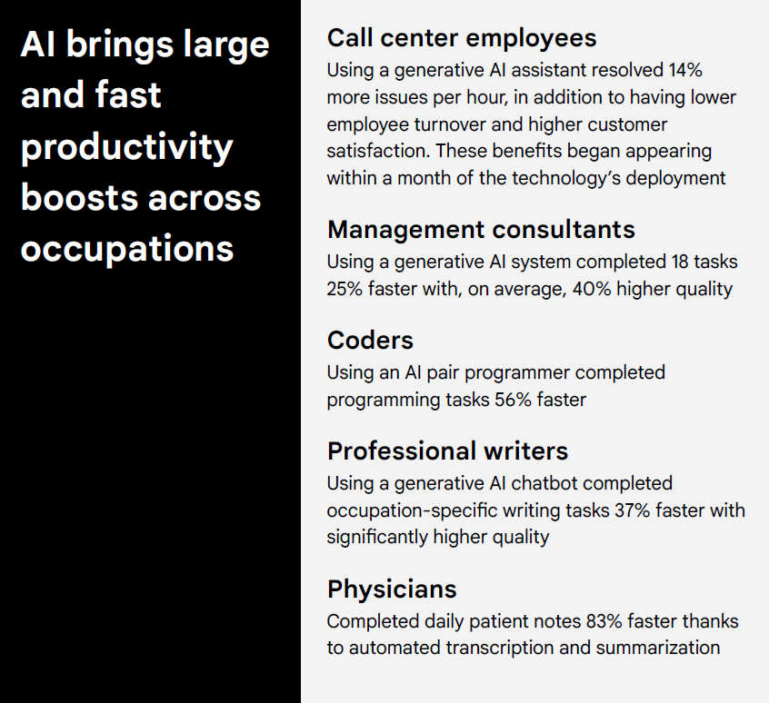
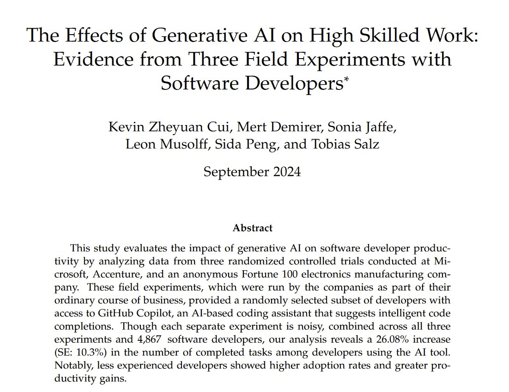

```{r setup, include=FALSE}
knitr::opts_chunk$set(cache = TRUE,
                      echo = FALSE,
                      warning = FALSE,
                      message = FALSE,
                      progress = FALSE, 
                      verbose = FALSE,
                      dev = 'png',
                      fig.height = 3,
                      dpi = 300,
                      fig.align = 'center')

options(htmltools.dir.version = FALSE)


miamired = '#C3142D'

if(require(pacman)==FALSE) install.packages("pacman")
if(require(devtools)==FALSE) install.packages("devtools")
if(require(countdown)==FALSE) devtools::install_github("gadenbuie/countdown")
if(require(xaringanExtra)==FALSE) devtools::install_github("gadenbuie/xaringanExtra")
if(require(emo)==FALSE) devtools::install_github("hadley/emo")
if(require(icons)==FALSE) devtools::install_github("mitchelloharawild/icons")

pacman::p_load(tidyverse, magrittr, lubridate, janitor, # data analysis pkgs
               DataExplorer, scales, plotly, calendR, pdftools, # plots
               tmap, sf, urbnmapr, tigris, # maps
               bibliometrix, # for bibliometric analysis of my papers
               gifski, av, gganimate, ggtext, glue, extrafont, # for animations
               emojifont, emo, RefManageR, xaringanExtra, countdown) # for
```

```{r xaringan-themer, include=FALSE, warning=FALSE}
if(require(xaringanthemer) == FALSE) install.packages("xaringanthemer")
library(xaringanthemer)

style_mono_accent(base_color = "#84d6d3",
                  base_font_size = "20px")

xaringanExtra::use_extra_styles(
  hover_code_line = TRUE,         
  mute_unhighlighted_code = TRUE  
)

xaringanExtra::use_xaringan_extra(c("tile_view", "animate_css", "tachyons", "panelset", "share_again", "search", "fit_screen", "editable", "clipboard"))

```


## Audience Pulse: Interests & Experience with Gen AI

<center>
<iframe src="https://wall.sli.do/event/5jdmw1sTzECQCYKjq4PE2U?section=05462fb2-179e-4eb3-a025-72619b3dddde" height="75%" width="75%" frameBorder="0" style="min-height: 450px;" allow="clipboard-write" title="Slido"></iframe></center>


.footnote[
<html>
<hr>
</html>

**Note:** Please scan the QR code to access the Slido poll. You can also use the link: <https://app.sli.do/event/5jdmw1sTzECQCYKjq4PE2U>. 
]

---

## Just Confirming this Talk is not About Recycling!!

```{r recycling, echo=FALSE, out.width='45%'}


```

---
count: false

## Just Confirming this Talk is not About Recycling!!

```{r recycling2, echo=FALSE, out.width='73%'}

```

.footnote[
<html>
<hr>
</html>

**Note:** Cartoon created using ChatGPT-o3 on May 18, 2025. You can see the entire interaction [here](https://chatgpt.com/share/682aa227-8360-8005-b881-6d01414f1553). The full resolution image from that interaction can be downloaded [here](https://chatgpt.com/share/682aa14e-38f4-8191-a28f-1c7786e4bbe7).
]

---

## The Road to Large Language Models

<br>

```{r generative_ai_chart_out, out.width='100%', dpi = 600, fig.alt='From big data to big models, a flow chart documenting how we got to large language models'}
knitr::include_graphics('figs/generative_ai_chart.png')
```

.footnote[
<html>
<hr>
</html>

**Comment:** You have been hearing about **big data** in Quality Control for over a decade now. In fact, we presented our paper, [Statistical Perspectives on Big Data](https://citeseerx.ist.psu.edu/document?repid=rep1&type=pdf&doi=ab40f392e653b7336cbebf7c4fb95d3988748282), almost exactly 12 years ago in the ISQC Workshop in Sydney. We now have models that can digest questions/prompts and generate answers based on more than 45TB of text. 
]

---

## Uniqueness of LLMs vs. Earlier AI Models

.content-box-gray[
.bold[.red[LLMs:]] .bold[The objective is to generate new content rather than analyze existing data.]
]

.font90[
-  The generated content is based on a .bold[.red[stochastic behavior embedded in generative AI models such that the same input prompts results in different content]].
- LLMs with known model sizes can have up to **540 billion parameters** ([PaLM](https://arxiv.org/abs/2204.02311)). Note that state-of-the-art models like *GPT-o3*, and *Claude Sonnet 3.7*  **have not revealed their model sizes**.
- With the increase in model size, researchers have observed the **“emergent abilities”** of LLMs, which were **not explicitly encoded in the training**. [Examples include](https://ai.googleblog.com/2022/11/characterizing-emergent-phenomena-in.html):
  + Multi-step arithmetic, and  
  + taking college-level exams.  
- LLMs are **foundation models** (see [Bommasani et al. 2021](https://arxiv.org/abs/2108.07258)), large pre-trained AI systems
that can be **repurposed with minimal effort across numerous domains and diverse tasks.**
]


---

## Generative AI Hype (2023)

```{r mckinsey_ai, echo=FALSE, out.width='60%'}
knitr::include_graphics('figs/mckinsey_ai.png')
```

.footnote[
<html>
<hr>
</html>

**Image Source:** [McKinsey & Company (July 2023). The economic potential of generative AI: The next productivity frontier [P. 10]](https://www.mckinsey.com/capabilities/mckinsey-digital/our-insights/the-economic-potential-of-generative-ai-the-next-productivity-frontier#/)
]


---

## Generative AI Hype (2024)

.pull-left[
```{r google_ai, echo=FALSE, out.width='100%'}

```

.center[
.font80[Andrew McAfee (2024). [Generally Faster: The Economic Impact of Generative AI](https://storage.googleapis.com/gweb-uniblog-publish-prod/documents/Generally_Faster_-_The_Economic_Impact_of_Generative_AI.pdf)]
]
]

.pull-right[
```{r ssn_2024, echo=FALSE, out.width='100%'}

```

.center[.font80[Cui et al. (2024). [SSRN 4945566](https://papers.ssrn.com/sol3/papers.cfm?abstract_id=4945566)]]

]


---

## Generative AI Hype (2025)

```{r bcg_data, echo=FALSE, out.width='100%', fig.height = 3.5}
# Prepare data
df <- tibble::tibble(
  Country = factor(c("Japan", "US", "Singapore", "UK", "France", "Germany",
                     "India", "UAE", "Spain", "Italy", "Brazil", "Global"),
                   levels = rev(c("Japan", "US", "Singapore", "UK", "France", "Germany",
                                  "India", "UAE", "Spain", "Italy", "Brazil", "Global"))),
  `Up to $25M` = c(53, 59, 63, 65, 69, 69, 71, 78, 81, 83, 86, 69),
  `$26M-$50M`  = c(26, 23, 25, 18, 17, 18, 15, 15, 6, 12, 12, 18),
  `$51M-$100M` = c(10, 9, 6, 10, 6, 9, 8, 6, 5, 3, 0, 7),
  `>$100M`     = c(11, 9, 6, 7, 8, 4, 6, 1, 8, 2, 2, 6)
)

# Transform to long format
df_long <- tidyr::pivot_longer(
  data = df,
  cols = -Country,
  names_to = "Investment",
  values_to = "Percent"
)

# Order levels
df_long$Investment <- factor(df_long$Investment, 
                             levels = rev(c("Up to $25M", "$26M-$50M", "$51M-$100M", ">$100M")))

# Cumulative position for centering
df_long <- dplyr::group_by(df_long, Country) |> 
  dplyr::mutate(pos = cumsum(Percent) - Percent / 2)

# Add dynamic text color and conditional labels
df_long <- dplyr::mutate(
  df_long,
  text_color = ifelse(Percent > 15, "white", "white"),
  label = ifelse(Percent >= 3, paste0(Percent, "%"), "")
)

# Define fill colors from RColorBrewer
fill_colors <- c("black", miamired,  "#FEB24C", "#A9A9A9")
names(fill_colors) <- levels(df_long$Investment)

# Plot
ggplot2::ggplot(df_long, ggplot2::aes(x = Percent, y = Country, fill = Investment)) +
  ggplot2::geom_col(width = 0.8) +
  ggplot2::geom_text(
    ggplot2::aes(label = label, x = pos, color = text_color),
    size = 3,
    fontface = "bold",
    show.legend = FALSE
  ) +
  ggplot2::scale_x_continuous(
    breaks = seq(0, 100, 20),
    labels = scales::percent_format(scale = 1),
    limits = c(0, 120),
  ) +
  ggplot2::scale_color_identity() +
  ggplot2::scale_fill_manual(
    values = fill_colors,
    guide = ggplot2::guide_legend(reverse = TRUE)
    ) +
  ggplot2::labs(
    title = "How much are you planning to invest in AI in 2025?",
    x = "Percentage of companies", 
    y = NULL, 
    fill = NULL
    # caption = "**Data Source:** BCG AI Radar (2025). From Potential to Profit: Closing the AI Impact Gap. [P. 5] | **Adapted By:** Fadel M. Megahed"
  ) +
  ggplot2::theme_minimal(base_size = 10) +
  ggplot2::theme(
    legend.position = "bottom",
    panel.grid.major.y = ggplot2::element_blank(),
    panel.grid.minor = ggplot2::element_blank(),
    axis.text.y = ggplot2::element_text(face = "bold")
  ) +
  # Rectangle from 66 to 100% on the Global bar
  ggplot2::annotate(
    geom = "rect",
    xmin = 69, xmax = 100,
    ymin = 0.5, ymax = 1.5,
    fill = NA, color = "forestgreen", size = 1.5
  ) +
  
  # Label to the right of the bar
  ggplot2::annotate(
    geom = "label",
    x = 102, y = 1.35,
    label = "~ One in three \ncompanies plan \nto invest >$25M",
    hjust = 0, vjust = 0.5,
    size = 2,
    label.size = 0.3,
    fill = "white", color = "forestgreen",
    fontface = "bold"
  ) +
  ggplot2::theme(
    legend.position = "bottom",
    panel.grid.major.y = ggplot2::element_blank(),
    panel.grid.minor = ggplot2::element_blank(),
    axis.text.y = ggplot2::element_text(face = "bold"),
    axis.text.x = ggplot2::element_text(face = "bold"),
    legend.text = ggplot2::element_text(face = "bold"),
    plot.title = ggplot2::element_text(face = "bold", size = 12, hjust = 0.5),
    axis.title.x = ggplot2::element_text(face = "bold", size = 11),
    plot.caption = ggtext::element_markdown(size = 7, hjust = 0)
  ) 


```

.footnote[
<html>
<hr>
</html>

**Image Adapted from:** BCG AI Radar (2025). [From Potential to Profit: Closing the AI Impact Gap](https://www.bcg.com/publications/2025/how-much-are-you-planning-to-invest-in-ai-in-2025). [P. 5]
]


---

##🤦🏽‍♂️️ But also My Experience in May 2025 (ChatGPT-o3)

```{r rock_paper, echo=FALSE, out.width='75%'}

```

.footnote[
<html>
<hr>
</html>

**Source:** Megahed, F.M. (2025). [Playing Rock Paper Scissors with ChatGPT o3 on May 18, 2025.](https://chatgpt.com/share/6829d3fa-2640-8005-a882-971d1190bb21). See the full video of the interaction [here](https://www.loom.com/share/7c0eac514773425bb3b5ef0355add538?sid=cb1f9e28-bb71-4131-9cce-38d5dd79463c).
]


---

##🤦🏽‍♂️️ But also My Experience in May 2025 (ChatGPT-o3)


<center>
<iframe width="800" height="450" src="https://www.loom.com/embed/44c2ddbd1696471f93601573155b4f34?sid=60a80e88-97c3-4f67-b784-00b68e77caa6" frameborder="0" webkitallowfullscreen mozallowfullscreen allowfullscreen></iframe>
</center>

.footnote[
<html>
<hr>
</html>

**Context:** Here, we show that *ChatGPT-o3* (OpenAI's most advanced reasoning models) continues to hallucinate when asked about **fictional data not in the `qcc` package**. This demonstrates that the issues identified earlier by [Megahed et al. (2024)](https://www.tandfonline.com/doi/abs/10.1080/08982112.2023.2206479) remain relevant, despite the model's advancements.
]


---
class: inverse, center, middle

# Structured Text Extraction for SQC Applications


---

## What do we mean by "Structured Text Extraction"?

**Structured Text Extraction** is the process of extracting relevant information from unstructured text data and converting it into a structured format that can be easily analyzed.

<br>

```{r structured_text, echo=FALSE, out.width='100%'}
set.seed(2025)
recalls = readr::read_delim(
  "data/FLAT_RCL.txt", 
  delim = "\t",
  # based on https://static.nhtsa.gov/odi/ffdd/rcl/RCL.txt (name or desc based)
  col_names = c(
    "record_id", "campaign_number", "make", "model", "year", 
    "manf_campaign_number", "component_desc", "manufacturer", "begin_manf_date",
    "end_manf_date", "vehicle_equipment_tire_report", "potential_vehicles_affected",
    "date_owner_notified_by_manf", "recall_initatior", "manufactuerers_of_recalled",
    "report_receieved_date", "record_creation_date", "regulation_part_number",
    "federal_motor_vehicle_safety_standard_number", "defect_description",
    "consequence_description", "corrective_action_description", "recall_notes",
    "recall_component_id", "manufacturer_component_name", 
    "manufacturer_component_description",
    "manufacturer_component_number"
  )
) |> 
  # removing unknown years
  dplyr::filter(year >= 2025 & year < 9999) |> 
  # keeping only unique recall_descriptions since a recall can impact multiple models and makes
  dplyr::distinct(defect_description, .keep_all = TRUE) |> 
  dplyr::select(
    record_id, defect_description
  ) |> dplyr::sample_n(3)

knitr::kable(
  recalls,
  col.names = c("Record ID", "Defect Description"),
  caption = "2025 Vehicle Recall Data from NHTSA.",
  format = "html",
  escape = FALSE
) |> 
  kableExtra::kable_styling(
    full_width = FALSE,
    position = "left",
    html_font = "Arial",
    font_size = 12,
    bootstrap_options = c("striped", "hover", "condensed")
  )

```


---

## The Code and Output

.font90[
```{r structured_text_code, echo = TRUE, results='hide', out.width='100%'}
chat = ellmer::chat_ollama(model = 'gemma3:27b')

type_recall = ellmer::type_object(
  manufacturer   = ellmer::type_string("The name of the company recalling the vehicles.", required=F),
  models         = ellmer::type_string("List of affected vehicle models.", required=F),
  model_years    = ellmer::type_string("List of model years affected.", required=F),
  defect_summary = ellmer::type_string("Summary of the main defect.", required=F)
)

extract_fn = function(x, chat_object, custom_type_object){
  return( chat_object$extract_data(x, type = custom_type_object) )
}

extracted_data = purrr::map_df(
  .x=recalls$defect_description, .f=extract_fn, chat_object=chat, custom_type_object=type_recall
  ) 
```
]

```{r structured_text_code2, echo=FALSE, out.width='100%'}
knitr::kable(
  extracted_data |> 
    dplyr::mutate(record_id = recalls$record_id) |> 
    dplyr::select(
      record_id, manufacturer, models, model_years, defect_summary
      ) |> 
    tail(2),
  col.names = c("Record ID", "Manufacturer", "Vehicle Models", "Model Years", "Defect Summary"),
  format = "html",
  escape = FALSE
) |> 
  kableExtra::kable_styling(
    full_width = FALSE,
    position = "left",
    html_font = "Arial",
    font_size = 12,
    bootstrap_options = c("striped", "hover", "condensed")
  )
```

.footnote[
<html>
<hr>
</html>

**Note:** The choice of open-source vs closed-source model, and the model size can have a large impact on the performance of this step. **Here**, we only show the last two rows of our extraction step for space considerations.
]


---

## Our No-Code App for STE: A Demo

Our [no-code app](https://huggingface.co/spaces/fmegahed/structured_text_extraction) utilizes the `ellmer` package to extract structured data from unstructured text, and OpenAI's `gpt-4o-mini` model to perform the extraction. 

```{r structured_text_app, echo=FALSE, out.width='90%'}

```

---

## Some Potential Applications of STE in SQC

- **Defect Detection**: Automating the identification of defects in manufacturing processes by analyzing inspection reports and maintenance logs.  

- **Customer Feedback Analysis**: Analyzing customer feedback, reviews, and warranty claims to identify common defects or issues with products. 

- **Regulatory Compliance**: Extracting information from regulatory documents, such as safety recalls or compliance reports, to ensure that products meet industry standards and regulations.  

- **Research:** Analyzing research papers, patents, and technical reports to extract relevant information about new materials, processes, or technologies.


---

## Practical Considerations

> LLMs are **inherently stochastic**. It is important to check the: (a) **consistency** of the extracted data, and (b) **external validity** of the results.  

```{r ste_reliability, echo=FALSE, out.width='45%'}

```


.footnote[
<html>
<hr>
</html>

**Note:** Our work on LLM consistency should be on **arXiv** sometime next week. Our detailed analysis in this area is available [here](https://fmegahed.github.io/research/llm_consistency/llm_consistency.html).
]


---
class: inverse, center, middle

# ChatISA: Our In-House Bot for Students

<br>

.pull-left-2[<br>Megahed, F. M., Chen, Y. J., Ferris, J.A., Resatar, C., Ross, K., Lee, Y., & Jones-Farmer, L. A. (2024). ChatISA: A Prompt-Engineered Chatbot for Coding, Project Management, Interview and Exam Preparation Activities. Under review.

[Freely available @ [arXiv](https://arxiv.org/abs/2407.15010)].]

.pull-right-2[<div></div>]


---

## A Live Demo of ChatISA

<center>
    <a href="https://chatisa.fsb.miamioh.edu/">
        
    </a>
</center>

.footnote[
<html>
<hr>
</html>

**Note:** We encourage the audience to experiment with **ChatISA** at <https://chatisa.fsb.miamioh.edu/>. If we have time, we can also go over [this pre-recorded and sped-up demo of our voice-enabled Interview Mentor](https://www.loom.com/share/896d4ab0e18747f0bca8dba5fff9cc36?sid=24872af4-aefd-4889-8083-b3eeb1082c52).
]


---
class: inverse, center, middle

# ChatSQC: Our Grounded App, to address Imprecise SQC Answers and Hallucinations

<br>

.pull-left-2[<br>Megahed, F. M., Chen, Y. J., Zwetsloot, I., Knoth, S., Montgomery, D.C., & Jones-Farmer, L. A. (2024). Introducing ChatSQC: Enhancing Statistical Quality Control with Augmented AI.  *Journal of Quality Technology*, 56(5), 474-497.

[Freely available @ [arXiv](https://arxiv.org/pdf/2308.13550)].]

.pull-right-2[<div></div>]


---

## The Construction of ChatSQC

```{r chatsqc, out.width='80%', echo=FALSE, fig.alt='The construction of ChatSQC involved four main phases: (a) a one-time extraction of the reference material, (b) a one-time preprocessing of the extracted material, (c) a continuous (online) chat inference, and (d) the hosting/deployment of the app on a web server.'}
knitr::include_graphics('figs/ChatSQC_flowchart_new.png')
```

---

## A Live Demo of ChatSQC

<center>
    <a href="https://chatsqc.osc.edu/">
        
    </a>
</center>

.footnote[
<html>
<hr>
</html>

**Note:** We encourage the audience to experiment with **ChatSQC** at <https://chatsqc.osc.edu/>.
]


---
class: inverse, center, middle

# Adapting OpenAI's CLIP Model for Few-Shot Image Inspection in Manufacturing Quality Control

<br>

.pull-left-2[<br>Megahed, F. M., Chen, Y. J., Colosimo, B. M., Grasso, M. L. G., Jones-Farmer, L. A., Knoth, S., Sun, H. & Zwetsloot, I. (2025). Adapting OpenAI's CLIP Model for Few-Shot Image Inspection in Manufacturing Quality Control: An Expository Case Study with Multiple Application Examples. arXiv preprint arXiv:2501.12596.

[Freely available @ [arXiv](https://arxiv.org/pdf/2501.12596)].]

.pull-right-2[<div></div>]


---

## What is CLIP?


```{r clip, echo=FALSE, out.width='100%'}
knitr::include_graphics('figs/CLIP.png')
```


.footnote[
<html>
<hr>
</html>

**Note:** CLIP (Contrastive Language–Image Pretraining) is a neural network architecture that learns to connect images and text. It was developed by OpenAI and released in January 2021.

**Image Source:** <https://github.com/openai/CLIP>.
]


???

This is the main training loss for CLIP. The key idea is simple: we want the embedding of an image and its correct caption to be close, and for all other captions to be far away — and vice versa.

So for each image–text pair in the mini-batch, we compute how similar the image is to every text in the batch, and how similar the text is to every image. Then we use a softmax to convert those similarities into a probability distribution, and apply cross-entropy loss to maximize the likelihood of the correct match.

The loss is symmetric — we do this from image-to-text and text-to-image, and average the two directions.

This simple structure is what gives CLIP its ability to generalize so broadly.

---

## Our Few Shot QC Framework

```{r few_shot, echo=FALSE, out.width='100%'}
knitr::include_graphics('figs/clip_framework.png')
```

> **Practical Notes:** 
>
> All preprocessing shown in the figure—center-crop → resize → patch extraction → embedding—happens **automatically** inside the standard `model, preprocess = clip.load("ViT-L/14", device=device)` function.
>
> In practice, you call one function, and CLIP handles the crop, resize, non-overlapping patching, and projection to the $d$-dimensional vector.*


---

## An Example with Stochastic Textured Surfaces (STS)

```{r exp03_learning_images, echo=FALSE, out.width='100%'}
knitr::include_graphics('https://raw.githubusercontent.com/fmegahed/qe_genai/main/results/exp03_learning_images.gif')
```


---

## Zero-Shot Failure for the STS Example


CLIP fails in **zero‑shot** because STS defects are subtle & domain‑specific.

<br>

| Accuracy | Sens | Spec | Prec | F1 | AUC |
|---------:|-----:|-----:|-----:|---:|----:|
| 0.500 | 0.000 | 1.000 | 0.000 | 0.000 | 0.171 |

<br>

Therefore we evaluate **few‑shot** performance while varying the learning‑set size (*ViT‑L/14* vs *ViT‑B/32*).


---

## Few-Shot Learning for the STS Example

```{r exp03_few_shot, echo=FALSE, out.width='72%'}
knitr::include_graphics('figs/exp03_comparing_two_clip_models.png')
```


???

- *ViT‑L/14* reaches **97% accuracy** with only **50** images/class.  

- Smaller *ViT‑B/32* saturates around 76%.  

- Fine‑grained $14\times14$ patching better captures local stochastic texture.


---

## Our No-Code App for CLIP: A Demo

**Our tool is available at**: <https://huggingface.co/spaces/fmegahed/clip>.

```{r clip_demo, echo=FALSE, out.width='100%'}
knitr::include_graphics('figs/hf_clip.png')
```


---

class: inverse, center, middle

# Concluding Remarks


---

