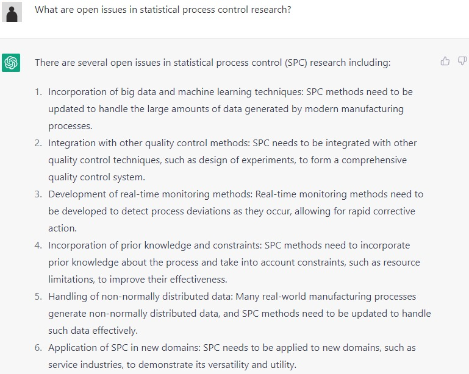

```{r setup, include=FALSE}
knitr::opts_chunk$set(cache = TRUE,
                      echo = FALSE,
                      warning = FALSE,
                      message = FALSE,
                      progress = FALSE, 
                      verbose = FALSE,
                      dev = 'png',
                      fig.height = 3,
                      dpi = 300,
                      fig.align = 'center')

options(htmltools.dir.version = FALSE)


miamired = '#C3142D'

if(require(pacman)==FALSE) install.packages("pacman")
if(require(devtools)==FALSE) install.packages("devtools")
if(require(countdown)==FALSE) devtools::install_github("gadenbuie/countdown")
if(require(xaringanExtra)==FALSE) devtools::install_github("gadenbuie/xaringanExtra")
if(require(emo)==FALSE) devtools::install_github("hadley/emo")
if(require(icons)==FALSE) devtools::install_github("mitchelloharawild/icons")

pacman::p_load(tidyverse, magrittr, lubridate, janitor, # data analysis pkgs
               DataExplorer, scales, plotly, calendR, pdftools, # plots
               tmap, sf, urbnmapr, tigris, # maps
               bibliometrix, # for bibliometric analysis of my papers
               gifski, av, gganimate, ggtext, glue, extrafont, # for animations
               emojifont, emo, RefManageR, xaringanExtra, countdown) # for
```

```{r xaringan-themer, include=FALSE, warning=FALSE}
if(require(xaringanthemer) == FALSE) install.packages("xaringanthemer")
library(xaringanthemer)

style_mono_accent(base_color = "#84d6d3",
                  base_font_size = "20px")

xaringanExtra::use_extra_styles(
  hover_code_line = TRUE,         
  mute_unhighlighted_code = TRUE  
)

xaringanExtra::use_xaringan_extra(c("tile_view", "animate_css", "tachyons", "panelset", "share_again", "search", "fit_screen", "editable", "clipboard"))

```


# Background: Artificial Intelligence

.left-code[

.center[.bold[A working definition for AI]]

.content-box-gray[
.bold[.red[Artificial Intelligence (AI):]] .bold[A system that acts in a way, where people might denote as "intelligent" if another human were to do something similar.]
]

.center[.bold[Reported applications of AI span numerous fields]] 
e.g., see a sample applications as generated by ChatGPT in the flowchart to the right.

]

.right-plot[
```{r tex_to_png, out.width='100%', dpi=600, include=FALSE}
pdftools::pdf_convert('figs/ai_applications.pdf', dpi = 600,
                      filenames = 'figs/ai_applications.png')
pdftools::pdf_convert('figs/generative_ai_chart.pdf', dpi = 600,
                      filenames = 'figs/generative_ai_chart.png')
pdftools::pdf_convert('figs/conclusions.pdf', dpi = 600,
                      filenames = 'figs/conclusions.png')
pdftools::pdf_convert('figs/open_questions.pdf', dpi = 600,
                      filenames = 'figs/open_questions.png')
```
```{r ai_apps_out, out.width='100%', dpi = 600, fig.alt='A flowchart highlighting the applications of AI, with highlight in red for fraud detection (in e-commerce), grading and assessment (in education), quality control and predictive maintenance (in manufacturing and production) as they relate the most to our SPC audience'}

```

]

.footnote[
<html>
<hr>
</html>

**Image Source:** The flowchart's content and its LaTex code were generated using ChatGPT (May 24 Version).
]


---

# Background: The Road to Generative AI

<br>

```{r generative_ai_chart_out, out.width='100%', dpi = 600, fig.alt='From big data to big models, a flow chart documenting how we got to large language models'}
knitr::include_graphics('figs/generative_ai_chart.png')
```

.footnote[
<html>
<hr>
</html>

**Comment:** You have been hearing about **big data** in SPC for over a decade now. In fact, we presented our paper titled [Statistical Perspectives on Big Data](https://citeseerx.ist.psu.edu/document?repid=rep1&type=pdf&doi=ab40f392e653b7336cbebf7c4fb95d3988748282) was presented almost exactly 10 years ago in the ISQC Workshop in Sydney. We now have models that can digest and generate answers based on more than 45TB of text. 
]

---

# Background: Generative AI

.content-box-gray[
.bold[.red[Generative AI:]] .bold[The objective is to generate new content rather than analyze existing data.]
]

.font90[
-  The generated content is based on a .bold[.red[stochastic behavior embedded in generative AI models such that the same input prompts results in different content]].
- State-of-the-art generative AI models can have up to **540 billion parameters** ([PaLM](https://arxiv.org/abs/2204.02311)).  
- With the increase in model size, researchers have observed the **“emergent abilities”** of LLMs, which were **not explicitly encoded in the training**. [Examples include](https://ai.googleblog.com/2022/11/characterizing-emergent-phenomena-in.html):
  + Multi-step arithmetic,   
  + taking college-level exams, and 
  + identifying the intended meaning of a word.  
- LLMs are **foundation models** (see [Bommasani et al. 2021](https://arxiv.org/abs/2108.07258)), large pre-trained AI systems
that can be **repurposed with minimal effort across numerous domains and diverse tasks.**
]


---

# Background: Generative AI Developments

```{r generative_ai_dev, include=FALSE, out.width='90%'}
df = readr::read_csv('recent_developments_ai.csv') |> 
  dplyr::mutate(
    Date = lubridate::mdy(Date),
    Year = lubridate::year(Date),
    Month = lubridate::month(Date)) |> 
  dplyr::arrange(Date) |> 
  dplyr::mutate(position = c(rep(c(1, -1, 0.5, -0.5),4), 1, -1),
                position2 = c(rep(c(1.1, -1.1, 0.6, -0.6),4), 1.1, -1.1) )

df[which(df$`AI Method` == 'Bard'), 'position'] = -0.75
df[which(df$`AI Method` == 'Bard'), 'position2'] = -0.85

df[which(df$`AI Method` == 'Google AI Search'), 'position'] = -1.15
df[which(df$`AI Method` == 'Google AI Search'), 'position2'] = -1.25

df[which(df$`AI Method` == 'PaLM 2'), 'position'] = 1.15
df[which(df$`AI Method` == 'PaLM 2'), 'position2'] = 1.25

df |> 
  ggplot2::ggplot(ggplot2::aes(x = Date, y = 0, label = `AI Method`, col = Company, group = Description)) + 
  ggplot2::geom_point(ggplot2::aes(y=0), size=1) + 
  ggplot2::geom_hline(yintercept=0, linewidth=0.7) +
  ggplot2::theme_bw(base_size = 8) +
  ggplot2::theme(
    plot.background = ggplot2::element_rect(color = "black"),
    legend.title = ggplot2::element_text(),
    legend.position = 'bottom',
    plot.margin = ggplot2::unit(c(0.1, 0.2, 0.1, 0.1), 'cm'),
    plot.title = ggplot2::element_text(hjust = 0.5, face="bold"),
    plot.subtitle = ggtext::element_markdown(hjust = 0.5, lineheight = 1.5),
    axis.title.y= ggplot2::element_blank(),
    axis.ticks.y= ggplot2::element_blank(),
    # axis.ticks.x = ggplot2::element_blank(),
    axis.text.x= ggplot2::element_text(face = 'bold'),
    axis.title.x= ggplot2::element_text(face = 'bold'),
    axis.text.y= ggplot2::element_blank(),
    panel.grid.major = ggplot2::element_blank(),
    panel.grid.minor = ggplot2::element_blank()
  ) +
  ggplot2::geom_text(ggplot2::aes(y = position2), size = 3.5, fontface = 'bold') +
  ggplot2::geom_segment(ggplot2::aes(y = position, yend=0, xend = Date)) +
  ggplot2::scale_color_brewer(palette = 'Dark2') +
  ggplot2::guides(colour = ggplot2::guide_legend(nrow = 1)) +
  ggplot2::scale_x_date(breaks = scales::pretty_breaks(n=24), limits = c(lubridate::ymd('2020-06-01'), lubridate::ymd('2023-08-15'))) +
  ggplot2::scale_y_continuous(limits = c(-1.25, 1.25)) +
  
  ggplot2::labs(
    x = '',
    caption = expression(paste(bold('Data Source:'),  ' Publicly available release dates of major AI developments.')),
    title = 'A Representative Sample of Major Generative AI Developments from 2020 to May 2023') -> p1

ggplot2::ggsave(filename = 'figs/ai_dev.pdf', plot = p1,
                width = 8.5, height = 4)

pdftools::pdf_convert('figs/ai_dev.pdf', dpi = 600,
                      filenames = 'figs/ai_dev.png')
```

```{r generative_ai_dev_out, echo=FALSE, out.width='100%'}

```


---

# Background: Generative AI Hype

```{r gen_ai_hype, out.width='100%', fig.height = 3.5, dpi = 600, echo=FALSE, fig.alt='It took ChatGPT 5 days to reach 1 million users, while Instagram took 2.5 months and twitter took 24 months. We have not seen such a huge adoption that quick in tech before.'}
companies = c('ChatGPT', 'Facebook', 'Twitter', 'Instagram',  'Hulu', 'Spotify', 'Pinterest')
time_taken = c(5/30, 10, 24, 2.5, 10, 5, 20)

df_popularity = tibble::tibble(companies, time_taken) |> 
  dplyr::arrange(dplyr::desc(time_taken)) |> 
  dplyr::mutate(companies = forcats::fct_reorder(companies, time_taken))

df_popularity |> 
  ggplot2::ggplot(ggplot2::aes(x = time_taken, y = companies)) +
  ggplot2::geom_bar(stat = 'identity', fill = "white", color = 'black') +
  ggplot2::geom_text(
    mapping = ggplot2::aes(x = time_taken -0.5, y = companies, label = round(time_taken,1)),
    hjust = 1,
    nudge_x = -0.1,
    color = 'black',
    fontface = 'bold',
    size = 2.5
  ) +
  ggplot2::scale_x_continuous(breaks = scales::pretty_breaks(10)) +
  ggplot2::theme_bw(base_size = 8) +
  ggplot2::theme(
    plot.background = ggplot2::element_rect(color = "black"),
    legend.title = ggplot2::element_text(),
    legend.position = 'bottom',
    plot.margin = ggplot2::unit(c(0.1, 0.2, 0.1, 0.1), 'cm'),
    plot.title = ggplot2::element_text(hjust = 0.5, face="bold"),
    plot.subtitle = ggtext::element_markdown(hjust = 0.5),
    axis.title.x= ggplot2::element_text(face="bold"),
    panel.grid.major = ggplot2::element_blank(),
    panel.grid.minor = ggplot2::element_blank()
  ) +
  ggplot2::geom_segment(x = 1.50, xend = 0.1666, y = 1, yend = 1, 
                        arrow =  ggplot2::arrow(length = ggplot2::unit(0.03, "npc")), size = 1) +
  ggplot2::geom_text(
    x = 6, y = 1.25, label = 'It took chatGPT only 5 days \n (0.167 months) to reach 1M users',
    hjust = 0.5,
    color = 'black',
    fontface = 'bold',
    size = 2.5
  ) +
  
  ggplot2::labs(
    x = 'Number of Months to Reach 1 Million Users', y = NULL,
    caption = expression(paste(bold('By: '), 'Fadel M. Megahed   | ', bold('Data Source:'), ' Business Insider')),
    title = 'Months to Reach 1M Users in Tech', 
    subtitle = "Hype/potential is unprecedented for ChatGPT; **5 days** to reach 1M users vs 2+ months for other tech."
  ) -> plot_hype

ggplot2::ggsave(filename = 'figs/chatgpt_hype.png', plot = plot_hype,
                width = 11, height = 5)


```


---
count: false

# Background: Generative AI Hype

```{r mckinsey_ai, echo=FALSE, out.width='60%'}
knitr::include_graphics('figs/mckinsey_ai.png')
```

.footnote[
<html>
<hr>
</html>

**Image Source:** [McKinsey & Company (July 2023). The economic potential of generative AI: The next productivity frontier [P. 10]](https://www.mckinsey.com/~/media/mckinsey/business%20functions/mckinsey%20digital/our%20insights/the%20economic%20potential%20of%20generative%20ai%20the%20next%20productivity%20frontier/the-economic-potential-of-generative-ai-the-next-productivity-frontier-vf.pdf)
]


---
class: inverse, center, middle

# On the Use of LLMs, such as ChatGPT, in SQC

<br>

.pull-left-2[<br> Megahed, F. M., Chen, Y. J., Ferris, J. A., Knoth, S., & Jones-Farmer, L. A. (2023). How generative AI models such as ChatGPT can be (mis)used in SPC practice, education, and research? An exploratory study. *Quality Engineering*, 1-29.

[Freely available @ [QE (end of Sept)](https://www.tandfonline.com/doi/full/10.1080/08982112.2023.2206479) & [arXiv (forever)](https://arxiv.org/pdf/2302.10916.pdf)].]

.pull-right-2[<div></div>]


---

# Our Overarching Research Question

.content-box-red[
.bold[What can generative LLM-based AI tools do now to augment the roles of SPC practitioners, educators, and researchers?]

]

-  **Secondary goal:** To motivate the SPC community to be receptive to exploring whether new AI tools can help them be more **efficient**, **productive**, and **innovative**. This is consistent with:

  + Box and Woodall ([2012](https://www.tandfonline.com/doi/10.1080/08982112.2012.627003)): “we stress the necessity for the quality engineering community to strengthen and promote its role in **innovation**”, and  
  + Hockman and Jensen ([2016](https://www.tandfonline.com/doi/10.1080/08982112.2015.1083107)): “for statisticians to be successful in leading innovation, they will need to strengthen their **skills beyond what they have traditionally needed in the past**, but we believe this will be worth the effort”.  
  
- **Scope:** We evaluated the utility of ChatGPT (GPT-3.5 engine) as of its *Jan 30 Version*.   

---

# Our Study Design

```{r study_design, include=FALSE}
pdftools::pdf_convert('figs/methods.pdf', dpi = 600,
                      filenames = 'figs/methods.png') # convert latex pdf to png
```
<center>

</center>


---

# The Good: Knowledge Generation


.bold[Inspired by the TEDxBoston talk titled [what we learned from 5 million books](https://www.ted.com/talks/jean_baptiste_michel_erez_lieberman_aiden_what_we_learned_from_5_million_books?language=en), we asked ChatGPT the following question:]

<br>

> .bold[.large["What are open issues in statistical process control research?'']]

<br>

### Why this question seemed like a reasonable prompt?
.bold[ChatGPT likely “read” and “can recall” more SPC research papers than most of us] 

---
count: false

# The Good: Knowledge Generation

```{r spc_research_knowledge, echo=FALSE, out.width='63%', fig.alt='Chat GPT highlighted six areas where there are open issues in statistical process control. We will highlight the main themes in the next slide'}

```


---
count: false

# The Good: Knowledge Generation

.content-box-red[
.center[.bold[.large[Some Thoughts on the ChatGPT Answer]]]

- It captured .bold[reasonable themes, e.g., ]
  + incorporating .bold[big data and machine learning] techniques, 
  + .bold[online/real-time monitoring] solutions where 100% sampling is employed, 
  + the need for .bold[non-normality], and 
  + .bold[applications to new domains].  

- In our opinion, .bold[value is in using it as a high-level tool for idea generation/validation].  
- Potentially .bold[“stale”] as [Chat(GPT)-3.5 “finished training in early 2022”](https://openai.com/blog/chatgpt/) and is limited to [data up to Sept 2021](https://community.openai.com/t/knowledge-cutoff-date-of-september-2021/66215).  
  + Probably not an issue for future LLM generations (.bold[Why?])
]


---

# The Bad: Precise Definitions

```{r imprecise, out.width='46%', echo=FALSE, fig.alt="ChatGPT's generated response for our prompt of explain the practitioner-to-practitioner variability. Its response is somewhat long and imprecise. Specifically, ChatGPT presented five factors, which share a common feature; all deal with differences on the method level, i.e., chart type, subgroup design, techniques to calculate the limits, dealing with outliers, and choice of software. While we agree that these factors are important and will drive different results, ChatGPT's answer ignores the context for which the practitioner-to-practitioner variability is used in the SPC literature. In fact, the practitioner-to-practitioner variability refers to the variation that occurs with a fixed configuration of the five aforementioned factors, i.e., the variation results from multiple implementations of the same procedure on the same data-generating process."}
knitr::include_graphics('figs/research_prompt_05_fig_01.png')
```


---

# The Ugly: ChatGPT's Hallucination

.bold[To detect whether ChatGPT can detect erroneous requests, we asked:]

<br>

> .bold[.large["Can you use the ‘bigfish' dataset from the qcc library in R to create a control chart?'' Note that we made up this dataset name.]]

<br>

### Why this question seemed like a reasonable prompt?
.bold[In an earlier question (within the same thread), ChatGPT answered a question by using the `qcc` package, i.e., is .red[familiar with it], and .red[detecting unreasonable requests would be a strong feature for non-expert users].]


---
count: false

# The Ugly: ChatGPT's Hallucination

```{r bigfish1, out.width='60%', echo=FALSE, fig.alt='The ChatGPT hallucination, answering a question about a non-existent dataset in the qcc library'}
knitr::include_graphics('figs/practice_prompt_03_fig_01.png')
```


---
count: false

# The Ugly: ChatGPT's Hallucination

```{r bigfish2, out.width='80%', echo=FALSE, fig.alt='ChatGPT making up details about the non-existent bigfish dataset and saying it is popular in the SPC community'}
knitr::include_graphics('figs/practice_prompt_03_fig_02.png')
```


---
class: inverse, center, middle

# ChatSQC: Our Grounded App, to address Imprecise SQC Answers and Halucinations

<br>

Megahed, F. M., Chen, Y. J., Zwetsloot, I., Knoth, S., Montgomery, D.C., & Jones-Farmer, L. A. (2023). AI and the Future of Work in Statistical Quality Control: Insights from a First Attempt to Augmenting ChatGPT with an SQC Knowledge Base (ChatSQC). To be submitted to publication (next week).

---

# The Construction of ChatSQC

```{r chatsqc, out.width='80%', echo=FALSE, fig.alt='The construction of ChatSQC involved four main phases: (a) a one-time extraction of the reference material, (b) a one-time preprocessing of the extracted material, (c) a continuous (online) chat inference, and (d) the hosting/deployment of the app on a web server.'}

```

---

# A Live Demo of ChatSQC

<center>
    <a href="https://chatsqc.osc.edu/">
        
    </a>
</center>


---

# Concluding Remarks

.font90[
- **Educational Grounding:** *ChatSQC* uniquely grounds its answers in the [NIST/SEMATECH e-handbook of Statistical Methods](https://www.itl.nist.gov/div898/handbook/index.htm), ensuring users receive authoritative and educational responses.  

- **Transparency in Answers:** Instead of merely serving answers, we provide links, snapshots of the five most relevant text passages (along with their L2 distances to the prompt), and the costs incurred to generate these responses.

- **Enhanced Privacy:** By utilizing the OpenAI API: [At OpenAI, protecting user data is fundamental to our mission. We do not train our models on inputs and outputs through our API](https://openai.com/api-data-privacy).  

- Our **Roadmap:**  
    + Utilizing open-source LLMs.  
    + Working with Wiley to get permission to include copyrighted materials such as [Introduction to Statistical Quality Control](https://www.wiley.com/en-us/Introduction+to+Statistical+Quality+Control%2C+8th+Edition-p-9781119399308).  
    + Incorporating multiple sources/retrievers in *ChatSQC*.  
    + Incorporating additional feedback from the community.

]

---

# What Would you Like to See in ChatSQC?

<center>
    <iframe src="https://wall.sli.do/event/xvSdjsyjURxqXyChZZhbu6?section=509c9bdd-99b3-4b32-8e96-3fce440839ad" width="100%" height="480"></iframe>
</center>


---
class: center, middle, inverse, title-slide

.title[
# <p>AI and the Future of Work in SQC: Augmenting ChatGPT with an SQC Knowledge Base (ChatSQC)</p>
]
.author[
### Fadel M. Megahed, PhD <br><a href="https://scholar.google.com/citations?user=6CTlKGMAAAAJ&amp;hl=en&amp;oi=ao"><svg viewBox="0 0 488 512" style="height:1em;position:relative;display:inline-block;top:.1em;fill:white;" xmlns="http://www.w3.org/2000/svg"> <path d="M488 261.8C488 403.3 391.1 504 248 504 110.8 504 0 393.2 0 256S110.8 8 248 8c66.8 0 123 24.5 166.3 64.9l-67.5 64.9C258.5 52.6 94.3 116.6 94.3 256c0 86.5 69.1 156.6 153.7 156.6 98.2 0 135-70.4 140.8-106.9H248v-85.3h236.1c2.3 12.7 3.9 24.9 3.9 41.4z"></path></svg> Scholar</a>   |   <a href="https://twitter.com/FadelMegahed"><svg viewBox="0 0 512 512" style="height:1em;position:relative;display:inline-block;top:.1em;fill:white;" xmlns="http://www.w3.org/2000/svg"> <path d="M459.37 151.716c.325 4.548.325 9.097.325 13.645 0 138.72-105.583 298.558-298.558 298.558-59.452 0-114.68-17.219-161.137-47.106 8.447.974 16.568 1.299 25.34 1.299 49.055 0 94.213-16.568 130.274-44.832-46.132-.975-84.792-31.188-98.112-72.772 6.498.974 12.995 1.624 19.818 1.624 9.421 0 18.843-1.3 27.614-3.573-48.081-9.747-84.143-51.98-84.143-102.985v-1.299c13.969 7.797 30.214 12.67 47.431 13.319-28.264-18.843-46.781-51.005-46.781-87.391 0-19.492 5.197-37.36 14.294-52.954 51.655 63.675 129.3 105.258 216.365 109.807-1.624-7.797-2.599-15.918-2.599-24.04 0-57.828 46.782-104.934 104.934-104.934 30.213 0 57.502 12.67 76.67 33.137 23.715-4.548 46.456-13.32 66.599-25.34-7.798 24.366-24.366 44.833-46.132 57.827 21.117-2.273 41.584-8.122 60.426-16.243-14.292 20.791-32.161 39.308-52.628 54.253z"></path></svg> <span class="citation">@FadelMegahed</span></a>   |   <a href="https://github.com/fmegahed"><svg viewBox="0 0 496 512" style="height:1em;position:relative;display:inline-block;top:.1em;fill:white;" xmlns="http://www.w3.org/2000/svg"> <path d="M165.9 397.4c0 2-2.3 3.6-5.2 3.6-3.3.3-5.6-1.3-5.6-3.6 0-2 2.3-3.6 5.2-3.6 3-.3 5.6 1.3 5.6 3.6zm-31.1-4.5c-.7 2 1.3 4.3 4.3 4.9 2.6 1 5.6 0 6.2-2s-1.3-4.3-4.3-5.2c-2.6-.7-5.5.3-6.2 2.3zm44.2-1.7c-2.9.7-4.9 2.6-4.6 4.9.3 2 2.9 3.3 5.9 2.6 2.9-.7 4.9-2.6 4.6-4.6-.3-1.9-3-3.2-5.9-2.9zM244.8 8C106.1 8 0 113.3 0 252c0 110.9 69.8 205.8 169.5 239.2 12.8 2.3 17.3-5.6 17.3-12.1 0-6.2-.3-40.4-.3-61.4 0 0-70 15-84.7-29.8 0 0-11.4-29.1-27.8-36.6 0 0-22.9-15.7 1.6-15.4 0 0 24.9 2 38.6 25.8 21.9 38.6 58.6 27.5 72.9 20.9 2.3-16 8.8-27.1 16-33.7-55.9-6.2-112.3-14.3-112.3-110.5 0-27.5 7.6-41.3 23.6-58.9-2.6-6.5-11.1-33.3 2.6-67.9 20.9-6.5 69 27 69 27 20-5.6 41.5-8.5 62.8-8.5s42.8 2.9 62.8 8.5c0 0 48.1-33.6 69-27 13.7 34.7 5.2 61.4 2.6 67.9 16 17.7 25.8 31.5 25.8 58.9 0 96.5-58.9 104.2-114.8 110.5 9.2 7.9 17 22.9 17 46.4 0 33.7-.3 75.4-.3 83.6 0 6.5 4.6 14.4 17.3 12.1C428.2 457.8 496 362.9 496 252 496 113.3 383.5 8 244.8 8zM97.2 352.9c-1.3 1-1 3.3.7 5.2 1.6 1.6 3.9 2.3 5.2 1 1.3-1 1-3.3-.7-5.2-1.6-1.6-3.9-2.3-5.2-1zm-10.8-8.1c-.7 1.3.3 2.9 2.3 3.9 1.6 1 3.6.7 4.3-.7.7-1.3-.3-2.9-2.3-3.9-2-.6-3.6-.3-4.3.7zm32.4 35.6c-1.6 1.3-1 4.3 1.3 6.2 2.3 2.3 5.2 2.6 6.5 1 1.3-1.3.7-4.3-1.3-6.2-2.2-2.3-5.2-2.6-6.5-1zm-11.4-14.7c-1.6 1-1.6 3.6 0 5.9 1.6 2.3 4.3 3.3 5.6 2.3 1.6-1.3 1.6-3.9 0-6.2-1.4-2.3-4-3.3-5.6-2z"></path></svg> <span class="citation">@fmegahed</span></a>   |   <a href="mailto:fmegahed@miamioh.edu"><svg viewBox="0 0 512 512" style="height:1em;position:relative;display:inline-block;top:.1em;fill:white;" xmlns="http://www.w3.org/2000/svg"> <path d="M476 3.2L12.5 270.6c-18.1 10.4-15.8 35.6 2.2 43.2L121 358.4l287.3-253.2c5.5-4.9 13.3 2.6 8.6 8.3L176 407v80.5c0 23.6 28.5 32.9 42.5 15.8L282 426l124.6 52.2c14.2 6 30.4-2.9 33-18.2l72-432C515 7.8 493.3-6.8 476 3.2z"></path></svg> fmegahed@miamioh.edu</a></br> <br> <u><b><font color="white">Joint work with:</b></u><br> Ying-Ju (Tessa) Chen, PhD   <a href="https://udayton.edu/directory/artssciences/mathematics/chen-ying-ju.php"><svg viewBox="0 0 512 512" style="height:1em;position:relative;display:inline-block;top:.1em;fill:white;" xmlns="http://www.w3.org/2000/svg"> <path d="M326.612 185.391c59.747 59.809 58.927 155.698.36 214.59-.11.12-.24.25-.36.37l-67.2 67.2c-59.27 59.27-155.699 59.262-214.96 0-59.27-59.26-59.27-155.7 0-214.96l37.106-37.106c9.84-9.84 26.786-3.3 27.294 10.606.648 17.722 3.826 35.527 9.69 52.721 1.986 5.822.567 12.262-3.783 16.612l-13.087 13.087c-28.026 28.026-28.905 73.66-1.155 101.96 28.024 28.579 74.086 28.749 102.325.51l67.2-67.19c28.191-28.191 28.073-73.757 0-101.83-3.701-3.694-7.429-6.564-10.341-8.569a16.037 16.037 0 0 1-6.947-12.606c-.396-10.567 3.348-21.456 11.698-29.806l21.054-21.055c5.521-5.521 14.182-6.199 20.584-1.731a152.482 152.482 0 0 1 20.522 17.197zM467.547 44.449c-59.261-59.262-155.69-59.27-214.96 0l-67.2 67.2c-.12.12-.25.25-.36.37-58.566 58.892-59.387 154.781.36 214.59a152.454 152.454 0 0 0 20.521 17.196c6.402 4.468 15.064 3.789 20.584-1.731l21.054-21.055c8.35-8.35 12.094-19.239 11.698-29.806a16.037 16.037 0 0 0-6.947-12.606c-2.912-2.005-6.64-4.875-10.341-8.569-28.073-28.073-28.191-73.639 0-101.83l67.2-67.19c28.239-28.239 74.3-28.069 102.325.51 27.75 28.3 26.872 73.934-1.155 101.96l-13.087 13.087c-4.35 4.35-5.769 10.79-3.783 16.612 5.864 17.194 9.042 34.999 9.69 52.721.509 13.906 17.454 20.446 27.294 10.606l37.106-37.106c59.271-59.259 59.271-155.699.001-214.959z"></path></svg> University of Dayton</a><br/> Inez Zwetsloot, PhD   <a href="https://www.uva.nl/en/profile/z/w/i.m.zwetsloot/i.m.zwetsloot.html"><svg viewBox="0 0 512 512" style="height:1em;position:relative;display:inline-block;top:.1em;fill:white;" xmlns="http://www.w3.org/2000/svg"> <path d="M326.612 185.391c59.747 59.809 58.927 155.698.36 214.59-.11.12-.24.25-.36.37l-67.2 67.2c-59.27 59.27-155.699 59.262-214.96 0-59.27-59.26-59.27-155.7 0-214.96l37.106-37.106c9.84-9.84 26.786-3.3 27.294 10.606.648 17.722 3.826 35.527 9.69 52.721 1.986 5.822.567 12.262-3.783 16.612l-13.087 13.087c-28.026 28.026-28.905 73.66-1.155 101.96 28.024 28.579 74.086 28.749 102.325.51l67.2-67.19c28.191-28.191 28.073-73.757 0-101.83-3.701-3.694-7.429-6.564-10.341-8.569a16.037 16.037 0 0 1-6.947-12.606c-.396-10.567 3.348-21.456 11.698-29.806l21.054-21.055c5.521-5.521 14.182-6.199 20.584-1.731a152.482 152.482 0 0 1 20.522 17.197zM467.547 44.449c-59.261-59.262-155.69-59.27-214.96 0l-67.2 67.2c-.12.12-.25.25-.36.37-58.566 58.892-59.387 154.781.36 214.59a152.454 152.454 0 0 0 20.521 17.196c6.402 4.468 15.064 3.789 20.584-1.731l21.054-21.055c8.35-8.35 12.094-19.239 11.698-29.806a16.037 16.037 0 0 0-6.947-12.606c-2.912-2.005-6.64-4.875-10.341-8.569-28.073-28.073-28.191-73.639 0-101.83l67.2-67.19c28.239-28.239 74.3-28.069 102.325.51 27.75 28.3 26.872 73.934-1.155 101.96l-13.087 13.087c-4.35 4.35-5.769 10.79-3.783 16.612 5.864 17.194 9.042 34.999 9.69 52.721.509 13.906 17.454 20.446 27.294 10.606l37.106-37.106c59.271-59.259 59.271-155.699.001-214.959z"></path></svg> University of Amsterdam</a><br/> Sven Knoth, PhD   <a href="https://www.hsu-hh.de/compstat/en/sven-knoth-2"><svg viewBox="0 0 512 512" style="height:1em;position:relative;display:inline-block;top:.1em;fill:white;" xmlns="http://www.w3.org/2000/svg"> <path d="M326.612 185.391c59.747 59.809 58.927 155.698.36 214.59-.11.12-.24.25-.36.37l-67.2 67.2c-59.27 59.27-155.699 59.262-214.96 0-59.27-59.26-59.27-155.7 0-214.96l37.106-37.106c9.84-9.84 26.786-3.3 27.294 10.606.648 17.722 3.826 35.527 9.69 52.721 1.986 5.822.567 12.262-3.783 16.612l-13.087 13.087c-28.026 28.026-28.905 73.66-1.155 101.96 28.024 28.579 74.086 28.749 102.325.51l67.2-67.19c28.191-28.191 28.073-73.757 0-101.83-3.701-3.694-7.429-6.564-10.341-8.569a16.037 16.037 0 0 1-6.947-12.606c-.396-10.567 3.348-21.456 11.698-29.806l21.054-21.055c5.521-5.521 14.182-6.199 20.584-1.731a152.482 152.482 0 0 1 20.522 17.197zM467.547 44.449c-59.261-59.262-155.69-59.27-214.96 0l-67.2 67.2c-.12.12-.25.25-.36.37-58.566 58.892-59.387 154.781.36 214.59a152.454 152.454 0 0 0 20.521 17.196c6.402 4.468 15.064 3.789 20.584-1.731l21.054-21.055c8.35-8.35 12.094-19.239 11.698-29.806a16.037 16.037 0 0 0-6.947-12.606c-2.912-2.005-6.64-4.875-10.341-8.569-28.073-28.073-28.191-73.639 0-101.83l67.2-67.19c28.239-28.239 74.3-28.069 102.325.51 27.75 28.3 26.872 73.934-1.155 101.96l-13.087 13.087c-4.35 4.35-5.769 10.79-3.783 16.612 5.864 17.194 9.042 34.999 9.69 52.721.509 13.906 17.454 20.446 27.294 10.606l37.106-37.106c59.271-59.259 59.271-155.699.001-214.959z"></path></svg> Helmut-Schmidt-Universität</a><br/> Douglas C. Montgomery, PhD   <a href="https://search.asu.edu/profile/10123"><svg viewBox="0 0 512 512" style="height:1em;position:relative;display:inline-block;top:.1em;fill:white;" xmlns="http://www.w3.org/2000/svg"> <path d="M326.612 185.391c59.747 59.809 58.927 155.698.36 214.59-.11.12-.24.25-.36.37l-67.2 67.2c-59.27 59.27-155.699 59.262-214.96 0-59.27-59.26-59.27-155.7 0-214.96l37.106-37.106c9.84-9.84 26.786-3.3 27.294 10.606.648 17.722 3.826 35.527 9.69 52.721 1.986 5.822.567 12.262-3.783 16.612l-13.087 13.087c-28.026 28.026-28.905 73.66-1.155 101.96 28.024 28.579 74.086 28.749 102.325.51l67.2-67.19c28.191-28.191 28.073-73.757 0-101.83-3.701-3.694-7.429-6.564-10.341-8.569a16.037 16.037 0 0 1-6.947-12.606c-.396-10.567 3.348-21.456 11.698-29.806l21.054-21.055c5.521-5.521 14.182-6.199 20.584-1.731a152.482 152.482 0 0 1 20.522 17.197zM467.547 44.449c-59.261-59.262-155.69-59.27-214.96 0l-67.2 67.2c-.12.12-.25.25-.36.37-58.566 58.892-59.387 154.781.36 214.59a152.454 152.454 0 0 0 20.521 17.196c6.402 4.468 15.064 3.789 20.584-1.731l21.054-21.055c8.35-8.35 12.094-19.239 11.698-29.806a16.037 16.037 0 0 0-6.947-12.606c-2.912-2.005-6.64-4.875-10.341-8.569-28.073-28.073-28.191-73.639 0-101.83l67.2-67.19c28.239-28.239 74.3-28.069 102.325.51 27.75 28.3 26.872 73.934-1.155 101.96l-13.087 13.087c-4.35 4.35-5.769 10.79-3.783 16.612 5.864 17.194 9.042 34.999 9.69 52.721.509 13.906 17.454 20.446 27.294 10.606l37.106-37.106c59.271-59.259 59.271-155.699.001-214.959z"></path></svg> Arizona State University</a><br> Allison Jones-Farmer, PhD   <a href="https://miamioh.edu/fsb/directory/?up=/directory/farmerl2"><svg viewBox="0 0 512 512" style="height:1em;position:relative;display:inline-block;top:.1em;fill:white;" xmlns="http://www.w3.org/2000/svg"> <path d="M326.612 185.391c59.747 59.809 58.927 155.698.36 214.59-.11.12-.24.25-.36.37l-67.2 67.2c-59.27 59.27-155.699 59.262-214.96 0-59.27-59.26-59.27-155.7 0-214.96l37.106-37.106c9.84-9.84 26.786-3.3 27.294 10.606.648 17.722 3.826 35.527 9.69 52.721 1.986 5.822.567 12.262-3.783 16.612l-13.087 13.087c-28.026 28.026-28.905 73.66-1.155 101.96 28.024 28.579 74.086 28.749 102.325.51l67.2-67.19c28.191-28.191 28.073-73.757 0-101.83-3.701-3.694-7.429-6.564-10.341-8.569a16.037 16.037 0 0 1-6.947-12.606c-.396-10.567 3.348-21.456 11.698-29.806l21.054-21.055c5.521-5.521 14.182-6.199 20.584-1.731a152.482 152.482 0 0 1 20.522 17.197zM467.547 44.449c-59.261-59.262-155.69-59.27-214.96 0l-67.2 67.2c-.12.12-.25.25-.36.37-58.566 58.892-59.387 154.781.36 214.59a152.454 152.454 0 0 0 20.521 17.196c6.402 4.468 15.064 3.789 20.584-1.731l21.054-21.055c8.35-8.35 12.094-19.239 11.698-29.806a16.037 16.037 0 0 0-6.947-12.606c-2.912-2.005-6.64-4.875-10.341-8.569-28.073-28.073-28.191-73.639 0-101.83l67.2-67.19c28.239-28.239 74.3-28.069 102.325.51 27.75 28.3 26.872 73.934-1.155 101.96l-13.087 13.087c-4.35 4.35-5.769 10.79-3.783 16.612 5.864 17.194 9.042 34.999 9.69 52.721.509 13.906 17.454 20.446 27.294 10.606l37.106-37.106c59.271-59.259 59.271-155.699.001-214.959z"></path></svg> Miami University</a><br><br/>
]
.date[
### August 16, 2023 | ISQC 2023 | Washington DC
]