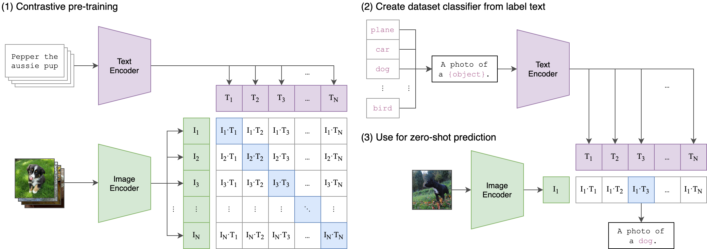
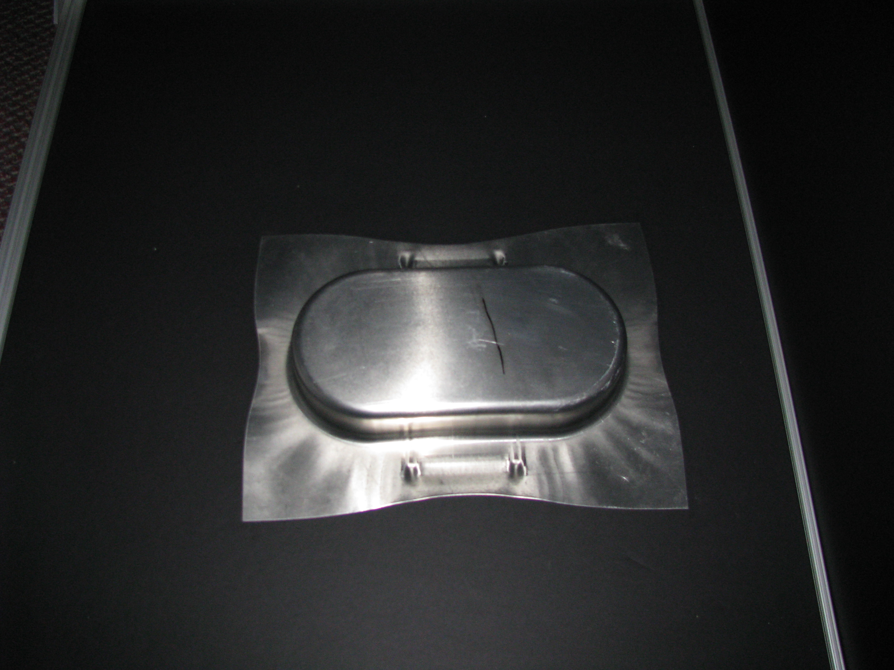

# Context and Motivation {.center .inverse}

## The Evolution of Statistical Process Monitoring (SPM)

 

  

::: footnote

**Image Source:** Colosimo BM, Jones-Farmer LA, Megahed FM, Paynabar K, Ranjan C, Woodall WH. Statistical process monitoring from industry 2.0 to industry 4.0: insights into research and practice. Technometrics. 2024 Oct 1;66(4):507-30. The paper is publicly available at the [first author's repo (click here)](https://re.public.polimi.it/bitstream/11311/1268020/1/0Statistical%20Process%20Monitoring%20from%20Industry%202.0%20to%20Industry%204.0%20%20Insights%20into%20Research%20and%20Practice.pdf) to access it -- see Figure 1.

:::

## Key Technologies Enabling SPM 4.0

{fig-align="center" width="20%"}
  

## The Central Role of Image Data in SPM 4.0

::: {style="display: flex; justify-content: center;"}

:::

::: footnote
**Note:** This video was generated by Fadel M. Megahed using [Google's text-to-video Veo 3 model](https://labs.google/fx/tools/flow/). The prompts used to create and stitch the generated videos into one comprehensive video can be accessed [here](https://github.com/fmegahed/fmegahed.github.io/blob/master/talks/isspm2025/figs/image_qc_video_steps.md).
:::

## What is an Image?

{width=500, fig-align="center"}

## Typical Pipeline for Image-Based SPM

**Prior to image monitoring, several preprocessing steps are typically applied.**

{width="100%" fig-align="center"}

- **Raw Image**: Direct camera output, often affected by noise, lighting, or alignment variability.
- **Normalization**: Standardizes intensity ranges across images, minimizing lighting differences.
- **Edge Detection**: Enhances structural elements like cracks or seams, highlighting defects.
- **Feature Extraction**: Summarizes key spatial information (e.g., region intensities, patterns) into compact descriptors.
- **Monitoring Statistic**: Uses extracted features in control charts (e.g., GLR) to detect when and where changes occur.

## Industrial Challenges for Practical Adoption of Image-Based SPM

In our opinion, there are **three main challenges that hinder the wide adoption of image-based SPM methods**. 

{width="100%" fig-align="center"}

 

### But, ...

We have **two built-in advantages:**    

  - SPM methods can **accumulate evidence over time** (e.g., GLR-type charts)  
  - SPM methods do not require **a representative training set of defective** images

## Our Research Objetive and Goals

> **Objective**: We propose a **few-shot learning CLIP-based approach** as a simple yet powerful baseline and preliminary benchmark, addressing the aforementioned limitations. 

1. **Demonstrate the practical use of CLIP’s few-shot learning**  
   Easily adapt CLIP for manufacturing quality control, and show that it can offer high accuracy with reduced complexity.

2. **Evaluate the effect of learning set size on performance**  
   Analyze how training data volume influences classification accuracy and offer guidance on minimal data requirements for successful application.

3. **Compare different vision transformer backbones**  
   Benchmark ViT-B/32 vs. ViT-L/14 in terms of classification accuracy and computational efficiency, helping practitioners make informed model choices.

# Background: What is  Contrastive Language-Image Pretraining (CLIP)? {.center .inverse}

## What is CLIP?

- **CLIP** stands for **Contrastive Language-Image Pre-training**.

- It was developed by [OpenAI](https://openai.com/index/clip/) and trained on a **massive dataset of 400 million image-text pairs**.

- The core idea is to **teach an AI to understand images and the words we use to describe them**.

- After training, [CLIP can be used to](https://openai.com/index/clip/):

  + Classify images using only text descriptions (**zero-shot classification**).

  + Power applications like image search and automated captioning.

## A Visual Introduction to CLIP

- CLIP uses **two encoders**: one for images, one for text  
- The model learns to match the correct image with the correct text

::: footnote

**Image Source:** [OpenAI's GitHub Repo for CLIP](https://github.com/openai/CLIP)

:::

## An Illustrative Example: The Ask?

::: {.columns}
::: {.column}

Let's test CLIP with an image showing a metal component with a defect.

Our question is **simple**:

> Can CLIP correctly identify this as a defective part?

We gave it **five captions to choose from:**

1. "A defective metal component"

2. "A nominal metal component"

3. "An industrial part"

4. "A piece of sheet metal"

5. "An artistic photograph"
:::
::: {.column}

 

:::
:::

## An Illustrative Example: CLIP's Internal Preprocessing and Encoding

1. **Image Preprocessing** (based on the *ViT-L/14* CLIP model (encoder)) 
   - Original resolution: 3264×2448 pixels  
   - CLIP center-crops and resizes it to **336×336 pixels**

2. **Image Embedding**  
   - The preprocessed image is encoded into a **768-dimensional vector**:  
     $\mathbf{v} = [0.371,\ 0.857,\ -0.063, \ \ldots,\ -0.649,\ -0.153,\ -0.198]$

3. **Provided Text Description and its Embedding (Example: a)**  
   - “A defective metal component” is padded and tokenized into 77 tokens  
   - Then encoded to:  
     $\mathbf{t} = [-0.0135,\ -0.0178,\ -0.0316,\ \ldots,\ 0.0006,\ 0.0008,\ 0.0638]$

4. **Similarity Comparison**  
   - CLIP computes **cosine similarity** between $\mathbf{v}$ and each $\mathbf{t}_i$  

## An Illustrative Example: Our Obtained Zero-Shot Classfication Results  
CLIP computes the **cosine similarity** between them, which we then passed through the **softmax function** to produce the following obtained probabilities:

 

<table style="width: 70%; table-layout: fixed; border-collapse: collapse; font-size: 0.95em;">
  <colgroup>
    <col style="width: 17%;">
    <col style="width: 45%;">
  </colgroup>
  <thead>
    <tr style="background-color: #c3142d; color: white;">
      <th style="padding: 8px; border: 1px solid #ddd; text-align: center;">Probability</th>
      <th style="padding: 8px; border: 1px solid #ddd; text-align: left;">Text Description</th>
    </tr>
  </thead>
  <tbody>
    <tr style="background-color: white;">
      <td style="padding: 8px; border: 1px solid #ddd; text-align: center;"><strong>85.1%</strong></td>
      <td style="padding: 8px; border: 1px solid #ddd;">A <strong>nominal</strong> metal component</td>
    </tr>
    <tr style="background-color: #f9f9f9;">
      <td style="padding: 8px; border: 1px solid #ddd; text-align: center;">6.2%</td>
      <td style="padding: 8px; border: 1px solid #ddd;">A defective metal component</td>
    </tr>
    <tr style="background-color: white;">
      <td style="padding: 8px; border: 1px solid #ddd; text-align: center;">4.9%</td>
      <td style="padding: 8px; border: 1px solid #ddd;">An industrial part</td>
    </tr>
    <tr style="background-color: #f9f9f9;">
      <td style="padding: 8px; border: 1px solid #ddd; text-align: center;">3.8%</td>
      <td style="padding: 8px; border: 1px solid #ddd;">A piece of sheet metal</td>
    </tr>
    <tr style="background-color: white;">
      <td style="padding: 8px; border: 1px solid #ddd; text-align: center;">0.01%</td>
      <td style="padding: 8px; border: 1px solid #ddd;">An artistic photograph</td>
    </tr>
  </tbody>
</table>

 

Despite the simulated defect, CLIP predicts **"nominal"** as the most likely label.

---

## Takeaway from our Illustrative Example

While the **purpose** of this illustrative example was to demonstrate how zero-shot classification works with the CLIP model, it seems to be consistent with the published limitations of the CLIP model. 

> "CLIP also still has **poor generalization to images not covered in its pre-training dataset**." [OpenAI Blog Post on the CLIP Model](https://openai.com/index/clip/) 

 

> We suspect that the majority of industrial SPM applications to fit into the **images not covered in its pretraining dataset** category, which can overcome using few-shot learning examples.

# Our Few-Shot Learning Adaptation for CLIP {.inverse .center}

## Our Few-Shot Framework for CLIP-Based Quality Inspection

> **Practical Notes:** 
>
> All preprocessing in the center block happens **automatically** inside the standard `model, preprocess = clip.load("ViT-L/14", device=device)` function.
>
> In practice, you call one function, and CLIP handles the crop, resize, non-overlapping patching, and projection to the $d$-dimensional vector.
>
>We do **NOT** leverage the **text encoder** in our few-shot approach. We only use the **image encoder** to extract the $d$-dimensional vector representation of the image.

## The Pan Example: How we Expanded on the Illustrative Example?

  - **Binary Classification:** Reduced from five classes to two -- *nominal* vs. *defective*.    
    + *"A metallic pan free of black scuff marks"*    
    + *"A metallic pan with a simulated scuff mark drawn by a black marker"* 

- Tested on **78 Images:**  39 nominal, 39 defective (instead of just one!!).  

{fig-align="center" width="800"}

## Zero-Shot Results for the Pan Example

CLIP **fails in zero‑shot because manufacturing defects are likely domain‑specific.**

 

<table style="width: 90%; table-layout: fixed; border-collapse: collapse; font-size: 0.95em;">
  <thead>
    <tr style="background-color: #c3412d; color: white;">
      <th style="padding: 8px; border: 1px solid #ddd; text-align: center;">Accuracy</th>
      <th style="padding: 8px; border: 1px solid #ddd; text-align: center;">Sensitivity (Recall)</th>
      <th style="padding: 8px; border: 1px solid #ddd; text-align: center;">Specificity</th>
      <th style="padding: 8px; border: 1px solid #ddd; text-align: center;">Precision</th>
      <th style="padding: 8px; border: 1px solid #ddd; text-align: center;">F1-Score</th>
      <th style="padding: 8px; border: 1px solid #ddd; text-align: center;">AUC</th>
    </tr>
  </thead>
  <tbody>
    <tr style="background-color: white;">
      <td style="padding: 8px; border: 1px solid #ddd; text-align: center;">0.615</td>
      <td style="padding: 8px; border: 1px solid #ddd; text-align: center;">0.231</td>
      <td style="padding: 8px; border: 1px solid #ddd; text-align: center;">1.000</td>
      <td style="padding: 8px; border: 1px solid #ddd; text-align: center;">1.000</td>
      <td style="padding: 8px; border: 1px solid #ddd; text-align: center;">0.375</td>
      <td style="padding: 8px; border: 1px solid #ddd; text-align: center;">0.559</td>
    </tr>
  </tbody>
</table>

 

Therefore we evaluate our **few‑shot** performance.

## Few-Shot Results for the Pan Example

 

<table style="width: 100%; table-layout: fixed; border-collapse: collapse; font-size: 0.75em;">
  <thead>
    <tr style="background-color: #c3412d; color: white;">
      <th style="padding: 8px; border: 1px solid #ddd; text-align: center;">Model</th>
      <th style="padding: 8px; border: 1px solid #ddd; text-align: center;">Accuracy</th>
      <th style="padding: 8px; border: 1px solid #ddd; text-align: center;">Sensitivity</th>
      <th style="padding: 8px; border: 1px solid #ddd; text-align: center;">Specificity</th>
      <th style="padding: 8px; border: 1px solid #ddd; text-align: center;">Precision</th>
      <th style="padding: 8px; border: 1px solid #ddd; text-align: center;">F1</th>
      <th style="padding: 8px; border: 1px solid #ddd; text-align: center;">AUC</th>
      <th style="padding: 8px; border: 1px solid #ddd; text-align: center;">Runtime (min)</th>
    </tr>
  </thead>
  <tbody>
    <tr style="background-color: white;">
      <td style="padding: 8px; border: 1px solid #ddd; text-align: center;">CLIP Few-Shot</td>
      <td style="padding: 8px; border: 1px solid #ddd; text-align: center;"><strong>0.910</strong></td>
      <td style="padding: 8px; border: 1px solid #ddd; text-align: center;"><strong>0.821</strong></td>
      <td style="padding: 8px; border: 1px solid #ddd; text-align: center;"><strong>1.000</strong></td>
      <td style="padding: 8px; border: 1px solid #ddd; text-align: center;"><strong>1.000</strong></td>
      <td style="padding: 8px; border: 1px solid #ddd; text-align: center;"><strong>0.901</strong></td>
      <td style="padding: 8px; border: 1px solid #ddd; text-align: center;"><strong>0.998</strong></td>
      <td style="padding: 8px; border: 1px solid #ddd; text-align: center;">9.1</td>
    </tr>
    <tr style="background-color: #f9f9f9;">
      <td style="padding: 8px; border: 1px solid #ddd; text-align: center;"><a href="https://link.springer.com/content/pdf/10.1007/s10845-010-0378-3.pdf" target="_blank" style="text-decoration: none; color: inherit;">
          Benchmark</td>
      <td style="padding: 8px; border: 1px solid #ddd; text-align: center;">0.880</td>
      <td style="padding: 8px; border: 1px solid #ddd; text-align: center;">0.760</td>
      <td style="padding: 8px; border: 1px solid #ddd; text-align: center;"><strong>1.000</strong></td>
      <td style="padding: 8px; border: 1px solid #ddd; text-align: center;"><strong>1.000</strong></td>
      <td style="padding: 8px; border: 1px solid #ddd; text-align: center;">0.857</td>
      <td style="padding: 8px; border: 1px solid #ddd; text-align: center;">– –</td>
      <td style="padding: 8px; border: 1px solid #ddd; text-align: center;">– –</td>
    </tr>
  </tbody>
</table>

 

- **CLIP Few-Shot performs at least as well as the [benchmark](https://link.springer.com/content/pdf/10.1007/s10845-010-0378-3.pdf) across all reported metrics**, with perfect specificity and precision, and a higher F1-score.

- It also offers a **simpler and more efficient implementation**, requiring just 9.1 minutes of runtime (loading the 100 images, few-shot learning, and test classification).

## The Stochastic Textured Surfaces (STS) Example

---

## Zero-Shot Failure for the STS Example

CLIP fails in **zero‑shot** because STS defects are subtle & domain‑specific.

 

| Accuracy | Sens | Spec | Prec | F1 | AUC |
|---------:|-----:|-----:|-----:|---:|----:|
| 0.500 | 0.000 | 1.000 | 0.000 | 0.000 | 0.171 |

 

Therefore we evaluate **few‑shot** performance while varying the learning‑set siz and two image encoder models (*ViT‑L/14* vs *ViT‑B/32*).

---

## Few-Shot Learning for the STS Example

{fig-align="center"}

::: {.notes}

- *ViT‑L/14* reaches **97% accuracy** with only **50** images/class.  

- Smaller *ViT‑B/32* saturates around 76%.  

- Fine‑grained $14\times14$ patching better captures local stochastic texture.
:::

# Concluding Remarks {.inverse .center}

## Key Takeaways

- CLIP is a **simple, yet effective baseline for image inspection before exploring more complex or costly alternatives**.

- Performance is **strong in single-component, texture-rich applications, and weaker in multi-object, complex scenes** (please refer to [our paper](https://arxiv.org/abs/2501.12596)).

- **Encoing Model choice matters:** ViT-L/14 offers superior performance for fine-grained textures.

- Effective with as few as **10–50 images per class** in many settings—ideal for data-scarce domains.

## Try-Out Our No-Code App? In Public Alpha

Our **no-code tool is available at:** <https://huggingface.co/spaces/fmegahed/clip>.

{width='50%'}

::: footnote

**Source code:** [HF Files](https://huggingface.co/spaces/fmegahed/clip/tree/main) | **Detailed experiments:** [Python Notebook](https://github.com/fmegahed/qe_genai/blob/main/notebook/image_inspection_with_clip.ipynb) | **Python library:** [FewShotIQ](https://test.pypi.org/project/FewShotIQ/0.1.1/)

:::

## Questions ??

  

<iframe sandbox='allow-scripts allow-same-origin allow-presentation' allowfullscreen='true' allowtransparency='true' frameborder='0' height='315' src='https://www.mentimeter.com/app/presentation/alp88uwirn4b5uu9wdcxq4xbzeyruwqr/embed' style='position: absolute; top: 0; left: 0; width: 100%; height: 100%;' width='420'></iframe>

##  {.inverse .center .title-slide}

  

<section id="title-slide" data-background-color="#c3142d" data-background-image="pres_qr_code.png" data-background-position="99% 95%" data-background-size="10%" class="quarto-title-block center">
  <h1 class="title">Adapting OpenAI’s CLIP Model for Few-Shot Image Inspection in Manufacturing Quality Control</h1>
  
An Expository Case Study with Multiple Application Examples

Fadel M. Megahed 

Ying-Ju Chen 

Bianca Colosimo 

Marco Grasso 

Allison Jones-Farmer 

Sven Knoth 

Hongyue Sun 

Inez Zwetsloot 

