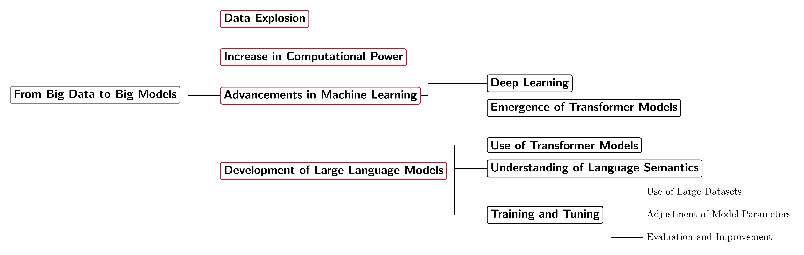
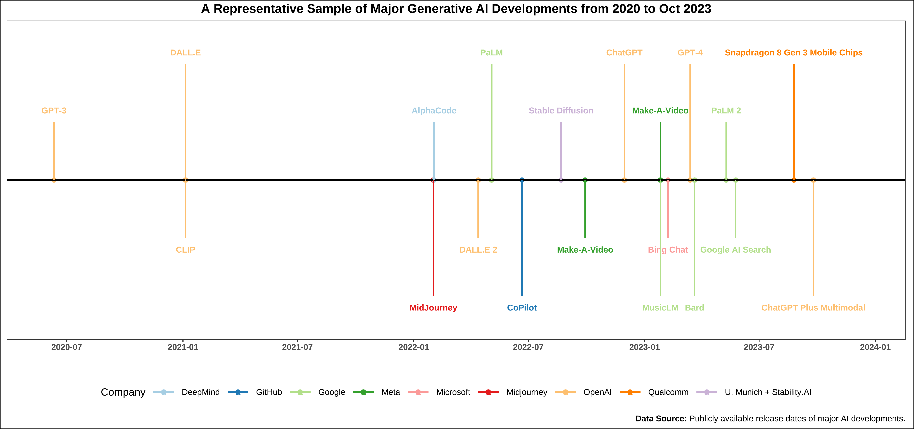
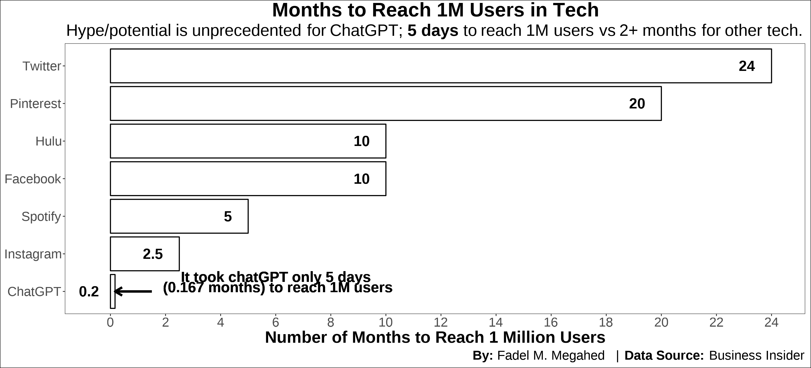
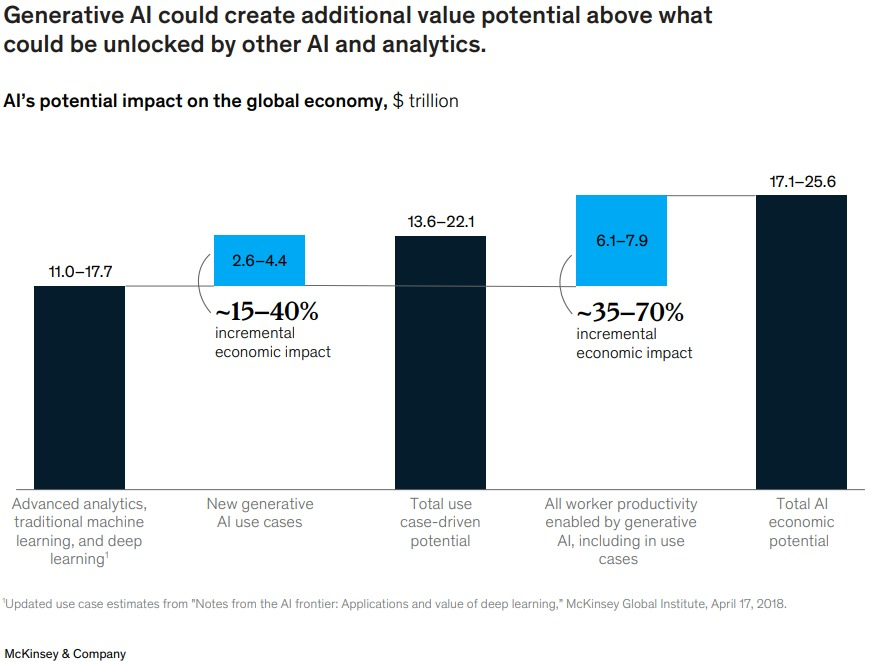

```{r setup, include=FALSE}
knitr::opts_chunk$set(cache = TRUE,
                      echo = FALSE,
                      warning = FALSE,
                      message = FALSE,
                      progress = FALSE, 
                      verbose = FALSE,
                      dev = 'png',
                      fig.height = 3,
                      dpi = 300,
                      fig.align = 'center')

options(htmltools.dir.version = FALSE)


miamired = '#C3142D'

if(require(pacman)==FALSE) install.packages("pacman")
if(require(devtools)==FALSE) install.packages("devtools")
if(require(countdown)==FALSE) devtools::install_github("gadenbuie/countdown")
if(require(xaringanExtra)==FALSE) devtools::install_github("gadenbuie/xaringanExtra")
if(require(emo)==FALSE) devtools::install_github("hadley/emo")
if(require(icons)==FALSE) devtools::install_github("mitchelloharawild/icons")

pacman::p_load(tidyverse, magrittr, lubridate, janitor, # data analysis pkgs
               DataExplorer, scales, plotly, calendR, pdftools, # plots
               tmap, sf, urbnmapr, tigris, # maps
               bibliometrix, # for bibliometric analysis of my papers
               gifski, av, gganimate, ggtext, glue, extrafont, # for animations
               emojifont, emo, RefManageR, xaringanExtra, countdown) # for
```

```{r xaringan-themer, include=FALSE, warning=FALSE}
if(require(xaringanthemer) == FALSE) install.packages("xaringanthemer")
library(xaringanthemer)

style_mono_accent(base_color = "#84d6d3",
                  base_font_size = "20px")

xaringanExtra::use_extra_styles(
  hover_code_line = TRUE,         
  mute_unhighlighted_code = TRUE  
)

xaringanExtra::use_xaringan_extra(c("tile_view", "animate_css", "tachyons", "panelset", "share_again", "search", "fit_screen", "editable", "clipboard"))

```


# Background: Artificial Intelligence

.left-code[

.center[.bold[A [working definition](https://www.brookings.edu/articles/what-is-artificial-intelligence/) for AI]]

.content-box-gray[
.bold[.red[Artificial Intelligence (AI):]] .bold[A system that acts in a way, where people might denote as "intelligent" if another human were to do something similar.]
]

.center[.bold[Reported applications of AI span numerous fields]] 
e.g., see a sample applications as generated by ChatGPT in the flowchart to the right.

]

.right-plot[
```{r tex_to_png, out.width='100%', dpi=600, include=FALSE}
pdftools::pdf_convert('figs/ai_applications.pdf', dpi = 600,
                      filenames = 'figs/ai_applications.png')
pdftools::pdf_convert('figs/generative_ai_chart.pdf', dpi = 600,
                      filenames = 'figs/generative_ai_chart.png')
pdftools::pdf_convert('figs/conclusions.pdf', dpi = 600,
                      filenames = 'figs/conclusions.png')
pdftools::pdf_convert('figs/open_questions.pdf', dpi = 600,
                      filenames = 'figs/open_questions.png')
```
```{r ai_apps_out, out.width='100%', dpi = 600, fig.alt='A flowchart highlighting the applications of AI, with highlight in red for fraud detection (in e-commerce), grading and assessment (in education), quality control and predictive maintenance (in manufacturing and production) as they relate the most to our SPC audience'}
knitr::include_graphics('figs/ai_applications.png')
```

]

.footnote[
<html>
<hr>
</html>

**Image Source:** The flowchart's content and its LaTex code were generated using ChatGPT (May 24 Version).
]


---

# Background: The Road to Generative AI

<br>

```{r generative_ai_chart_out, out.width='100%', dpi = 600, fig.alt='From big data to big models, a flow chart documenting how we got to large language models'}

```

.footnote[
<html>
<hr>
</html>

**Comment:** You have been hearing about **big data** in SPC for over a decade now. For example, my paper titled [Statistical Perspectives on Big Data](https://citeseerx.ist.psu.edu/document?repid=rep1&type=pdf&doi=ab40f392e653b7336cbebf7c4fb95d3988748282) was published almost exactly 10 years ago in the ISQC Workshop in Sydney. We now have models that can digest and generate answers based on more than 45TB of text. 
]

---

# Background: Generative AI

.content-box-gray[
.bold[.red[Generative AI:]] .bold[The objective is to generate new content rather than analyze existing data.]
]

.font90[
-  The generated content is based on a .bold[.red[stochastic behavior embedded in generative AI models such that the same input prompts results in different content]].
- State-of-the-art generative AI models can have up to **540 billion parameters** ([PaLM](https://arxiv.org/abs/2204.02311)).  
- With the increase in model size, researchers have observed the **“emergent abilities”** of LLMs, which were **not explicitly encoded in the training**. [Examples include](https://ai.googleblog.com/2022/11/characterizing-emergent-phenomena-in.html):
  + Multi-step arithmetic,   
  + taking college-level exams, and 
  + identifying the intended meaning of a word.  
- LLMs are **foundation models** (see [Bommasani et al. 2021](https://arxiv.org/abs/2108.07258)), large pre-trained AI systems
that can be **repurposed with minimal effort across numerous domains and diverse tasks.**
]


---

# Background: Generative AI Developments

```{r generative_ai_dev, include=FALSE, out.width='90%'}
df = readr::read_csv('recent_developments_ai.csv') |> 
  dplyr::mutate(
    Date = lubridate::mdy(Date),
    Year = lubridate::year(Date),
    Month = lubridate::month(Date)) |> 
  dplyr::arrange(Date) |> 
  dplyr::mutate(position = c(rep(c(0.5, -0.5, 1, -1), 5)),
                position2 = c(rep(c(0.6, -0.6, 1.1, -1.1), 5)))

# df[which(df$`AI Method` == 'Bard'), 'position'] = -0.75
# df[which(df$`AI Method` == 'Bard'), 'position2'] = -0.85
# 
# df[which(df$`AI Method` == 'Google AI Search'), 'position'] = -1.15
# df[which(df$`AI Method` == 'Google AI Search'), 'position2'] = -1.25
# 
# df[which(df$`AI Method` == 'PaLM 2'), 'position'] = 1.15
# df[which(df$`AI Method` == 'PaLM 2'), 'position2'] = 1.25

df |> 
  ggplot2::ggplot(ggplot2::aes(x = Date, y = 0, label = `AI Method`, col = Company, group = Description)) + 
  ggplot2::geom_point(ggplot2::aes(y=0), size=1) + 
  ggplot2::geom_hline(yintercept=0, linewidth=0.7) +
  ggplot2::theme_bw(base_size = 7) +
  ggplot2::theme(
    plot.background = ggplot2::element_rect(color = "black"),
    legend.title = ggplot2::element_text(),
    legend.position = 'bottom',
    plot.margin = ggplot2::unit(c(0.1, 0.2, 0.1, 0.1), 'cm'),
    plot.title = ggplot2::element_text(hjust = 0.5, face="bold"),
    plot.subtitle = ggtext::element_markdown(hjust = 0.5, lineheight = 1.5),
    axis.title.y= ggplot2::element_blank(),
    axis.ticks.y= ggplot2::element_blank(),
    # axis.ticks.x = ggplot2::element_blank(),
    axis.text.x= ggplot2::element_text(face = 'bold'),
    axis.title.x= ggplot2::element_text(face = 'bold'),
    axis.text.y= ggplot2::element_blank(),
    panel.grid.major = ggplot2::element_blank(),
    panel.grid.minor = ggplot2::element_blank()
  ) +
  ggplot2::geom_text(ggplot2::aes(y = position2), size = 2, fontface = 'bold') +
  ggplot2::geom_segment(ggplot2::aes(y = position, yend=0, xend = Date)) +
  ggplot2::scale_color_brewer(palette = 'Paired') +
  ggplot2::guides(colour = ggplot2::guide_legend(nrow = 1)) +
  ggplot2::scale_x_date(breaks = scales::pretty_breaks(n=12), limits = c(lubridate::ymd('2020-06-01'), lubridate::ymd('2023-12-15'))) +
  ggplot2::scale_y_continuous(limits = c(-1.25, 1.25)) +
  
  ggplot2::labs(
    x = '',
    caption = expression(paste(bold('Data Source:'),  ' Publicly available release dates of major AI developments.')),
    title = 'A Representative Sample of Major Generative AI Developments from 2020 to Oct 2023') -> p1

ggplot2::ggsave(filename = 'figs/ai_dev.pdf', plot = p1,
                width = 8.5, height = 4)

pdftools::pdf_convert('figs/ai_dev.pdf', dpi = 600,
                      filenames = 'figs/ai_dev.png')
```

```{r generative_ai_dev_out, echo=FALSE, out.width='100%'}

```


---

# Background: Generative AI Hype

```{r gen_ai_hype, out.width='100%', fig.height = 3.5, dpi = 600, echo=FALSE, fig.alt='It took ChatGPT 5 days to reach 1 million users, while Instagram took 2.5 months and twitter took 24 months. We have not seen such a huge adoption that quick in tech before.'}
companies = c('ChatGPT', 'Facebook', 'Twitter', 'Instagram',  'Hulu', 'Spotify', 'Pinterest')
time_taken = c(5/30, 10, 24, 2.5, 10, 5, 20)

df_popularity = tibble::tibble(companies, time_taken) |> 
  dplyr::arrange(dplyr::desc(time_taken)) |> 
  dplyr::mutate(companies = forcats::fct_reorder(companies, time_taken))

df_popularity |> 
  ggplot2::ggplot(ggplot2::aes(x = time_taken, y = companies)) +
  ggplot2::geom_bar(stat = 'identity', fill = "white", color = 'black') +
  ggplot2::geom_text(
    mapping = ggplot2::aes(x = time_taken -0.5, y = companies, label = round(time_taken,1)),
    hjust = 1,
    nudge_x = -0.1,
    color = 'black',
    fontface = 'bold',
    size = 2.5
  ) +
  ggplot2::scale_x_continuous(breaks = scales::pretty_breaks(10)) +
  ggplot2::theme_bw(base_size = 8) +
  ggplot2::theme(
    plot.background = ggplot2::element_rect(color = "black"),
    legend.title = ggplot2::element_text(),
    legend.position = 'bottom',
    plot.margin = ggplot2::unit(c(0.1, 0.2, 0.1, 0.1), 'cm'),
    plot.title = ggplot2::element_text(hjust = 0.5, face="bold"),
    plot.subtitle = ggtext::element_markdown(hjust = 0.5),
    axis.title.x= ggplot2::element_text(face="bold"),
    panel.grid.major = ggplot2::element_blank(),
    panel.grid.minor = ggplot2::element_blank()
  ) +
  ggplot2::geom_segment(x = 1.50, xend = 0.1666, y = 1, yend = 1, 
                        arrow =  ggplot2::arrow(length = ggplot2::unit(0.03, "npc")), size = 1) +
  ggplot2::geom_text(
    x = 6, y = 1.25, label = 'It took chatGPT only 5 days \n (0.167 months) to reach 1M users',
    hjust = 0.5,
    color = 'black',
    fontface = 'bold',
    size = 2.5
  ) +
  
  ggplot2::labs(
    x = 'Number of Months to Reach 1 Million Users', y = NULL,
    caption = expression(paste(bold('By: '), 'Fadel M. Megahed   | ', bold('Data Source:'), ' Business Insider')),
    title = 'Months to Reach 1M Users in Tech', 
    subtitle = "Hype/potential is unprecedented for ChatGPT; **5 days** to reach 1M users vs 2+ months for other tech."
  ) -> plot_hype

ggplot2::ggsave(filename = 'figs/chatgpt_hype.png', plot = plot_hype,
                width = 11, height = 5)



```


---

# Background: Generative AI Hype

```{r mckinsey_ai, echo=FALSE, out.width='60%'}

```

.footnote[
<html>
<hr>
</html>

**Image Source:** [McKinsey & Company (July 2023). The economic potential of generative AI: The next productivity frontier [P. 10]](https://www.mckinsey.com/~/media/mckinsey/business%20functions/mckinsey%20digital/our%20insights/the%20economic%20potential%20of%20generative%20ai%20the%20next%20productivity%20frontier/the-economic-potential-of-generative-ai-the-next-productivity-frontier-vf.pdf)
]


---

# Questions to be Discussed by the Panel

1. **Shaping the Classroom:** How is Generative AI transforming the way you teach?  

2. **Research Frontiers:** How does Generative AI fit into your current research, or are there any groundbreaking projects you're exploring in this domain?  

3. **The Future of AI:** Imagine the potential of generative AI! How do you envision the capabilities of ChatGPT-7, three to four years down the line?

<html>
<style>
    .image-container {
        display: flex;
        justify-content: space-between; /* To space the images apart */
    }
    .image-box {
        width: 17%;
        text-align: center; /* To center the person's name below the image */
    }
    .image-box img {
        width: 100%;
        height: auto; /* To maintain the aspect ratio */
    }
</style>

<div class="image-container">
    <div class="image-box">
        
        <p>Joshua Ferris</p>
    </div>
    <div class="image-box">
        
        <p>Rayna Xu</p>
    </div>
    <div class="image-box">
        
        <p>Jay Shan</p>
    </div>
    <div class="image-box">
        
        <p>Fadel Megahed</p>
    </div>
</div>
  
</html>


---

## Ferris: How is Generative AI transforming the way you teach?

.font80[
🌐 **More Open and Collaborative Assessment** 🌐  

- 🤖 Every student now has a *personal tutor* at their fingertips, ready to answer most questions in **mere seconds**. Let's embrace this change, not resist it!   
- 🚀 I'm excited to announce that I'll soon be integrating assessments that encourage the use of GenAI as a coach.  Tools like [ChatISA](https://chatisa.fsb.miamioh.edu/)) are revolutionizing how students approach programming assignments and debug them, saving valuable contact time.    

🎨 **Diverse and Dynamic Assessments** 🎨

💡 With the power of *GenAI*, we can swiftly prototype innovative question types and offer a diverse range of questions, ensuring a comprehensive assessment experience!
]

---

## Ferris: The Future of AI

.font80[
💼 **Boosting Daily Productivity** 💼

- 🚀 Imagine a day where GenAI takes care of mundane tasks, gifting you more time and freedom. This isn't just about **efficiency** —it's about unleashing your **innovation** and **creativity** to the fullest!    

🔍 **Revolutionizing Data Access** 🔍

- 💡 If costs can come down (reduced compute power or new hardware), a true revolution in how we **access and search data** could be on the horizon.   
  + 📑 Think of the *United States Patent and Trademark Office (USPTO)* and how much work it requires to verify a new application against their catalog.

📉 **A Predicted Downturn... but a Bright Future Ahead!** 📈

- ⚠️ I see some bumps on the GenAI road. Concerns around data privacy, the environment, and upcoming legislation may cause a brief regression in AI capabilities and availability.  

- 🌟 Once this turbulence passes, I foresee more advanced models capable of multiple tasks vs the current single focus models (we are somewhat seeing this currently with plugins mostly).  
]

---

## Xu: How is Generative AI transforming the way you teach?

.font80[
🌱 **ChatGPT: A Student's Trusty Sidekick** 🌱

- 🌐 ChatGPT is a valuable resource that students can rely on throughout their learning journey, **complementing conventional search engines**.  

🧠 **Mastering Modern Tools** 🧠  

- 💡 It's crucial for students to develop the skill of harnessing such tools
effectively for problem-solving.  

⚖️ **Accuracy & Validation** ⚖️  

- ❗ Responses from ChatGPT may occasionally contain **inaccuracies**, such as erroneous code or incorrect facts. Therefore, it’s imperative to **educate students on the importance of cross-validating the
information** they receive from ChatGPT to ensure its reliability.  
]

---

## Xu: Impact on Research

.font80[
📝 **ChatGPT: My Manuscript's Second Set of Eyes** 📝  

- I have been using ChatGPT to proofread my manuscript.  


**Ongoing Research Projects Related with Generative AI**

- 🆚 ChatGPT vs. Google: Exploring New Frontiers in Search & Experience 🌍 (.red[impact of generative AI on search])   
  + 🕐 1 – 1:50 pm | 📍 Room ASC 1062

🏦 **Customized Large Language Models for Banks** 📜  

- Fine-tune the LLMs using traditional Chinese text in financial context   
- Localized implementation to address security and privacy concerns  
]

---

## Xu: The Future of AI

.font80[

🔍 The Dawn of a **New Search Era** 🔍   

📞 Redefining **Customer Services** with **Intelligence** 📞  

🤖 **Chit-Chatting Robots:** The Future of Conversation 🤖

👩‍💼 AI as Analysts, Accountants, Engineers, & More! 👩‍💼

- 🌌 "ChatGPT-7" Visions 🌌  
  + 📚 A vast expanse of data at its fingertips.  
  + 🎨🔊🎬 Engaging through pictures, audios, and videos.  
  + 🎯 Higher accuracy -- less hallucinations.  
  + 🌐 **AGI?**
]


---

## Shan: How is Generative AI transforming the way you teach?

.font80[

🎓 Navigating the **Teaching** and **Learning of Programming** 🎓  

- 🚫 **Homework Helper?** Bad for directly solving homework assignments  
- ✅ **Code Explanations:**  Good for code explanation and debugging (personal tutor)  

⛔ **Exam Rule:** ChatGPT is off-limits.   

🤝 **Group Projects Reimagined:**

- Coding is usually the biggest barrier for non-tech-savvy groups 
- Co-pilot becomes essential in analytics roles  
- 🛠 Frees up time for problem solving and ideation  
- 📊 Presentation is the primary deliverable

]

---

## Shan: Impact on Research

.font80[

🔍 **Search Capabilities** 🔍

- Evolves as a new type of search engine.  
- Superior summarization capabilities.  
- **Limitation:** May not have the most up-to-date information.  
- Cannot discern reliability of reference sources.

📊 **Data Collection and Analysis** 📊

- The co-pilot feature simplifies coding, though it's not flawless.    
- Increases efficiency in descriptive analysis.  
- **Limitation:** Not suitable for handling confidential data under current settings.

🖋️ **Content Generation** 🖋️ 

- Aids in refining writing, especially beneficial for non-native English speakers.
- Assists in exploring new research directions.
- Helps articulate complex arguments.

]

---

## Shan: The Future of AI

.font80[
🚀 **Predicted Innovation in the Age of GAI** 🚀

- The integration of GAI will be as ubiquitous in the modern business landscape as personal computers, Windows OS, and iPhones once were.  
- It's imperative for higher education to adapt to this changing landscape, equipping students to harness the full potential of GAI.
- However, just as WiFi access once did, the high costs associated with GAI could exacerbate digital inequality.

💡 **Empowering the Everyday Learner** 💡 

- GAI will serve as a catalyst for personal learning, transforming average learners into exceptional ones.  - It holds the potential to address and rectify the most significant challenges facing online education and MOOCs.

🔮 **ChatGPT-7 and Beyond:** 🔮

- Personal AI profiles will offer tailored experiences, but this customization will bring forth privacy challenges.  
- As organic data emerges as the new battlefield, we may witness a shift towards more restrictive data
ecosystems. The ideal of a free and open internet may be at stake.  
- Copyright issues will pave the way for a burgeoning industry focused on green, or ethical, content generation.  

]

---

## Megahed: On  Research, Teaching, Learning, and the Future


Let us demo the [ChatSQC app](https://chatsqc.fsb.miamioh.edu/).


---
class: center, middle, inverse

# Audience Questions and Discussion

---

<center>
    <iframe src="https://wall.sli.do/event/xvSdjsyjURxqXyChZZhbu6?section=509c9bdd-99b3-4b32-8e96-3fce440839ad" width="100%" height="480"></iframe>
</center>