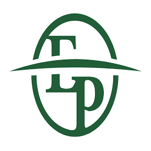
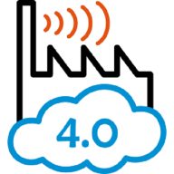
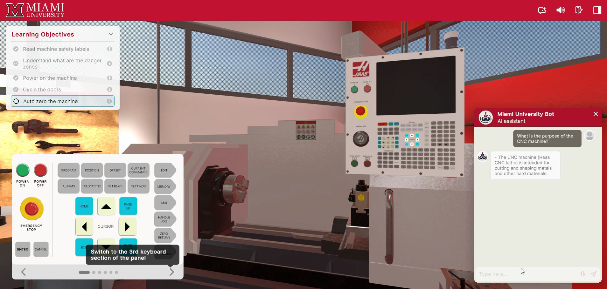
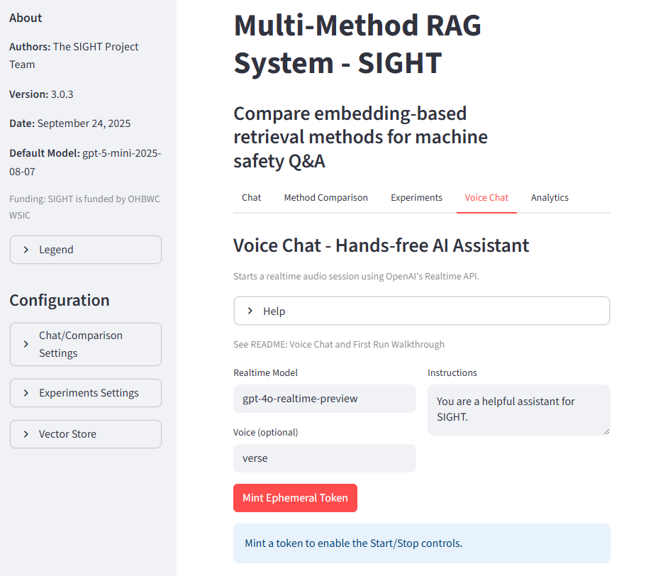
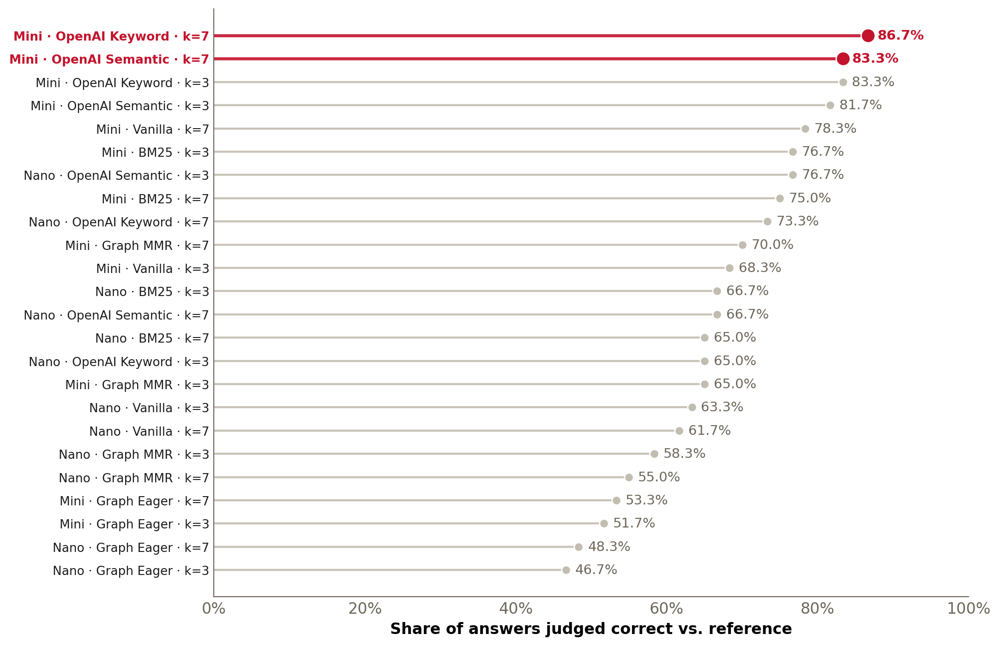
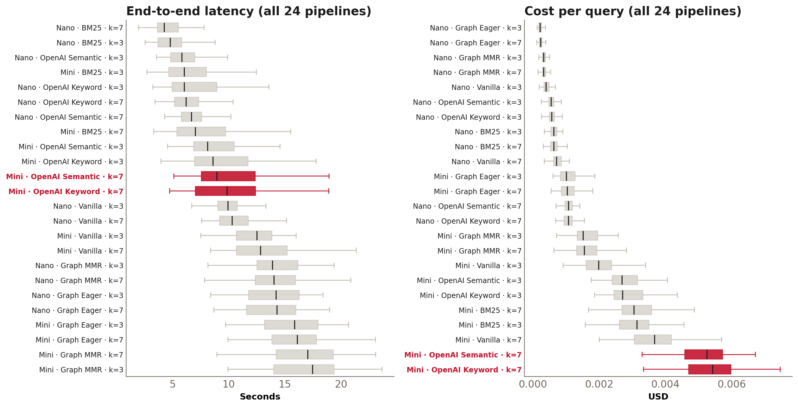
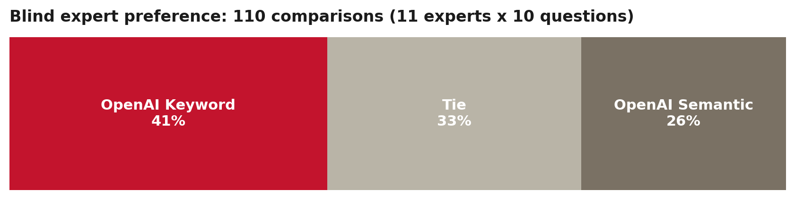
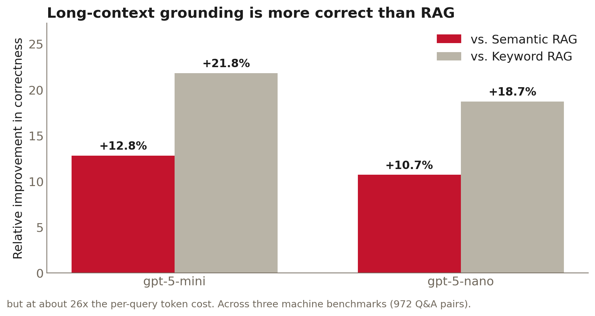

## The Cost of Workplace Injuries in Manufacturing

The U.S. manufacturing industry loses **nearly $7.47 billion a year** to serious,
nonfatal workplace injuries.^1^ It employs about **12.5 million workers**.^2^

::: statgrid
::: stat
[💥]{.sicon}[$0.83B]{.num}[Struck by object or equipment (11.2%)]{.lab}
:::
::: stat
[🗜️]{.sicon}[$0.65B]{.num}[Caught in or compressed by equipment (8.8%)]{.lab}
:::
::: stat
[⚠️]{.sicon}[~$1.48B]{.num}[From contact with equipment alone]{.lab}
:::
:::

- Manufacturing is among the **most hazardous** occupational sectors.
- Being **struck by** equipment is the **3rd** most common cause; being **caught in or
  compressed by** equipment is the **4th**.^1^

::: footnote
**References:** 
1. Liberty Mutual, *2025 Workplace Safety Index: Manufacturing* ([Report Summary](https://dam.libertymutual.com/AssetLink/iyqk45k20d8en1xcdem1777511d75dhy.pdf)). 
2. U.S. manufacturing employment, ~12.5M average in 2025 ([FRED: MANEMP](https://fred.stlouisfed.org/series/MANEMP)).
:::

## Ohio's Manufacturing Industry: Safety Issues

 From 2007-2017, the OHBWC insured **about two-thirds of Ohio's workers**.^3^ From the
 analysis of private-employer claims over that period:^3^

 - In FY 17 alone, the OHBWC paid **[$1.635 B in total benefits](https://ohioauditor.gov/Auditsearch/Reports/2024/Ohio_BWC_2024-Franklin_FINAL.pdf)** (per p. 49).

 - A total of **31,703 lost-time cases** were caused by **contact with objects and equipment**.

 - In manufacturing, contact with objects/equipment represented:
   + **34.85%** of the sector's lost-time (LT) claims.
   + **57.11%** of the sector's total (LT + medical-only) claims.

::: footnote

**Notes:** 
    - The OHBWC (established in 1912) is the largest state-run WC system in the US.  
    - Lost-time (LT) claims = 8 or more days away from work ($\ge 8$ DAW); Medical-only (MO) claims (medical care only and/or $\le 7$ DAW).
  
**Reference:** 
3. *J Safety Res.* 2021;79:148-167 ([publicly available](https://pmc.ncbi.nlm.nih.gov/articles/PMC9026720/)).
:::

## Safety Issues Root-Causes

- **Standardized machine guarding checklists** to identify hazards and system deficiencies, especially in metal-working and similar industries.^3^
- Temporary workers have **higher contact injury rates** due to:^4^ (a) **less safety training**; and (b) shorter job tenure.
- **Recognized interventions** to reduce such injuries include:
  - Machine guarding and safety saws^5^
  - PPE: safety glasses, gloves, awareness campaigns^6,7^
  - NIOSH guidance: Hazardous Energy Control Resource Guide^8^

::: footnote
**References:** 
3. *J Safety Res.* 2021;79:148-167 ([link](https://pmc.ncbi.nlm.nih.gov/articles/PMC9026720/)). 
4. *Am J Ind Med.* 2017;60(10):841-851 ([link](https://pubmed.ncbi.nlm.nih.gov/28869311/)). 
5. *Am J Ind Med.* 2014;57(12):1398-1412 ([link](https://stacks.cdc.gov/view/cdc/32077)). 
6. *Am J Ind Med.* 2000;18(4S):27-32 ([link](https://pubmed.ncbi.nlm.nih.gov/10793278/)). 
7. *Orthopedics.* 1995;18(11):1067-1071 ([link](https://pubmed.ncbi.nlm.nih.gov/8559691/)). 
8. NIOSH, *Hazardous Energy Control: Lockout and Other Means*, 2025 ([NIOSH](https://www.cdc.gov/niosh/manufacturing/hazardous-energy-control/index.html)).
:::

## Traditional Safety Training Is Static

::: columns
::: {.column width="45%"}
**Why it falls short**

- Delivered **once at onboarding** and at fixed intervals; it does not adapt to evolving
  hazards or differing worker experience.
- When an operator needs machine-specific guidance, a static manual is **hard to search
  in the moment** a hazard is present.
:::
::: {.column width="8%"}
:::
::: {.column width="45%"}
**Evidence for immersive training**

- A meta-analysis of VR, AR, and mixed-reality training finds immersive methods are **at
  least as effective as traditional training**, with gains in engagement and retention.^9^
- This motivates **adaptive, immersive** delivery for hazard recognition.
:::
:::

::: footnote
**Reference:** 
9. Kaplan et al., *The Effects of Virtual Reality, Augmented Reality, and Mixed Reality as Training Enhancement Methods: A Meta-Analysis*, Human Factors 2021;63(4):706-726 ([doi](https://doi.org/10.1177/0018720820904229)).
:::

## Our Industry Partners

::: partnergrid
::: partner

[Engineered Profiles]{.pname}
[Industry leader in plastic extrusion, serving Agriculture, Building Products, Energy, HVAC & Filtration, Refrigeration, Retail & Commercial Fixtures, and more]{.prole}
:::
::: partner

[Industrious Group]{.pname}
[North American holding company delivering maintenance, repair, and modernization of heavy machinery and equipment across critical industries]{.prole}
:::
::: partner

[Yamaha Motor Mfg. (YMMC)]{.pname}
[Builds and assembles WaveRunners, Side-by-Sides, ATVs, and Golf Cars]{.prole}
:::
:::

 

**Technology and development partners**

::: {.partnergrid style="grid-template-columns:repeat(2,1fr); max-width:62%; margin:0.3em auto 0;"}
::: {.partner .tech}

[MeetKai]{.pname}
[AI and web-based VR development]{.prole}
:::
::: {.partner .tech}

[MaxByte]{.pname}
[AR, IIoT, and digital transformation]{.prole}
:::
:::

## A Web-Based VR Training Environment

Together, we built a **web-based VR training environment**.

<iframe width="720" height="405" src="https://www.youtube.com/embed/EbiKD_GSrf0" title="SIGHT web-based VR safety training walkthrough" frameborder="0" allow="accelerometer; autoplay; clipboard-write; encrypted-media; gyroscope; picture-in-picture; web-share" allowfullscreen style="display:block;margin:0.2em auto;border-radius:8px;box-shadow:0 6px 20px rgba(0,0,0,0.25);"></iframe>

  <strong>Try it live:</strong> <a href="https://mou-virtual-demo.mkms.io/">mou-virtual-demo.mkms.io</a>
  

## The Chatbot, Embedded in the VR Platform

Inside the environment, workers **ask questions in plain language** and get grounded,
document-backed guidance with **cited sources**, by **text, or voice**.

::: fullimg
{fig-align="center" alt="Screenshot of the VR training environment, showing a user asking a question about machine safety and receiving a text answer with citations to regulatory documents."}
:::

## Why Embed an AI Safety Chatbot?

The same assistant is available **two ways**, so it meets workers in the mode most
convenient to their environment.

::: cardgrid
::: card
[💬]{.icon}[Standalone web chatbot]{.ctitle}[A browser chatbot for text, image, and voice questions. [sight.fsb.miamioh.edu](https://sight.fsb.miamioh.edu/)]{.ctext}
:::
::: card
[🔌]{.icon}[Programmatic API]{.ctitle}[A public API to embed safety Q&A into other tools and platforms. [API documentation](https://sight-142484475712.us-east5.run.app/docs)]{.ctext}
:::
:::

This talk focuses on **how we built and benchmarked** that assistant.

# Building and Benchmarking the Safety Chatbot {.inverse .center}

## Three Design Requirements

A next-generation safety-training assistant must satisfy three requirements,^10^ which are
**in tension** with one another.

::: cardgrid
::: card
[🎯]{.icon}[Accuracy]{.ctitle}[Technically correct and operationally safe guidance.]{.ctext}
:::
::: card
[⏱️]{.icon}[Latency]{.ctitle}[Timely, responsive answers under changing conditions.]{.ctext}
:::
::: card
[💲]{.icon}[Cost]{.ctitle}[Affordable and scalable for manufacturers of all sizes.]{.ctext}
:::
:::

Our artifact: an **open-source, Retrieval-Augmented Generation (RAG)** chatbot grounded in
regulatory documents (OSHA, NIOSH) and OEM manuals.

::: footnote
**Reference:** 
10. Peffers et al., *A Design Science Research Methodology for Information Systems Research*, J. Manag. Inf. Syst. 2007;24(3):45-77 ([doi](https://doi.org/10.2753/MIS0742-1222240302)).
:::

## The Six-Phase Framework

::: phasegrid
::: phase
[Phase 1]{.pnum}[Source Curation and Corpus]{.ptitle}

- Collect OSHA, NIOSH, OEM docs
- OCR and clean text
- Segment and standardize files
:::
::: phase
[Phase 2]{.pnum}[Knowledge Base and Indexing]{.ptitle}

- Cloud keyword and semantic
- Local BM25 index
- Graph indices and a router
:::
::: phase
[Phase 3]{.pnum}[Multimodal Chatbot]{.ptitle}

- Text, image, and speech
- Grounded citations
- Session analytics
:::
::: phase
[Phase 4]{.pnum}[Benchmark Q&A Dataset]{.ptitle}

- Draft questions from manuals
- Expert-validated gold answers
- Three target machines
:::
::: phase
[Phase 5]{.pnum}[Automated Evaluation]{.ptitle}

- 24-pipeline factorial
- Accuracy, latency, cost
- 1,440 responses per metric
:::
::: phase
[Phase 6]{.pnum}[Human Evaluation]{.ptitle}

- Blind side-by-side review
- 11 industry and safety experts
- Select the deployed pipeline
:::
:::

## Phase 1: Source Curation and Corpus

We curated **four categories** of authoritative documents:

::: {.srcstack}
::: srccard
[⚖️ OSHA Regulations (29 CFR 1910)]{.srchead}
[1910.147](https://www.osha.gov/laws-regs/regulations/standardnumber/1910/1910.147) (Control of Hazardous Energy: Lockout/Tagout) 
[1910.178](https://www.osha.gov/laws-regs/regulations/standardnumber/1910/1910.178) (Powered Industrial Trucks) 
[1910.211-.219](https://www.osha.gov/laws-regs/regulations/standardnumber/1910/1910.211) (Guarding to Mechanical Power Transmission)
:::
::: srccard
[📘 OSHA Technical Documents]{.srchead}
[3120](https://www.osha.gov/sites/default/files/publications/osha3120.pdf) (Control of Hazardous Energy, Lockout/Tagout) 
[3170](https://www.osha.gov/sites/default/files/publications/osha3170.pdf) (Safeguarding Equipment and Protecting from Amputations) 
[Technical Manual](https://www.osha.gov/otm) (Sec. IV, Ch. 4: Industrial Robot Safety)
:::
::: srccard
[⚠️ NIOSH Safety Alerts and Guidance]{.srchead}
[2011-156](https://www.cdc.gov/niosh/docs/2011-156/) (Lockout/Tagout to Prevent Injury during Maintenance) 
[85-103](https://www.cdc.gov/niosh/docs/85-103/) (Preventing the Injury of Workers by Robots)
:::
::: srccard
[🛠️ OEM Manuals]{.srchead}
Bridgeport Milling Machine (M-508, 2018) 
Haas Lathe Operator's Manual (96-8910, Rev. J) 
UR5e Universal Robots User Manual
:::
:::

## Phase 2: Knowledge Base and Indexing

We built **six** retrieval mechanisms behind a **unified router**, so strategies can be
swapped for a fair, controlled comparison.

User question

&rarr;

Unified retrieval router

&rarr;

<b>Cloud vector store</b> 1 · OpenAI Keyword 2 · OpenAI Semantic

<b>Local index</b> 3 · BM25

<b>Graph (AstraDB)</b> 4 · Graph Eager 5 · Graph MMR 6 · Vanilla

&rarr;

LLM: grounded answer

Questions may use **precise regulatory terms** or **broad hazard descriptions**, so the mix
of lexical, semantic, and graph methods covers both.

## Phase 3: The Multimodal Chatbot

::: columns
::: {.column width="55%"}
A deployed **Streamlit** application (OpenAI **Responses** and **Realtime** APIs):

- **Text, image, and speech** input.
- Answers are **grounded with transparent citations**.
- Logs session analytics for auditability and trust.

Live: [sight.fsb.miamioh.edu](https://sight.fsb.miamioh.edu/)
:::
::: {.column width="45%"}
{width="100%" alt="Screenshot of the chatbot interface."}
:::
:::

## Phase 4: An Expert-Validated Benchmark

A **key contribution**: expert-validated Q&A across **three generations** of machines; evaluation focuses on the **UR5e cobot**.

::: statgrid
::: stat
[🛠️]{.sicon}[42]{.num}[Bridgeport manual mill]{.lab}
:::
::: stat
[⚙️]{.sicon}[51]{.num}[Haas TL-1 CNC lathe]{.lab}
:::
::: stat
[🤖]{.sicon}[60]{.num}[UR5e cobot · 23 easy / 30 moderate / 7 challenging]{.lab}
:::
:::

::: columns
::: {.column width="53%"}
::: qa
::: q
**Q (easy):** *What is a pinch hazard in robot operation?*
:::
::: a
**Gold answer:** A pinch hazard occurs when body parts can be caught between moving robot parts or surfaces.
:::
:::
:::
::: {.column width="5%"}
:::
::: {.column width="42%"}
- Validated by **industry safety experts** (Engineered Profiles, Yamaha, MeetKai) with academic researchers.
- **Openly available** on [GitHub](https://github.com/fmegahed/safety_rag_evaluation).
:::
:::

## Phase 5: Experimental Design

A **full-factorial** experiment isolates what actually drives performance.

  
Retrieval6methods

  &times;
  
LLM2mini · nano

  &times;
  
Top-k23 · 7

  =
  
Pipelines24

Each of the **24 pipelines** answers all **60 benchmark questions** → **1,440 responses per metric**.

- **Metrics:** accuracy (LLM-as-judge vs gold), latency (end-to-end), cost (token cost).
- **Controlled:** temperature 0, max 5,000 output tokens, low reasoning effort.

::: note
This is the **automated** screening stage (Phase 5). The most promising pipelines then advance to **Phase 6: blind human expert evaluation**.
:::

## Phase 5 Results: Accuracy

{width="58%" fig-align="center" fig-alt="Horizontal lollipop chart ranking all 24 RAG pipelines by the share of answers judged correct versus the reference, from about 47% to 87%. The two most accurate pipelines, gpt-5-mini with OpenAI Keyword (87%) and gpt-5-mini with OpenAI Semantic (83%) at top-k 7, are highlighted in red at the top; the remaining pipelines are gray, with the Graph Eager configurations ranked lowest."}

All 24 pipelines. **Retrieval method and model size** drive accuracy; **depth (top-k) does not**.

::: note
The **two most accurate** pipelines (gpt-5-mini with OpenAI Keyword and OpenAI Semantic, top-k = 7, shown in red) are **carried to blind expert review**.
:::

## Phase 5 Results: Latency and Cost

{width="80%" fig-align="center" fig-alt="Two box-plot panels comparing all 24 RAG pipelines. The left panel shows end-to-end latency in seconds (roughly 4 to 17 seconds); the right panel shows cost per query in USD (near zero to about $0.006). The two pipelines carried to expert review, gpt-5-mini with OpenAI Keyword and OpenAI Semantic at top-k 7, are highlighted in red: they are mid-pack on latency but among the most expensive, while the Graph and Nano configurations are the fastest and cheapest."}

The same **two highlighted pipelines** are mid-pack on latency and the **most expensive** (the
price of their accuracy). Cost gaps are real but **modest at deployment scale** (a few
dollars/month under ~10,000 queries); ~10s latency suits **informational guidance**.

## Phase 6: The Human Evaluation

**Industry experts in the loop again:** 11 manufacturing and occupational-safety experts
(7 external to the team) ran a **blind, side-by-side** comparison of the two best pipelines.

<iframe class="survey" src="https://miamioh.yul1.qualtrics.com/jfe3/preview/previewId/ef02fe21-1ef7-4643-9243-07f9ce4f73d2/SV_d5SNKxEse5FUbMq?Q_CHL=preview&amp;Q_SurveyVersionID=current"></iframe>

## Phase 6 Results: Human Evaluation

{width="68%" fig-align="center"}

::: statgrid
::: stat
[86.66%]{.num}[Accuracy]{.lab}
:::
::: stat
[~$0.005]{.num}[Cost per query]{.lab}
:::
::: stat
[~10s]{.num}[End-to-end latency]{.lab}
:::
:::

**Deployed:** gpt-5-mini with **OpenAI Keyword** at top-k = 7, the best trade-off for a
safety-critical setting.

# Discussion and Implications {.inverse .center}

## Contributions and Key Takeaway

1. An **open-source, domain-grounded multimodal safety chatbot** (text, image, speech).
2. An **expert-validated, openly available benchmark** spanning three generations of
   machines, built **with industry experts** and reusable by the community
   ([on GitHub](https://github.com/fmegahed/safety_rag_evaluation)).
3. A **systematic, reusable methodology** (six phases) linking knowledge-base design to
   end-to-end RAG performance.

**Takeaway:** no single pipeline dominates across accuracy, latency, and cost; RAG
configuration is **inherently multi-objective**.

## Extension: The Token Tax of Epistemic Accuracy

{width="68%" fig-align="center"}

Loading the **entire corpus** in context (long-context prompting) is **more correct** than
retrieving a few passages, but at **about 26x the per-query token cost**.^11^ This motivates
**Pareto-based optimization** across accuracy, latency, and cost for a facility's budget.

::: footnote
**Reference:** 
11. Companion study, *The Token Tax of Epistemic Accuracy: Comparing RAG and Long-Context Architectures* (to be submitted on arXiv this week).
:::

# Thank You {.inverse .center}

## Thank You

**A Multimodal Manufacturing Safety Chatbot**, Singh et al., NAMRC 54

::: columns
::: {.column width="57%"}
- **Try the chatbot:** [sight.fsb.miamioh.edu](https://sight.fsb.miamioh.edu/)
- **API:** [documentation](https://sight-142484475712.us-east5.run.app/docs)
- **Code and benchmark:** [github.com/fmegahed/safety_rag_evaluation](https://github.com/fmegahed/safety_rag_evaluation)
- **Paper and slides:** scan the QR codes
- **Contact:** [fmegahed@miamioh.edu](mailto:fmegahed@miamioh.edu)
:::
::: {.column width="5%"}
:::
::: {.column width="38%"}
::: trylive
{width="42%" alt="arXiv paper QR code"}
{width="42%" alt="Presentation deck QR code"}
:::

::: {.small-text .center}
Funded by the Ohio Bureau of Workers' Compensation, Worker Safety Innovation Center (Grant #WSIC26-250206-009).
:::
:::
:::
