## An Opinionated Timeline of GenAI

<!-- Sources (verified):
  ChatGPT: https://openai.com/index/chatgpt/ (Nov 30, 2022)
  Prompt patterns: White et al., arXiv 2302.11382 (Feb 2023); https://developers.openai.com/api/docs/guides/prompt-engineering
  Agents: https://www.anthropic.com/engineering/building-effective-agents (Dec 2024)
  Claude Code: https://www.anthropic.com/news/claude-3-7-sonnet (Feb 24, 2025)
  Context: https://www.anthropic.com/engineering/effective-context-engineering-for-ai-agents (Sep 29, 2025)
  OpenClaw: https://docs.openclaw.ai/concepts/agent-loop ; https://github.com/openclaw/openclaw/blob/main/docs/start/lore.md
  AutoResearch: https://github.com/karpathy/autoresearch (Mar 2026; ships program.md) -->

ChatGPT · Nov 30, 2022human → model → response

PROMPT · 2023prompt → model → output● Prompt Pattern Catalog · Feb 2023

AGENTS · 2023–25reason → act → observe ↻● Building Effective Agents · Dec 2024 &nbsp; ● Claude Code · Feb 24, 2025

CONTEXT · 2025context assembly → model → action ↻● Effective Context Engineering (Anthropic) · Sep 29, 2025 &nbsp; ● OpenClaw · early 2026

LOOP · 2026

<b>★ AutoResearch</b> (Karpathy) · Mar 2026 · <b>126 unattended experiments</b> · ships <code>program.md</code>modify → experiment → measure → keep/discard ↻

PROMPT → AGENT → CONTEXT → LOOP

the recurring structure: context → action → observation → evaluation → update ↻

::: notes
An opinionated intellectual history, not a comprehensive one: the claim is that the OBJECT BEING ENGINEERED keeps expanding. Beat 1 (chip, visible at start): ChatGPT makes natural-language interaction with a capable LLM broadly accessible — we begin by effectively programming a model through conversation. Beat 2 (PROMPT frame): 2023, the first engineering object is the instruction itself — examples, constraints, decomposition, roles (White et al.'s prompt-pattern catalog, Feb 2023). Beat 3 (AGENTS frame): models stop producing single responses; they choose actions, invoke tools, observe results (Anthropic's Building Effective Agents, Dec 2024). Claude Code (Feb 24, 2025) puts the agent inside a real executable environment — inspect, modify, execute, observe, revise. The object becomes the action trajectory. Beat 4 (CONTEXT frame): over long horizons prompts are insufficient; engineers curate what the model sees each step — instructions, tools, files, history, retrievals, memory, state (Anthropic, Sep 29, 2025). OpenClaw makes the persistent runtime visible: sessions, memory, workspaces, skills. Beat 5 (dashed LOOP frame + AutoResearch): Karpathy's AutoResearch (Mar 2026) makes the iterative optimization explicit — the agent edits train.py, runs 5 minutes, measures val_bpb, keeps or discards; 0.9979→0.9697 over 126 unattended experiments. The human defines the environment, objective, constraints, and evaluation — the artifact becomes the process that generates and selects other artifacts. Note it ships a file named program.md — remember that name. Beat 6 (overlay): prompt → agent → context → LOOP — the loop itself is now the engineered object. The next slide shows how big that idea got. Q&A armor: agentic ideas predate 2023 (ReAct, Oct 2022) — 2023–25 marks mainstreaming; RAG (2020→) is context engineering's ancestor; reasoning models (o1, Sep 2024) are excluded because they change how the model thinks, not what we engineer around it.
:::

## August 5, 2026: The Loop Becomes a Company {.tight}

::: ghostrow
June–July 2026 · "loop engineering" enters the conversation 
[Forbes: "Loop Engineering Is Fully Making The Rounds…"](https://www.forbes.com/sites/lanceeliot/2026/06/17/loop-engineering-is-fully-making-the-rounds-for-boosting-generative-ai-and-agentic-ai/) · [Business Insider: "Forget prompt engineering: 'Loop engineering' is all the rage now"](https://www.businessinsider.com/what-are-loops-ai-engineering-tips-2026-6) · [Fast Company: "Why AI learning loops are a governance issue"](https://www.fastcompany.com/91569569/ai-learning-loops-governance-issue)
:::

 

::: {.fragment}

DISCOVERY LOOP

[Jeff Dean](https://scholar.google.com/citations?user=sdcsQb4AAAAJ) · [Sanjay Ghemawat](https://scholar.google.com/citations?user=0KF6ZC8AAAAJ) · [Quoc Le](https://scholar.google.com/citations?user=vfT6-XIAAAAJ) · [Oriol Vinyals](https://scholar.google.com/citations?user=NkzyCvUAAAAJ) leave Google to automate the research loop

:::

<a href="https://x.com/JeffDean/status/2085035498222002595/photo/1">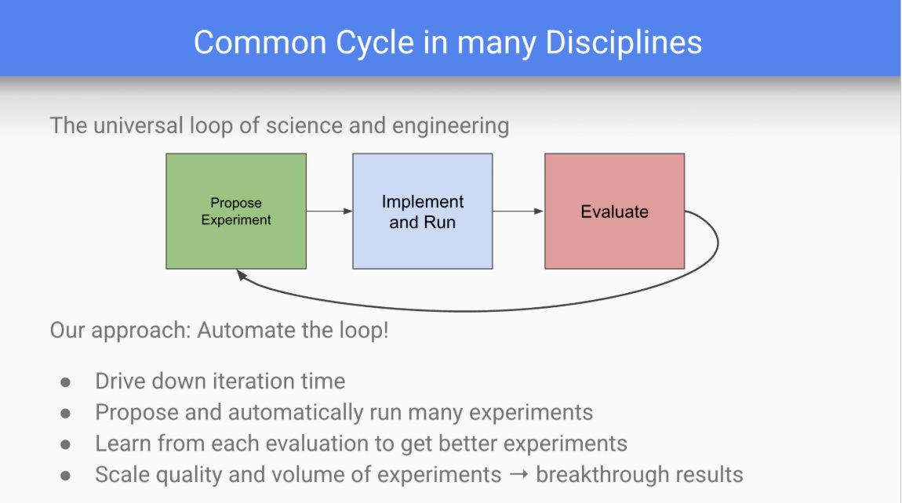</a>
<a href="https://x.com/JeffDean/status/2085035498222002595/photo/2">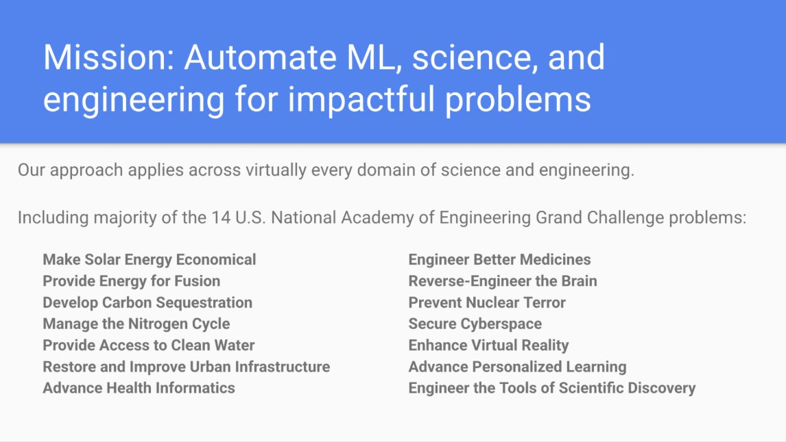</a>
<a href="https://x.com/JeffDean/status/2085035498222002595/photo/3">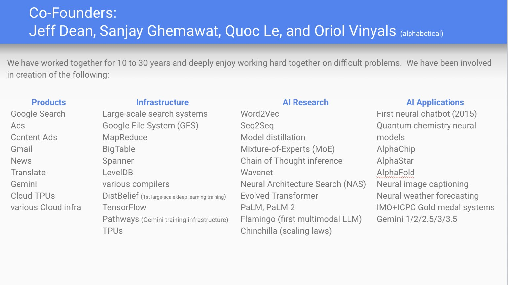</a>

::: {.small-text .center style="font-size:0.44em; margin:0.1em 0 0.2em;"}
Slides from the founders' own pitch deck, [shared publicly by Jeff Dean](https://x.com/JeffDean/status/2085035498222002595) (names above link to their Google Scholar profiles)
:::

::: {.dl-nae .corn .fragment}
**Explicit aim:** Accelerate **science and engineering**, toward the [14 NAE Grand Challenges](https://www.nae.edu/20782/grand-challenges-project).
:::

::: {.dl-signals .fragment}

GOOGL▼ 4.0%Aug 5, 2026 amid the departures

Seed co-led by <b>Radical Ventures · Khosla Ventures</b> with Alphabet · Lightspeed · Kleiner Perkins · Doerr Capital

:::

::: notes
The before → inflection → after story. Before: through June–July the phrase "loop engineering" circulates in Forbes (Lance Eliot, June 17 and June 30), Business Insider (June 20 — Boris Cherny, Claude Code's creator, saying he no longer writes individual prompts), and Fast Company (the governance angle: "a loop can be wrong and compound"). Inflection, one week ago today: Jeff Dean and Sanjay Ghemawat — 27 years at Google, the pair behind MapReduce, TPUs, TensorFlow — leave with Quoc Le and Oriol Vinyals to found Discovery Loop, a Delaware public benefit corporation whose stated mission is to "automatically solve important problems in machine learning, science, and engineering" by automating the propose→run→evaluate loop of research — starting with ML, then science broadly. For this room: their site names Grand Challenge targets (engineering better medicines, health informatics, economical solar, clean water, securing cyberspace, engineering the tools of scientific discovery) — and the 14 NAE Grand Challenges list was created by a committee convened at NSF's request (2006; announced Feb 2008). After: the market and the smart money. Alphabet closed down about 4% on Aug 5 (intraday reports ~5%) AMID the news — "amid," not "because"; and note the irony that Alphabet itself is a founding investor and the cloud partner. Backers per Wilson Sonsini and Radical Ventures: seed co-led by Radical and Khosla; Alphabet, Lightspeed, Kleiner Perkins, and Doerr Capital participating. The three center images are the founders' OWN pitch-deck slides, shared publicly by Jeff Dean on X (Aug 6, 2026): the universal propose/implement/evaluate cycle with "Our approach: Automate the loop!"; the mission slide listing the majority of the 14 NAE Grand Challenges; and the co-founders slide with their collective contributions (MapReduce, GFS, BigTable, Spanner, TensorFlow, TPUs, Word2Vec, Seq2Seq, NAS, AlphaFold, Gemini). Each founder's name links to their Google Scholar profile (Dean ~426k citations; Vinyals ~452k; Ghemawat ~173k). Sources: discoveryloop.com; radical.vc/our-investment-in-discovery-loop; wsgr.com launch advisory; nae.edu/grand-challenges; x.com/JeffDean/status/2085035498222002595.
:::

## Loop Engineering Applied to Manufacturing Systems {.tight}

::: {.small-text style="margin-bottom:0.2em;"}
**Tennessee Eastman Process (TEP)**: the canonical simulated chemical-plant benchmark ([Downs & Vogel, 1993](https://doi.org/10.1016/0098-1354(93)80018-I)). 53 process variables (41 measurements and 12 manipulatable valves) and 22 fault classes (normal and 21 faults). Our harness drives the fault detection/diagnosis, and we evaluate on unseen simulation runs.
:::

::: columns
::: {.column width="40%"}

loop-tep/ 
├── program.md ← the loop contract 
├── config.json · frozen 
├── prepare.py · frozen 
├── train.py · mutable: the agent edits this 
├── run_baseline.py · trial → log + git commit 
├── results.tsv · append-only log 
├── reasoning_log.tsv · observation → hypothesis 
└── runs/ · 874 artifacts

<b>Our adaptation</b> of Karpathy's autoresearch pattern (his loop tunes LLM training) to manufacturing fault diagnosis. The <code>program.md</code> contract:
<ul style="margin:0.15em 0 0 1.1em; padding:0;">
<li><b>Objective:</b> maximize validation macro-F1</li>
<li><b>Frozen evaluation:</b> <code>config.json</code> · <code>prepare.py</code></li>
<li><b>Mutable surface:</b> <code>train.py</code> only</li>
<li><b>Stopping, informal:</b> "stop when improvements dry up" (exactly the kind of rule DOE makes principled)</li>
</ul>

:::
::: {.column width="60%"}

claude · loop-tep

&gt; python run_baseline.py --observation "…" --hypothesis "…"

⏺ trial_0001&nbsp; minimal · medium&nbsp;&nbsp;&nbsp;&nbsp;&nbsp;&nbsp;&nbsp;macro-F1 <b>0.702</b> [baseline · committed]

✗ trial_0002&nbsp; temporal&nbsp;&nbsp;&nbsp;&nbsp;&nbsp;&nbsp;&nbsp;&nbsp;&nbsp;&nbsp;&nbsp;&nbsp;&nbsp;CRASH (stale cache; agent fixes train.py)

⏺ trial_0003&nbsp; temporal (roll5+lag1)&nbsp;&nbsp;<b>0.780</b> (+0.078)

⏺ trial_0004&nbsp; best_quality&nbsp;&nbsp;&nbsp;&nbsp;&nbsp;&nbsp;&nbsp;&nbsp;&nbsp;0.780 (no change: bagging was off)

✗ trial_0005&nbsp; + bag5/stack1&nbsp;&nbsp;&nbsp;&nbsp;&nbsp;&nbsp;&nbsp;&nbsp;CRASH (Windows stacking bug; agent fixes)

⏺ trial_0006&nbsp; + bag5/stack1&nbsp;&nbsp;&nbsp;&nbsp;&nbsp;&nbsp;&nbsp;&nbsp;0.788

⏺ trial_0007&nbsp; multi-scale (5/20/60)&nbsp;&nbsp;<b>0.836</b> (+0.049)

⏺ trial_0008&nbsp; + class-balanced&nbsp;&nbsp;&nbsp;&nbsp;&nbsp;&nbsp;<b>0.849</b>

⏺ trial_0009&nbsp; extreme · bag8 · GPU&nbsp;&nbsp;&nbsp;<b>0.864</b> ★ champion

⏺ trial_0010&nbsp; + specialist(16,21)&nbsp;&nbsp;&nbsp;&nbsp;0.862 (no help → STOP)

★ holdout (gated, touched once)&nbsp;&nbsp;&nbsp;&nbsp;<b>0.885</b>

:::
:::

::: {.flow .files .fragment}

<b>Context</b>program.md

&rarr;

<b>Action</b>edit train.py

&rarr;

<b>Evaluation</b>macro-F1, unseen runs

&rarr;

<b>Update</b>commit + reasoning log

&#8635;

:::

::: notes
The loop as a physical, inspectable artifact — a real directory in our repo, not a metaphor. Left: the harness. program.md is the loop contract — the objective (maximize validation macro-F1 over 22 classes), the frozen evaluation (cohort, run-grouped split, seeds, a holdout gated behind an explicit flag), and the mutable surface (train.py only). Credit framing, said precisely: Karpathy's autoresearch established the pattern — a program.md contract driving an autonomous modify→run→measure→keep/discard loop — but his loop tunes LLM training (nanochat, val_bpb); THIS harness is OUR adaptation of that pattern to a manufacturing system, and to our knowledge the first on a process-monitoring benchmark. One honest gap worth naming out loud: our stopping rule was informal — "stop when improvements dry up." When do you stop an automated experiment? That is a classical sequential-design question, and it is one of the things DOE-structured guidance makes principled — foreshadowing TRIAGE. Right: the actual ten-trial run, condensed from results.tsv — every line is a real logged trial, every trial one git commit. Two crashes stay in the log as evidence: a stale feature cache and a Windows dynamic-stacking bug; the agent diagnosed both from tracebacks and fixed the mutable file itself. Bottom: the recurring loop annotated by the file that implements each stage. Framing for later: this is the BARE-GOAL CONTROL ARM of TRIAGE — no DOE, no search study — and the next section walks through what it found. Full detail: loop-tep/writeup (available on request).
:::

## The Tennessee Eastman Experiment {.inverse .center}

**An autonomous bare-goal loop on a simulated chemical plant**

::: notes
Transition into the evidence section: six slides — the plant, the contract, the data, the run, the reasoning, and the validation.
:::

## Why Tennessee Eastman?

::: {.small-text style="margin-bottom:0;"}
An **integrated production system in miniature**: a realistic plant-wide control problem from a real Eastman Chemical process ([Downs & Vogel, 1993](https://doi.org/10.1016/0098-1354(93)80018-I)) that converts **gaseous feeds A, C, D, E** into **liquid products G and H**. Since 1993, it has remained a popular fault-diagnosis testbed.
:::

<svg class="tepsvg" viewBox="0 0 960 400" width="94%" role="img" aria-label="Animated Tennessee Eastman schematic: five unit operations connected by streams, an instrumentation layer of 53 sensors, closed-loop control, and a fault-propagation pulse around the recycle path.">
<defs>
<marker id="tep-arrow" markerWidth="8" markerHeight="8" refX="7" refY="4" orient="auto"><path d="M0,0 L8,4 L0,8 z" fill="#70685c"/></marker>
<marker id="tep-arrow-red" markerWidth="8" markerHeight="8" refX="7" refY="4" orient="auto"><path d="M0,0 L8,4 L0,8 z" fill="#c3142d"/></marker>
</defs>
<!-- beat 0 (base): the physical system -->
<rect class="unit" x="90" y="180" width="150" height="95" rx="9"/><text class="unitlabel" x="165" y="222">Reactor</text><text class="annosub" x="165" y="240" text-anchor="middle">two exothermic reactions</text>
<rect class="unit" x="330" y="105" width="140" height="55" rx="9"/><text class="unitlabel" x="400" y="137">Condenser</text>
<rect class="unit" x="555" y="170" width="160" height="70" rx="9"/><text class="unitlabel" x="635" y="200">Vapor / liquid</text><text class="unitlabel" x="635" y="218">separator</text>
<rect class="unit" x="555" y="38" width="150" height="46" rx="9"/><text class="unitlabel" x="630" y="66">Recycle compressor</text>
<rect class="unit" x="555" y="300" width="160" height="70" rx="9"/><text class="unitlabel" x="635" y="330">Stripper</text>
<path class="stream" d="M14,225 L84,225"/><text class="streamlabel" x="2" y="196">gaseous feeds</text><text class="streamlabel" x="2" y="211">A · C · D · E</text>
<path class="stream" d="M240,205 L285,205 L285,132 L324,132"/>
<path class="stream" d="M470,132 L515,132 L515,195 L549,195"/>
<path class="stream" d="M635,166 L635,90"/>
<path class="recycle" d="M549,61 L165,61 L165,174"/><text class="recyclelabel" x="300" y="52">recycle</text>
<path class="stream" d="M705,61 L780,61"/><text class="streamlabel" x="786" y="65">purge</text>
<path class="stream" d="M635,244 L635,294"/>
<path class="stream" d="M715,335 L780,335"/><text class="streamlabel" x="786" y="318">liquid products</text><text class="streamlabel" x="786" y="333">G · H</text>
<!-- beat 1: instrumentation layer -->
<g class="fragment" data-fragment-index="1">
<circle class="sensor" cx="120" cy="176" r="5"/><circle class="sensor" cx="205" cy="279" r="5"/><circle class="sensor" cx="357" cy="101" r="5"/><circle class="sensor" cx="443" cy="164" r="5"/><circle class="sensor" cx="583" cy="166" r="5"/><circle class="sensor" cx="700" cy="244" r="5"/><circle class="sensor" cx="583" cy="374" r="5"/><circle class="sensor" cx="712" cy="296" r="5"/><circle class="sensor" cx="600" cy="34" r="5"/><circle class="sensor" cx="49.5" cy="221" r="5"/><circle class="sensor" cx="285" cy="168" r="5"/><circle class="sensor" cx="515" cy="163" r="5"/>
<text class="anno" x="860" y="150" text-anchor="middle">53 variables</text>
<text class="annosub" x="860" y="168" text-anchor="middle">41 measured (XMEAS)</text>
<text class="annosub" x="860" y="184" text-anchor="middle">12 manipulated (XMV)</text>
</g>
<!-- beat 2: closed-loop control -->
<g class="fragment" data-fragment-index="2">
<path class="ctrl" d="M120,176 C 110,120 160,110 200,140"/>
<path class="ctrl" d="M583,166 C 560,140 545,150 540,170"/>
<path class="ctrl" d="M712,296 C 740,280 740,320 718,330"/>
<text class="anno" x="860" y="240" text-anchor="middle">Closed-loop control</text>
<text class="annosub" x="860" y="258" text-anchor="middle">controllers fight every</text>
<text class="annosub" x="860" y="274" text-anchor="middle">disturbance, so signatures</text>
<text class="annosub" x="860" y="290" text-anchor="middle">are muffled, not missing</text>
</g>
<!-- beat 3: fault propagation pulse -->
<g class="fragment" data-fragment-index="3">
<path class="recycle pulsepath" d="M549,61 L165,61 L165,174"/>
<path class="recycle pulsepath" d="M240,205 L285,205 L285,132 L324,132 M470,132 L515,132 L515,195 L549,195 M635,166 L635,90"/>
<circle cx="165" cy="225" r="14" fill="none" stroke="#c3142d" stroke-width="3"><animate attributeName="r" values="8;22;8" dur="1.6s" repeatCount="indefinite"/><animate attributeName="opacity" values="0.9;0.15;0.9" dur="1.6s" repeatCount="indefinite"/></circle>
<text class="anno" x="862" y="360" text-anchor="middle">21 fault types</text>
<text class="annosub" x="862" y="378" text-anchor="middle">propagate through the</text>
<text class="annosub" x="862" y="394" text-anchor="middle">feedback and recycle paths</text>
</g>
</svg>

::: {.note .fragment fragment-index="3" style="margin-top:0.1em; font-size:0.66em;"}
**Diagnosis is a systems-integration problem,** where a fault can impact multiple systems and/or variables.
:::

::: notes
Built for this audience as a systems story, in four beats. Beat 0: the physical system — five unit operations (two-phase reactor with two exothermic irreversible reactions, condenser, vapor/liquid separator, recycle compressor, stripper), four gas feeds, products G and H, a purge. Beat 1: the instrumentation layer — 53 process variables, 41 measured (XMEAS: temperatures, pressures, levels, flows, compositions) and 12 manipulated (XMV: valve positions). Beat 2: closed-loop control — the plant is open-loop unstable and cannot run without feedback, so every disturbance is actively fought by the controllers; a fault's signature is muffled, not missing. Beat 3: fault propagation — 21 standard fault types enter as physical disturbances in the running simulation (step changes, random variations, slow drift, sticking valves), and the recycle stream smears each one across the entire plant, which is why no single sensor tells the story. That is the punchline for MSI: diagnosis here is inherently a systems-integration problem — sensing, control, and process physics interacting across units. We use the revised simulator lineage (Bathelt, Ricker & Jelali 2015), whose authors later positioned it explicitly as a "testbed for SPC and DoE methods" (Quality Engineering) — the benchmark itself anticipates TRIAGE's pairing. Simplified redraw; full P&ID in the writeup.
:::

## The Experimental Contract

::: {.small-text style="margin-bottom:0.15em;"}
The agent's task, stated as the **optimization problem** it is:
:::

OBJECTIVE

Maximize validation <b>macro-F1</b> across all 22 fault classes, giving hard and easy classes equal weight.

CONSTRAINTS

The evaluation contract is immutable: cohort construction · run-grouped split · seeds · metric · a holdout gated behind an explicit flag, touched exactly once (<code>config.json</code>, <code>prepare.py</code>). No leakage: features must live within a run.

DECISION VARIABLES

The mutable surface, all via <code>train.py</code>: feature representation (instantaneous vs. temporal vs. multi-scale) · model families · presets · bagging and stacking depth · class weights.

SEARCH POLICY

<b>Greedy, one change per trial:</b> hypothesize → run → read <code>results.tsv</code> → keep only if validation improves. Reasoning logged every run (<code>&#45;&#45;observation</code>, <code>&#45;&#45;hypothesis</code>).

<s>experimental design</s> · <s>Optuna / search study</s> · <s>screening or main-effects readout</s> &nbsp;·&nbsp; <b>this is the bare-goal control arm.</b>

::: notes
Framed deliberately in optimization language for this audience: objective, constraints, decision variables, search policy. The objective is macro-F1 (not accuracy) so the rare, hard faults cannot hide behind the easy ones. The constraints are the frozen evaluation contract — cohort, run-grouped split, seeds, and a holdout unlocked by an explicit flag exactly once, after convergence. The decision variables are everything in the one mutable file: representation, model families, ensembling depth, class weights. And the search policy is the interesting part: GREEDY, one change per trial, keep-if-better — a coordinate-descent-like walk through the design space with no design of experiments, no Optuna, no screening, no main-effects estimates. That absence is the point: this is the CONTROL CONDITION the DOE-guided arm of TRIAGE will be measured against. Two more contract details for Q&A: leakage rules (features must be within-row or within-run; never cross-run statistics, never run_id/seq/label), and the reasoning requirement — every trial logs an observation (what the last result showed) and a hypothesis (what this run tests) to reasoning_log.tsv, making the agent's reasoning itself a logged, evaluable artifact. That instrument matters later: TRIAGE proposes to judge experimental arms partly on the reasoning they record, not only the metric they reach.
:::

## The Data: 21 Faults, 210 Runs {.tight}

::: {.flow style="margin:0.1em 0 0.25em; font-size:0.82em;"}

Simulator closed-loop plant

&rarr;

Activate IDV(k) one disturbance flag, at t = 10 h

&rarr;

21 faults × 10 seeded batches = 210 runs · 50 h each

&rarr;

Classify all 22 states normal + 21 faults · unseen runs only

:::

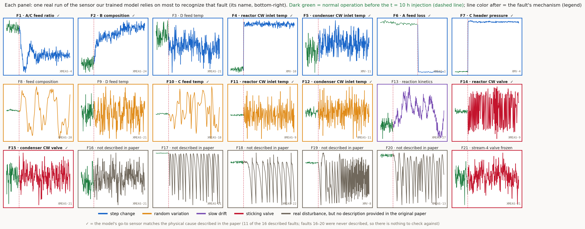{width="99%" fig-align="center" fig-alt="Twenty-one small panels, one per Tennessee Eastman fault, each showing the fault's most diagnostic process variable in one real simulation run: gray trace before the 10-hour injection point, colored after, with border colors distinguishing step, random, drift, sticking-valve, and undocumented fault types. Check marks tag the eleven faults whose designed physical cause was recovered in the champion model's top SHAP variables."}

::: notes
What a run is, and what a fault is — in the data itself. Top: generation. The simulated plant runs under closed-loop control; at t = 10 h one disturbance flag IDV(k) is activated — a physical perturbation inside the running simulation, not corrupted data; 21 fault types × 10 independently seeded batches = 210 runs of 50 hours each. Rows before onset are labeled normal from each run's OWN pre-fault window (so "normal vs fault" cannot be won by a data-format artifact); every 10th sample kept (10-minute cadence); splits are at the level of whole runs (seeds 2026/202607; 38,948 / 10,036 / 12,246 train/val/holdout samples), so evaluation is always on unseen simulations — which is why our honest number lives in the mid-0.8s while much of the literature's 99% rests on shuffled per-sample splits that leak. Bottom: every fault, in the flesh. The panel variable, in plain language: after training, ask the model "which sensor do you lean on most to recognize this fault?" — that is what each panel shows (formally, the top variable by SHAP attribution on the champion's features; that machinery stays in these notes, off the slide). This works for EVERY fault, documented or not, because it comes from the model, not the documentation. The panel plots that sensor's raw value in one real run, gray before onset; the line color after onset encodes the fault MECHANISM, not magnitude. Blue steps are trivially visible; orange random variation is partly absorbed by the controllers; the purple kinetics drift (F13) develops over hours, invisible to any snapshot; red sticking valves (F15, F21) barely move the sensors at all. The ✓ then has a clean meaning: for 11 of the 16 documented faults, the model's go-to sensor matches the physically perturbed quantity — the model learned the right physics where physics is observable. The "undocumented" faults 16–20 are real disturbances built into the simulator whose cause was never published: their signatures are just as physical (17–20 oscillate dramatically and are easy to diagnose — high F1), but with no published cause there is nothing to check a ✓ against, and fault 16's near-zero F1 cannot be attributed to a known mechanism. Check marks: for 11 of the 16 documented faults, the champion's SHAP top-3 recovers the DESIGNED physical cause (Table 4 of the writeup) — the model learned the right mechanism where one is observable, and the misses are exactly the faults whose perturbed quantity is not directly instrumented. Figure generated from the prepared dataset by deck/figs/tep/make_fault_grid.py.
:::

## The Loop's Trajectory {data-autoslide="8000"}

::: r-stack
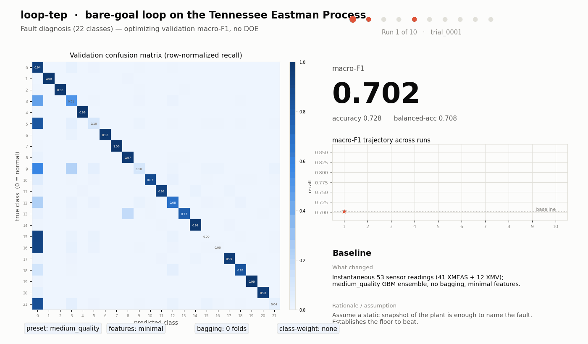{width="96%"}

{.fragment width="96%" data-autoslide="4000"}

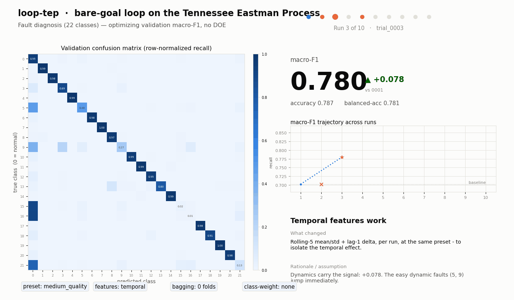{.fragment width="96%"}

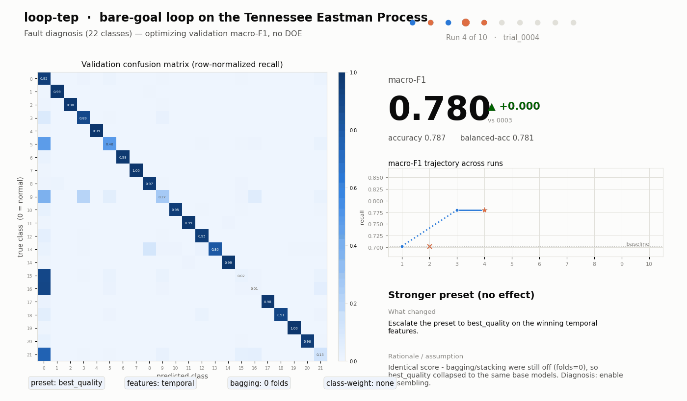{.fragment width="96%"}

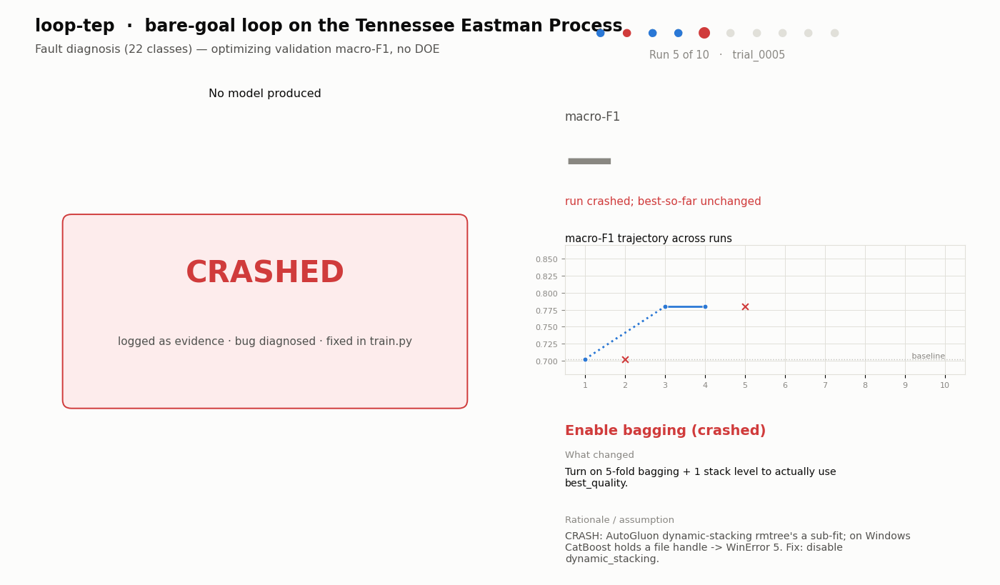{.fragment width="96%" data-autoslide="4000"}

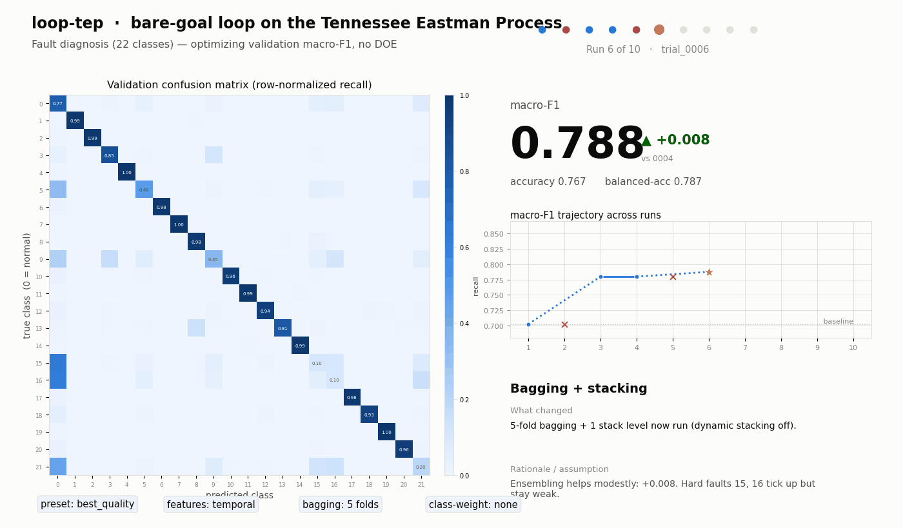{.fragment width="96%"}

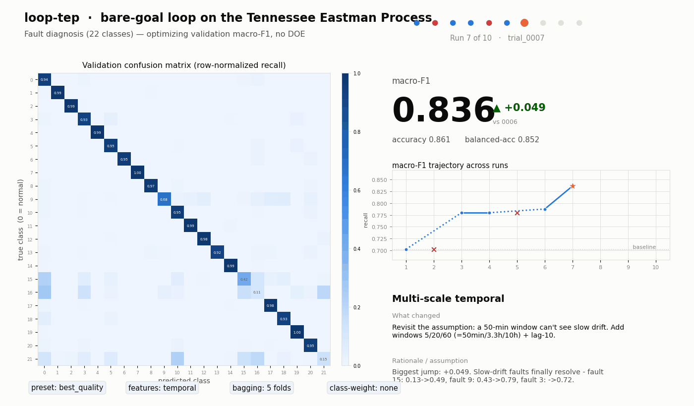{.fragment width="96%"}

{.fragment width="96%"}

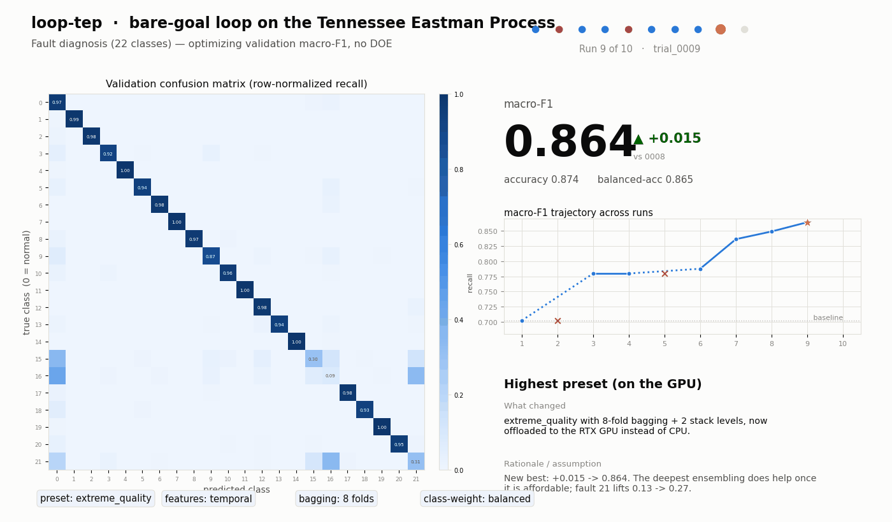{.fragment width="96%"}
:::

::: {.fragment data-autoslide="0" style="height:0; overflow:hidden;"}
:::

::: notes
Numbers to say aloud at the end: 0.702 → 0.864 validation over 10 logged runs, 0.885 on the gated holdout — and the two big jumps are physics, not tuning (temporal +0.078, multi-scale +0.049; all computational knobs together only about +0.03). Watch the run happen: each frame is one real trial — the confusion-matrix diagonal brightens, the macro-F1 counter moves, and the right panel shows the agent's own "what changed / rationale." The slide auto-advances (8 s per run, 4 s on the two crash frames; auto-slide-stoppable is off, so the timer keeps running even after key presses; the final fragment halts it). Beats to narrate: run 1 baseline 0.702 on instantaneous readings; run 2 CRASH — stale feature cache, diagnosed from the traceback and fixed; run 3 temporal features jump to 0.780; run 4 stronger preset does nothing (bagging was off — the agent found its own config bug); run 5 CRASH — Windows dynamic-stacking file-lock, fixed in train.py; run 6 bagging +0.008; run 7 multi-scale windows 0.836, the biggest jump — a 50-minute window cannot see a fault that develops over hours; run 8 class-balancing 0.849; run 9 extreme_quality on the GPU, champion 0.864. Afterwards the specialist model for the two hardest faults added nothing (run 10, not shown in the sequence), and the gated holdout — touched exactly once — scored 0.885 (it exceeds validation because the final model refits on train+validation: more data, not leakage). The two crash frames stay in the record deliberately: the loop debugged itself, and the log is honest.
:::

## What the Agent Actually Learned {.tight}

::: {.flow style="margin:0.15em 0 0.2em;"}

Observation

&rarr;

Hypothesis

&rarr;

Change

&rarr;

Trial

&rarr;

Metric

&#8635;

:::

&gt; python run_baseline.py &#45;&#45;observation "…" &#45;&#45;hypothesis "…"
&rarr;
reasoning_log.tsv · one row per trial · git-committed

the rows below are read from that log, written live during the run, not reconstructed

Hard faults show almost no signal in the instantaneous readings.

A fault is a trajectory, not an instant: add per-run temporal features.

+0.078

A 50-minute window cannot see a fault that develops over hours.

Add multi-scale windows (≈50 min · 3.3 h · 10 h) so slow drifts become explicit features.

+0.049

Only the rare post-onset faults 16 &amp; 21 stay low.

Macro-F1 weights classes equally: upweight the rare classes.

+0.013

The hard-fault specialist added nothing; the literature calls 16 &amp; 21 near-undetectable.

<b>Stop:</b> the limit is the process, not the model.

STOP → 0.885

::: {.quotecard .fragment style="max-width:70%; margin-top:0.45em;"}
"In a closed loop, a fault is a trajectory, not a snapshot."
the agent's own logged hypothesis, before run 2
:::

::: notes
The loop made visible: observation → hypothesis → change → trial → metric, around and around — and these four rows are the real thread from reasoning_log.tsv, not a reconstruction. Row 1: the agent read per-class F1, saw the hard faults flat, and hypothesized that in a closed-loop plant a fault is a trajectory — the single most valuable move of the run (+0.078). Row 2: it then reasoned about timescales — slow drifts need windows measured in hours (+0.049, the biggest jump; fault 15 went 0.13→0.49, fault 9 0.43→0.79). Row 3: metric-shaped reasoning — macro-F1 weights all classes equally, so upweight the rare ones (+0.013). Row 4: it recognized a limit — the specialist extracted nothing, the literature agrees 16 and 21 are near-undetectable, so it stopped and spent its single holdout confirmation: 0.885. The reading: the two large gains came from hypotheses about the PHYSICS; the computational levers (preset, bagging, GPU) each added little; and the loop knew when to stop. The reasoning itself is a logged artifact — --observation and --hypothesis fields on every trial — which is exactly the instrument TRIAGE proposes for judging experimental arms: not only what score they reach, but what reasoning they record along the way.
:::

## Run Budgets Across Two Autonomous Experiments {.tight}

::: {.small-text style="margin-bottom:0.1em;"}
The same harness pattern with two different `program.md` contracts, on two very different problems. Shown here for the **run-budget contrast**:
:::

Tennessee Eastman · manufacturing fault diagnosis

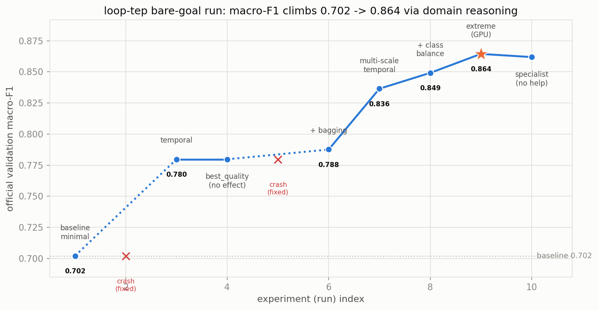

<b>10 runs</b> · macro-F1 0.702 → 0.864 (<b>+0.16</b>) · gains from <b>physics hypotheses</b> · ceiling: process observability

SRTR heart transplant · 10-yr graft-failure prediction

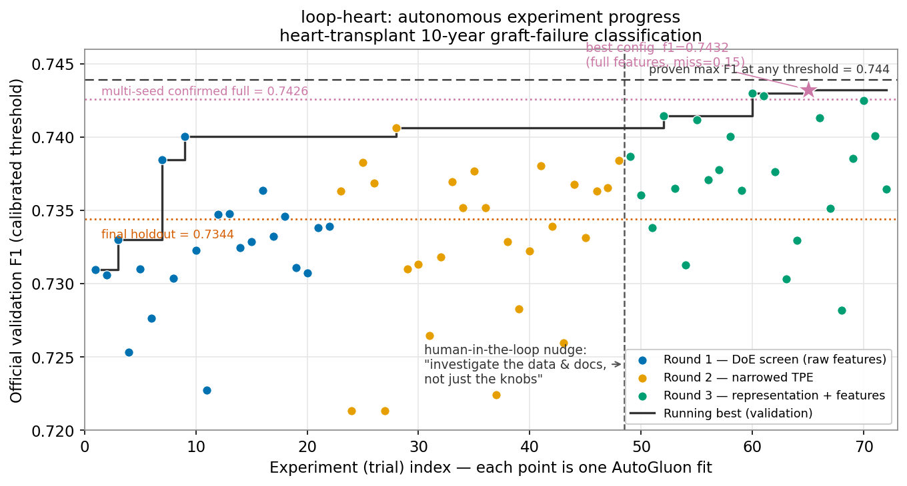

<b>72 runs</b> · F1 ≈ 0.740 → 0.7426 (<b>+0.005</b>) · gains from <b>data-representation discovery</b> · ceiling: feature discrimination

::: {.note .fragment style="font-size:0.66em; margin-top:0.35em;"}
One pattern, wildly different run budgets and gain profiles: **run-efficiency is the scarce resource**.
:::

::: notes
Our second, parallel experiment — included not for MSI relevance but for the CONTRAST in experimental economics. Left: TEP — ten runs, +0.16 macro-F1, every large gain a physics hypothesis (temporal, multi-scale), and a ceiling set by process observability (faults 16 and 21 are near-unobservable in closed loop — the decades-old finding; the agent resolved 3 and 9, lifted 15, and stopped where the process, not the model, sets the limit). Right: the SRTR/UNOS heart-transplant registry, 1985–March 2026 — seventy-two runs for +0.005 F1, where the only real gain came from a data-representation discovery (54 miscoded categorical columns) unlocked by a one-sentence human nudge, and the ceiling is the discrimination content of pre-transplant features (an external 0.85 claim was audited and proven unreachable — max F1 at any threshold 0.744). Two extremes: cheap-run/large-gain vs expensive-run/small-gain; hypothesis-rich vs representation-bound. What both share: the run budget is the binding constraint. Ten runs or seventy-two, every run costs compute or time — run-efficiency is exactly what design of experiments was invented to buy. TEP validation detail if asked: SHAP fingerprints recover the designed cause in the top-3 for 11 of 16 documented faults; SHAP, EBM, and gain importance agree; misses are exactly the faults whose perturbed quantity is not instrumented.
:::

## The Fundamental Hypothesis {.tight}

If science is becoming an automated <b>propose → run → evaluate</b> loop (<a href="https://www.discoveryloop.com/">Discovery Loop's own words</a>, and <a href="https://x.com/JeffDean/status/2085035498222002595/photo/1">the first slide of their pitch deck</a>, right), then the statistical question is:

<svg class="hyposvg" viewBox="0 0 940 300" width="54%" style="display:block; margin:0 auto;" role="img" aria-label="Two stylized search trajectories over a response surface: a gray greedy one-change-at-a-time path that plateaus at a local maximum and keeps spending runs along the flat, and a red DOE-structured path that screens, estimates effects, and reaches a higher optimum in fewer steps.">
<path class="land" d="M20,270 C 120,240 180,180 260,185 C 330,190 360,225 430,215 C 520,200 560,90 680,70 C 780,55 860,45 920,40"/>
<g class="fragment" data-fragment-index="1">
<path class="greedy" d="M30,268 L90,255 L110,258 L170,225 L200,228 L250,200 L290,203 L340,198 L390,200 L430,196"/>
<circle cx="430" cy="196" r="7" fill="#70685c"/>
<path class="greedy" style="stroke-dasharray:5 6; opacity:0.55;" d="M437,196 L700,193"/>
<text class="hlabel" x="452" y="160" fill="#70685c">greedy loop</text>
<text class="hsub" x="452" y="178">one change at a time · plateaus at a local maximum</text>
<text class="hsub" x="706" y="199">runs spent past the plateau</text>
</g>
<g class="fragment" data-fragment-index="2">
<path class="doe" d="M30,268 C 100,250 150,235 230,210 C 330,180 430,150 560,110 C 640,88 700,75 760,62"/>
<circle cx="760" cy="62" r="8" fill="#c3142d"/>
<text class="hlabel" x="440" y="70" fill="#c3142d">DOE-structured loop?</text>
<text class="hsub" x="440" y="90">screen → estimate effects → exploit</text>
</g>
</svg>

::: {.contract style="max-width:92%; gap:0.32em;"}

LEARN FASTER

Reach the <b>same solution in fewer runs</b>: run-efficiency, the scarce resource on the previous slide.

REACH HIGHER

Escape the <b>local maxima</b> that greedy one-change-at-a-time loops settle into: the interactions a factorial design sees and a greedy walk cannot.

KNOW WHEN TO STOP

End the search on <b>evidence, not intuition</b>: the heart-transplant loop spent <b>72 runs for +0.005</b>. Sequential stopping rules make "done" a calculation, not a feeling.

:::

::: notes
The synthesis slide — in Discovery Loop's own propose/run/evaluate vocabulary, because that legitimizes the premise: automated science is arriving whether or not it is statistically well-designed. Our fundamental hypothesis has three parts, each with a century of statistics behind it. (a) LEARN FASTER: reach the same solution in fewer runs — runs are the scarce resource at both extremes we just showed. (b) REACH HIGHER: greedy one-change-at-a-time search provably cannot see interactions; the heart-transplant synergy was exactly this — two changes that each hurt alone and only helped together, invisible to any greedy walk, visible to a factorial design. (c) KNOW WHEN TO STOP: the heart-transplant loop spent 72 runs for +0.005 — its later rounds bought practically nothing — and TEP's stop rule was the informal "stop when improvements dry up"; sequential analysis (Wald's sequential tests; the group-sequential and futility rules that govern clinical trials) makes stopping a calculation, and the loop's own 0.744-ceiling audit was in fact a futility argument, made ad hoc — TRIAGE makes it by design. The dashed gray tail in the sketch is that third hypothesis: runs spent past the plateau. The sketch is stylized, not data. This is the hypothesis the TRIAGE proposal turns into aims — next section.
:::

## The TRIAGE Proposal {.inverse .center}

**From two pilot loops to a research program**

::: notes
Final section: the study design that turns the hypothesis into an experiment, the three aims, where it sits in the MSI portfolio, and what we are asking today.
:::

## The Study Design: Two Arms, One Contract {.tight}

SHARED CONTRACT

One frozen <code>program.md</code> per problem: objective · evaluation · mutable surface. The arms differ in exactly one thing: the <b>guidance</b>.

ARM A · BARE GOAL (control)
the run you just watched

form <b>one hypothesis</b>
change <b>one thing</b> · run a trial
keep only if the metric <b>improves</b>
stop when improvements dry up (<b>informal</b>)

ARM B · DOE-GUIDED (treatment)
classical and modern experimental design as structured guidance

screen factors and optimize <b>in one designed batch</b> (OMARS designs)
estimate main effects <b>independently</b>, plus interactions and curvature
allocate follow-up runs <b>adaptively</b> (multi-armed bandits)
stop by a <b>principled sequential rule</b> (best-arm identification)

MEASURED

<b>Runs</b> to reach a given solution · <b>quality</b> of the final solution · <b>transferable knowledge</b>, read from the logged reasoning and tested by warm-starting new problems.

::: footnote
OMARS designs combine factor screening and response-surface optimization in a single experiment ([Goos, *WIREs Computational Statistics*, 2025](https://doi.org/10.1002/wics.70018)); multi-armed bandits provide adaptive run allocation and stopping with statistical guarantees ([Slivkins, *Introduction to Multi-Armed Bandits*, 2019](https://arxiv.org/abs/1904.07272)).
:::

::: notes
The experiment ON the loops. Same agent, same harness, same frozen evaluation contract; the arms differ only in the guidance section of program.md. Arm A is exactly what you watched: one hypothesis, one change, keep-if-better, informal stopping. Arm B hands the agent both classical AND modern experimental design, and the two named instruments are chosen deliberately. OMARS designs (orthogonal minimally aliased response surface designs; Goos's 2025 WIREs review) bridge definitive screening designs and classical response-surface designs: one designed batch estimates all main effects independently WHILE detecting two-factor interactions and curvature, collapsing the traditional two-step screen-then-optimize sequence into a single experiment — which is precisely the learn-faster hypothesis (fewer runs to the same knowledge), and the interaction/curvature detection is the reach-higher hypothesis (the effects a greedy walk cannot see; the heart-transplant synergy was exactly such an interaction). Multi-armed bandits (Slivkins's textbook treatment) are the sequential complement: where OMARS structures the batch, bandits structure the sequence — adaptive allocation concentrates the remaining run budget on promising configurations instead of spreading it evenly, and best-arm identification provides stopping criteria with statistical guarantees, which is the know-when-to-stop hypothesis made operational (fixing both TEP's informal stop and the heart loop's 72-runs-for-+0.005). We measure three things, deliberately understated in a single band: run-efficiency, solution quality, and transferable knowledge — the last read from the logged reasoning you saw and tested by warm-starting new problems. The TEP section was, deliberately, Arm A's dry run: the control condition already exists and this deck is its lab notebook.
:::

## Three Aims {.tight}

::: phasegrid
::: {.phase .fragment}
[Aim 1]{.pnum}[Within-problem gains]{.ptitle}

- Bare-goal vs. DOE-guided on **simulations with known ground truth**
- Domains: process monitoring (TEP), predictive maintenance, production optimization
- Evidence in hand: the **TEP control arm you just saw**
:::
::: {.phase .fragment}
[Aim 2]{.pnum}[Transferable knowledge]{.ptitle}

- **Warm-start** vs. cold-start agents on new problems
- Compare agent-reported effects to **true simulated effects**
- Instrument in hand: the **logged reasoning thread**
:::
::: {.phase .fragment}
[Aim 3]{.pnum}[Sim-to-real]{.ptitle}

- One **physical manufacturing task** (3-D bin packing, robotic assembly)
- First honest step at the **sim-to-real gap** for agentic experimentation
:::
:::

::: {.note .fragment}
Everything ships as **open community infrastructure**: harnesses, `program.md` templates, and benchmarks others can run.
:::

::: notes
The aims, each anchored to something already shown. Aim 1: in simulation we know the true effects, so we can score whether DOE guidance improved the agent's INFERENCES, not just its final metric; the TEP bare-goal run is the control condition, already logged, committed, and written up. Aim 2 is the question black-box tuners cannot even pose: does the knowledge the loop accumulates transfer? We compare warm-started to cold-started agents and compare the effects the agent REPORTS to the effects we BUILT into the simulators; the reasoning log you saw is the measurement instrument. Aim 3 takes the approach to one physical task, deliberately scoped as a first step at the sim-to-real gap. And everything releases openly, which is both broader impact and MSI's generalizable-principles criterion.
:::

## Where TRIAGE Sits in the MSI Portfolio {.tight}

<a href="https://www.nsf.gov/awardsearch/showAward?AWD_ID=2627331">NSF 2627331</a>starts 9/2026
Collaborative Sequential Experimentation for Bio-Additive Manufacturing Systems
Costly trials + sequential experimental design: the portfolio's nearest neighbor to <b>DOE in the loop</b>.

<a href="https://www.nsf.gov/awardsearch/showAward?AWD_ID=2618912">NSF 2618912</a>starts 9/2026
Self-Learning Digital Twins for Robotic Remanufacturing under Uncertainty
<b>Loops that learn</b> on digital twins of manufacturing systems.

<a href="https://www.nsf.gov/awardsearch/showAward?AWD_ID=2517645">NSF 2517645</a>started 9/2025
Improving Zero-Shot Learning of Manufacturing Anomalies by Leveraging Textual Sources
<b>Language models meet fault detection</b>, the TEP problem's close kin.

<a href="https://www.nsf.gov/awardsearch/showAward?AWD_ID=2627490">NSF 2627490</a>starts 1/2027
Trustworthy Model Adaptation for Manufacturing Process Certification under Corrupted Data
<b>Trustworthiness of manufacturing AI</b>, the T in TRIAGE.

::: {.quotecard .fragment style="max-width:92%; margin:0.3em auto 0.2em; padding:0.3em 0.9em; font-size:0.84em;"}
"…manufacturing systems that are data-driven, adaptive, and capable of <b style="font-style:normal;">continuous self-improvement</b>" · "those decisions must be <b style="font-style:normal;">explainable and auditable</b>"
[Terpenny & Wei, *AI-Driven Smart Manufacturing*, Digital Engineering, 2026](https://doi.org/10.1016/j.dte.2026.100128) — the loop is the self-improvement; the logged, audited reasoning is the explainability
:::

::: {.note .fragment style="font-size:0.6em; margin-top:0.2em; padding:0.3em 0.85em;"}
**No current award makes the agentic experiment loop itself the object of statistical design.** TRIAGE examines this new frontier.
:::

::: notes
The quote is from the program director's own recent editorial with Yupeng Wei in Digital Engineering (June 2026), "AI-Driven Smart Manufacturing" — its conclusion calls for manufacturing systems "capable of continuous self-improvement," and its ethics section insists that when algorithms set process parameters or maintenance schedules, "those decisions must be explainable and auditable." TRIAGE answers both calls directly: the loop IS continuous self-improvement made statistical, and the logged reasoning thread plus the 0.85-claim audit are exactly the explainable-and-auditable discipline the editorial demands. The editorial also names the trustworthiness/black-box challenge and workforce readiness as the field's key hurdles — both worth echoing verbally. We read the program's current portfolio. Four funded awards are close kin, and we mean that as a feature: sequential experimentation for bio-additive manufacturing is the nearest neighbor (costly trials, designed sequences); the self-learning digital twin awards are loops that learn; the zero-shot anomaly award brings language models to fault detection; and the newest award in the portfolio is about trustworthy manufacturing AI. TRIAGE complements rather than duplicates: every one of those projects treats the AI or the twin as the object; none makes the experiment loop itself the object of statistical design, which is precisely our contribution. Portfolio context for calibration (verbal only): about fifty active research awards, single-institution awards typically $200k to $690k with most $250k to $600k, collaborative pairs totaling roughly $450k to $550k. We would also welcome an introduction to the sequential-experimentation team if you see synergy.
:::

## What We Heard, and What We Are Asking {.tight}

YOUR GUIDANCE, TAKEN
<ul>
<li>✓ We are developing a <b>full proposal to MSI</b>, per your recommendation</li>
<li>✓ Timed to the cycle: <b>reviewed now, funded after the next budget</b></li>
<li>✓ A six-person, two-institution team <b>sized for a full award</b>, with an <b>industry advisory board</b>: Aurora Insights · YMMC · EY · Porsche Ventures</li>
</ul>

TODAY'S QUESTIONS
<ul>
<li>Are the three aims <b>right-sized</b> for a standard MSI award?</li>
<li><b>Timeliness:</b> the field moves in weeks; review plus award runs many months. Beyond our advisory board keeping the work industry-current, how would you advise us to <b>protect currentness</b> through the cycle?</li>
<li>Are there <b>DCLs or other non-standard mechanisms</b> with a quicker turnaround than a standard submission that we should watch?</li>
</ul>

::: timeline

Aug 12, 2026This briefing

&rarr;

Fall 2026Full proposal to MSI

&rarr;

Review cyclePanel review

&rarr;

Post-budgetAward window

:::

::: notes
Framed to show her email was read carefully. Left: guidance taken — full MSI proposal (we are not pursuing the small exploratory mechanism she declined; if it comes up, her own portfolio shows the shift: the last such award started October 2024); we understand the fiscal-year reality that proposals are reviewed now and funding follows the next budget, likely October, and our fall submission fits that cadence; and the team is sized for a full award AND extended by an industry advisory board — professionals from Aurora Insights, YMMC (Yamaha Motor Manufacturing), EY, and Porsche Ventures have agreed to advisory roles, which keeps our problems, benchmarks, and priorities industry-current. Right, the three questions. One: scope calibration against the portfolio norms (verbal: single-institution typically $250–600k, collaborative pairs ≈$500k; we are thinking a standard-size request with the UGA subaward). Two, the timeliness worry, phrased as a question rather than a complaint: this deck's opening slide is about a company founded ONE WEEK before this meeting, and the loop-engineering discourse itself is eight weeks old; a normal review-plus-award cycle is many months on top of the post-budget funding reality she named, so we genuinely want her advice on protecting currentness — the advisory board is our own mitigation (it continuously refreshes what "current" means from the industry side), and we ask what else she recommends. Three: are there Dear Colleague Letters, supplements, workshop mechanisms, or other non-standard vehicles with faster turnaround that we should watch — asked as a genuine question about what exists, not a request to bypass review. Backup questions if time allows: which aim she expects to resonate most in panel review; single-with-subaward versus collaborative submissions; portfolio coordination, especially with the sequential-experimentation bio-AM team. Leave most of the meeting time on this slide.
:::

## Thank You {.tight}

**TRIAGE** · Trustworthy Run-efficient Investigation of Agentic Guided Experiments

::: columns
::: {.column width="58%"}
- **Contact:** [fmegahed@miamioh.edu](mailto:fmegahed@miamioh.edu)
- **This deck:** <a href="https://fmegahed.github.io/talks/nsf/msi2026/loopengineering/" style="font-size:0.82em; word-break:break-all;">fmegahed.github.io/talks/nsf/msi2026/loopengineering</a>
- **Writeups on request:** the TEP experiment and the heart-transplant experiment
- **Next:** full proposal to MSI · fall 2026
- **Team:**

<ul style="display:grid; grid-template-rows:repeat(3, auto); grid-auto-flow:column; gap:0.12em 2.6em; justify-content:start; font-size:0.8em; margin:0.1em 0 0 2.2em; padding:0;">
<li><a href="https://scholar.google.com/citations?user=6CTlKGMAAAAJ">Fadel Megahed</a></li>
<li><a href="https://scholar.google.com/citations?user=egqSi4sAAAAJ">Allison Jones-Farmer</a></li>
<li><a href="https://scholar.google.com/citations?user=lWLdqsAAAAAJ">Arthur Carvalho</a></li>
<li><a href="https://scholar.google.com/citations?user=XtuMDGYAAAAJ">Ibrahim Yousif</a></li>
<li><a href="https://scholar.google.com/citations?user=WXIZS38AAAAJ">Maria Weese</a></li>
<li><a href="https://scholar.google.com/citations?user=IOX-e6wAAAAJ">Hongyue Sun</a></li>
</ul>
:::
::: {.column width="4%"}
:::
::: {.column width="38%"}
{width="60%" fig-align="center" fig-alt="QR code linking to this deck online"}

::: {.small-text .center style="font-size:0.5em;"}
Miami University · University of Georgia
:::
:::
:::

::: notes
Close by thanking her for the earlier guidance and for the meeting itself, restate the fall submission plan, and offer both writeups as follow-up material. The deck stays online at the printed link and QR so it can be forwarded within NSF.
:::
