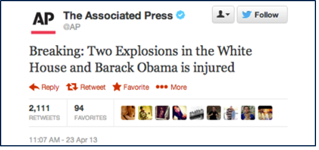
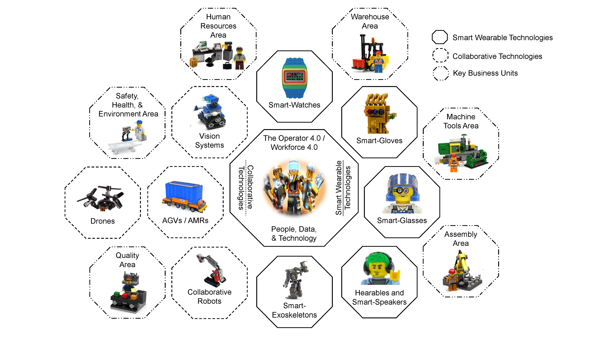
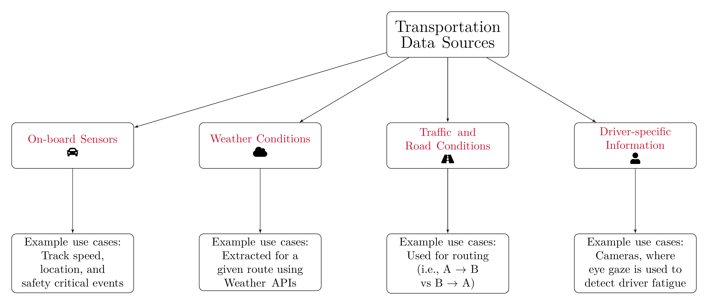
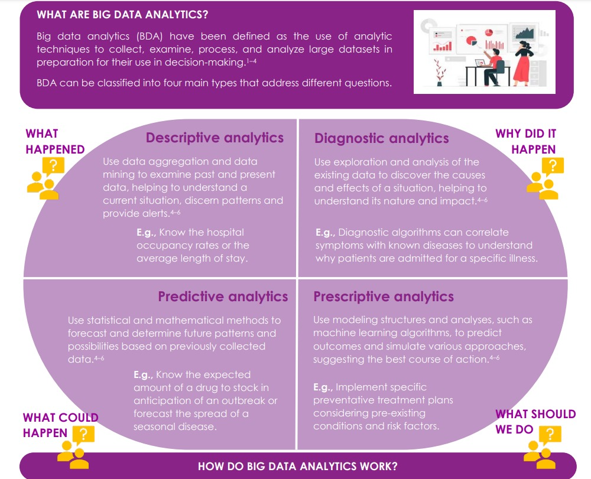
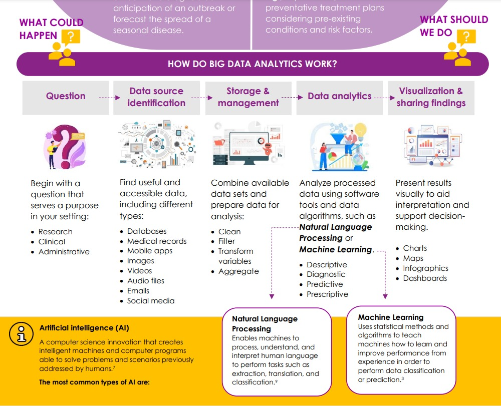

```{r setup, include=FALSE}
knitr::opts_chunk$set(cache = TRUE,
                      echo = TRUE,
                      warning = FALSE,
                      message = FALSE,
                      progress = FALSE, 
                      verbose = FALSE,
                      dev = 'png',
                      fig.height = 3,
                      dpi = 300,
                      fig.align = 'center')

options(htmltools.dir.version = FALSE)


miamired = '#C3142D'

if(require(pacman)==FALSE) install.packages("pacman")
if(require(devtools)==FALSE) install.packages("devtools")
if(require(countdown)==FALSE) devtools::install_github("gadenbuie/countdown")
if(require(xaringanExtra)==FALSE) devtools::install_github("gadenbuie/xaringanExtra")
if(require(emo)==FALSE) devtools::install_github("hadley/emo")
if(require(icons)==FALSE) devtools::install_github("mitchelloharawild/icons")

pacman::p_load(tidyverse, magrittr, lubridate, janitor, # data analysis pkgs
               DataExplorer, scales, plotly, calendR, pdftools, # plots
               tmap, sf, urbnmapr, tigris, # maps
               bibliometrix, # for bibliometric analysis of my papers
               gifski, av, gganimate, ggtext, glue, extrafont, # for animations
               emojifont, emo, RefManageR, xaringanExtra, countdown) # for
```

```{r xaringan-themer, include=FALSE, warning=FALSE}
if(require(xaringanthemer) == FALSE) install.packages("xaringanthemer")
library(xaringanthemer)

style_mono_accent(base_color = "#84d6d3",
                  base_font_size = "20px")

xaringanExtra::use_extra_styles(
  hover_code_line = TRUE,         
  mute_unhighlighted_code = TRUE  
)

xaringanExtra::use_xaringan_extra(c("tile_view", "animate_css", "tachyons", "panelset", "share_again", "search", "fit_screen", "editable", "clipboard"))

```


# About Me – My route to Miami University

.font80[
- Application of data-driven decisions (D3) in 3 continents.  

- **Interests:** Applications in logistics, manufacturing, occupational safety & portfolios.  

- **Collaborations with:** Aflac, GE Research, Gore, Hilton, IBM Research, & Tennibot
]

```{r my_map, echo=FALSE, out.width='100%', fig.alt="My journey with data driven decisions.", fig.align='center', fig.cap='My journey with data-driven decision making.'}
# animated map based on the excellent blog by: Shannon Pileggi
# https://www.pipinghotdata.com/posts/2021-02-15-gganimating-a-geographic-introduction/

residence = tribble(
  ~city,           ~state,  ~lat,   ~long, ~years, ~description,
  "Cairo",         "Egypt", 30.0444,  31.2357,  20,    "Childhood and <br> Undergrad at the <br> American University in Cairo (AUC)",
  "Aachen",      "Germany", 50.7753,  6.083611,   0.33,    "Undergraduate Research Assistant <br> at RWTH Aachen",
  "Cairo",         "Egypt", 30.0444,  31.2357,  1,    "Finishing up my Undergrad <br> at AUC",
  "Blacksburg", "Virginia", 37.2296, -80.4139,   4,    "MS and PhD in <br> Industrial & Systems Engineering (ISE) <br> Graduate Research Assistant and <br> Instructor",
  "Auburn",    "Alabama", 32.6099,  -85.4808, 4,    "Assistant Professor of <br> Industrial and Systems Engineering <br> Auburn University",
  "Oxford",      "Ohio", 39.5070,  -84.7452,   7,    "Assistant-Associate Professor of <br> Business Analytics <br> Farmer School of Business <br> Miami University"
) 


residence_connections_prelim <- residence |> 
  mutate(
    # need this to create transition state ----
    city_order = row_number() + 1,
    # where I moved to next, for curved arrows ----
    lat_next = lead(lat),
    long_next = lead(long),
    # label to show in plot, styled using ggtext ---
    label = glue::glue("**{city}, {state}** ({years} yrs)<br>*{description}*"),
    # label of next location ----
    label_next = lead(label)
  ) 


residence_connections <- residence_connections_prelim |>
  # get first row of residence ----
slice(1) |> 
  # manually modify for plotting ----
mutate(
  city_order = 1,
  label_next = label,
  lat_next = lat,
  long_next = long,
) |> 
  # combine with all other residences ----
bind_rows(residence_connections_prelim) |> 
  # last (7th) row irrelevant ----
slice(1:6) |> 
  # keep what we neeed ----
dplyr::select(city_order, lat, long, lat_next, long_next, label_next)


world_map =  ggplot2::map_data("world") |> 
  filter(region != 'Antarctica' &
           lat >0 & lat <70 &
           long <50 & long > -130)

base_map <- ggplot() +
  # plot states ----
geom_polygon(
  data = world_map,
  aes(
    x     = long, 
    y     = lat, 
    group = group
  ),
  fill  = "#F2F2F2",
  color = "white"
) +
  # lines for pins ----
geom_segment(
  data = residence,
  aes(
    x    = long,
    xend = long,
    y    = lat,
    yend = lat + 2
  ),
  color = "#181818",
  size = 1
) +
  # pin heads, a bit above actual location, color with R ladies lighter purple ----
geom_point(
  data = residence,
  aes(
    x = long, 
    y = lat + 0.5
  ),
  size = 1,
  color = "#88398A"
) +
  theme_void()


anim <- base_map +
  # show arrows connecting residences ----
geom_curve(
  # do not include 1st residence in arrows as no arrow is intended ----
  # and inclusion messes up transition ---
  data = residence_connections |> slice(-1),
  # add slight adjustment to arrow positioning ----
  aes(
    y     = lat - 0.1,
    x     = long,
    yend  = lat_next - 0.2,
    xend  = long_next,
    # group is used to create the transition ----
    group = seq_along(city_order)
  ),
  color = "#181818",
  curvature = -0.5,
  arrow = arrow(length = unit(0.02, "npc")),
  size  = 0.2
) +
  # add in labels for pins, with inward positioning ----
# show labels either top left or top right of pin ----
geom_richtext(
  data = residence_connections,
  aes(
    x     = ifelse(long_next < 0, long_next + 1, long_next - 1),
    y     = lat_next + 5,
    label = label_next,
    vjust = "top",
    hjust = ifelse(long_next < -80, 0, 1),
    # group is used to create the transition ----
    group = seq_along(city_order)
  ),
  size = 2,
  label.colour = "white",
  color = "#C3142D"
) +
  # title determined by group value in transition ----
ggtitle("Home {closest_state} of 6") +
  # create animation ----
transition_states(
  city_order,
  transition_length = 2,
  state_length = 5
) +
  # style title ----
theme(
  plot.title = element_text(
    color = "#C3142D",
    family = "Permanent Marker",
    size = 12
  )
)

anim
```


---

# About Miami University

<center>
<iframe width="840" height="472" src="https://www.youtube.com/embed/l-l_FUVvyBo" title="YouTube video player" frameborder="0" allow="accelerometer; autoplay; clipboard-write; encrypted-media; gyroscope; picture-in-picture; web-share" allowfullscreen></iframe>
</center>


---

# Learning Objectives for Today's Class

- Define **big data**, describe its **evolution**, and explain its importance.  

- Provid examples of **big data sources.**  

- Describe the **main steps and technologies/tools used** in **big data analytics**.   

- Discuss the various **applications of big data analytics in different business sectors**.  

- Discuss **future trends in big data**. 


---
class: inverse, center, middle

# What is Big Data?


---

# Big Data: A Working Defintion

Big data is used to describe the **large**, **diverse**, **complex** and/or **longitudinal datasets** generated from **a variety of instruments, sensors and/or computer-based transactions.**

```{r big_data_v, echo=FALSE}
big_data_df = tibble::tibble(
  vol = c(2, 5, 6.50, 9, 12.50, 15.50, 18, 26, 33, 41, 64.20, 79, 97, 120, 147, 181),
  year = 2010:2025
)

big_data_df |> 
  ggplot2::ggplot(
    ggplot2::aes(
      x = year, y = vol, label = vol
    )
  ) +
  ggplot2::geom_point(size = 2) +
  ggplot2::geom_line() +
  ggplot2::theme_bw(base_size = 12) +
  # ggplot2::theme(
  #   plot.background = ggplot2::element_rect(color = "black"),
  #   legend.title = ggplot2::element_text(),
  #   legend.position = 'bottom',
  #   plot.margin = ggplot2::unit(c(0.1, 0.2, 0.1, 0.1), 'cm'),
  #   plot.title = ggplot2::element_text(hjust = 0.5, face="bold"),
  #   plot.subtitle = ggtext::element_markdown(hjust = 0.5, lineheight = 1.5),
  #   # axis.title.y= ggplot2::element_blank(),
  #   # axis.ticks.y= ggplot2::element_blank(),
  #   # axis.ticks.x = ggplot2::element_blank(),
  #   axis.text.x= ggplot2::element_text(face = 'bold'),
  #   axis.title.x= ggplot2::element_text(face = 'bold'),
  #   # axis.text.y= ggplot2::element_blank(),
  #   panel.grid.major = ggplot2::element_blank(),
  #   panel.grid.minor = ggplot2::element_blank()
  # ) +
  ggplot2::scale_x_continuous(breaks = scales::pretty_breaks(n = 15)) +
  ggplot2::scale_y_continuous(breaks = scales::pretty_breaks(n = 6), limits = c(0, max(big_data_df$vol + 30))) +
  ggplot2::labs(
    x = 'Year', y = 'Data Volume (Zeta Bytes)', caption = 'Credits: Created by Fadel M. Megahed | Data Source: Statistica', 
    title = 'Exponential Growth in Data Generated',
    subtitle = 'Most of the data that exists in the world today was generated within the past five years. Note that the values for 2018-2025 are forecasted by Statistica.'
  ) +
  ggplot2::geom_ribbon(
    ggplot2::aes(xmin = 2018, xmax = 2025), fill = miamired, alpha = 0.2) +
  ggplot2::geom_segment(x = 2018, y = 150, xend = 2019, yend = 150, size = 1,
                        color = miamired,
                        arrow = ggplot2::arrow(length = ggplot2::unit(0.03, "npc"))) +
  ggplot2::geom_text(y = 152, x = 2020.15, label = 'Forecast', color = miamired) +
  ggplot2::geom_text(hjust=0, vjust=-1)

```

---

# Big Data: The Three Vs

The term big data refers not only to the size or **volume** of data, but also to the **variety** of data and the **velocity** or speed of data accrual.


```{r internet_min_stats, echo=FALSE}
internet_min = 
  tibble::tibble(
    activity = c('Emails', 'Google Searches', 'Snaps', 'Facebook Content', 'Tinder Swipes', 'Tweets Shared'),
    amount = c(231400000, 5900000, 2430000,	1700000, 1100000, 347200)
  )

internet_min |> 
  ggplot2::ggplot(ggplot2::aes(x = amount, y = fct_reorder(activity, amount), label = scales::comma(amount)),
                  ) +
  ggplot2::geom_bar(stat = 'identity', fill = miamired) +
  ggplot2::theme_bw(base_size = 12) +
  ggplot2::labs(
    x = 'Amount of Activity', y = '', caption = 'Credits: Created by Fadel M. Megahed | Data Source: Statistica', 
    title = 'Media usage in an internet minute as of April 2022',
    subtitle = 'The volume and velocity of data generated are very large!!!'
  ) +
  ggplot2::geom_text(hjust=-0.1, vjust=0) +
  ggplot2::scale_x_continuous(limits = c(0, 301400000), breaks = scales::pretty_breaks(n = 6))
  
```


---

# Big Data: Beyond the 3 Vs

- The term big data refers not only to the size or **volume** of data, but also to the **variety** of data and the **velocity** or speed of data accrual.

- Other **V’s** important to big data problems are:  
  + **Veracity:** Trustworthiness of the data  
  + **Value:** Added value to creating knowledge in a topic  

- Both veracity and value relate to *data quality*

.pull-left[
```{r ap_hack, echo=FALSE, out.width='90%', fig.align='center'}

```
]

.pull-right[
- The **infamous** hacking of the AP account and the associated fake tweet.  
- The tweet caused the U.S. Dow Jones Index to drop momentarily by 140 points.
]


.footnote[
<html>
<hr>
</html> 

**Note:** Some sources also include **visualization** and **variability**, but as in **veracity** and **value** they are **NOT** specific to **big data**. See [Megahed & Jones-Farmer 2013](https://citeseerx.ist.psu.edu/document?repid=rep1&type=pdf&doi=ab40f392e653b7336cbebf7c4fb95d3988748282) for a detailed discussion.
]

---

# The Evolution of Big Data

```{r df_figure, echo=FALSE}
df = read_csv('big_data_evolution.csv') |>
  mutate(
    Date = mdy(Date),
    Year = year(Date),
    Month = month(Date),
    Group = factor(x = Group, 
                   levels = c('Pre-internet', 'Internet-age', 'Big Data', 'Big Models'))
    ) |>
  arrange(Date) |>
  mutate(position = rep(c(0.5, -.5, 1, -1),3),
         position2 = rep(c(0.6, -.6, 1.1, -1.1),3))

df |>
  ggplot(aes(x = Date, y = 0, label = `Event`, col = Group)) + 
  geom_point(aes(y=0), size=3) + 
  scale_color_brewer(palette = 'Dark2') +
  theme_minimal(base_size = 10) +
  geom_hline(yintercept=0, 
             color = "black", size=0.3) +
  theme(axis.line.y=element_blank(),
        axis.text.y=element_blank(),
        axis.title.x=element_blank(),
        axis.title.y=element_blank(),
        axis.ticks.y=element_blank(),
        axis.ticks.x =element_blank(),
        axis.line.x =element_blank(),
        plot.background = element_rect(color = "black", size = 0.5),
        legend.title = element_text(size=8),
        legend.position = 'bottom',
        plot.margin = unit(c(0.1, 0.2, 0.1, 0.1), 'cm'),
        plot.title = element_text(hjust = 0.5, face="bold")
  ) +
  geom_text(aes(y = position2), size = 2) +
  geom_segment(aes(y = position, yend=0, xend = Date), size = 1) +
  scale_x_date(breaks = scales::pretty_breaks(n=10), limits = c(ymd('1959-01-01'), ymd('2022-12-31'))) +
  labs(caption = 'Credits: Created by Fadel M. Megahed | Data Sources: Numerous Web Sites',
       title = 'The road to big data and big models')
```


---
class: inverse, center, middle

# A Tour of Big Data Sources

### Examples from the Manufacturing and Transportation Industries

### and

### a discussion of the Healthcare/Medical Industry

---

# An Operator-Focused Manufacturing Example

```{r operator40, echo=FALSE, out.width='84%'}

```

.footnote[
<html>
<hr>
</html> 

**Source:** Figure is from D. Romero, T. Wuest, M. Keepers, L. A. Cavuoto, and **F. M. Megahed**, “Smart Wearable and Collaborative Technologies for the Operator 4.0 in the Present and Post-COVID Digital Manufacturing Worlds,” Smart and Sustainable Manufacturing Systems 5, no. 1 (2021): 148–166.
https://doi.org/10.1520/SSMS20200084.
]


---

# A Transportation Industry Example

```{r transportation, echo=FALSE, out.width='84%', results='hide'}
tinytex::xelatex('transportation_sensors.tex')
Sys.sleep(1)
pdftools::pdf_convert('transportation_sensors.pdf', dpi = 600,
                      filenames = 'transportation_sensors.png') 
```

```{r transportation1, echo=FALSE, out.width='100%'}
 
```

.footnote[
<html>
<hr>
</html> 

**Note:** Flow chart informed by our safe-routing informed research with one of the largest trucking companies in the U.S.
]

---

`r countdown(minutes = 2, seconds = 0, top = 0, font_size = "2em")`

<div style='position: relative; padding-bottom: 56.25%; padding-top: 35px; height: 0; overflow: hidden;'><iframe sandbox='allow-scripts allow-same-origin allow-presentation' allowfullscreen='true' allowtransparency='true' frameborder='0' height='415' src='https://www.mentimeter.com/app/presentation/al12resike2gn4zhrpu24tq2119tevq5/embed' style='position: absolute; top: 0; left: 0; width: 100%; height: 100%;' width='420'></iframe></div>


---

class: inverse, center, middle

# What is Big Data Analytics About?


---

# Steps in Big (and Small) Data Analytics

```{r bigdatstep1, echo=FALSE, out.width='57%'}
 
```

.footnote[
<html>
<hr>
</html> 

**Image Source:** The image is part of an infographic created by Canada's National Collaborating Centre for Infectious Diseases, see <https://nccid.ca/wp-content/uploads/sites/2/2023/04/Big-data_Analytics_Apr2023.pdf>.
]


---
count: false

# Steps in Big (and Small) Data Analytics

```{r bigdatstep2, echo=FALSE, out.width='57%'}
 
```

.footnote[
<html>
<hr>
</html> 

**Image Source:** The image is part of an infographic created by Canada's National Collaborating Centre for Infectious Diseases, see <https://nccid.ca/wp-content/uploads/sites/2/2023/04/Big-data_Analytics_Apr2023.pdf>.
]


---

# Some Practical Advice for Big Data Analytics

- **Question the `r emo::ji("question")`** Are you answering a question worth answering? **Before you start:** Attempt to quantify the return on investment (ROI) on the best possible case (perfect model).   
- **Correct** `r emo::ji("check")` data, i.e.,   
    + *Do you actually capture the important predictors?*  
    + *Is your data aggregated to the right level?*  
- **Cleaned** `r emo::ji("bath")` data, i.e.,   
    + *Is your data worth analyzing?*   
- **Iterate** ""Fail early, fail often, but always fail forward", **prior to deployment**. Also have time-points, where you can `r emo::ji("stop")` the project if need to. 


---

# Big Data Technologies (2000-2013)

```{r bigdatatech, echo=FALSE, out.width='61%'}
knitr::include_graphics('https://specials-images.forbesimg.com/davefeinleib/files/2012/07/Big-Data-Trends.0031.png') 
```

.footnote[
<html>
<hr>
</html> 

**Image Source:** The image is from a slide deck on Dave Feinleib's Forbes Blog, see <https://www.forbes.com/sites/davefeinleib/2012/07/24/big-data-trends/?sh=325dbe9f72d7>.
]

---

# Big Data Technologies (What to Focus On?)

I do not argue against learning the basics behind specific technologies (e.g.,  using the excellent [MMDS book](http://www.mmds.org/) as a starting reference), but as a business student, I would argue you should first focus on how to **ask important questions, assess data and solution needs, etc.**

Some **Disclaimers:**

- Technology is constantly changing and you will be expected to continue to learn and grow in your career.  
- Hype and trendy topics change (e.g., [Gartner's new outlook on big data](https://www.gartner.com/en/newsroom/press-releases/2021-05-19-gartner-says-70-percent-of-organizations-will-shift-their-focus-from-big-to-small-and-wide-data-by-2025) is quite different from their 2010-2015 messaging), but the core problem remains the same, how to leverage internal and external data to drive value `r emo::ji("bag")` for your organization.  


---

class: inverse, center, middle

# Example Big Data Applications

---

# Manufacturing 4.0


```{r industry40_1, echo=FALSE, out.width='90%'}
knitr::include_graphics('https://blog.isa.org/hs-fs/hubfs/83%20-%20Corporate%20Marketing/Industry%2040%20-%20Jeff%20diagram.jpg?width=900&name=Industry%2040%20-%20Jeff%20diagram.jpgg') 
```

.footnote[
<html>
<hr>
</html> 

**Image Source:** The image is from a blog by Jeff Winter for *The International Society of Automation (ISA)*, see  <https://blog.isa.org/what-is-industry-40>.
]


---
count: false

# Manufacturing 4.0


```{r industry40_2, echo=FALSE, out.width='100%'}
knitr::include_graphics('https://imageio.forbes.com/blogs-images/bernardmarr/files/2018/09/AdobeStock_203804824-1200x480.jpg?format=jpg&width=960') 
```

.footnote[
<html>
<hr>
</html> 

**Image Source:** The image is from *Forbes*, see  <https://www.forbes.com/sites/bernardmarr/2018/09/02/what-is-industry-4-0-heres-a-super-easy-explanation-for-anyone/> for more detail.
]


---

# Manufacturing 4.0: A Big Data Example 

- **Goal:** Detect manufacturing defects in 3D printing (additive manufacturing) in near rear-time.  

- **Sensor Choice:** A thermal camera to detect anomalies in the cooling patterns for each-built layer.  

- **Approach:** An image monitoring of the resulting thermal camera images.  

- **Payoff:** Reduction of scrapped and wasted materials, improved **real** utilization of the 3d printers. 

---
count: false

# Manufacturing 4.0: A Big Data Example

<center>
<video width="768" height="432" controls>
  <source src="auburn_additive.mp4" type="video/mp4">
</video>
</center>

.footnote[
<html>
<hr>
</html> 

**Video Source:** How thermal cameras can be used to detect layer-by-layer additive manufacturing defects. Video combines work done at Auburn, with online thermal camera illustrations. Note that we use this illustration to highlight the use case of image monitoring for additive manufacturing, without exposing any real data from industrial partners.
]


---

# Trucking 4.0

- **Goal:** Examine whether driver-recorded safety critical events can be predicted (with a future 30-minute window used to allow for rest-break scheduling).  

- **Sensor Choice:** A smart breaking system.  

- **Approach:** A supervised machine learning approach was utilized to predict the occurrence (yes/no) of a safety critical event in the next 30-minute window, with features capturing *weather*, *mapping* APIs and *driver's* trip history.  

- **Payoff:** Minimizing crash risk (which is beneficial from a human safety perspective as well as a monetary perspective to the trucking company). 

---

# Trucking 4.0: A Big Data Example

.pull-left-2[
```{r trucking40_1, echo=FALSE, out.width='92%'}
knitr::include_graphics('https://ars.els-cdn.com/content/image/1-s2.0-S000145752100316X-gr2_lrg.jpg')
```
]

.pull-right-2[
- The occurrence of **safety critical events can be predicted in 30-minute intervals**.

-  Developed machine learning models are **generalizable to new drivers** and do **not require frequent training**.

- **Improved safety outcomes can be achieved** by deploying our models as a part of existing routing and rest-break scheduling models.
]


.footnote[
<html>
<hr>
</html> 

**Image Source:** Our published work in [Accident Analysis and Injury Prvention](https://www.sciencedirect.com/science/article/pii/S000145752100316X).
]

---
class: inverse, center, middle

# Recap

---

# Summary of Main Points

.pull-left[
By now, you should be able to do the following:   

- Define **big data**, describe its **evolution**, and explain its importance.  

- Provide examples of **big data sources.**  

- Describe the **main steps and technologies/tools used** in **big data analytics**.   

- Discuss the various **applications of big data analytics in different business sectors**.  

- Discuss **future trends in big data**. 
]


.pull-right[

Do you have **any questions** on these topics?

.center[]

]

---

# A Game to Evaluate your Understanding

To assess your understanding and retention of the topics covered today, you will **compete in a Kahoot game/competition (consisting of 5 questions)**:  

- Go to <https://kahoot.it/>  

- Enter the game pin, which will be shown during class

- Provide your first (preferred) and last name

- Answer each question within the allocated 20-second window (**fast and correct answers provide more points**)

<br>

**Winning the competition involves having as many correct answers as possible AND taking the shortest duration to answer these questions.** The winner `r fontawesome::fa(name = 'trophy', fill = 'gold')` of the competition will receive a FC Cincinnati souvenir. Good luck!!!

.footnote[
<html>
<hr>
</html>

**P.S:** The Kahoot competition will have **no impact on your grade**. It is a **fun** way of assessing your knowledge, motivating you to ask questions about topics covered that you do not have a full understanding of it, and providing me with some data that I can use to pace today's class. 
]


