```{r setup, include=FALSE, cache=FALSE}
knitr::opts_chunk$set(cache = TRUE,
                      echo = TRUE,
                      warning = FALSE,
                      message = FALSE,
                      progress = FALSE, 
                      verbose = FALSE,
                      dev = 'png',
                      fig.height = 3,
                      dpi = 300,
                      fig.align = 'center')

options(htmltools.dir.version = FALSE)


miamired = '#C3142D'

if(require(pacman)==FALSE) install.packages("pacman")
if(require(devtools)==FALSE) install.packages("devtools")
if(require(countdown)==FALSE) devtools::install_github("gadenbuie/countdown")
if(require(xaringanExtra)==FALSE) devtools::install_github("gadenbuie/xaringanExtra")
if(require(emo)==FALSE) devtools::install_github("hadley/emo")
if(require(icons)==FALSE) devtools::install_github("mitchelloharawild/icons")

pacman::p_load(tidyverse, magrittr, lubridate, janitor, # data analysis pkgs
               DataExplorer, scales, plotly, calendR, pdftools, # plots
               tmap, sf, urbnmapr, tigris, # maps
               bibliometrix, # for bibliometric analysis of my papers
               gifski, av, gganimate, ggtext, glue, extrafont, # for animations
               emojifont, emo, RefManageR, xaringanExtra, countdown) # for
```

```{r xaringan-themer, include=FALSE, warning=FALSE}
if(require(xaringanthemer) == FALSE) install.packages("xaringanthemer")
library(xaringanthemer)

style_mono_accent(base_color = "#84d6d3",
                  base_font_size = "20px")

xaringanExtra::use_extra_styles(
  hover_code_line = TRUE,         
  mute_unhighlighted_code = TRUE  
)

xaringanExtra::use_xaringan_extra(c("tile_view", "animate_css", "tachyons", "panelset", "share_again", "search", "fit_screen", "editable", "clipboard"))

```


# Preface: Similarities between of US and Korea

Two **major goals** for this talk are to: (a) highlight some of my research methods, outcomes, and experiences, and (b) develop ideas for future collaborations given some of the similarities that I noticed between both the US and Korea (from economic and research perspectives).

```{r korea_us, echo=FALSE}
wb_df = WDI::WDI(
  country = c(country = c('USA', 'KOR')),
  indicator = c(
    'Age dependency ratio, old (% of working-age population)' = 'SP.POP.DPND.OL',
    'GDP growth (annual %)' = 'NY.GDP.MKTP.KD.ZG',
    'Manufacturing, value added (% of GDP)' = 'NV.IND.MANF.ZS',
    'Current health expenditure (% of GDP)' = 'SH.XPD.CHEX.GD.ZS'),
  start = 2001
  
)

wb_df |> 
  tidyr::pivot_longer(cols = 5:8,
                      names_to = 'wb_stats',
                      values_to = 'value') |> 
  dplyr::mutate(
    value = 0.01*value,
    wb_stats = factor(wb_stats,
                      levels = c('Age dependency ratio, old (% of working-age population)',
                                 'GDP growth (annual %)',
                                 'Manufacturing, value added (% of GDP)',
                                 'Current health expenditure (% of GDP)'))) |> 
  ggplot2::ggplot(
    ggplot2::aes(x = year, y = value, group = iso3c, color = iso3c)
  ) +
  ggplot2::geom_point(size = 1.5) +
  ggplot2::geom_line() +
  ggplot2::facet_wrap(facets = ~wb_stats, ncol = 2, labeller = ) +
  ggplot2::scale_color_manual(
    values = c('KOR' = '#EC0F32',
               'USA' = '#1F2742')
  ) +
  ggplot2::scale_x_continuous(breaks = scales::pretty_breaks(n = 4)) +
  ggplot2::scale_y_continuous(labels = scales::percent) +
  ggplot2::theme_bw(base_size = 8) +
  ggplot2::theme(
    legend.position = 'bottom',
    strip.text.x = element_text(size =8)) +
  ggplot2::labs(
    x = 'Year',
    y = '',
    color = 'Country',
    caption = 'Created by: Fadel M. Megahed | Data Source: World Bank Statistics'
  )

```

---

# Preface: Why Humans Need Help in Making Decisions?

<center>
<iframe width="738" height="415" src="https://www.youtube.com/embed/FWSxSQsspiQ" title="The Door Study" frameborder="0" allow="accelerometer; autoplay; clipboard-write; encrypted-media; gyroscope; picture-in-picture; web-share" allowfullscreen></iframe>
</center>

.footnote[
<html>
<hr>
</html>

**Source:** Simons, D. J. and Levin, D.T. (1998). “Failure to detect changes to people during a real-world interaction”. *Psychonomic Bulletin & Review*, 5(4), pp. 644-649. Click [here for full text](http://link.springer.com/article/10.3758%2FBF03208840).
]


---

# Preface: Data $\neq$ Knowledge

.content-box-grey[
.font90[
  - **2011:** “**More information ought to be useful, but only if companies can interpret it**. And workers are already overloaded: **62%** of them say that the quality of what they do is **hampered because they cannot make sense of the data they already have …**” [The Economist](https://www.economist.com/business/2011/12/31/too-much-buzz)
- **2022:**   ``**Eight out of 10 global workers are suffering from information overload**''  
  + ``Of those surveyed in the U.S., **76%** felt that information overload contributes to their **daily stress**. Another **35%** percent said this overload is having a **detrimental effect on their work performance, with 30% revealing it is affecting their overall job satisfaction** ... [Datanami](https://www.datanami.com/2022/08/18/report-80-of-global-workers-experience-information-overload/)
]
]

.content-box-grey[
.font90[
**"Information, no matter how complete and speedy, is not knowledge. Knowledge has temporal spread. Knowledge comes from theory. Without theory, there is no way to use the information that comes to us on the instant."** [Deming (Out of the Crisis, P.106)](https://books.google.co.kr/books?hl=en&lr=&id=RTNwDwAAQBAJ&oi=fnd&pg=PR7&dq=deming+out+of+the+crisis&ots=V1tti3F9L2&sig=c0es629lQeWzx0GGUFjViMDgiZc&redir_esc=y#v=onepage&q=deming%20out%20of%20the%20crisis&f=false)

]
]


---

# My Background

.font80[
- Application of data-driven decisions $(D^3)$ in 3 continents.  

- **Interests:** Applications in logistics, manufacturing, occupational safety & portfolios.  

- **Collaborations with:** Aflac, GE Research, Gore, Hilton, IBM Research, & Tennibot
]

```{r my_map, echo=FALSE, out.width='100%', fig.alt="My journey with data driven decisions.", fig.align='center', fig.cap='My journey with data-driven decision making.'}
# animated map based on the excellent blog by: Shannon Pileggi
# https://www.pipinghotdata.com/posts/2021-02-15-gganimating-a-geographic-introduction/

residence = tribble(
  ~city,           ~state,  ~lat,   ~long, ~years, ~description,
  "Cairo",         "Egypt", 30.0444,  31.2357,  20,    "Childhood and <br> Undergrad at the <br> American University in Cairo (AUC)",
  "Aachen",      "Germany", 50.7753,  6.083611,   0.33,    "Undergraduate Research Assistant <br> at RWTH Aachen",
  "Cairo",         "Egypt", 30.0444,  31.2357,  1,    "Finishing up my Undergrad <br> at AUC",
  "Blacksburg", "Virginia", 37.2296, -80.4139,   4,    "MS and PhD in <br> Industrial & Systems Engineering (ISE) <br> Graduate Research Assistant and <br> Instructor",
  "Auburn",    "Alabama", 32.6099,  -85.4808, 4,    "Assistant Professor of <br> Industrial and Systems Engineering <br> Auburn University",
  "Oxford",      "Ohio", 39.5070,  -84.7452,   7,    "Assistant-Associate Professor of <br> Business Analytics <br> Farmer School of Business <br> Miami University"
) 


residence_connections_prelim <- residence |> 
  mutate(
    # need this to create transition state ----
    city_order = row_number() + 1,
    # where I moved to next, for curved arrows ----
    lat_next = lead(lat),
    long_next = lead(long),
    # label to show in plot, styled using ggtext ---
    label = glue::glue("**{city}, {state}** ({years} yrs)<br>*{description}*"),
    # label of next location ----
    label_next = lead(label)
  ) 


residence_connections <- residence_connections_prelim |>
  # get first row of residence ----
slice(1) |> 
  # manually modify for plotting ----
mutate(
  city_order = 1,
  label_next = label,
  lat_next = lat,
  long_next = long,
) |> 
  # combine with all other residences ----
bind_rows(residence_connections_prelim) |> 
  # last (7th) row irrelevant ----
slice(1:6) |> 
  # keep what we neeed ----
dplyr::select(city_order, lat, long, lat_next, long_next, label_next)


world_map =  ggplot2::map_data("world") |> 
  filter(region != 'Antarctica' &
           lat >0 & lat <70 &
           long <50 & long > -130)

base_map <- ggplot() +
  # plot states ----
geom_polygon(
  data = world_map,
  aes(
    x     = long, 
    y     = lat, 
    group = group
  ),
  fill  = "#F2F2F2",
  color = "white"
) +
  # lines for pins ----
geom_segment(
  data = residence,
  aes(
    x    = long,
    xend = long,
    y    = lat,
    yend = lat + 2
  ),
  color = "#181818",
  size = 1
) +
  # pin heads, a bit above actual location, color with R ladies lighter purple ----
geom_point(
  data = residence,
  aes(
    x = long, 
    y = lat + 0.5
  ),
  size = 1,
  color = "#88398A"
) +
  theme_void()


anim <- base_map +
  # show arrows connecting residences ----
geom_curve(
  # do not include 1st residence in arrows as no arrow is intended ----
  # and inclusion messes up transition ---
  data = residence_connections |> slice(-1),
  # add slight adjustment to arrow positioning ----
  aes(
    y     = lat - 0.1,
    x     = long,
    yend  = lat_next - 0.2,
    xend  = long_next,
    # group is used to create the transition ----
    group = seq_along(city_order)
  ),
  color = "#181818",
  curvature = -0.5,
  arrow = arrow(length = unit(0.02, "npc")),
  size  = 0.2
) +
  # add in labels for pins, with inward positioning ----
# show labels either top left or top right of pin ----
geom_richtext(
  data = residence_connections,
  aes(
    x     = ifelse(long_next < 0, long_next + 1, long_next - 1),
    y     = lat_next + 5,
    label = label_next,
    vjust = "top",
    hjust = ifelse(long_next < -80, 0, 1),
    # group is used to create the transition ----
    group = seq_along(city_order)
  ),
  size = 2,
  label.colour = "white",
  color = "#C3142D"
) +
  # title determined by group value in transition ----
ggtitle("Home {closest_state} of 6") +
  # create animation ----
transition_states(
  city_order,
  transition_length = 4,
  state_length = 5
) +
  # style title ----
theme(
  plot.title = element_text(
    color = "#C3142D",
    family = "Permanent Marker",
    size = 12
  )
)

anim
```


---
count:false

# My Background

```{r my_papers, echo=FALSE, fig.alt='A visualization of the historical direct citatio network of my research, which shows four clusters of research', out.width='95%'}
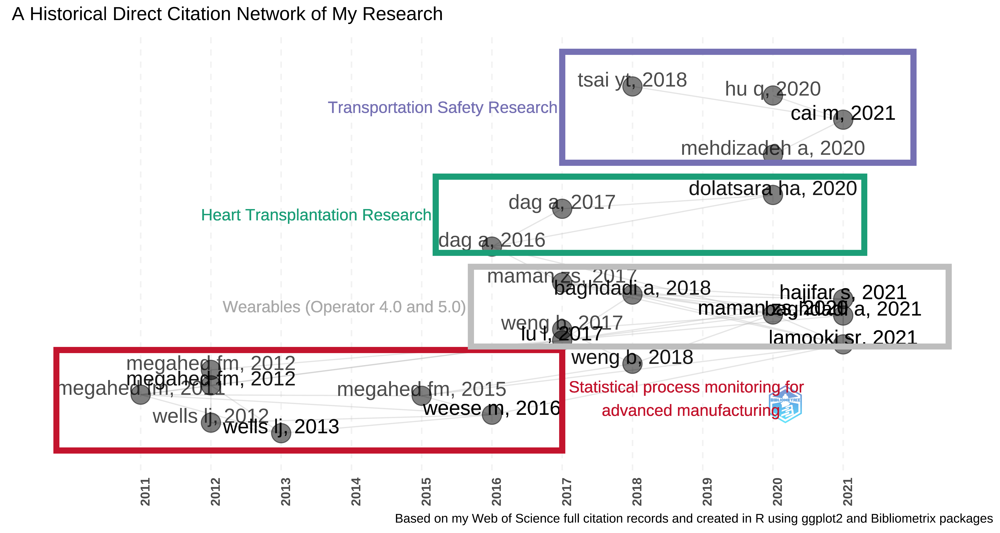
```


---

<div style='position: relative; padding-bottom: 56.25%; padding-top: 35px; height: 0; overflow: hidden;'><iframe sandbox='allow-scripts allow-same-origin allow-presentation' allowfullscreen='true' allowtransparency='true' frameborder='0' height='415' src='https://www.mentimeter.com/app/presentation/alw6f13cdvw777ayfqtbyq5yy6uv4eqx/embed' style='position: absolute; top: 0; left: 0; width: 100%; height: 100%;' width='420'></iframe></div>

.footnote[
<html>
<hr>
</html>

**Comment:** I will try to use this information to tailor the pace of presenting the different research topics based on your interests and background.
]

---
class: center, inverse, middle

# Our Work in Advanced Manufacturing 

# (Industry 4.0/5.0)

---

# Background: The 5 Industrial Revolutions?

```{r five_irs, echo=FALSE, fig.alt='The five industrial revolutions. From Industry 1.0 to Industry 2.0 (mass production) to Industry 3.0 (automation) to Industry 4.0 (fueled by Big Data) to Industry 5.0 (human machine synbosis)', out.width='100%'}
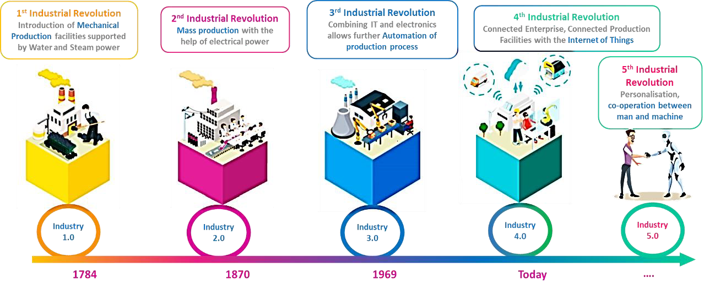
```

.center[The five industrial revolutions.]

.footnote[
<html>
<hr>
</html>

**Image Source:** The image is from Mourtzis, Dimitris, John Angelopoulos, and Nikos Panopoulos. "Operator 5.0: A survey on enabling technologies and a framework for digital manufacturing based on extended reality." *Journal of Machine Engineering* 22 (2022). Click [here](https://yadda.icm.edu.pl/baztech/element/bwmeta1.element.baztech-159441e0-80bf-4fed-8670-f0d61c3439f1) for full article text. Note that Industry 5.0 has been popularized by the EU Commission per [their policy brief](https://op.europa.eu/en/web/eu-law-and-publications/publication-detail/-/publication/38a2fa08-728e-11ec-9136-01aa75ed71a1).
]

---
count: false

# Background: The 5 Industrial Revolutions?

```{r the_fifth_it, echo=FALSE, fig.alt='The three pillars of the fifth industrial revolution. Pillar 1 is being human-centric. Pillar 2 is being sustainable. Pillar is 3 is the reslience of industry 5.0', out.width='55%'}
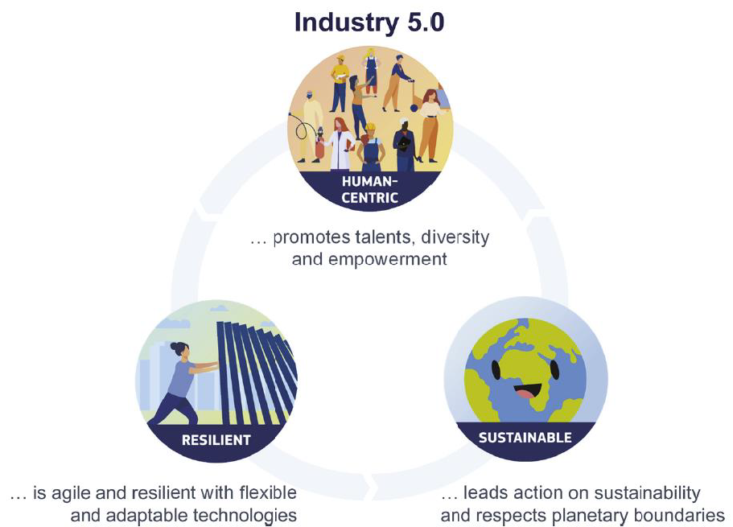
```

.center[The three pillars of the fifth industrial revolution.]

.footnote[
<html>
<hr>
</html>

**Image Source:** The image is from Mourtzis, Dimitris, John Angelopoulos, and Nikos Panopoulos. "Operator 5.0: A survey on enabling technologies and a framework for digital manufacturing based on extended reality." *Journal of Machine Engineering* 22 (2022). Click [here](https://yadda.icm.edu.pl/baztech/element/bwmeta1.element.baztech-159441e0-80bf-4fed-8670-f0d61c3439f1) for full article text. Note that Industry 5.0 has been popularized by the EU Commission per [their policy brief](https://op.europa.eu/en/web/eu-law-and-publications/publication-detail/-/publication/38a2fa08-728e-11ec-9136-01aa75ed71a1).
]

---

count: false

# Background: The 5 Industrial Revolutions?

```{r operator50a, echo=FALSE, fig.alt='A conceptual framework for operator 5.0, highlighting the role of wearable sensors for posture and worker performance analysis', out.width='65%'}
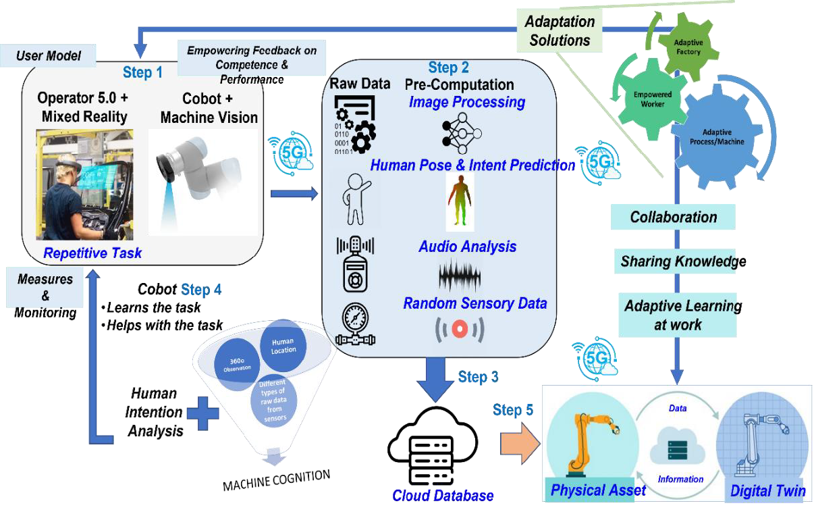
```

.center[Conceptual framework for Operator 5.0 and Cobot in Industry 5.0.]

.footnote[
<html>
<hr>
</html>

**Image Source:** The image is from Mourtzis, Dimitris, John Angelopoulos, and Nikos Panopoulos. "Operator 5.0: A survey on enabling technologies and a framework for digital manufacturing based on extended reality." *Journal of Machine Engineering* 22 (2022). Click [here](https://yadda.icm.edu.pl/baztech/element/bwmeta1.element.baztech-159441e0-80bf-4fed-8670-f0d61c3439f1) for full article text. Note that Industry 5.0 has been popularized by the EU Commission per [their policy brief](https://op.europa.eu/en/web/eu-law-and-publications/publication-detail/-/publication/38a2fa08-728e-11ec-9136-01aa75ed71a1).
]


---

# An Overview of My Industry 4.0/5.0 Research

```{r adv_manf_portfolio, echo=FALSE, fig.alt='A flow chart of my work in advanced manufacturing, highlighting my two main streams of research', out.width='100%'}
# pdftools::pdf_convert('figs/advanced_manufacturing.pdf', filenames = 'figs/advanced_manufacturing.png', dpi = 600)
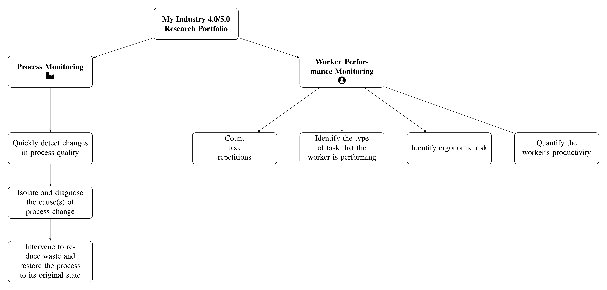
```

---

## Variation Visualization+Understanding for SUV Assembly


.content-box-grey[
.font80[
.center[.black[.bold[An Industry 4.0 problem involving CMM data and assembly trouble that was not diagnosed]]]
- A **major US automotive plant** provided us with a dataset of 1,000 vehicles, which had these characteristics*:  
  + 100% sampling was performed at 27 locations using CMMs  
  + 39 measurements (deviations from nominal) per vehicle 
]
]


```{r suv_sampling_points, echo=FALSE, out.width='80%', fig.alt='A 2D CAD of the SUV panel with the 27 locations and 39 measurement points'}
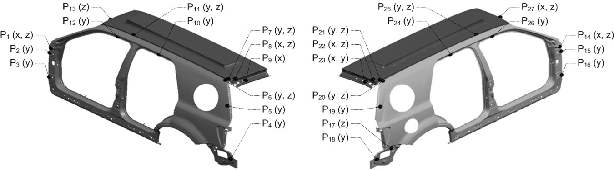
```


.footnote[
<html>
<hr>
</html>

* Due to proprietary issues, the original data values, such as the number and location of sample points (black spheres), and the sample data have been slightly modified.
]


---

# Our Solution for the Industry 4.0 Problem

<center>
<iframe width="738" height="415" src="https://www.youtube.com/embed/Tq8d9aj8UbI" title="Our Visualization of the Match-Boxing Assembly Error" frameborder="0" allow="accelerometer; autoplay; clipboard-write; encrypted-media; gyroscope; picture-in-picture; web-share" allowfullscreen></iframe>
</center>

.footnote[
<html>
<hr>
</html>

**Source:** Wells, L. J., **Megahed, F. M.**, Camelio, J. A., & Woodall, W. H. (2012). A framework for variation visualization and understanding in complex manufacturing systems. *Journal of Intelligent Manufacturing*, 23, 2025-2036. Click [here for full text](https://link.springer.com/content/pdf/10.1007/s10845-011-0529-1.pdf).
]

---

# Worker Performance Monitoring: Motivation

```{r box_score, echo=FALSE, out.width='93%', fig.alt="Did Auburn fatigue and lose a national championship?", fig.align='center', fig.cap='Did Auburn fatigue and lose a national championship?'}

```

.footnote[
<html>
<hr>
</html>

**Source:** The box score for the BCS Championship game between Auburn and FSU, available from <http://www.sports-reference.com/cfb/boxscores/2014-01-06-auburn.html>.  
]


---
count: false

# Worker Performance Monitoring: Motivation


```{r espn, echo=FALSE, out.width='47%', fig.alt="Did Auburn fatigue and lose a national championship?", fig.align='center', fig.cap='Did Auburn fatigue and lose a national championship?'}
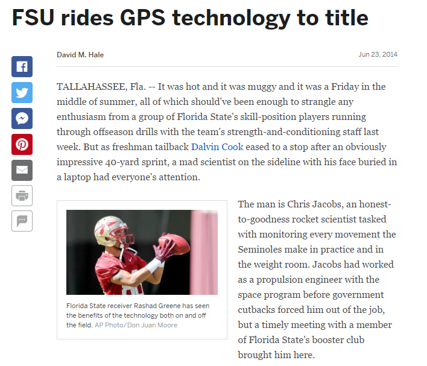
```

.footnote[
<html>
<hr>
</html>

**Source:** The ESPN article that started our research collaboration: <http://www.espn.com/college-football/story/_/id/11121315/florida-state-seminoles-coach-jimbo-fisher-use-gps-technology-win-national-championship>.  
]


---
count:false

# Worker Performance Monitoring: Motivation


```{r catapult, echo=FALSE, out.width='75%', fig.alt="The use of wearable sensors for physical fatigue management is widespread in athletics", fig.align='center'}

```

.footnote[
<html>
<hr>
</html>

**Figure Source:** <https://www.catapultsports.com/sports>.  
]


---

## Worker Performance Monitoring: Industry vs Athletics

.black[.bold[The use of wearables for fatigue management is easier in sports than in more traditional occupational settings!!!]]

.pull-left[
```{r fitt1, echo=FALSE, out.width='95%', fig.alt="The application of the FITT principle to industry", fig.align='center'}
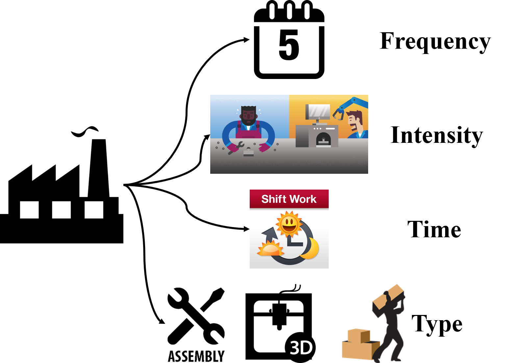
```

]

.pull-right[
```{r fitt2, echo=FALSE, out.width='95%', fig.alt="The application of the FITT principle to sports", fig.align='center'}
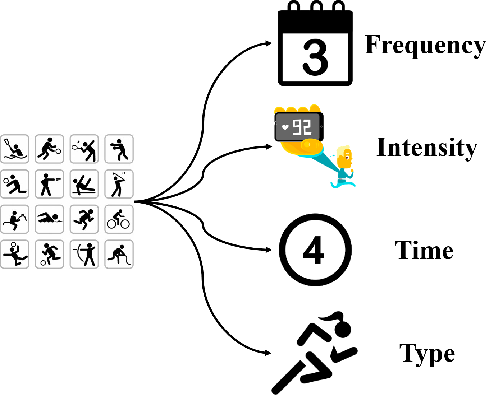
```

]


---

# Gait Monitoring for Industry 5.0 Operations


.content-box-grey[

.center[.black[.bold[Research Questions]]]

.font80[
1. How do important gait parameters (e.g., stride length, height and duration) change over time?   
2.  How do these sensor-based changes relate to the participants’ subjective fatigue ratings?  
3. Are there consistent patterns in performance across different individuals over time?
]
]

.pull-left[
```{r shimmer, echo=FALSE, out.width='52%', fig.alt="The attachment of the Shimmer IMU sensor on a participant's right ankle", fig.align='center'}
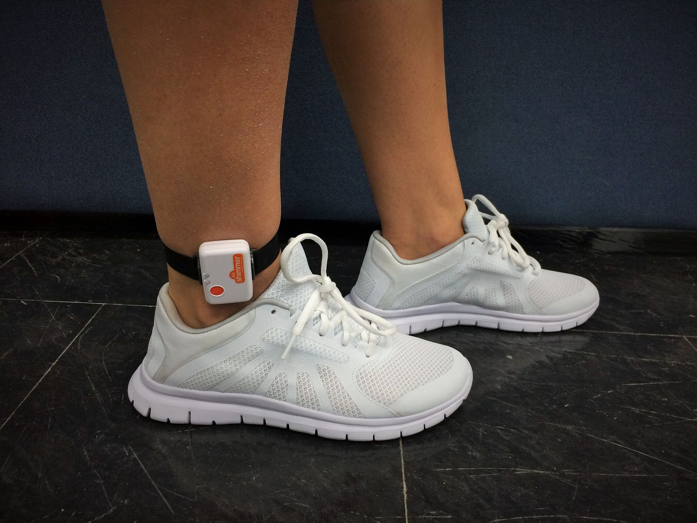
```

]

.pull-right[
```{r path, echo=FALSE, out.width='62%', fig.alt="A CAD representation of the pathway used by the participants during the material handling experiment", fig.align='center'}
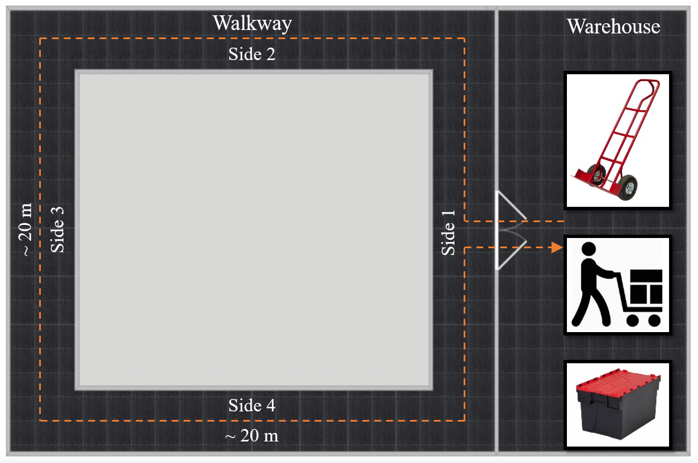
```
]


.footnote[
<html>
<hr>
</html>

**Source:** Baghdadi, A., Cavuoto, L. A., Jones-Farmer, A., Rigdon, S. E., Esfahani, E. T., & **Megahed, F. M.** (2021). Monitoring worker fatigue using wearable devices: A case study to detect changes in gait parameters. *Journal of Quality Technology*, 53(1), 47-71. Paper can be downloaded from [this link](https://par.nsf.gov/servlets/purl/10218083).
]


---
count:false

# Gait Monitoring for Industry 5.0 Operations


```{r imu_preprocess, echo=FALSE, fig.alt="The four steps of IMU preprocessing: rotational angle estimation for foot angle estimation, stride segmentation where we look for two humps associated with the gait cycle, translational velocity estimation for stride duration computations, and foot trajectory estimation for stride height and length estimation", fig.align='center', out.width='42%'}

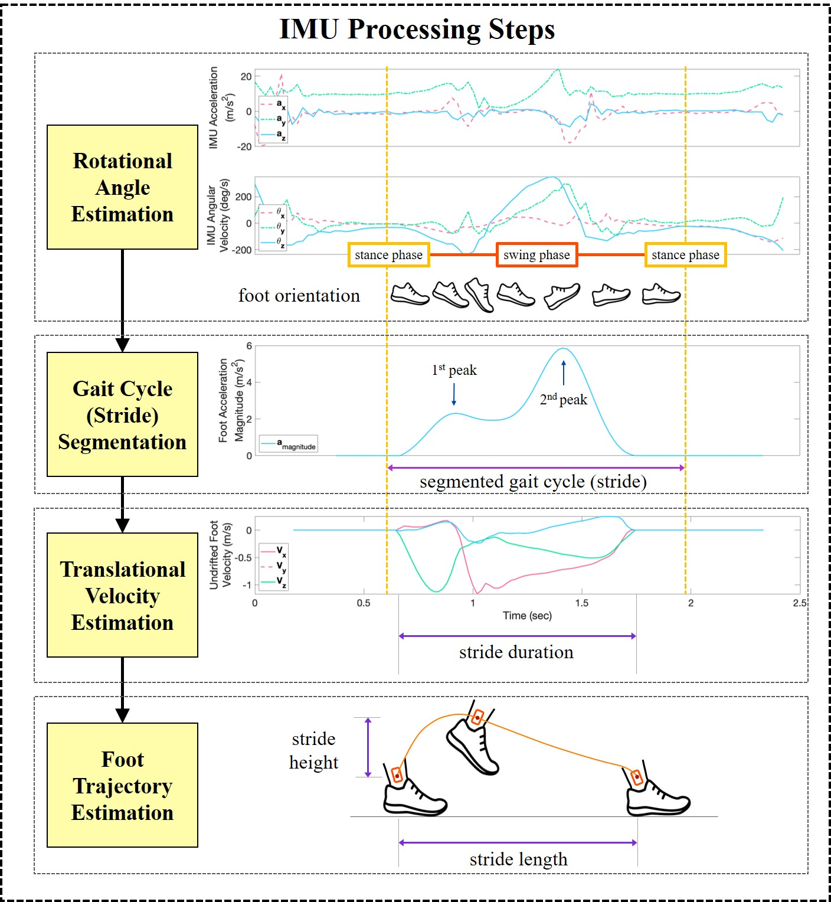
```


.footnote[
<html>
<hr>
</html>

**Source:** Baghdadi, A., Cavuoto, L. A., Jones-Farmer, A., Rigdon, S. E., Esfahani, E. T., & **Megahed, F. M.** (2021). Monitoring worker fatigue using wearable devices: A case study to detect changes in gait parameters. *Journal of Quality Technology*, 53(1), 47-71. Paper can be downloaded from [this link](https://par.nsf.gov/servlets/purl/10218083).
]


---
count:false

# Gait Monitoring for Industry 5.0 Operations

```{r imu_raw, echo=FALSE, results='hide'}
list.files(path = 'figs/jqt/', pattern = 'LineGraph-', full.names = T) |> 
  purrr::map(.f = magick::image_read) |> # reads each img from the extracted path file
  magick::image_join() |>  # joins the images
  magick::image_write_video(path ="figs/LineGraph.mp4", framerate = 1)
```

<center>
<video width="63%" height="63%" autoplay controls aria-label="A video showing that the scaled stride height, length and duration for all 15 participants show a significant amount of noise, which needs to be filtered out prior to any meaningful processing.">
<source src="figs/LineGraph.mp4" type="video/mp4">
</video>
</center>

.footnote[
<html>
<hr>
</html>

**Source:** Baghdadi, A., Cavuoto, L. A., Jones-Farmer, A., Rigdon, S. E., Esfahani, E. T., & **Megahed, F. M.** (2021). Monitoring worker fatigue using wearable devices: A case study to detect changes in gait parameters. *Journal of Quality Technology*, 53(1), 47-71. Paper can be downloaded from [this link](https://par.nsf.gov/servlets/purl/10218083).
]


---
count:false

# Gait Monitoring for Industry 5.0 Operations

```{r imu_filtered, echo=FALSE, results='hide'}
list.files(path = 'figs/jqt/', pattern = 'MedianFiltering-', full.names = T) |> 
  purrr::map(.f = magick::image_read) |> # reads each img from the extracted path file
  magick::image_join() |>  # joins the images
  magick::image_write_video(path ="figs/MedianFiltering.mp4", framerate = 1)
```

<center>
<video width="63%" height="63%" autoplay controls aria-label="A video showing that the use of median filtering, with a rolling window, has significantly smoothed the scaled stride height, length and duration for all 15 participants.">
<source src="figs/MedianFiltering.mp4" type="video/mp4">
</video>
</center>

.footnote[
<html>
<hr>
</html>

**Source:** Baghdadi, A., Cavuoto, L. A., Jones-Farmer, A., Rigdon, S. E., Esfahani, E. T., & **Megahed, F. M.** (2021). Monitoring worker fatigue using wearable devices: A case study to detect changes in gait parameters. *Journal of Quality Technology*, 53(1), 47-71. Paper can be downloaded from [this link](https://par.nsf.gov/servlets/purl/10218083).
]


---
count:false

# Gait Monitoring for Industry 5.0 Operations

```{r imu_rpe_analysis, echo=FALSE, results='hide'}
list.files(path = 'figs/jqt/', pattern = 'RPE_Analysis-', full.names = T) |> 
  purrr::map(.f = magick::image_read) |> # reads each img from the extracted path file
  magick::image_join() |>  # joins the images
  magick::image_write_video(path ="figs/RPE_Analysis.mp4", framerate = 1)
```

<center>
<video width="63%" height="63%" autoplay controls aria-label="A video showing that the use of the multivariate changepoint models and the cumulative sum of each signal can detect distinct changepoints that are associated with fatigue development in each participant.">
<source src="figs/RPE_Analysis.mp4" type="video/mp4">
</video>
</center>

.footnote[
<html>
<hr>
</html>

**Source:** Baghdadi, A., Cavuoto, L. A., Jones-Farmer, A., Rigdon, S. E., Esfahani, E. T., & **Megahed, F. M.** (2021). Monitoring worker fatigue using wearable devices: A case study to detect changes in gait parameters. *Journal of Quality Technology*, 53(1), 47-71. Paper can be downloaded from [this link](https://par.nsf.gov/servlets/purl/10218083).
]


---
count:false

# Gait Monitoring for Industry 5.0 Operations

.pull-left[
.font90[
.center[.bold[From the cluster visualization (right), we observe the followig patterns:]]

- A large variation in fatigue development patterns across participants.  
- There are varying patterns of fatigue development across participants.  
  + **Clusters 1 and 2:** Participants generally take **shorter, lower and slower steps when they are fatigued**.   
  + **Cluster 3** An opposite effect is observed, where participants tend to take **longer, higher but faster strides**.
]
]


.pull-right[
```{r clusters_imu, echo=FALSE, out.width='76%', fig.alt='A depiction of the median curve for each cluster in a panel plot. The top panel shows 4 curves, one for each cluster, for the stride length. The middle panel shows stride height and the lower panel shows stride duration. The explanation of the main trends for the three of the four clusters is in the text for the slide. I ignored explaining cluster four since it contained only one participant. Refer to the paper for more details.'}
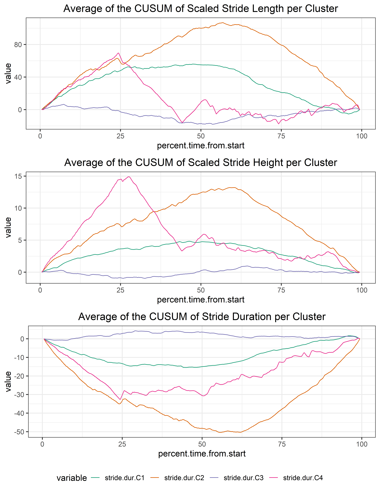
```
]


.footnote[
<html>
<hr>
</html>

**Source:** Baghdadi, A., Cavuoto, L. A., Jones-Farmer, A., Rigdon, S. E., Esfahani, E. T., & **Megahed, F. M.** (2021). Monitoring worker fatigue using wearable devices: A case study to detect changes in gait parameters. *Journal of Quality Technology*, 53(1), 47-71. Paper can be downloaded from [this link](https://par.nsf.gov/servlets/purl/10218083).
]


---

## End-to-End Ergonomic Risk Assessment for Operator 5.0

.content-box-grey[
.center[.bold[Research Questions]]

.font80[

1. How can we automatically divide the time series of acceleration signals, obtained from a wrist-worn accelerometer, into different segments? 

2. Within each segment, can we determine the correct task label for the segment?  

3. How accurately can we determine the total duration of each identified/performed task?  

4. How accurately can we determine the number of repetitions for repetitive tasks, such as the number of lifts or the number of hand pulls in a hoisting task.

5. How can we fuse the physical ergonomic risk factors (i.e., task type, duration, repetition) from the sensor with load and task-design information to systematically estimate the probability of a workplace injury?
]
]

.footnote[
<html>
<hr>
</html>

**Source:** Lamooki, S. R., Hajifar, S., Kang, J., Sun, H., **Megahed, F. M.**, & Cavuoto, L. A. (2022). A data analytic end-to-end framework for the automated quantification of ergonomic risk factors across multiple tasks using a single wearable sensor. *Applied Ergonomics*, 102, 103732. Paper can be downloaded from [this link](https://www.sciencedirect.com/science/article/pii/S0003687022000552).
]


---
count: false

## End-to-End Ergonomic Risk Assessment for Operator 5.0

```{r conceptual_framework, echo=FALSE, out.width='70%', fig.alt="Here, we present an overview of our proposed end-to-end framework for ergonomic risk assessment using a single accelerometer. The framework extends the MSAAI framework of (Lim and D'Souza, 2020) by: (a) explicitly highlighting the importance of clearly defining the ergonomic problem of interest to ensure that the goals and requirements are distinctly communicated; (b) dividing the modeling stage into planning (in our first and second phases) and feature engineering (in our third phase); and (c) expanding on the steps in the analysis phase to include change point detection, task identification (activity recognition), and estimation of task duration/repetition count."}

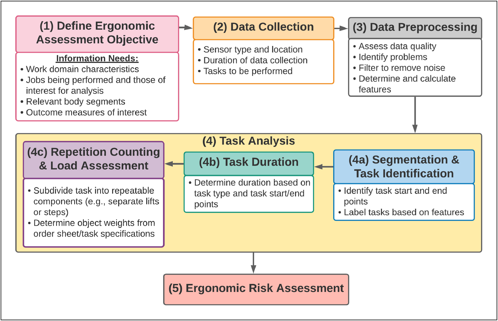
```

.footnote[
<html>
<hr>
</html>

**Source:** Lamooki, S. R., Hajifar, S., Kang, J., Sun, H., **Megahed, F. M.**, & Cavuoto, L. A. (2022). A data analytic end-to-end framework for the automated quantification of ergonomic risk factors across multiple tasks using a single wearable sensor. *Applied Ergonomics*, 102, 103732. Paper can be downloaded from [this link](https://www.sciencedirect.com/science/article/pii/S0003687022000552).
]

---
count: false

## End-to-End Ergonomic Risk Assessment for Operator 5.0

```{r conceptual_framework_details, echo=FALSE, out.width='41%', fig.alt="The details of the ergonomic risk assessment framework."}

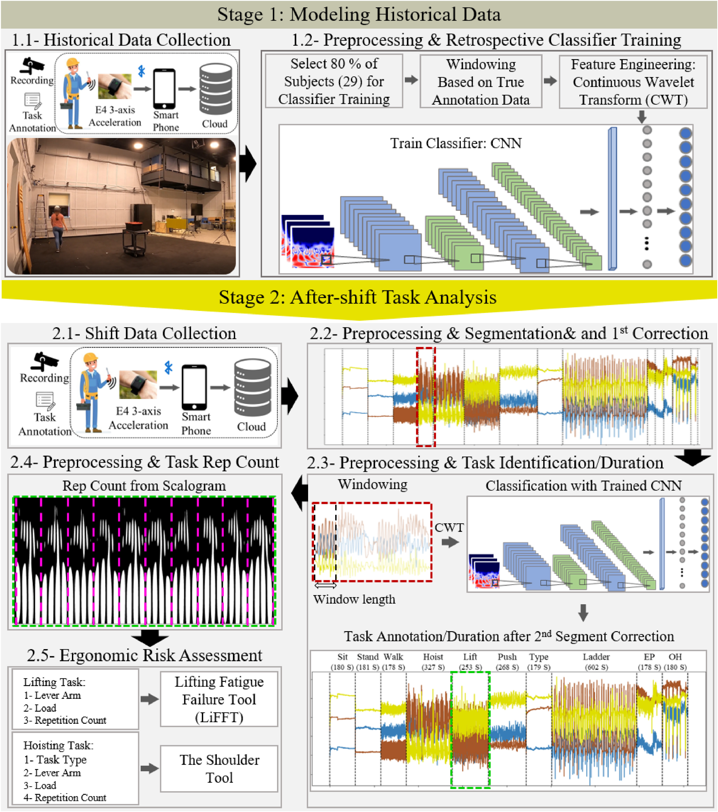
```

.footnote[
<html>
<hr>
</html>

**Source:** Lamooki, S. R., Hajifar, S., Kang, J., Sun, H., **Megahed, F. M.**, & Cavuoto, L. A. (2022). A data analytic end-to-end framework for the automated quantification of ergonomic risk factors across multiple tasks using a single wearable sensor. *Applied Ergonomics*, 102, 103732. Paper can be downloaded from [this link](https://www.sciencedirect.com/science/article/pii/S0003687022000552).
]


---

# Our Future Directions in Operator 5.0 Research

```{r niosh_project, echo=FALSE, out.width='86%', fig.alt="We are currently examining whether system reliability models can be used to model the repeated cycles of fatigue and recovery in human workers. This is a joint 3-year project with the University at Buffalo and funded by the National Institute for Occupational Safety and Health."}

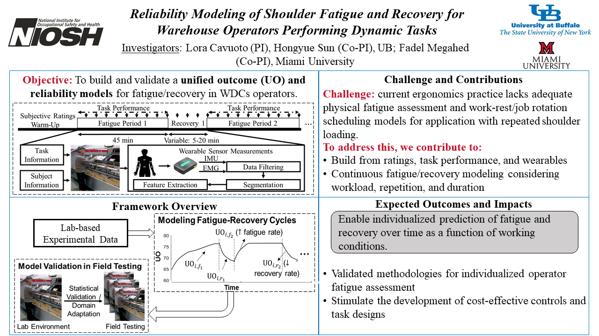
```


---
class: center, middle, inverse

# Our Work in Healthcare and Public Health


---

# An Overview of My Health Analytics Research

```{r health_portfolio, echo=FALSE, fig.alt='A flow chart of my work in health analytics, highlighting my two main streams of research', out.width='100%'}
# pdftools::pdf_convert('figs/health.pdf', filenames = 'figs/health.png', dpi = 600)
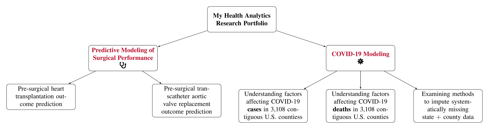
```


---

# Improving Heart Transplant Prediction

### United Network for Organ Sharing (UNOS)

- The United Network for Organ Sharing (UNOS) is a nonprofit association that manages the U.S. organ transplantation system and database.  

- Our UNOS dataset contained 129 predictors (43 numeric and 86 categorical) and 45,005 observations.  
  + The imbalance ratio in the response variable is ~ 6.29 (where 1-year graft survival = 38,829 & failure = 6,176 cases)
  
.footnote[
<html>
<hr>
</html>

**Source:** Dolatsara, H. A., Chen, Y. J., Evans, C., Gupta, A., & **Megahed, F. M.** (2020). A two-stage machine learning framework to predict heart transplantation survival probabilities over time with a monotonic probability constraint. *Decision Support Systems*, 137, 113363. Paper can be downloaded from [this link](https://www.sciencedirect.com/science/article/pii/S0167923620301184).
]


---
count: false

# Improving Heart Transplant Prediction

.pull-left[
- Develop **independent ML models** for each time-period  (e.g., see [Yoon 2018](https://journals.plos.org/plosone/article?id=10.1371/journal.pone.0194985) )
  
- Utilize a **sequential prediction** approach where the
“survival” probability from time periods $1, \dots, t$ are inputs to predict the survival at time $t+1$  ([Ohno-Machdo  1997](https://www.sciencedirect.com/science/article/pii/S0010482597000085))
  
- Predict the outcome probability for one time-period and use the
**population’s survival outcomes to calibrate** other periods’ probabilities ([Medved 2018](https://www.nature.com/articles/s41598-018-21417-7))
]

.pull-right[

.center[**What we really want**]

```{r isotonic_gif, echo =FALSE, out.width='100%', fig.alt='Proposed use of isotonic regression to tune survival probabilities'}
knitr::include_graphics("figs/isotonic.gif")
```

Achievable by applying isotonic regression to the outputs of the different ML models.

]


.footnote[
<html>
<hr>
</html>

**Source:** Dolatsara, H. A., Chen, Y. J., Evans, C., Gupta, A., & **Megahed, F. M.** (2020). A two-stage machine learning framework to predict heart transplantation survival probabilities over time with a monotonic probability constraint. *Decision Support Systems*, 137, 113363. Paper can be downloaded from [this link](https://www.sciencedirect.com/science/article/pii/S0167923620301184).
]


---
count: false

# Improving Heart Transplant Prediction

```{r isotonic_framework, echo=FALSE, out.width='80%', fig.alt='Adopting the proposed two-stage framework to obtain monotonically decreasing heart transplantation survival probabilities over time.'}
knitr::include_graphics("https://ars.els-cdn.com/content/image/1-s2.0-S0167923620301184-gr3_lrg.jpg")
```


.footnote[
<html>
<hr>
</html>

**Source:** Dolatsara, H. A., Chen, Y. J., Evans, C., Gupta, A., & **Megahed, F. M.** (2020). A two-stage machine learning framework to predict heart transplantation survival probabilities over time with a monotonic probability constraint. *Decision Support Systems*, 137, 113363. Paper can be downloaded from [this link](https://www.sciencedirect.com/science/article/pii/S0167923620301184).
]

---
count: false

# Improving Heart Transplant  Prediction

.panelset[

.panel[.panel-name[**Sample Patient Predictions**]

```{r sample_patients, echo=FALSE, out.width='35%', fig.alt='Plots of the forecast probabilities for four sample patients at years 1 − 10 post transplant. The light and dark blue lines show the probabilities before and after the application of isotonic regression, respectively. Note when the dark blue line is not shown, this equates to a perfect overlap with the light blue line.'}
knitr::include_graphics("https://ars.els-cdn.com/content/image/1-s2.0-S0167923620301184-gr6_lrg.jpg")
```

]

.panel[.panel-name[**Unexpected Improvements in Predictive Metrics**]

.center[**Differences (after isotonic regression – before isotonic regression) in the holdout performance**]

.font75[
<html>
<table>
<thead>
  <tr>
    <th></th>
    <th><span style="font-weight:700">Month 1</span></th>
    <th><span style="font-weight:700">Year 1</span></th>
    <th><span style="font-weight:700">Year 2</span></th>
    <th><span style="font-weight:700">Year 3</span></th>
    <th><span style="font-weight:700">Year 4</span></th>
    <th><span style="font-weight:700">Year 5</span></th>
    <th><span style="font-weight:700">Year 6</span></th>
    <th><span style="font-weight:700">Year 7</span></th>
    <th><span style="font-weight:700">Year 8</span></th>
    <th><span style="font-weight:700">Year 9</span></th>
    <th><span style="font-weight:700">Year 10</span></th>
  </tr>
</thead>
<tbody>
  <tr>
    <td><span style="font-weight:bolder">&Delta; AUC</span></td>
    <td><span style="font-weight:bolder">0.008</span></td>
    <td><span style="font-weight:bolder">0.017</span></td>
    <td><span style="font-weight:bolder">0.029</span></td>
    <td><span style="font-weight:bolder">0.021</span></td>
    <td><span style="font-weight:bolder">0.011</span></td>
    <td><span style="font-weight:bolder">0.007</span></td>
    <td><span style="font-weight:bolder">0.001</span></td>
    <td><span style="font-weight:bolder">0.001</span></td>
    <td><span style="font-weight:bolder">0.000</span></td>
    <td><span style="font-weight:bolder">0.002</span></td>
    <td><span style="font-weight:bolder">0.001</span></td>
  </tr>
  <tr>
    <td><span style="font-weight:bolder">&Delta; Accuracy</span></td>
    <td><span style="font-weight:bolder">0.125</span></td>
    <td><span style="font-weight:bolder">0.083</span></td>
    <td><span style="font-weight:bolder">0.061</span></td>
    <td><span style="font-weight:bolder">0.042</span></td>
    <td><span style="font-weight:bolder">0.017</span></td>
    <td><span style="font-weight:bolder">0.007</span></td>
    <td>−0.005</td>
    <td>−0.008</td>
    <td>−0.006</td>
    <td><span style="font-weight:bolder">0.001</span></td>
    <td><span style="font-weight:bolder">0.008</span></td>
  </tr>
  <tr>
    <td><span style="font-weight:bolder">&Delta; Sensitivity</span></td>
    <td><span style="font-weight:bolder">0.150</span></td>
    <td><span style="font-weight:bolder">0.136</span></td>
    <td><span style="font-weight:bolder">0.110</span></td>
    <td><span style="font-weight:bolder">0.083</span></td>
    <td><span style="font-weight:bolder">0.032</span></td>
    <td><span style="font-weight:bolder">0.007</span></td>
    <td>−0.037</td>
    <td>−0.061</td>
    <td>−0.102</td>
    <td>−0.130</td>
    <td>−0.161</td>
  </tr>
  <tr>
    <td><span style="font-weight:bolder">&Delta; Specificity</span></td>
    <td>−0.114</td>
    <td>−0.105</td>
    <td>−0.064</td>
    <td>−0.047</td>
    <td>−0.009</td>
    <td><span style="font-weight:bolder">0.008</span></td>
    <td><span style="font-weight:bolder">0.034</span></td>
    <td><span style="font-weight:bolder">0.050</span></td>
    <td><span style="font-weight:bolder">0.087</span></td>
    <td><span style="font-weight:bolder">0.112</span></td>
    <td><span style="font-weight:bolder">0.134</span></td>
  </tr>
  <tr>
    <td><span style="font-weight:bolder">&Delta; G-Mean</span></td>
    <td><span style="font-weight:bolder">0.009</span></td>
    <td><span style="font-weight:bolder">0.010</span></td>
    <td><span style="font-weight:bolder">0.019</span></td>
    <td><span style="font-weight:bolder">0.016</span></td>
    <td><span style="font-weight:bolder">0.010</span></td>
    <td><span style="font-weight:bolder">0.007</span></td>
    <td><span style="font-weight:bolder">0.000</span></td>
    <td>−0.003</td>
    <td>−0.003</td>
    <td>−0.001</td>
    <td>−0.005</td>
  </tr>
</tbody>
</table>
</html>
]
]
]

.footnote[
<html>
<hr>
</html>

**Source:** Dolatsara, H. A., Chen, Y. J., Evans, C., Gupta, A., & **Megahed, F. M.** (2020). A two-stage machine learning framework to predict heart transplantation survival probabilities over time with a monotonic probability constraint. *Decision Support Systems*, 137, 113363. Paper can be downloaded from [this link](https://www.sciencedirect.com/science/article/pii/S0167923620301184).
]

---

# COVID-19 Deaths in 3,108 U.S. Counties

.pull-right-2[

.content-box-grey[
.center[.black[.bold[Motivation]]]

.font80[
- "Across the world, public health data are gathered at a very local level before aggregation into regional and national figures.... While useful as a summary, local distinctions get lost, painting a misleading image of whole countries being affected uniformly.” [Financial Times](https://ig.ft.com/coronavirus-global-data/)

- Differing national and regional patterns within the United States was illustrated in the chart.
]
]
]

.pull-left-2[
```{r aggregate_vs_regional, echo=FALSE, fig.align='center', out.width='100%', fig.alt='the national 7-day moving average of deaths as well as the various patterns that arise among 8 example counties from Sunday, March 1, 2020, to Saturday, February 27, 2021. For example, New York, NY, experienced a large first wave of deaths, followed by a relatively low death count through the remainder of the study. Nearby Ocean County, NJ, a populous county near the New Jersey shore had a large first wave of deaths, followed by a second wave beginning in late 2020. In contrast, Butler County, OH, a populous midwestern county, showed low death counts until late in the study period. None of these patterns mimics the overall pattern for the aggregate death counts in the United States.'}
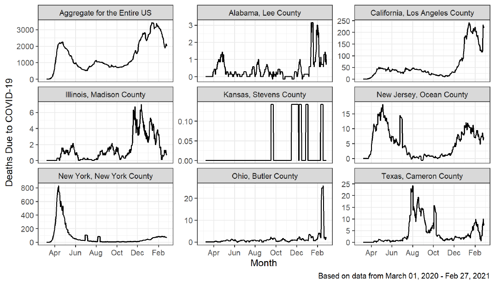

```
]

.footnote[
<html>
<hr>
</html>

**Source:** **Megahed, F. M.**, Jones-Farmer, L. A., Ma, Y., & Rigdon, S. E. (2022). Explaining the Varying Patterns of COVID-19 Deaths Across the United States: 2-Stage Time Series Clustering Framework. *JMIR Public Health and Surveillance*, 8(7), e32164. Paper can be downloaded from [this link](https://publichealth.jmir.org/2022/7/e32164).
]


---
count: false

# COVID-19 Deaths in 3,108 U.S. Counties


.pull-right-2[

.content-box-grey[
.center[.black[.bold[Research Questions]]]

.font80[
- How many distinct clusters of U.S. counties exhibit similar time series patterns in the deaths due to COVID-19?  

- How are these clusters geographically distributed across the United States?  
- Are certain geographic, political, government, and social vulnerability variables associated with the patterns of COVID-19 related deaths?
]
]
]

.pull-left-2[
```{r aggregate_vs_regional2, echo=FALSE, fig.align='center', out.width='100%', fig.alt='the national 7-day moving average of deaths as well as the various patterns that arise among 8 example counties from Sunday, March 1, 2020, to Saturday, February 27, 2021. For example, New York, NY, experienced a large first wave of deaths, followed by a relatively low death count through the remainder of the study. Nearby Ocean County, NJ, a populous county near the New Jersey shore had a large first wave of deaths, followed by a second wave beginning in late 2020. In contrast, Butler County, OH, a populous midwestern county, showed low death counts until late in the study period. None of these patterns mimics the overall pattern for the aggregate death counts in the United States.'}


```
]

.footnote[
<html>
<hr>
</html>

**Source:** **Megahed, F. M.**, Jones-Farmer, L. A., Ma, Y., & Rigdon, S. E. (2022). Explaining the Varying Patterns of COVID-19 Deaths Across the United States: 2-Stage Time Series Clustering Framework. *JMIR Public Health and Surveillance*, 8(7), e32164. Paper can be downloaded from [this link](https://publichealth.jmir.org/2022/7/e32164).
]


---
count: false

# COVID-19 Deaths in 3,108 U.S. Counties

```{r covid_19_deaths, echo=FALSE, out.width="100%", fig.alt='A cluster map of the contiguous US counties. The map shows that the 3108 counties can be divided into 4 clusters.'}
crossSectionalData = readr::read_rds('data/crossSectionalData.rds')

clusterCounties = readr::read_rds('data/clusterCounties.rds')
clusterCounties$fips <- stringr::str_pad(clusterCounties$key_numeric, width = 5, side = 'left', pad = '0')
clusterCounties = dplyr::ungroup(clusterCounties)

leaflet_sf <- 
  albersusa::counties_sf("longlat") |> 
  dplyr::filter(!state %in% c('Alaska', 'Hawaii')) |> 
  tigris::geo_join(crossSectionalData, by_sp= 'fips', by_df= 'fips') |> 
  dplyr::left_join(clusterCounties[, c('fips', 'cluster_group')], by = 'fips') 

#### Setting the Color Scheme
leafletPal <-  leaflet::colorFactor('Set2', domain = leaflet_sf$cluster_group, na.color = "white")

#### The visual
leaflet::leaflet(height=460) |> # initializing the leaflet map
  leaflet::setView(lng = -96, lat = 37.8, zoom = 3.8) |> # setting the view on Continental US
  leaflet::addTiles() |> # adding the default tiles
  leaflet::addPolygons(
    data = leaflet_sf, stroke = FALSE, 
    fillColor = ~leafletPal(leaflet_sf$cluster_group), # adding the data
    weight = 2, opacity = 1, color = "white", dashArray = "3", fillOpacity = 0.7, # adding color
    popup = paste("County:", leaflet_sf$location, "<br>", 
                  "Cluster:", leaflet_sf$cluster_group, "<br>",
                  "Population Density:", round(leaflet_sf$e_popdensity, 1), "<br>")) |> #pop-up Menu
  leaflet::addLegend(position = "bottomleft", pal = leafletPal, values =  leaflet_sf$cluster_group, 
                     title = "Cluster", opacity = 1) # legend formatting

```

.footnote[
<html>
<hr>
</html>

**Source:** **Megahed, F. M.**, Jones-Farmer, L. A., Ma, Y., & Rigdon, S. E. (2022). Explaining the Varying Patterns of COVID-19 Deaths Across the United States: 2-Stage Time Series Clustering Framework. *JMIR Public Health and Surveillance*, 8(7), e32164. Paper can be downloaded from [this link](https://publichealth.jmir.org/2022/7/e32164).
]


---
count: false

# COVID-19 Deaths in 3,108 U.S. Counties

.pull-left[

- Using a multinomial regression model, we were able to:  

  + Identify some of the **explanatory factors** that can be used to explain a **county's assignment to a given cluster**.  
  
  + Our **overall accuracy was about 61.25%**, which is statistically significant when compared to the baseline of 25% (random prediction of the four classes).

]

.pull-right[
```{r cluster_exp, echo=FALSE, fig.alt='A table of the multinomial regression coefficients used to explain the differences in cluster membership.', out.width='70%', fig.align='center'}
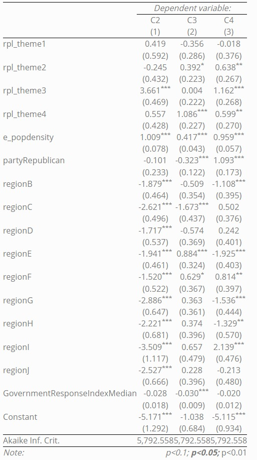
```
]


---

# Future Directions: Data Quality in Public Health


<center>
<video width="72%" height="72%" autoplay controls aria-label="A video showing there are some structural missing behavior in U.S. public health data (with the case of COVID-19 vaccinations). In our current research, we are examining how statistical and mathematical models can be combined to address this issue.">
<source src="figs/animated_vaccine_map.mp4" type="video/mp4">
</video>
</center>


---
class: center, middle, inverse

# Our Work in Transportation Analytics

---

# An Overview of My Transportation Portfolio

```{r transportation_portfolio, echo=FALSE, fig.alt='A flow chart of my work in health analytics, highlighting my two main streams of research', out.width='100%'}
# pdftools::pdf_convert('figs/logistics.pdf', filenames = 'figs/logistics.png', dpi = 600)
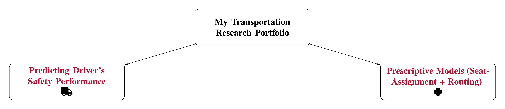
```


---

# Seat Assignment with Social Distancing

.content-box-grey[
.center[.bold[Research Motivation]]
.font90[
- In the U.S., school districts created strict layouts for student bus seating depending on the **bus configuration** and **social distancing** requirements (6ft $\rightarrow$ 3.3 ft). See [KY Guidelines Archived](https://archive.org/details/ERIC_ED611894/page/6/mode/2up).  

- However, these guidelines did not account for the fact that often students from the same household ride together in the same school bus. 

]
]


```{r seat_assignment0, out.width='80%', echo=FALSE}
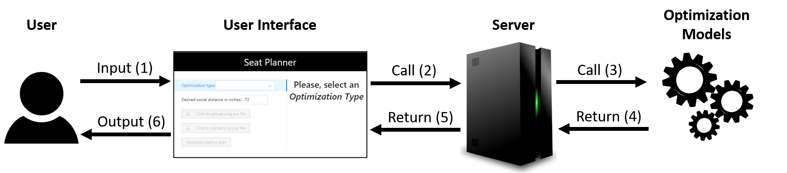
```

.footnote[
<html>
<hr>
</html>

**Source:** Moore, J. F., Carvalho, A., Davis, G. A., Abulhassan, Y., & **Megahed, F. M.** (2021). Seat assignments with physical distancing in single-destination public transit settings. *IEEE Access*, 9, 42985-42993. Paper can be downloaded from [this link](https://ieeexplore.ieee.org/abstract/document/9374410).
]


---
count: false
# Seat Assignment with Social Distancing


.center[Experimental results for school buses and a 6-ft minimum physical distancing requirement.]

| Bus Capacity in Persons (P) | KY Guidelines per [link](https://archive.org/details/ERIC_ED611894/page/6/mode/2up) in P (% occupancy) | MIP Solution in P <html><br></html> (% occupancy) | Heuristic Solution in P <html><br></html> (% occupancy) |
| :---: | :---: | :---: | :---: |
| .bold[34P] | 4P (11.8%) | 4P (11.8%) | 5P (14.7%) |
| .bold[52P] | 6P (11.5%) | 6P (11.5%) | 8P (15.4%) |
| .bold[66P] | 7P (10.6%) | 8P (12.1%) | 10P (15.2%) |
| .bold[72P] | 8P (11.1%) | 8P (11.1%) | 11P (15.3%) |
| .bold[84P] | 9P (10.7%) | 10P (11.9%) | 13P (15.5%) |


.footnote[
<html>
<hr>
</html>

**Source:** Moore, J. F., Carvalho, A., Davis, G. A., Abulhassan, Y., & **Megahed, F. M.** (2021). Seat assignments with physical distancing in single-destination public transit settings. *IEEE Access*, 9, 42985-42993. Paper can be downloaded from [this link](https://ieeexplore.ieee.org/abstract/document/9374410).
]


---
count: false
# Seat Assignment with Social Distancing

```{r seat_assignment2, out.width='90%', echo=FALSE}
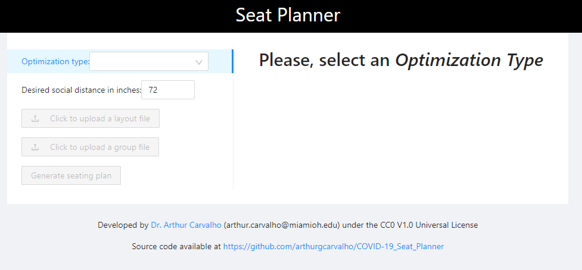
```

.center[.font80[Click [here to open the app](http://seatplanner.fsb.miamioh.edu/) and interact with it (e.g., pick **household** from the **dropdown next to optimization type**)]]

.footnote[
<html>
<hr>
</html>

**Source:** Moore, J. F., Carvalho, A., Davis, G. A., Abulhassan, Y., & **Megahed, F. M.** (2021). Seat assignments with physical distancing in single-destination public transit settings. *IEEE Access*, 9, 42985-42993. Paper can be downloaded from [this link](https://ieeexplore.ieee.org/abstract/document/9374410).
]


---

# Safety-Driven Truck Routing 

.center[
**It is much safer to drive in Korea than in the U.S.** 

<iframe src="https://data.worldbank.org/share/widget?indicators=SH.STA.TRAF.P5&locations=US-KR" width='650' height='433' frameBorder='0' scrolling="no" ></iframe>

]


---
count: false

# Safety-Driven Truck Routing 

.content-box-grey[
.center[.bold[Research Questions]]
.font80[
- Can we predict the occurrence of safety critical events in the next 30-minutes of driving?  

- Can we develop a truck routing routine that minimizes the occurrence of safety critical events by suggesting non-shortest distance routes (while not impacting on-time delivery)? 

]
]

.pull-left[
```{r full_region, echo=FALSE, out.width='45%', fig.alt='Full region of recorded pings'}
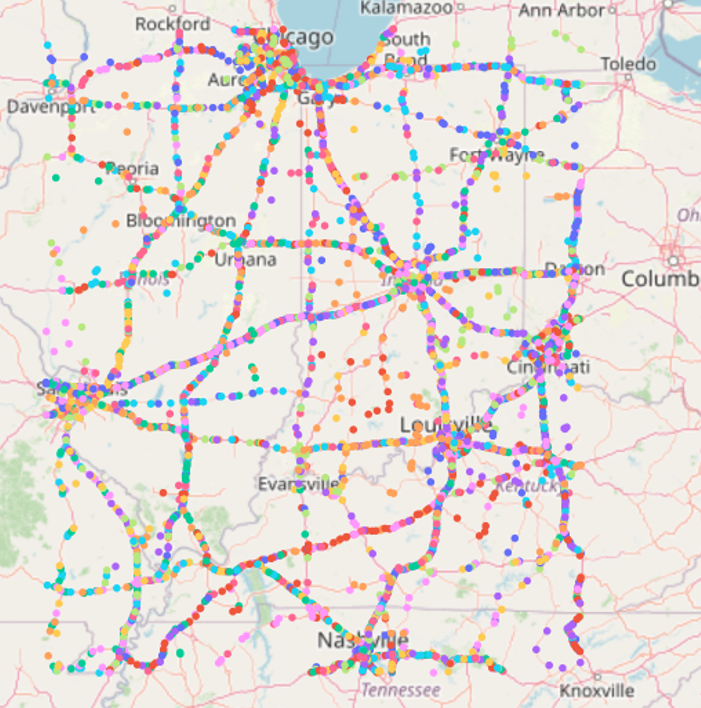
```
.center[.font80[Full region of recorded pings]]
]

.pull-right[
```{r imp_nodes, echo=FALSE, out.width='45%', fig.alt='Important nodes of the road network'}
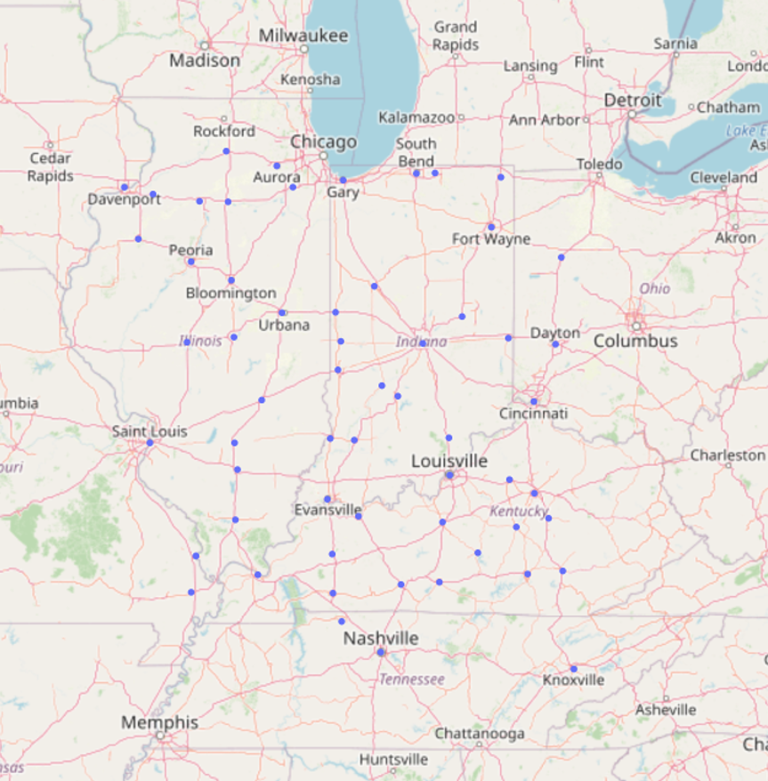
```
.center[.font80[Important junctions (nodes) ]]

]

.footnote[
<html>
<hr>
</html>

**Source:** On-going joint work with [Qiong Hu](https://business.ucdenver.edu/about/our-people/qiong-hu), [Alex Vinel](https://eng.auburn.edu/directory/azv0019), and [Steven E. Rigdon](https://www.slu.edu/public-health-social-justice/faculty/rigdon-steven.php).
]

---
count: false

# Safety-Driven Truck Routing 

```{r ksp_diagram, echo=FALSE, out.width='38%', fig.alt='The five step process of our proposed framework. The first step involves extracting the data. In the second step, we utilize machine learning models to predict the occurence of SCEs based on traffic, weather, road, and driver data. We also construct the road network. In the third step, we use the outputs from the ML process as inputs to an optimization model, where we try to minimize the distance traveled and the occurence of SCEs. In step 4, we define the solution approach, and we rank the solutions in step 5. '}
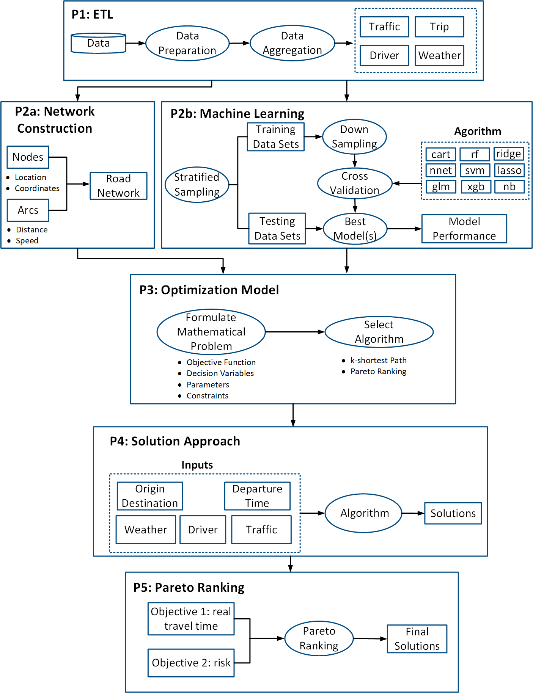
```

.footnote[
<html>
<hr>
</html>

**Source:** On-going joint work with [Qiong Hu](https://business.ucdenver.edu/about/our-people/qiong-hu), [Alex Vinel](https://eng.auburn.edu/directory/azv0019), and [Steven E. Rigdon](https://www.slu.edu/public-health-social-justice/faculty/rigdon-steven.php).
]


---
count: false

# Safety-Driven Truck Routing


.center[The predictive performance of the machine learning models on the holdout dataset.]

| Metric/Model | cart | glm | lasso | nb | nnet | rf | ridge | svm | xgb |
| --- | --- | --- | --- | --- | --- | --- | --- | --- | --- |
| AUC | 0.693 | 0.723 | 0.722 | 0.740 | 0.752 | 0.752 | 0.710 | 0.745 | **0.765** |
| Accuracy | 0.662 | 0.745 | 0.736 | **0.803** | 0.711 | 0.688 | 0.711 | 0.696 | 0.700 |
| Sensitivity | 0.641 | 0.548 | 0.554 | 0.534 | 0.652 | 0.679 | 0.579 | 0.647 | **0.684** |
| Specificity | 0.663 | 0.747 | 0.738 | **0.805** | 0.711 | 0.688 | 0.712 | 0.696 | 0.700 |
| Gmean | 0.651 | 0.640 | 0.639 | 0.656 | 0.681 | 0.683 | 0.634 | 0.671 | **0.692** |


.footnote[
<html>
<hr>
</html>

**Source:** On-going joint work with [Qiong Hu](https://business.ucdenver.edu/about/our-people/qiong-hu), [Alex Vinel](https://eng.auburn.edu/directory/azv0019), and [Steven E. Rigdon](https://www.slu.edu/public-health-social-justice/faculty/rigdon-steven.php).
]

---
count: false

# Safety-Driven Truck Routing

```{r ksp_sol, echo=FALSE, results='hide'}
list.files(path = 'figs/', pattern = 'case3_', full.names = T) |> 
  purrr::map(.f = magick::image_read) |> # reads each img from the extracted path file |> 
  purrr::map(.f = magick::image_scale, '1216x1316!') |> 
  magick::image_join() |>  # joins the images
  magick::image_write_video(path ="figs/case3.mp4", framerate = 0.1)
```

<center>
<video width="44%" height="44%" autoplay controls aria-label="A video showing the routes corresponding to pareto ranks 1, 2, and 3 for driving between Cincinnati, OH and Gary, IN.">
<source src="figs/case3.mp4" type="video/mp4">
</video>
</center>


.footnote[
<html>
<hr>
</html>

**Source:** On-going joint work with [Qiong Hu](https://business.ucdenver.edu/about/our-people/qiong-hu), [Alex Vinel](https://eng.auburn.edu/directory/azv0019), and [Steven E. Rigdon](https://www.slu.edu/public-health-social-justice/faculty/rigdon-steven.php).
]


---
class: inverse, center, middle

# Concluding Remarks

---

# $D^3$ Requires a Team

.pull-left[
- $D^3$ requires a **team** 

- **Meaningful data-driven research** should be:    
  + Application-based (“business”)  
  + Driven by grand challenges 
  + Impactful (i.e. actionable)  
  
- I would be excited to collaborate with **Yonsei faculty** on problems such as the ones I presented today

]

.pull-right[
```{r d_team, echo=FALSE, out.width='100%', fig.alt='Data-driven decision making requires a team of information technology, domain knowledge and math/statistics'}
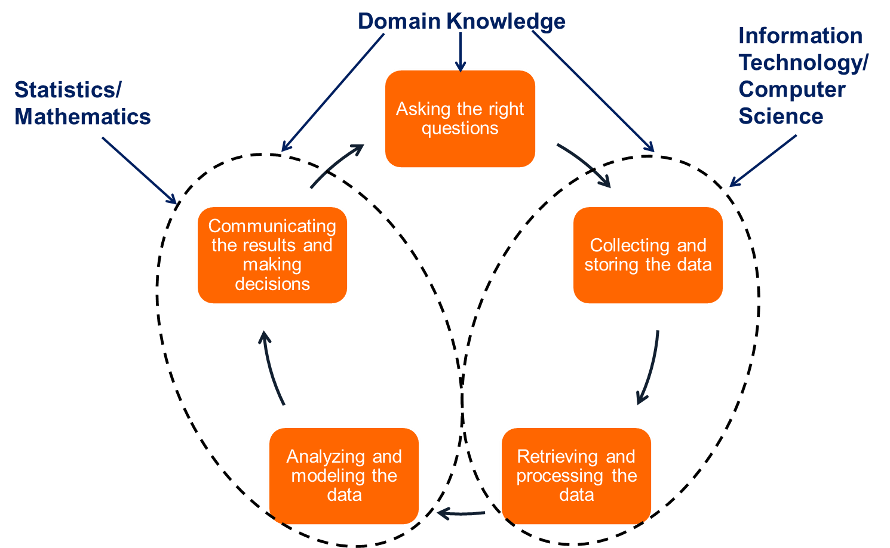
```
]
